--- 
title: "Econometría II"
author: "Ana María Díaz"
date: "`r Sys.Date()`"
site: bookdown::bookdown_site
documentclass: book
description: |
  Notas de clase para el curso de Econometría II de la Pontificia Universidad Javeriana.
  Cubre el modelo clásico de regresión lineal, sus supuestos, propiedades y extensiones.
link-citations: yes
github-repo: adiazescobar/libro-econometria
---

# Información general {#informacion-general}

| Campo | Detalle |
|-------|---------|
| **Curso** | Econometría Avanzada (Cod 1420) |
| **Docente** | Ana María Díaz |
| **Oficina / Atención** | Séptimo piso Edificio 20 \| Lunes 9–11 a.m. (o por Teams) |
| **Sitio web** | <http://adiazescobar.com> |
| **Correo** | <a.diaze@javeriana.edu.co> |
| **Prerequisito** | Econometría I |
| **Horario de clase** | Martes y Jueves 11:00–13:00 \| Salones 2‑207 (Ma) y 67‑303 (Ju) |
| **Monitor** | Sophia Aristizabal — horarios y oficina por definir |

## Descripción del curso {#descripcion-del-curso}

El objetivo principal es proporcionar herramientas para el análisis econométrico de datos de corte transversal, series de tiempo y panel. Se revisa el modelo clásico de regresión lineal, las consecuencias de violar sus supuestos, modelos para variables dependientes discretas o limitadas y técnicas básicas de series de tiempo y panel. Al finalizar, el estudiante podrá ejecutar regresiones múltiples, diagnosticar problemas comunes y aplicar soluciones apropiadas.

## Material bibliográfico {#material-bibliografico}

### Libro obligatorio

- Verbeek, Marno (2004). *A Guide to Modern Econometrics*. Wiley.

### Libros recomendados

1. Greene, William (2003). *Econometric Analysis*. Prentice Hall.  
2. Wooldridge, Jeffrey (2003). *Introductory Econometrics: A Modern Approach*. Thomson.  
3. Wooldridge, Jeffrey (2002). *Econometric Analysis of Cross Section and Panel Data*. MIT Press.  
4. Montenegro, Álvaro (2009). *Series de Tiempo*. Javegraf, PUJ.  
5. Stock, J. & Watson, M. (2006). *Introduction to Econometrics*. Addison‑Wesley.  
6. Hayashi, Fumio (2000). *Econometrics*. Princeton UP.  
7. Angrist, J.D. & Pischke, J.S. (2009). *Mostly Harmless Econometrics*. Princeton UP.  
8. Cameron, A.C. & Trivedi, P.K. (2009). *Microeconometrics Using Stata*. Stata Press.  
9. *Stata 11 Time Series Reference Manual*. Stata Press.  
10. Rosales R. et al. (2010). *Fundamentos de Econometría Intermedia*. CEDE.

## Evaluación {#evaluacion}

| Porcentaje | Actividad |
|-----------:|-----------|
| 25 % | Parcial 1 teórico |
| 25 % | Parcial 2 teórico |
| 3 %  | Talleres en clase |
| 7 %  | Monitorías |
| 15 % | Trabajo final |
| 25 % | Examen final |
| +0.5 (para el mejor) | Video‑bono examen final |

Los exámenes son con libro cerrado y sin dispositivos electrónicos. El incumplimiento se sanciona según el reglamento de la universidad. Trabajo Final: - Primera entrega: 10% (Presentación de la idea) - Segunda entrega: 20% (Introducción + Descriptiva + Metodología) - Documento final: 30% - Sustentación: 40% (Presentación & preguntas)

## Programa semanal

| Semana | Tema principal | Lecturas clave |
|:------:|---------------|---------------|
| **1** | Supuestos del MCRL | Verbeek cap. 1‑2 (oblig.)  \| Hayashi cap. 1; Wooldridge cap. 1‑2 (opc.) |
| **2** | Regresión simple vs múltiple; Teorema FWL | Verbeek cap. 1‑2  \| *The Stata Journal* (2013) 13(1): 92‑106 |
| **3** | Propiedades de MCO en muestras finitas; Teorema Gauss‑Markov | Verbeek cap. 2 |
| **4** | Inferencia y predicción; Propiedades asintóticas de MCO | Verbeek cap. 3 |
| **5** | **Primer parcial** | — |
| **6** | No linealidad; Multicolinealidad | Verbeek cap. 3‑4 |
| **7** | Heterocedasticidad | Verbeek cap. 4 |
| **8** | Endogeneidad: simultaneidad, omitidas, medición | Verbeek cap. 5 |
| **9** | Variables instrumentales, MCO2E, GMM | Verbeek cap. 5 |
| **10** | Modelos LPM, logit y probit | Verbeek cap. 7 |
| **11** | Máximo verosimilitud; DID, RD, duración, cuantílica (opc.) | — |
| **12** | Semana Santa / Receso | — |
| **13** | **Segundo parcial** | — |
| **14** | Series de tiempo: conceptos básicos | Verbeek cap. 8 |
| **15** | AR, MA y VAR estacionarios | Verbeek cap. 9 |
| **16** | Datos de panel: pooled, between, FE, RE | Verbeek cap. 10 |
| **17** | **Examen final** | — |

## Recursos adicionales

- [Ben Lambert – Econometrics on YouTube](https://www.youtube.com/playlist?list=PLwJRxp3blEvZyQBTTOMFRP_TDaSdly3gU)  
- [Mastering Econometrics (MRU)](https://mru.org/mastering-econometrics)  
- [AEA *Journal of Economic Perspectives* – Classroom](https://www.aeaweb.org/journals/jep/classroom)  
- [Google Dataset Search](https://toolbox.google.com/datasetsearch)  
- [Stata Cheat Sheets](https://geocenter.github.io/StataTraining/pdf/AllCheatSheets.pdf)  
- [Seeing Theory – Visual Probability](https://seeing-theory.brown.edu)

## Inclusión {#inclusion}

Este curso da la bienvenida a personas de todas las edades, orígenes, creencias, etnias, géneros, identidades, orientaciones sexuales y capacidades. Se espera un ambiente respetuoso e inclusivo.

## Integridad académica {#integridad-academica}

La Universidad Javeriana fomenta la honestidad y establece sanciones por fraude o plagio según el reglamento de estudiantes. Cualquier uso no autorizado de materiales durante evaluaciones se considera falta grave.


```{r include=FALSE}
# automatically create a bib database for R packages
knitr::write_bib(c(
  .packages(), 'bookdown', 'knitr', 'rmarkdown'
), 'packages.bib')
```

<!--chapter:end:index.Rmd-->

# Prueba de Entrada - Econometria II

```{r setup-quiz, include=FALSE}
knitr::opts_chunk$set(echo = FALSE, message = FALSE, warning = FALSE)

# Paquete webexercises
if (!requireNamespace("webexercises", quietly = TRUE)) {
  install.packages("webexercises")
}
library(webexercises)
```

```{css, echo=FALSE}
/* Estilos personalizados para la prueba de entrada */

.quiz-section {
  background-color: #f8f9fa;
  border-left: 4px solid #1F77B4;
  padding: 20px;
  margin: 20px 0;
  border-radius: 5px;
}

.quiz-section h2 {
  color: #1F77B4;
  margin-top: 0;
}

.question-box {
  background-color: white;
  padding: 15px;
  margin: 15px 0;
  border-radius: 8px;
  box-shadow: 0 2px 4px rgba(0,0,0,0.1);
}

.question-number {
  font-weight: bold;
  color: #1F77B4;
  font-size: 1.1em;
}

.intro-box {
  background: linear-gradient(135deg, #1F77B4 0%, #2E86AB 100%);
  color: white;
  padding: 25px;
  border-radius: 10px;
  margin-bottom: 30px;
}

.intro-box h3 {
  margin-top: 0;
  color: white;
}

.scoring-guide {
  background-color: #e8f4f8;
  border: 2px solid #1F77B4;
  padding: 20px;
  border-radius: 10px;
  margin-top: 30px;
}

.resources-box {
  background-color: #fff3cd;
  border-left: 4px solid #ffc107;
  padding: 20px;
  margin: 20px 0;
  border-radius: 5px;
}

.webex-check {
  margin-left: 10px;
}

/* Estilo para respuestas correctas e incorrectas (cuando ya se muestra feedback) */
.webex-correct {
  color: #28a745;
  font-weight: bold;
}

.webex-incorrect {
  color: #dc3545;
}

.tip-box {
  background-color: #d4edda;
  border-left: 4px solid #28a745;
  padding: 15px;
  margin: 15px 0;
  border-radius: 5px;
}

.warning-box {
  background-color: #f8d7da;
  border-left: 4px solid #dc3545;
  padding: 15px;
  margin: 15px 0;
  border-radius: 5px;
}

/* ======= CLAVE 1: Desactivar feedback inmediato de webexercises hasta finalizar ======= */
#prueba-entrada-quiz:not(.show-feedback) .webex-check,
#prueba-entrada-quiz:not(.show-feedback) .webex-correct,
#prueba-entrada-quiz:not(.show-feedback) .webex-incorrect,
#prueba-entrada-quiz:not(.show-feedback) input.webex-solveme.webex-correct,
#prueba-entrada-quiz:not(.show-feedback) input.webex-solveme.webex-incorrect,
#prueba-entrada-quiz:not(.show-feedback) .webex-radiogroup label.webex-correct,
#prueba-entrada-quiz:not(.show-feedback) .webex-radiogroup label.webex-incorrect {
  display: none !important;
}

/* ======= CLAVE 2: Ocultar explicaciones/soluciones hasta finalizar =======
   hide()/unhide() generan bloques con clase .webex-solution.
   Con esto, el estudiante no ve el boton "Ver explicacion" ni el contenido
   hasta presionar "Finalizar y calcular puntaje".
*/
#prueba-entrada-quiz:not(.show-feedback) .webex-solution {
  display: none !important;
}

/* Boton de puntaje */
.btn-score {
  display: inline-block;
  padding: 10px 14px;
  border-radius: 8px;
  border: 1px solid #1F77B4;
  background: #1F77B4;
  color: #fff;
  cursor: pointer;
  font-weight: 600;
}

.btn-score:disabled {
  opacity: 0.6;
  cursor: not-allowed;
}

#score-result table {
  width: 100%;
  border-collapse: collapse;
  margin-top: 10px;
}

#score-result th, #score-result td {
  border: 1px solid #dee2e6;
  padding: 8px;
  text-align: left;
}
```

<div class="intro-box">
<h3>Bienvenido a la Prueba de Entrada - Econometria II</h3>

Esta prueba diagnostica evalua tus conocimientos de Econometria I, que son prerequisito para este curso. Nos ayuda a identificar los temas que necesitan refuerzo.

<strong>Instrucciones:</strong>

- La prueba contiene <strong>20 preguntas</strong> divididas en 5 secciones
- Responde cada pregunta seleccionando la opcion correcta o escribiendo tu respuesta
- La retroalimentacion, las explicaciones y el puntaje se muestran solo al final, cuando presiones <strong>Finalizar y calcular puntaje</strong>
- No hay limite de tiempo, pero intenta responder sin consultar materiales
- Al final encontraras recursos para repasar

<strong>Tiempo estimado:</strong> 20-25 minutos

</div>

---

<div id="prueba-entrada-quiz">

## Seccion 1: Modelo de Regresion Lineal

<div class="quiz-section" data-section="Modelo de Regresion Lineal">

Esta seccion evalua tu comprension del modelo clasico de regresion lineal.

<div class="question-box">
<span class="question-number">Pregunta 1.</span> En el modelo $y_i = \beta_0 + \beta_1 x_i + u_i$, el termino $u_i$ representa:

`r mcq(c("La variable dependiente", "El intercepto", answer = "El termino de error que captura factores no observados", "La pendiente de la regresion"))`

`r hide("Ver explicacion")`
El termino de error $u_i$ captura todos los factores que afectan a $y$ pero que no estan incluidos explicitamente en el modelo. Incluye variables omitidas, errores de medicion y aleatoriedad inherente.
`r unhide()`
</div>

<div class="question-box">
<span class="question-number">Pregunta 2.</span> El estimador de MCO (Minimos Cuadrados Ordinarios) minimiza:

`r mcq(c("La suma de los errores", "La suma de los valores absolutos de los errores", answer = "La suma de los errores al cuadrado", "El error maximo"))`

`r hide("Ver explicacion")`
MCO minimiza $\sum_{i=1}^{n}(y_i - \hat{y}_i)^2 = \sum_{i=1}^{n}e_i^2$, es decir, la suma de los residuos al cuadrado (SCR).
`r unhide()`
</div>

<div class="question-box">
<span class="question-number">Pregunta 3.</span> Si en una regresion de salario sobre educacion obtenemos $\hat{\beta}_1 = 1500$, esto significa que:

`r mcq(c("El salario promedio es 1500", answer = "Por cada anio adicional de educacion, el salario aumenta en promedio 1500 unidades", "El 15% de la variacion en salarios es explicada por la educacion", "La correlacion entre salario y educacion es 0.15"))`

`r hide("Ver explicacion")`
El coeficiente $\hat{\beta}_1$ mide el cambio esperado en $y$ (salario) por cada unidad adicional de $x$ (educacion), manteniendo todo lo demas constante.
`r unhide()`
</div>

<div class="question-box">
<span class="question-number">Pregunta 4.</span> El coeficiente de determinacion $R^2$ puede tomar valores entre:

`r mcq(c("-1 y 1", answer = "0 y 1", "-infinito e infinito", "0 e infinito"))`

`r hide("Ver explicacion")`
$R^2 = 1 - \frac{SCR}{SCT}$ mide la proporcion de varianza explicada. Como $0 \leq SCR \leq SCT$, entonces $0 \leq R^2 \leq 1$.
`r unhide()`
</div>

</div>

---

## Seccion 2: Supuestos de MCO

<div class="quiz-section" data-section="Supuestos de MCO">

Esta seccion evalua tu conocimiento de los supuestos del modelo clasico y sus implicaciones.

<div class="question-box">
<span class="question-number">Pregunta 5.</span> El supuesto de exogeneidad estricta establece que:

`r mcq(c("Los errores tienen varianza constante", answer = "E(u|X) = 0, los errores no estan correlacionados con las variables explicativas", "Los errores siguen una distribucion normal", "No hay correlacion entre los errores"))`

`r hide("Ver explicacion")`
La exogeneidad estricta $E(u|X) = 0$ implica que las variables explicativas no contienen informacion sobre el termino de error. Es fundamental para la insesgadez de MCO.
`r unhide()`
</div>

<div class="question-box">
<span class="question-number">Pregunta 6.</span> El supuesto de homocedasticidad se refiere a:

`r mcq(c("Los errores tienen media cero", answer = "La varianza de los errores es constante: Var(u|X) = sigma^2", "No hay correlacion serial en los errores", "Las X no estan correlacionadas entre si"))`

`r hide("Ver explicacion")`
Homocedasticidad: $Var(u_i|X) = \sigma^2$ para todo $i$. Si la varianza cambia (heterocedasticidad), MCO sigue siendo insesgado pero no es eficiente y los errores estandar clasicos son incorrectos.
`r unhide()`
</div>

<div class="question-box">
<span class="question-number">Pregunta 7.</span> Si existe multicolinealidad perfecta entre dos variables explicativas:

`r mcq(c("Los estimadores seran insesgados pero ineficientes", "El R^2 sera muy bajo", answer = "No se pueden calcular los estimadores de MCO (matriz X'X no invertible)", "Los errores estandar seran muy pequenios"))`

`r hide("Ver explicacion")`
Si hay multicolinealidad perfecta (una variable es combinacion lineal exacta de otras), la matriz $(X'X)$ es singular y no se puede invertir, por lo que MCO no puede calcularse.
`r unhide()`
</div>

<div class="question-box">
<span class="question-number">Pregunta 8.</span> El Teorema de Gauss-Markov establece que bajo los supuestos clasicos, MCO es:

`r mcq(c("El unico estimador insesgado", "El estimador con menor sesgo", answer = "BLUE: el mejor estimador lineal insesgado (minima varianza)", "El estimador maximo verosimil"))`

`r hide("Ver explicacion")`
Gauss-Markov: bajo supuestos A1-A5, MCO es BLUE (Best Linear Unbiased Estimator). Es el estimador lineal insesgado de minima varianza, pero no necesariamente el mejor de todos los estimadores posibles.
`r unhide()`
</div>

</div>

---

## Seccion 3: Inferencia Estadistica

<div class="quiz-section" data-section="Inferencia Estadistica">

Esta seccion evalua tu comprension de pruebas de hipotesis e intervalos de confianza.

<div class="question-box">
<span class="question-number">Pregunta 9.</span> Para contrastar $H_0: \beta_1 = 0$ vs $H_1: \beta_1 \neq 0$, usamos el estadistico:

`r mcq(c(answer = "t = (beta_hat - 0) / se(beta_hat)", "F = SCE / SCR", "Chi-cuadrado", "Z = beta_hat / beta"))`

`r hide("Ver explicacion")`
El estadistico t para contrastar $H_0: \beta_k = \bar{\beta}_k$ es $t = \frac{\hat{\beta}_k - \bar{\beta}_k}{se(\hat{\beta}_k)}$, que sigue una distribucion t con n-k grados de libertad bajo $H_0$.
`r unhide()`
</div>

<div class="question-box">
<span class="question-number">Pregunta 10.</span> Si el p-value de un coeficiente es 0.02, podemos decir que:

`r mcq(c("El coeficiente es significativo al 1%", answer = "El coeficiente es significativo al 5% pero no al 1%", "El coeficiente no es significativo", "Hay 98% de probabilidad de que el coeficiente sea correcto"))`

`r hide("Ver explicacion")`
p-value = 0.02 < 0.05, por lo que rechazamos $H_0$ al 5%. Pero 0.02 > 0.01, asi que no rechazamos al 1%.
`r unhide()`
</div>

<div class="question-box">
<span class="question-number">Pregunta 11.</span> Un intervalo de confianza del 95% para $\beta_1$ se construye como:

`r mcq(c(answer = "beta_hat +/- t_critico * se(beta_hat)", "beta_hat +/- 1.96 * beta_hat", "beta_hat +/- sigma^2", "beta_hat +/- R^2"))`

`r hide("Ver explicacion")`
IC 95%: $\hat{\beta}_1 \pm t_{n-k, 0.025} \times se(\hat{\beta}_1)$. El valor critico depende de los grados de libertad; para muestras grandes, $t \approx 1.96$.
`r unhide()`
</div>

<div class="question-box">
<span class="question-number">Pregunta 12.</span> El estadistico F se utiliza para:

`r mcq(c("Contrastar hipotesis sobre un solo coeficiente", answer = "Contrastar hipotesis conjuntas sobre multiples coeficientes", "Detectar heterocedasticidad", "Medir el ajuste del modelo"))`

`r hide("Ver explicacion")`
El test F permite contrastar restricciones lineales conjuntas, como $H_0: \beta_2 = \beta_3 = 0$. Para un solo coeficiente, t y F son equivalentes ($F = t^2$).
`r unhide()`
</div>

</div>

---

## Seccion 4: Algebra Matricial y MCO

<div class="quiz-section" data-section="Algebra Matricial">

Esta seccion evalua conocimientos basicos de matrices aplicados a econometria.

<div class="question-box">
<span class="question-number">Pregunta 13.</span> El estimador de MCO en notacion matricial es:

`r mcq(c("beta_hat = X'y", "beta_hat = (X'y)^(-1)", answer = "beta_hat = (X'X)^(-1) X'y", "beta_hat = X(X'X)^(-1)"))`

`r hide("Ver explicacion")`
Minimizando $(y - X\beta)'(y - X\beta)$ y derivando respecto a $\beta$, obtenemos las ecuaciones normales $X'X\beta = X'y$, cuya solucion es $\hat{\beta} = (X'X)^{-1}X'y$.
`r unhide()`
</div>

<div class="question-box">
<span class="question-number">Pregunta 14.</span> La matriz de varianzas-covarianzas del estimador MCO bajo homocedasticidad es:

`r mcq(c("sigma^2 * X'X", answer = "sigma^2 * (X'X)^(-1)", "(X'X)^(-1)", "sigma^2 * I"))`

`r hide("Ver explicacion")`
$Var(\hat{\beta}|X) = \sigma^2(X'X)^{-1}$. Los errores estandar de cada $\hat{\beta}_k$ son la raiz de los elementos diagonales de esta matriz.
`r unhide()`
</div>

<div class="question-box">
<span class="question-number">Pregunta 15.</span> Si X es una matriz de n x k, entonces X'X tiene dimension:

`r mcq(c("n x n", answer = "k x k", "n x k", "k x n"))`

`r hide("Ver explicacion")`
Si $X$ es $n \times k$, entonces $X'$ es $k \times n$, y el producto $X'X$ es $k \times k$ (cuadrada, con k filas y k columnas).
`r unhide()`
</div>

<div class="question-box">
<span class="question-number">Pregunta 16.</span> El residuo $e_i$ se define como:

`r mcq(c("El error poblacional u_i", answer = "La diferencia entre el valor observado y el predicho: e_i = y_i - y_hat_i", "El valor predicho por el modelo", "La varianza del error"))`

`r hide("Ver explicacion")`
El residuo $e_i = y_i - \hat{y}_i$ es la diferencia entre el valor observado y el predicho. Es el analogo muestral del error poblacional $u_i = y_i - E(y_i|X)$.
`r unhide()`
</div>

</div>

---

## Seccion 5: Stata

<div class="quiz-section" data-section="Stata">

Esta seccion evalua tu familiaridad con comandos basicos de Stata.

<div class="question-box">
<span class="question-number">Pregunta 17.</span> El comando para estimar una regresion de y sobre x1 y x2 en Stata es:

`r fitb(c("reg y x1 x2", "regress y x1 x2"), width = 25, ignore_case = TRUE)`

`r hide("Ver explicacion")`
`regress y x1 x2` (o abreviado `reg y x1 x2`) estima el modelo $y = \beta_0 + \beta_1 x_1 + \beta_2 x_2 + u$ por MCO.
`r unhide()`
</div>

<div class="question-box">
<span class="question-number">Pregunta 18.</span> Despues de una regresion en Stata, para obtener los residuos en una variable llamada "res" usamos:

`r mcq(c("gen res = residuals", answer = "predict res, residuals", "residuals res", "get residuals res"))`

`r hide("Ver explicacion")`
`predict varname, residuals` genera una nueva variable con los residuos de la ultima regresion estimada.
`r unhide()`
</div>

<div class="question-box">
<span class="question-number">Pregunta 19.</span> El comando `summarize` en Stata sirve para:

`r mcq(c("Estimar una regresion", answer = "Obtener estadisticas descriptivas (media, desv. est., min, max)", "Graficar datos", "Importar datos"))`

`r hide("Ver explicacion")`
`summarize varlist` muestra estadisticas descriptivas basicas. Con la opcion `detail` muestra percentiles, asimetria y curtosis.
`r unhide()`
</div>

<div class="question-box">
<span class="question-number">Pregunta 20.</span> Para hacer un test F de que beta_1 = beta_2 = 0 despues de una regresion en Stata, usamos:

`r mcq(c("ftest x1 x2", answer = "test x1 x2", "testparm x1 x2", "hypothesis x1 x2"))`

`r hide("Ver explicacion")`
`test varlist` realiza un test de Wald para la hipotesis conjunta de que los coeficientes de las variables listadas son cero. Tambien acepta restricciones mas generales como `test x1 = x2`.
`r unhide()`
</div>

</div>

</div> <!-- cierre prueba-entrada-quiz -->

---

## Puntaje (automatico)

<div class="scoring-guide">
  <button type="button" id="btn-finalizar" class="btn-score">
    Finalizar y calcular puntaje
  </button>

  <div id="score-result" style="display:none; margin-top: 15px;"></div>

  <p style="margin-top: 12px;">
    Nota: el puntaje se calcula en tu navegador (HTML).
  </p>
</div>

```{=html}
<script>
(function () {

  function normalizeText(s, ignoreCase, noSpaces) {
    let out = (s ?? "").toString().trim();
    if (noSpaces) out = out.replace(/\s+/g, "");
    if (ignoreCase) out = out.toLowerCase();
    return out;
  }

  function fitbCorrect(input) {
    const raw = (input.value ?? "").toString();
    const answered = raw.trim().length > 0;

    const ignoreCase =
      input.classList.contains("ignorecase") ||
      input.classList.contains("ignore_case") ||
      input.classList.contains("ignore-case");

    const noSpaces = input.classList.contains("nospaces");

    if (!answered) return { answered: false, correct: false };

    let answers = [];
    if (input.dataset && input.dataset.answer) {
      try { answers = JSON.parse(input.dataset.answer); }
      catch (e) { answers = [input.dataset.answer]; }
    }

    const isNum = input.classList.contains("num");
    const tol = (input.dataset && input.dataset.tol) ? parseFloat(input.dataset.tol) : null;
    const isRegex = input.classList.contains("regex");

    if (isNum) {
      const v = parseFloat(raw);
      if (Number.isNaN(v)) return { answered: true, correct: false };
      for (const a of answers) {
        const af = parseFloat(a);
        if (Number.isNaN(af)) continue;
        if (tol !== null) {
          if (Math.abs(v - af) <= tol) return { answered: true, correct: true };
        } else {
          if (v === af) return { answered: true, correct: true };
        }
      }
      return { answered: true, correct: false };
    }

    if (isRegex) {
      for (const a of answers) {
        try {
          const re = new RegExp(a);
          if (re.test(raw.trim())) return { answered: true, correct: true };
        } catch (e) {}
      }
      return { answered: true, correct: false };
    }

    const val = normalizeText(raw, ignoreCase, noSpaces);
    for (const a of answers) {
      const ans = normalizeText(a, ignoreCase, noSpaces);
      if (val === ans) return { answered: true, correct: true };
    }
    return { answered: true, correct: false };
  }

  function selectCorrect(sel) {
    const v = (sel.value ?? "").toString();
    if (v === "" || v === "blank") return { answered: false, correct: false };
    return { answered: true, correct: v === "answer" };
  }

  function radioCorrect(group) {
    const checked = group.querySelector("input[type='radio']:checked");
    if (!checked) return { answered: false, correct: false };
    return { answered: true, correct: checked.value === "answer" };
  }

  function scoreQuestionBox(box) {
    const inputs = Array.from(box.querySelectorAll("input.webex-solveme"));
    const selects = Array.from(box.querySelectorAll("select.webex-select"));
    const radios  = Array.from(box.querySelectorAll(".webex-radiogroup"));

    const widgets = inputs.length + selects.length + radios.length;
    if (widgets === 0) return { answered: false, correct: false };

    let answeredAny = false;
    let allCorrect = true;

    inputs.forEach(i => {
      const r = fitbCorrect(i);
      answeredAny = answeredAny || r.answered;
      allCorrect = allCorrect && r.correct;
    });

    selects.forEach(s => {
      const r = selectCorrect(s);
      answeredAny = answeredAny || r.answered;
      allCorrect = allCorrect && r.correct;
    });

    radios.forEach(g => {
      const r = radioCorrect(g);
      answeredAny = answeredAny || r.answered;
      allCorrect = allCorrect && r.correct;
    });

    return { answered: answeredAny, correct: allCorrect };
  }

  function computeScores(root) {
    const qBoxes = Array.from(root.querySelectorAll(".question-box"));
    const sections = Array.from(root.querySelectorAll(".quiz-section"));

    let total = 0, correct = 0, answered = 0;

    qBoxes.forEach(box => {
      total += 1;
      const r = scoreQuestionBox(box);
      if (r.answered) answered += 1;
      if (r.correct) correct += 1;
    });

    const bySection = sections.map(sec => {
      const name = sec.getAttribute("data-section") || "Seccion";
      const boxes = Array.from(sec.querySelectorAll(".question-box"));
      let t = boxes.length, c = 0;
      boxes.forEach(b => { if (scoreQuestionBox(b).correct) c += 1; });
      return { name, total: t, correct: c };
    });

    return { total, correct, answered, bySection };
  }

  function levelMessage(nCorrect) {
    if (nCorrect >= 18) return "Excelente: base muy solida para Econometria II.";
    if (nCorrect >= 15) return "Buen nivel: repasa los temas con errores antes de comenzar.";
    if (nCorrect >= 12) return "Nivel aceptable: conviene repasar prerequisitos de Econometria I.";
    return "Reforzar prerequisitos: revisa los recursos sugeridos antes de la segunda semana.";
  }

  document.addEventListener("DOMContentLoaded", () => {
    const root = document.getElementById("prueba-entrada-quiz");
    const btn = document.getElementById("btn-finalizar");
    const out = document.getElementById("score-result");

    if (!root || !btn || !out) return;

    btn.addEventListener("click", () => {
      const s = computeScores(root);
      const pct = s.total > 0 ? Math.round(100 * s.correct / s.total) : 0;

      const rows = s.bySection.map(x =>
        `<tr><td>${x.name}</td><td>${x.correct} / ${x.total}</td></tr>`
      ).join("");

      out.innerHTML = `
        <h3>Resultados</h3>
        <p><strong>Puntaje total:</strong> ${s.correct} / ${s.total} (${pct}%)</p>
        <p><strong>Preguntas respondidas:</strong> ${s.answered} / ${s.total}</p>
        <p><strong>Diagnostico:</strong> ${levelMessage(s.correct)}</p>

        <h4>Desglose por seccion</h4>
        <table>
          <thead><tr><th>Seccion</th><th>Puntaje</th></tr></thead>
          <tbody>${rows}</tbody>
        </table>
      `;

      out.style.display = "block";
      root.classList.add("show-feedback"); // ahora si se muestran correct/incorrect y explicaciones
      out.scrollIntoView({ behavior: "smooth", block: "start" });
    });
  });

})();
</script>
```

---

## Recursos para Repasar

<div class="resources-box">

### Si necesitas repasar el Modelo de Regresion Lineal

- Verbeek, Marno. *A Guide to Modern Econometrics*. Capitulos 1-2
- Wooldridge, Jeffrey. *Introductory Econometrics*. Capitulos 1-4
- Ben Lambert (playlist de YouTube)
```text
https://www.youtube.com/playlist?list=PLwJRxp3blEvZyQBTTOMFRP_TDaSdly3gU
```

### Si necesitas repasar Supuestos y Propiedades de MCO

- Verbeek, Marno. *A Guide to Modern Econometrics*. Capitulo 2
- Greene, William. *Econometric Analysis*. Capitulos 2-4
- Notas del curso:
```text
https://adiazescobar.github.io/libro-econometria/
```

### Si necesitas repasar Inferencia Estadistica

- Verbeek, Marno. *A Guide to Modern Econometrics*. Capitulo 3
- Stock & Watson. *Introduction to Econometrics*. Capitulos 4-7

### Si necesitas repasar Algebra Matricial

- Apendice de cualquier libro de econometria intermedia
- Khan Academy - Algebra Lineal
```text
https://es.khanacademy.org/math/linear-algebra
```

### Si necesitas repasar Stata

- UCLA IDRE Stata Modules
```text
https://stats.oarc.ucla.edu/stata/modules/
```

- Stata Video Tutorials
```text
https://www.stata.com/links/video-tutorials/
```

- Cameron & Trivedi. *Microeconometrics Using Stata*

</div>

<div class="tip-box">

### Consejos para Econometria II

1. **Repasa las derivaciones matriciales** de MCO antes de la primera clase.
2. **Practica con Stata** regularmente; el curso tiene componente aplicado.
3. **Entiende los supuestos** y sus consecuencias, no solo los memorices.
4. **Forma grupos de estudio** para discutir problemas.
5. **Consulta las notas del curso** que complementan el libro de Verbeek.

</div>

<center>
<strong>Bienvenido a Econometria II</strong>
</center>

<!--chapter:end:00-PruebaEntrada.Rmd-->

# Repaso

```{r setup-poblacion2, include=FALSE}
options(htmltools.dir.version = FALSE)
library(pacman)
p_load(broom, latex2exp, ggplot2, ggthemes, viridis, dplyr, magrittr, knitr, parallel)
library(ggplot2)
library(ggtext)

# Color institucional
red_pink <- "#C0562F"

# Opciones globales de knitr
opts_chunk$set(
  comment = "#>",
  fig.align = "center",
  fig.height = 9,
  fig.width  = 7,
  fig.asp = 1,
 out.width = "75%",
  warning = FALSE,
  message = FALSE
)

# Temas ggplot auxiliares
theme_empty <- theme_bw() + theme(
  line          = element_blank(),
  rect          = element_blank(),
  strip.text    = element_blank(),
  axis.text     = element_blank(),
  plot.title = element_text(size = rel(1), face = "bold", margin = margin(0,0,15,0), hjust = 0),
  axis.title = element_text(size = rel(0.85), face = "bold"),
  plot.margin   = margin(0,0,-1,-1, unit = "lines"),
  legend.position = "none")


theme_simple <- theme_bw() + theme(
  line          = element_blank(),
  panel.grid    = element_blank(),
  rect          = element_blank(),
  strip.text    = element_blank(),
  axis.text.x   = element_text(size = 14),
  axis.text.y   = element_blank(),
  axis.ticks    = element_blank(),
  plot.title    = element_blank(),
  axis.title    = element_blank(),
  legend.position = "none"
)
```

### ¿Qué estudia la econometría? {#que-estudia-la-econometria}

La econometría es la herramienta que usamos para entender el mundo usando datos. Nos ayuda a responder preguntas como: ¿cuánto gana una persona según su nivel educativo? ¿Cómo influye la experiencia laboral en el salario? ¿Cuál es el impacto de una política pública sobre el empleo?

Pero aquí hay un reto importante: casi nunca podemos observar a toda la población. En vez de eso, trabajamos con una muestra. Usamos esta muestra para hacer inferencias sobre cómo funciona el mundo real, ese que no podemos ver completamente. En este capítulo vamos a entender, paso a paso, por qué eso genera incertidumbre —y por qué esa incertidumbre es una parte inevitable (¡y valiosa!) del análisis econométrico.


### El proceso generador de datos

Supongamos que el salario de un individuo, \(y_i\), depende de forma lineal de su nivel educativo, \(x_i\):

\[
y_i \;=\; \beta_0 \;+\; \beta_1\,x_i \;+\; u_i,
\]

donde \(u_i\) recoge todo lo que **no** observamos (habilidad, contactos, suerte…).  
A esta ecuación la llamaremos **Proceso Generador de Datos (PGD)** o **modelo poblacional**. El problema es que no podemos observar \(u_i\) porque es un término de error. Ni tenemos acceso a todos los individuos de la población.

### ¿Qué hacemos entonces? {#que-hacemos-entonces}

En la práctica, tomamos una muestra aleatoria de individuos y observamos sus salarios y años de educación \((y_i,\,x_i)\), el termino de error \(u_i\) permanece oculto.

Con una muestra aleatoria de tamaño \(n\), estimamos los parámetros \(\beta_0\) y \(\beta_1\) de la siguiente manera:

\[
y_i \;=\; \hat{\beta}_0 + \hat{\beta}_1\,x_i + e_i,
\qquad
\hat{y}_i \;=\; \hat{\beta}_0 + \hat{\beta}_1\,x_i,
\]

Donde \(\hat{\beta}_0\) y \(\hat{\beta}_1\) son los estimadores de los parámetros poblacionales \(\beta_0\) y \(\beta_1\), y \(e_i\) es el término de error muestral. A la recta que obtenemos se le llama **modelo muestral**. La direfencia entre este modelo y el PGD es precisamente lo que genera incertidumbre en nuestras estimaciones. Es decir que tenemos dos fuentes de incertidumbre, la muestra que compone nuestros datos y el término de error \(u_i\) que no podemos observar.

Para entender todo esto mejor, vamos primero a enfocarnos en la muestra que tenemos y cómo podemos usarla para estimar el PGD. Luego veremos cómo la incertidumbre afecta nuestras estimaciones y por qué es importante.

## Construimos una población de juguete {#construimos-una-poblacion-de-juguete}

Para ilustrar el proceso generador de datos y la incertidumbre, vamos a crear una población de juguete. Esta población será un conjunto de 100 individuos con características específicas. Luego tomaremos muestras aleatorias de esta población y realizaremos regresiones para ver cómo se comportan nuestras estimaciones en comparación con el PGD real.

Vamos a crear un mundo ficticio con 100 individuos. A cada uno le asignamos:

* $x$ (años de educación) sigue una normal con media 5 y desviación 1.5.
* $y$ depende linealmente de $x$ con pendiente 0.5 y un término aleatorio $u\sim N(0,1)$.


```{R, gen dataset, include = F, cache = T}
# Set population and sample sizes
n_p <- 100
n_s <- 30
# Set the seed
set.seed(12468)
# Generate data
pop_df <- tibble(
  i = 3,
  x = rnorm(n_p, mean = 5, sd = 1.5),
  e = rnorm(n_p, mean = 0, sd = 1),
  y = i + 0.5 * x + e,
  row = rep(1:sqrt(n_p), times = sqrt(n_p)),
  col = rep(1:sqrt(n_p), each = sqrt(n_p)),
  s1 = sample(x = c(rep(T, n_s), rep(F, n_p - n_s))),
  s2 = sample(x = c(rep(T, n_s), rep(F, n_p - n_s))),
  s3 = sample(x = c(rep(T, n_s), rep(F, n_p - n_s)))
)
# Regressions
lm0 <- lm(y ~ x, data = pop_df)
lm1 <- lm(y ~ x, data = filter(pop_df, s1 == T))
lm2 <- lm(y ~ x, data = filter(pop_df, s2 == T))
lm3 <- lm(y ~ x, data = filter(pop_df, s3 == T))
# Simulation
set.seed(12468)
sim_df <- mclapply(mc.cores = 10, X = 1:1e4, FUN = function(x, size = n_s) {
  lm(y ~ x, data = pop_df %>% sample_n(size = size)) %>% tidy()
}) %>% do.call(rbind, .) %>% as_tibble()
```


```{R, pop1, echo = F, fig.fullwidth = T, dev = "svg"}
ggplot(data = pop_df, aes(x = row, y = col)) +
geom_point(color = "darkslategray", size = 8) +
  labs(
    title = "Grafica 1. 100 Individuos",
    subtitle = "Ubicación de cada individo"
  ) + theme_empty
```


### La relación verdadera en la población {#la-relacion-verdadera-en-la-poblacion}
El modelo poblacional que usamos, es decir el PGD, es: $y = 3 + 0.5x$: Así que en promedio los salarios de los individuos aumentan en 0.5 por cada año adicional de educación. Esta es la verdad de nuestra población simulada. 

```{R, scatter1, echo = F, fig.fullwidth = T, dev = "svg"}
ggplot(data = pop_df, aes(x = x, y = y)) +
geom_abline(
  intercept = lm0$coefficients[1], slope = lm0$coefficients[2],
  color = red_pink, size = 3
) +
geom_point(color = "darkslategray", size = 6) + 
  labs(
    title = "Grafica 2. Línea de regresión",
    subtitle = "Relación verdadera"
  )+
theme_empty
```

Obtenemos que los coeficientes son muy similares a los que usamos para generar la población: 

$$ y_i = `r round(lm0$coefficients[1], 2)` + `r round(lm0$coefficients[2], 2)` x_i + u_i $$
Esto significa que el modelo poblacional es:

$$ y_i = \beta_0 + \beta_1 x_i + u_i $$
Sin embargo, esa linea está fuera de nuestro alcance porque requeriría encuestar a *todos* los egresados. Podemos estimar la relación entre $y$ y $x$ en una muestra aleatoria de individuos. Comencemos tomando 30 graduados al azar de nuestro grupo de 100 individuos: 

```{R, sample1, echo = F, fig.fullwidth = T, dev = "svg"}
ggplot(data = pop_df, aes(x = row, y = col, shape = s1)) +
geom_point(color = "darkslategray", size = 10) +
scale_shape_manual(values = c(1, 19)) +
  labs(
    title = "Grafica 3. 30 individuos seleccionados al azar",
  )+
theme_empty
```

Estimemos la relación que existe entre $y$ y $x$ en esta muestra de 30 individuos. En la siguiente gráfica, la línea roja es el modelo poblacional y la línea negra discontinua es el modelo muestral.

```{R, sample1 scatter, echo = F, fig.fullwidth = T, dev = "svg"}
ggplot(data = pop_df, aes(x = x, y = y)) +
geom_abline(
  intercept = lm0$coefficients[1], slope = lm0$coefficients[2],
  color = red_pink, size = 3, alpha = 0.3
) +
geom_point(aes(shape = s1), color = "darkslategray", size = 6) +
geom_abline(
  intercept = lm1$coefficients[1], slope = lm1$coefficients[2],
  size = 2, linetype = 2, color = "black"
) +
scale_shape_manual(values = c(1, 19))  + 
  labs(
    title = "Grafica 4. Línea de regresión",
    subtitle = "Relación Muestral"
  )+
theme_empty
```

Ahora encontramos unos coeficientes estimados que son diferentes a los del modelo poblacional:

**PGD Modelo Poblacional**
<br>
$y_i = `r round(lm0$coefficients[1], 2)` + `r round(lm0$coefficients[2], 2)` x_i + u_i$

**Modelo muestral**
<br>
$\hat{y}_i = `r round(lm1$coefficients[1], 2)` + `r round(lm1$coefficients[2], 2)` x_i$

Tomemos otros 30 individuos al azar de la población y veamos cómo se comporta la regresión. 

```{R, sample2, echo = F, fig.fullwidth = T, dev = "svg"}
ggplot(data = pop_df, aes(x = row, y = col, shape = s2)) +
geom_point(color = "darkslategray", size = 10) +
scale_shape_manual(values = c(1, 19)) +  
  labs(
    title = "Grafica 5. Otros 30 individuos al azar",
  )+
theme_empty
```

```{R, sample2 scatter, echo = F, fig.fullwidth = T, dev = "svg"}
ggplot(data = pop_df, aes(x = x, y = y)) +
geom_abline(
  intercept = lm0$coefficients[1], slope = lm0$coefficients[2],
  color = red_pink, size = 3, alpha = 0.3
) +
geom_point(aes(shape = s2), color = "darkslategray", size = 6) +
geom_abline(
  intercept = lm1$coefficients[1], slope = lm1$coefficients[2],
  size = 2, linetype = 2, color = "black", alpha = 0.3
) +
geom_abline(
  intercept = lm2$coefficients[1], slope = lm2$coefficients[2],
  size = 2, linetype = 2, color = "black"
) +
scale_shape_manual(values = c(1, 19)) +
theme_empty
```

Ahora encontramos los siguientes coeficientes estimados:

**PGD Modelo Poblacional**
<br>
$y_i = `r round(lm0$coefficients[1], 2)` + `r round(lm0$coefficients[2], 2)` x_i + u_i$

**Modelo muestral**
<br>
$\hat{y}_i = `r round(lm2$coefficients[1], 2)` + `r round(lm2$coefficients[2], 2)` x_i$

Podemos ver que los coeficientes estimados son diferentes a los del modelo poblacional y también diferentes entre sí. Esto es normal, porque cada muestra aleatoria puede dar lugar a diferentes estimaciones.

Tomemos una tercera muestra aleatoria de 30 individuos y veamos cómo se comporta la regresión.
```{R, sample3, echo = F, fig.fullwidth = T, dev = "svg"}
ggplot(data = pop_df, aes(x = row, y = col, shape = s3)) +
geom_point(color = "darkslategray", size = 10) +
scale_shape_manual(values = c(1, 19)) +
theme_empty
```
```{R, sample3 scatter, echo = F, fig.fullwidth = T, dev = "svg"}
ggplot(data = pop_df, aes(x = x, y = y)) +
geom_abline(
  intercept = lm0$coefficients[1], slope = lm0$coefficients[2],
  color = red_pink, size = 3, alpha = 0.3
) +
geom_point(aes(shape = s3), color = "darkslategray", size = 6) +
geom_abline(
  intercept = lm1$coefficients[1], slope = lm1$coefficients[2],
  size = 2, linetype = 2, color = "black", alpha = 0.3
) +
geom_abline(
  intercept = lm2$coefficients[1], slope = lm2$coefficients[2],
  size = 2, linetype = 2, color = "black", alpha = 0.3
) +
geom_abline(
  intercept = lm3$coefficients[1], slope = lm3$coefficients[2],
  size = 2, linetype = 2, color = "black"
) +
scale_shape_manual(values = c(1, 19)) +
theme_empty
```

Ahora encontramos los siguientes coeficientes estimados:

**PGD Modelo Poblacional**
<br>
$y_i = `r round(lm0$coefficients[1], 2)` + `r round(lm0$coefficients[2], 2)` x_i + u_i$

**Modelo muestral**
<br>
$\hat{y}_i = `r round(lm3$coefficients[1], 2)` + `r round(lm3$coefficients[2], 2)` x_i$

Siguen siendo diferentes a los del modelo poblacional y también diferentes entre sí. A veces se parece mucho, a veces no tanto. La razón es simple; cada muestra incluye un conjunto diferente de personas y eso cambia los resultados.

Ahora repitamos esto **10,000 veces**. Este ejercicio se conoce como Ejercicio de Monte Carlo. Vamos a tomar 10,000 muestras aleatorias de 30 individuos de nuestra población y estimar los coeficientes de regresión para cada muestra. Luego, graficaremos todas las líneas de regresión obtenidas para ver cómo se distribuyen en relación con la línea poblacional.

¿Lo interesante? Aunque cada recta individual es distinta, en promedio todas convergen hacia la recta verdadera (la primera que estimamos). 

```{R, simulation scatter, echo = F, dev = "png", dpi = 300, cache = T}
# Reshape sim_df
line_df <- tibble(
  intercept = sim_df %>% filter(term != "x") %>% select(estimate) %>% unlist(),
  slope = sim_df %>% filter(term == "x") %>% select(estimate) %>% unlist()
)
ggplot() +
geom_abline(data = line_df, aes(intercept = intercept, slope = slope), alpha = 0.01) +
geom_point(data = pop_df, aes(x = x, y = y), size = 3, color = "darkslategray") +
geom_abline(
  intercept = lm0$coefficients[1], slope = lm0$coefficients[2],
  color = red_pink, size = 1.5
) +
theme_empty
```


En resumen, en **promedio** las líneas de regresión se ajustan muy bien a la línea de la población. Sin embargo, las **líneas individuales** (muestras) pueden desviarse significativamente. Las diferencias entre las muestras individuales y la población generan **incertidumbre** para el econometrista.

>👉 Este resultado es tranquilizador: aunque nuestras estimaciones varían de muestra a muestra, en promedio nos acercamos a la verdad. Esto es lo que se conoce como insesgamiento del estimador MCO.

Eso implica que cuando estimamos los coeficientes de regresión, no podemos estar seguros de que nuestros estimadores sean exactamente iguales a los parámetros poblacionales. En cambio, obtenemos estimaciones que son **variables aleatorias**. En otras palabras,  $\hat{\beta}$ en sí mismo es una variable aleatoria, dependiente de la muestra aleatoria. Cuando tomamos una muestra y realizamos una regresión, no sabemos si es una muestra 'buena' ( $\hat{\beta}$ está cerca de $\beta$) o una muestra 'mala' (nuestra muestra difiere significativamente de la población).

Mantener un registro de esta incertidumbre es clave para el análisis econométrico. Nos permite entender la precisión de nuestras estimaciones y cómo podemos mejorar nuestro modelo. 


## ¿Y si mi muestra es mala?

> ❓ **Pregunta del lector:**  
> ¿Qué pasa si me toca una muestra mala? ¿Cómo lo sé? ¿Se puede hacer algo para reducir esa incertidumbre?

Una *muestra mala* es una muestra que, por puro azar, no representa bien a la población. Esto puede pasar incluso si tomamos la muestra correctamente. En esos casos, los estimadores como $\hat{\beta}_1$ pueden estar lejos de su valor verdadero $\beta_1$, y nuestras conclusiones podrían ser engañosas.

### ¿Cómo saber si me tocó una muestra mala? {#como-saber-si-me-toco-una-muestra-mala}

No podemos saberlo con certeza, porque no conocemos la verdad poblacional. Pero hay señales que nos pueden alertar:

- **Errores estándar grandes**: indican mucha variabilidad en la estimación.
- **Intervalos de confianza anchos**: reflejan gran incertidumbre.
- **Signos o tamaños inesperados en los coeficientes**: pueden deberse a una muestra no representativa.
- **Pruebas de diagnóstico del modelo**: pueden revelar si los supuestos no se cumplen (residuos no normales, heterocedasticidad, etc.).

### ¿Se puede reducir la incertidumbre muestral?

¡Sí! Estas son algunas estrategias comunes:

- **Aumentar el tamaño de la muestra ($n$)**   
  Entre más observaciones, más cerca estará $\hat{\beta}$ de $\beta$ (por la ley de los grandes números).

- **Mejorar el diseño muestral**  
  Muestreos estratificados, por conglomerados o con pesos pueden hacer las estimaciones más precisas.

- **Controlar por variables relevantes**  
  Incluir más covariables reduce la varianza al explicar mejor el comportamiento de $y$.

- **Usar estimadores eficientes o robustos**  
  Si hay heterocedasticidad, los errores estándar robustos o el uso de métodos como MCO ponderado pueden mejorar la precisión.

---

### ✅ La importancia de la fuente de los datos

Una forma muy eficaz de minimizar el riesgo de una muestra sesgada es **usar datos de fuentes confiables y con buen diseño muestral**.

> Por ejemplo, confiar en los datos del **DANE** en Colombia o de institutos nacionales de estadística en otros países es una práctica fundamental.  
> Estas instituciones diseñan cuidadosamente sus encuestas (como la ECH, ENUT o ENDS) para asegurar que sean **representativas de la población**.  
> Si el muestreo está bien hecho desde el inicio, el margen de error se reduce y nuestras inferencias serán mucho más confiables.

---

> 💡 **Mensaje clave:**  
> La incertidumbre **no es un error**: es una característica natural del trabajo con datos. Lo importante no es eliminarla, sino **medirla bien, comunicarla con claridad y tenerla en cuenta al tomar decisiones**.


## ¿Y si mantengo fija la muestra?

Hasta ahora nos enfocamos en la incertidumbre que surge por el azar de la muestra. Ahora exploramos otra fuente igual de importante: la variabilidad del término de error , incluso si la muestra es fija.

Hasta ahora vimos que la incertidumbre puede surgir del hecho de que trabajamos con una **muestra**: cada subconjunto aleatorio de la población genera estimadores ligeramente diferentes.

Pero hay una **segunda fuente de incertidumbre**: el **término de error \(u_i\)**.

### Recordemos el modelo:

\[
y_i = \beta_0 + \beta_1 x_i + u_i
\]

Aunque tuviéramos **toda la población** (o una muestra perfecta), no podríamos **predecir perfectamente \(y_i\)** porque el valor de \(u_i\) sigue siendo desconocido. 

El termino de error \(u_i\) representa **todo lo que influye en \(y_i\)** pero **no está capturado por \(x_i\)**. Por ejemplo, en un modelo donde \(y_i\) es el salario y \(x_i\) es la educación:

- Habilidades intrínsecas
- Redes de contacto
- Experiencia laboral previa
- Suerte (¡sí, también cuenta!)

Todo eso se concentra en \(u_i\), que es **no observable**, pero no irrelevante.
Incluso si estimamos \(\hat{y}_i = \hat{\beta}_0 + \hat{\beta}_1 x_i\) con una muestra fija:

- Nuestra **recta de regresión** capta la **tendencia promedio**.
- Pero los valores observados de \(y_i\) se **dispersan alrededor de la recta** por culpa de \(u_i\).

Esto se ve así:

```{R, error_term, echo = F, dev = "svg", fig.height = 6}
ggplot(data = pop_df, aes(x = x, y = y)) +
geom_abline(
  intercept = lm0$coefficients[1], slope = lm0$coefficients[2],
  color = red_pink, size = 3, alpha = 0.3
) +
geom_point(aes(shape = s1), color = "darkslategray", size = 6) +
geom_abline(
  intercept = lm1$coefficients[1], slope = lm1$coefficients[2],
  size = 2, linetype = 2, color = "black"
) +
scale_shape_manual(values = c(1, 19)) +
  
  labs(
    title = "Grafica 6. Efecto del término de error",
    subtitle = "Dispersión de los valores observados"
  ) +
  theme_empty
```


Al repetir el proceso de muestreo muchas veces, cada muestra tendrá su propia recta de regresión, pero todas estarán **dispersas alrededor de la recta poblacional**. 

Vamos a hacer lo siguiente:

1. Tomamos **una sola muestra fija** de 30 individuos de la población.
2. Mantenemos sus valores de \(x_i\) constantes.
3. Re-generamos el término de error \(u_i \sim N(0,1)\) **varias veces**.
4. Calculamos nuevos valores de \(y_i = 3 + 0.5x_i + u_i\) en cada iteración.
5. Estimamos una regresión para cada muestra simulada.

Esto nos permite ver cómo **las estimaciones varían** únicamente por culpa del término de error, manteniendo fija la muestra.

```{R, error_term_sim, echo = F, dev = "svg", fig.height = 6}
# tomemos una sola muestra fija
fixed_sample <- pop_df %>% filter(s1 == T)
# Re-generamos el término de error y calculamos nuevos valores de y
set.seed(12468)
sim_df <- mclapply(mc.cores = 10, X = 1:1e4, FUN = function(x, fixed_sample) {
  fixed_sample$e <- rnorm(nrow(fixed_sample), mean = 0, sd = 1)
  fixed_sample$y <- fixed_sample$i + 0.5 * fixed_sample$x + fixed_sample$e
  lm(y ~ x, data = fixed_sample) %>% tidy()
}, fixed_sample = fixed_sample) %>% do.call(rbind, .) %>% as_tibble()
# Reshape sim_df
line_df <- tibble(
  intercept = sim_df %>% filter(term != "x") %>% select(estimate) %>% unlist(),
  slope = sim_df %>% filter(term == "x") %>% select(estimate) %>% unlist()
)
ggplot() +
geom_abline(data = line_df, aes(intercept = intercept, slope = slope), alpha = 0.01) +
geom_point(data = fixed_sample, aes(x = x, y = y), size = 3, color = "darkslategray") +
geom_abline(
  intercept = lm0$coefficients[1], slope = lm0$coefficients[2],
  color = red_pink, size = 1.5
) +
  labs(
    title = "Grafica 7. Efecto del término de error",
    subtitle = "Variación de las estimaciones por el término de error"
  ) +
theme_empty

```
Aquí vemos que, aunque la muestra es fija, las rectas de regresión se dispersan alrededor de la recta poblacional. Esto es porque el término de error \(u_i\) introduce variabilidad en los valores de \(y_i\).


### ☝️ Una aclaración importante sobre el insesgamiento {#una-aclaracion-importante-sobre-el-insesgamiento}

Al repetir el proceso de muestreo muchas veces, cada muestra tendrá su propia recta de regresión. 

Pero **ojo**: aunque esas rectas se vean "alrededor" de la recta poblacional en nuestras simulaciones, **esto no siempre ocurre en la vida real**.

> **El hecho de que las estimaciones se agrupen alrededor de los verdaderos valores poblacionales depende de que se cumplan los supeustos de modelo de regresión lineal.**

Por ejemplo:

- Si el término de error \(u_i\) **está correlacionado con \(x_i\)** (por ejemplo, porque omitimos una variable relevante), entonces **nuestro estimador de \(\beta_1\) estará sesgado**.
- Si hay errores de medición, mala especificación del modelo o selección no aleatoria, también se viola el insesgamiento.

---

### 🎯 ¿Cuándo es cierto que nuestras estimaciones "se agrupan" alrededor del verdadero \(\beta_1\)? {#cuando-es-cierto-que-nuestras-estimaciones-se-agrupan-alrededor-del-verdadero-beta1}

Cuando se cumplen los **supuestos del modelo clásico de regresión lineal**, en particular exogeneidad estricta o **independencia del término de error \(u_i\)** respecto a las variables explicativas \(x_i\). En algunos libros se conoce como esperanza condicional igual cero:  
  \[
  \mathbb{E}[u_i \mid x_i] = 0
  \]


> 🔁 **Si este supuestos se cumplen**, entonces nuestro estimador de Mínimos Cuadrados Ordinarios (MCO) es **insesgado**:  
> \[
> \mathbb{E}[\hat{\beta}_1] = \beta_1
> \]

Es decir, **si repitiéramos el experimento de muestreo muchas veces**, el **promedio** de nuestras estimaciones convergería al verdadero valor poblacional.

Pero si **no se cumplen**, como veremos más adelante, podemos tener:

- Estimadores sesgados  
- Estimadores inconsistentes  
- Intervalos de confianza y pruebas de hipótesis inválidos

---

### 💬 Entonces, ¿las simulaciones que hicimos son “realistas”?

Sí... **bajo los supuestos del modelo clásico**. En nuestras simulaciones controlamos todo: sabemos exactamente cómo se genera \(y_i\), y aseguramos que \(u_i\) sea independiente de \(x_i\). Por eso nuestras estimaciones tienden a agruparse cerca de la recta poblacional.

Pero en el mundo real, los datos no vienen con etiqueta de “supuestos cumplidos”.

> Por eso uno de los grandes desafíos del análisis econométrico es **diagnosticar y justificar** si los supuestos se cumplen.  
> Y si no se cumplen, buscar soluciones: variables instrumentales, variables omitidas, diseños cuasiexperimentales, diseños experimentales, etc.


> 💡 **Conclusión clave:**  
> El término de error no desaparece, incluso cuando tenemos una muestra grande o bien diseñada.  
> Por eso, cualquier estimación puntual (\( \hat{\beta}_1 \)) debe ir acompañada de una **medida de incertidumbre**, como el **error estándar** o un **intervalo de confianza**.  
> Esto nos prepara para el siguiente paso: la inferencia estadística.

<div class="box-repaso">

## 📘 Preguntas de repaso

1. ¿Qué diferencia hay entre el modelo poblacional y el modelo muestral? ¿Cuál de los dos observamos y cuál inferimos?

2. ¿Por qué decimos que el término de error \(u_i\) es una fuente de incertidumbre, incluso si la muestra está fija?

3. ¿Qué condiciones deben cumplirse para que el estimador de Mínimos Cuadrados Ordinarios (MCO) sea insesgado?

4. ¿Qué significa que un estimador sea insesgado “en promedio”? ¿Eso garantiza que cualquier muestra nos dará un buen resultado?

5. ¿Qué implicaciones tiene usar una muestra mal diseñada o no representativa?

6. En la simulación Monte Carlo, ¿por qué las rectas de regresión estimadas con diferentes muestras se agrupan alrededor de la recta poblacional?

7. ¿Qué observas cuando repetimos la estimación con una misma muestra, pero re-generamos el término de error? ¿Qué se mantiene constante y qué varía?

8. En tus propias palabras, ¿por qué no podemos predecir perfectamente \(y_i\) aunque conozcamos bien \(x_i\)?

9. ¿Por qué se llama “Monte Carlo” a este método de simulación? ¿Qué relación tiene con el azar?


10. ¿Qué riesgos implica asumir que los supuestos del modelo clásico se cumplen cuando en realidad no lo hacen?

11. ¿Qué estrategias puedes usar si sospechas que \(u_i\) está correlacionado con \(x_i\)? Menciona al menos dos.

12. ¿Crees que todas las fuentes oficiales de datos (como el DANE) garantizan muestras perfectamente representativas? ¿Qué condiciones lo permitirían?


> ✏️ *Opcional para práctica adicional:* simula tu propia población de juguete con una relación negativa entre \(x\) y \(y\), y repite el ejercicio de Monte Carlo. ¿Qué cambia? ¿Qué se mantiene?

</div>

<!--chapter:end:01-intro.Rmd-->

# Regresión lineal: teoría {#regresion-lineal-teoria}


## Objetivos de aprendizaje {#objetivos-regresion-lineal-teoria}


```{r setup-poblacion, include=FALSE}
options(htmltools.dir.version = FALSE)
library(pacman)
p_load(broom, latex2exp, ggplot2, ggthemes, viridis, dplyr, magrittr, knitr, parallel)
library(ggplot2)
library(ggtext)

# Color institucional
red_pink <- "#C0562F"

# Opciones globales de knitr
opts_chunk$set(
  comment = "#>",
  fig.align = "center",
  fig.height = 9,
  fig.width  = 7,
  fig.asp = 1,
 out.width = "75%",
  warning = FALSE,
  message = FALSE
)

# Temas ggplot auxiliares
theme_empty <- theme_bw() + theme(
  line          = element_blank(),
  rect          = element_blank(),
  strip.text    = element_blank(),
  axis.text     = element_blank(),
  plot.title = element_text(size = rel(1), face = "bold", margin = margin(0,0,15,0), hjust = 0),
  axis.title = element_text(size = rel(0.85), face = "bold"),
  plot.margin   = margin(0,0,-1,-1, unit = "lines"),
  legend.position = "none")


theme_simple <- theme_bw() + theme(
  line          = element_blank(),
  panel.grid    = element_blank(),
  rect          = element_blank(),
  strip.text    = element_blank(),
  axis.text.x   = element_text(size = 14),
  axis.text.y   = element_blank(),
  axis.ticks    = element_blank(),
  plot.title    = element_blank(),
  axis.title    = element_blank(),
  legend.position = "none"
)
```

Al finalizar esta página podrás:

1. Entender qué es una regresión lineal y cómo se ve gráficamente.
2. Explicar por qué MCO elige la línea que minimiza la suma de residuos al cuadrado.
3. Derivar los estimadores de pendiente e intercepto en una regresión lineal simple.
4. Distinguir entre sesgo, varianza, consistencia y eficiencia.

## Intuición y motivación {#intuicion-regresion-lineal}

Antes de hablar de estimaciones, pensemos en cómo se generan los datos:

> Supondremos que hay un **modelo poblacional** o proceso generador de datos:

$$ y_i = \beta_0 + \beta_1 x_i + \epsilon_i $$

- \( y_i \): variable dependiente (lo que queremos explicar)
- \( x_i \): variable independiente
- \( \beta_0, \beta_1 \): parámetros poblacionales
- \( \epsilon_i \): **término de error**: todo lo que afecta a \( y_i \) y no está en \( x_i \)

El término \( \epsilon_i \) captura factores no observados, errores de medición, y variación aleatoria. Es fundamental porque incluso si tuviéramos los valores verdaderos de \( \beta_0 \) y \( \beta_1 \), seguiríamos sin poder predecir perfectamente \( y_i \) debido a este componente.

En la práctica, estimamos los parámetros a partir de una muestra. Esto nos da una versión estimada del modelo:

$$ \hat{y}_i = \hat{\beta}_0 + \hat{\beta}_1 x_i $$

Y calculamos los **residuos** (errores estimados):

$$ \hat{\epsilon}_i = y_i - \hat{y}_i $$

Queremos encontrar la línea que prediga \( y_i \) con la menor cantidad posible de errores. Eso significa minimizar:

$$ \text{SRC} = \sum_{i = 1}^{n} \hat{\epsilon}_i^2 $$

Esto se conoce como el **criterio de mínimos cuadrados**.

### Ilustración visual

Creemos unos nuevos datos para ilustrar esto.

```{R, ols vs lines 1, echo = F, dev = "svg", fig.height = 6, fig.cap="Gráfico de dispersión de la población"}
# Generate a population
set.seed(98731)
n <- 100
pop_df <- tibble(
  x = rnorm(n, mean = 10, sd = 2),
  y = 6 + 0.2 * x + rnorm(n, sd = 1)
) 
lm0 <- lm(y ~ x, data = pop_df)

# The plot
ggplot(data = pop_df, aes(x = x, y = y)) +
geom_point(size = 5, color = "darkslategray", alpha = 0.9) +
theme_empty
```

La linea de regresión es igual a $\hat{y} = \hat{\beta}_0 + \hat{\beta}_1 x$, donde $\hat{\beta}_0$ y $\hat{\beta}_1$ son los parámetros estimados de la regresión. En este caso, $\hat{\beta}_0 = 6$ y $\hat{\beta}_1 = 0.2$. Para cada una de las observaciones podemos encontrar el y estimado $\hat{y}_i$. En la siguiente figura, la línea naranja representa la línea de regresión estimada.

```{R, vs lines 2, echo = F, dev = "svg", fig.height = 6, fig.cap="Línea de regresión propuesta sobre la nube de puntos"}
# Define a function
y_hat <- function(x, b0, b1) {b0 + b1 * x}
# Define line's parameters
b0 <- 6
b1 <- 0.2
# The plot
ggplot(data = pop_df, aes(x = x, y = y)) +
# geom_segment(aes(x = x, xend = x, y = y, yend = y_hat(x, b0, b1)), size = 0.5, alpha = 0.2) +
geom_point(size = 5, color = "darkslategray", alpha = 0.9) +
geom_abline(intercept = b0, slope = b1, color = "orange", size = 2, alpha = 0.9) +
theme_empty
```

Para cada una de las observaciones podemos calcular los errores: $\epsilon_i = y_i - \hat{y}_i$, como se observa en el siguiente gráfico.


```{R, ols vs lines 3, echo = F, dev = "svg", fig.height = 6, fig.cap="Residuos verticales alrededor de una recta propuesta"}
# Define a function
y_hat <- function(x, b0, b1) {b0 + b1 * x}
# Define line's parameters
b0 <- 6
b1 <- 0.2
# The plot
ggplot(data = pop_df, aes(x = x, y = y)) +
geom_segment(aes(x = x, xend = x, y = y, yend = y_hat(x, b0, b1)), size = 0.5, alpha = 0.2) +
geom_point(size = 5, color = "darkslategray", alpha = 0.9) +
geom_abline(intercept = b0, slope = b1, color = "orange", size = 2, alpha = 0.9) +
theme_empty
```

Ahora podemos probar con otras lineas y ver cómo se comportan los errores. En el siguiente grafico, la línea de regresión estimada es $\hat{y} = 3 + 0.2 x$. Es evidente que los errores estiamdos son más grandes que los errores estimados en el gráfico anterior.

```{R, ols vs lines 4, echo = F, dev = "svg", fig.height = 6, fig.cap="Residuos cuando el intercepto propuesto es demasiado bajo"}
# Define a function
y_hat <- function(x, b0, b1) {b0 + b1 * x}
# Define line's parameters
b0 <- 3
b1 <- 0.2
# The plot
ggplot(data = pop_df, aes(x = x, y = y)) +
geom_segment(aes(x = x, xend = x, y = y, yend = y_hat(x, b0, b1)), size = 0.5, alpha = 0.2) +
geom_point(size = 5, color = "darkslategray", alpha = 0.9) +
geom_abline(intercept = b0, slope = b1, color = "orange", size = 2, alpha = 0.9) +
  theme_empty
```

Probemos ahora con una línea de regresión estimada que no se ajusta a los datos, $\hat{y} = 10 - 0.8 x$. En este caso, los errores son aún más grandes.

```{R, ols vs lines 5, echo = F, dev = "svg", fig.height = 6, fig.cap="Residuos cuando la pendiente propuesta tiene signo contrario"}
# Define a function
y_hat <- function(x, b0, b1) {b0 + b1 * x}
# Define line's parameters
b0 <- 10
b1 <- -0.8
# The plot
ggplot(data = pop_df, aes(x = x, y = y)) +
geom_segment(aes(x = x, xend = x, y = y, yend = y_hat(x, b0, b1)), size = 0.5, alpha = 0.2) +
geom_point(size = 5, color = "darkslategray", alpha = 0.9) +
geom_abline(intercept = b0, slope = b1, color = "orange", size = 2, alpha = 0.9) +
theme_empty
```

Recuerda que SRC es igual a: $\left(\sum e_i^2\right)$: Errores más grandes reciben penalizaciones más grandes.

```{R, ols vs lines 6, echo = F, dev = "svg", fig.height = 6, fig.cap="Penalización cuadrática de los residuos"}
# Define a function
y_hat <- function(x, b0, b1) {b0 + b1 * x}
# Define line's parameters
b0 <- 10
b1 <- -0.8
# The plot
ggplot(data = pop_df, aes(x = x, y = y)) +
geom_segment(aes(x = x, xend = x, y = y, yend = y_hat(x, b0, b1), color = (y - y_hat(x, b0, b1))^2), size = 0.5, alpha = 0.8) +
geom_point(size = 5, color = "darkslategray", alpha = 0.9) +
geom_abline(intercept = b0, slope = b1, color = "orange", size = 2, alpha = 0.9) +
scale_color_viridis(option = "cividis", direction = -1) +
theme_empty
```

La estimación de MCO es la combinación de $\hat{\beta}_0$ y $\hat{\beta}_1$ que minimiza la SRC

```{R, ols vs lines 7, echo = F, dev = "svg", fig.height = 6, fig.cap="Recta de MCO que minimiza la SRC"}
# Define a function
y_hat <- function(x, b0, b1) {b0 + b1 * x}
# Define line's parameters
b0 <- lm0$coefficients[1]
b1 <- lm0$coefficients[2]
# The plot
ggplot(data = pop_df, aes(x = x, y = y)) +
geom_segment(aes(x = x, xend = x, y = y, yend = y_hat(x, b0, b1), color = (y - y_hat(x, b0, b1))^2), size = 0.5, alpha = 0.8) +
geom_point(size = 5, color = "darkslategray", alpha = 0.9) +
geom_abline(intercept = b0, slope = b1, color = red_pink, size = 2, alpha = 0.9) +
scale_color_viridis(option = "cividis", direction = -1) +
theme_empty
```


## Desarrollo teórico {#desarrollo-teorico-regresion-lineal}

### Formalmente

En una regresión lineal simple, el estimador de MCO proviene de escoger  $\hat{\beta}_0$ y $\hat{\beta}_1$ que minimice la suma de residuos al cuadrado (SRC), _i.e._,

$$ \min_{\hat{\beta}_0,\, \hat{\beta}_1} \text{SRC} $$

donde
$$ \text{SRC} = \sum_{i = 1}^{n} (y_i - \hat{y}_i)^2 = \sum_{i = 1}^{n} (y_i - \hat{\beta}_0 - \hat{\beta}_1 x_i)^2 $$
El estimador de MCO es el valor de $\hat{\beta}_0$ y $\hat{\beta}_1$ que minimiza la SRC.

Sabemos que $\text{SRC} = \sum_i \hat{\epsilon}_i^2$. Usando las definiciones de $\hat{\epsilon}_i$ y $\hat{y}_i$:

$$
\begin{aligned}
  \hat{\epsilon}_i^2 &= \left( y_i - \hat{y}_i \right)^2 = \left( y_i - \hat{\beta}_0 - \hat{\beta}_1 x_i \right)^2 \\
  &= y_i^2 - 2 y_i \hat{\beta}_0 - 2 y_i \hat{\beta}_1 x_i + \hat{\beta}_0^2 + 2 \hat{\beta}_0 \hat{\beta}_1 x_i + \hat{\beta}_1^2 x_i^2
\end{aligned}
$$

**Recordatorio:** Minimizar una función multivariada requiere (**1**) que las primeras derivadas sean iguales a cero (las *condiciones de primer orden*) y (**2**) las condiciones de segundo orden (concavidad).

Necesitamos **minimizar la SRC**. 

$$ \text{SRC} = \sum_i \hat{\epsilon}_i^2 = \sum_i \left( y_i^2 - 2 y_i \hat{\beta}_0 - 2 y_i \hat{\beta}_1 x_i + \hat{\beta}_0^2 + 2 \hat{\beta}_0 \hat{\beta}_1 x_i + \hat{\beta}_1^2 x_i^2 \right) $$

Para obtener las condiciones de primer orden, derivamos la SRC con respecto a $\hat{\beta}_0$ y $\hat{\beta}_1$.

$$
\begin{aligned}
  \dfrac{\partial \text{SRC}}{\partial \hat{\beta}_0} &= \sum_i \left( 2 \hat{\beta}_0 + 2 \hat{\beta}_1 x_i - 2 y_i \right) = 2n \hat{\beta}_0 + 2 \hat{\beta}_1 \sum_i x_i - 2 \sum_i y_i \\
  &= 2n \hat{\beta}_0 + 2n \hat{\beta}_1 \overline{x} - 2n \overline{y}
\end{aligned}
$$

donde $\overline{x} = \frac{\sum x_i}{n}$ y $\overline{y} = \frac{\sum y_i}{n}$ son medias muestrales de $x$ y $y$ (de tamaño $n$).

Las condiciones de primer orden establecen que las derivadas deben ser iguales a cero: 
$$ \dfrac{\partial \text{SRC}}{\partial \hat{\beta}_0} = 2n \hat{\beta}_0 + 2n \hat{\beta}_1 \overline{x} - 2n \overline{y} = 0 $$

Lo que implica

$$ \hat{\beta}_0 = \overline{y} - \hat{\beta}_1 \overline{x} $$
Ahora para $\hat{\beta}_1$.

Tomemos la derivada de la SRC con respecto a $\hat{\beta}_1$

$$
\begin{aligned}
  \dfrac{\partial \text{SRC}}{\partial \hat{\beta}_1} &= \sum_i \left( 2 \hat{\beta}_0 x_i + 2 \hat{\beta}_1 x_i^2 - 2 y_i x_i \right) = 2 \hat{\beta}_0 \sum_i x_i + 2 \hat{\beta}_1 \sum_i x_i^2 - 2 \sum_i y_i x_i \\
  &= 2n \hat{\beta}_0 \overline{x} + 2 \hat{\beta}_1 \sum_i x_i^2 - 2 \sum_i y_i x_i
\end{aligned}
$$
Igualarlo a cero 

$$ \dfrac{\partial \text{SRC}}{\partial \hat{\beta}_1} = 2n \hat{\beta}_0 \overline{x} + 2 \hat{\beta}_1 \sum_i x_i^2 - 2 \sum_i y_i x_i = 0 $$
y reemplazar $\hat{\beta}_0$ por $\overline{y} - \hat{\beta}_1 \overline{x}$. Así:

$$
 2n \left(\overline{y} - \hat{\beta}_1 \overline{x}\right) \overline{x} + 2 \hat{\beta}_1 \sum_i x_i^2 - 2 \sum_i y_i x_i = 0
$$
Continuando

$$ 2n \left(\overline{y} - \hat{\beta}_1 \overline{x}\right) \overline{x} + 2 \hat{\beta}_1 \sum_i x_i^2 - 2 \sum_i y_i x_i = 0 $$
$$ 2n \overline{y}\,\overline{x} - 2n \hat{\beta}_1 \overline{x}^2 + 2 \hat{\beta}_1 \sum_i x_i^2 - 2 \sum_i y_i x_i = 0 $$
$$ \implies 2 \hat{\beta}_1 \left( \sum_i x_i^2 - n \overline{x}^2 \right) = 2 \sum_i y_i x_i - 2n \overline{y}\,\overline{x} $$

$$ \implies \hat{\beta}_1 = \dfrac{\sum_i y_i x_i - n \overline{y}\,\overline{x}}{\sum_i x_i^2 - n \overline{x}^2} = \dfrac{\sum_i (x_i - \overline{x})(y_i - \overline{y})}{\sum_i (x_i - \overline{x})^2} $$

Por tanto, los estimadores de MCO en regresión lineal simple son:

$$ \hat{\beta}_1 = \dfrac{\sum_i (x_i - \overline{x})(y_i - \overline{y})}{\sum_i (x_i - \overline{x})^2} $$
y

$$ \hat{\beta}_0 = \overline{y} - \hat{\beta}_1 \overline{x} $$

Esta derivación muestra de dónde proviene la parte de *mínimos cuadrados* en el término "mínimos cuadrados ordinarios".

Ahora pasamos a las propiedades (implícitas) de los  Mínimos Cuadrados Ordinarios (MCO / OLS).


## Supuestos y propiedades {#supuestos-propiedades-regresion-lineal}

### ¿Qué hace a un buen estimador? {#que-hace-a-un-buen-estimador}

Antes de hablar de propiedades del estimador de MCO, recordemos algunas herramientas fundamentales de estadística.

### 📈 Repaso: Funciones de densidad

Las **funciones de densidad de probabilidad** (FDP, o PDF en inglés) describen la probabilidad de que una **variable aleatoria continua** tome valores dentro de un intervalo dado. La probabilidad total bajo la curva es 1.

Ejemplo: para una variable normal estándar, la probabilidad de que tome un valor entre -2 y 0 es:

$$ \mathop{\text{P}}\left(-2 \leq X \leq 0\right) = 0.48 $$

```{r, example: pdf, echo=FALSE, dev="svg", fig.height=3.5, fig.cap="Área bajo una función de densidad normal estándar entre -2 y 0"}
tmp <- tibble(x = seq(-4, 4, 0.01), y = dnorm(x))
tmp <- rbind(tmp, tibble(x = seq(4, -4, -0.01), y = 0))

ggplot(data = tmp, aes(x, y)) +
  geom_polygon(fill = "grey85") +
  geom_polygon(data = tmp %>% filter(between(x, -2, 0)), fill = red_pink) +
  geom_hline(yintercept = 0, color = "black") +
  theme_simple
```

Otro ejemplo clásico es la probabilidad de que una variable aleatoria normal estándar tome un valor entre -1.96 y 1.96: $\mathop{\text{P}}\left(-1.96 \leq X \leq 1.96\right) = 0.95$

```{R, example: pdf 2, echo = F, dev = "svg", fig.height = 3.5, fig.cap="Área bajo una función de densidad normal estándar entre -1.96 y 1.96"}
# Generate data for density's polygon
tmp <- tibble(x = seq(-4, 4, 0.01), y = dnorm(x))
tmp <- rbind(tmp, tibble(x = seq(4, -4, -0.01), y = 0))
# Plot it
ggplot(data = tmp, aes(x, y)) +
geom_polygon(fill = "grey85") +
geom_polygon(data = tmp %>% filter(between(x, -1.96, 1.96)), fill = red_pink) +
geom_hline(yintercept = 0, color = "black") +
theme_simple
```
O la probabilidad de que una variable aleatoria normal estándar tome un valor mayor a 2: $\mathop{\text{P}}\left(X > 2\right) = 0.023$

```{R, example: pdf 3, echo = F, dev = "svg", fig.height = 3.5, fig.cap="Cola superior de una función de densidad normal estándar"}
# Generate data for density's polygon
tmp <- tibble(x = seq(-4, 4, 0.01), y = dnorm(x))
tmp <- rbind(tmp, tibble(x = seq(4, -4, -0.01), y = 0))
# Plot it
ggplot(data = tmp, aes(x, y)) +
geom_polygon(fill = "grey85") +
geom_polygon(data = tmp %>% filter(between(x, 2, Inf)), fill = red_pink) +
geom_hline(yintercept = 0, color = "black") +
theme_simple
```

### 🤔 ¿Qué propiedades buscamos en un estimador? {#que-propiedades-buscamos-en-un-estimador}

Imaginemos que intentamos estimar un parámetro verdadero \( \beta \), y tenemos tres métodos distintos. Cada uno produce una distribución diferente para \( \hat{\beta} \).


```{r competing_pdfs, echo = FALSE, fig.height = 4.5, fig.cap="Distribuciones muestrales hipotéticas de tres estimadores"}
# Cargar paquetes (por si el chunk se ejecuta solo)
library(tibble); library(dplyr); library(ggplot2)

# Datos para cada densidad -----------------------------
xs <- seq(-7.5, 7.5, 0.01)

d1 <- tibble(x = xs, y = dnorm(x, mean = 1,  sd = 1))   |>
  bind_rows(tibble(x = rev(xs), y = 0))
d2 <- tibble(x = xs, y = dunif(x, min  = -2.5, max = 1.5)) |>
  bind_rows(tibble(x = rev(xs), y = 0))
d3 <- tibble(x = xs, y = dnorm(x, mean = 0,  sd = 2.5)) |>
  bind_rows(tibble(x = rev(xs), y = 0))

# Gráfico ----------------------------------------------
ggplot() +
  geom_polygon(data = d1, aes(x = x, y = y),
               fill = "orange",       alpha = 0.80) +
  geom_polygon(data = d2, aes(x = x, y = y),
               fill = red_pink,       alpha = 0.65) +
  geom_polygon(data = d3, aes(x = x, y = y),
               fill = "darkslategray", alpha = 0.60) +
  geom_hline(yintercept = 0, colour = "black") +
  geom_vline(xintercept = 0, linetype = "dashed", linewidth = 1) +
  scale_x_continuous(breaks = 0, labels = expression(beta)) +   # <-- cambio
  theme_simple +
  theme(axis.text.x = element_text(size = 20))

```

**Pregunta:** ¿Qué propiedades podrían ser importantes para un estimador?

**Propiedad 1. Insesgamiento**  
Es decir, si repitiéramos el experimento muchas veces, ¿el estimador tiende a acercarse al valor verdadero del parámetro que estamos tratando de estimar?

El sesgo mide si el estimador se acerca al valor real en promedio:

> 🧪 **¿Qué significa "repetir el experimento"?**  
> En este contexto, *repetir el experimento* puede entenderse de tres formas, todas válidas para pensar en la incertidumbre de un estimador:
>
> 1. **Cambiar la muestra**: imaginar que tomamos muchas muestras aleatorias distintas de la población.  
> 2. **Mantener fija la muestra, pero cambiar los errores**: incluso si los valores de \( x_i \) no cambian, los valores de \( y_i \) pueden variar si asumimos que los errores \( \epsilon_i \) son aleatorios. Recuerda que \( y_i \) sigue un proceso generador de datos subyacente.  
> 3. **Cambiar ambos simultáneamente**: es el caso más común en simulaciones — se sortean tanto los \( x_i \) como los \( \epsilon_i \).
>
> En cualquiera de los tres escenarios, obtendríamos distintos valores de \( \hat{\beta} \). Eso nos permite construir una **distribución muestral** del estimador y analizar propiedades como el sesgo.
>
> ⚠️ **Importante:** cuando hablamos de “repetir el experimento”, no queremos decir que volvamos a observar a las *mismas* personas varias veces con diferentes valores de \( x \) (por ejemplo, dándoles distintos años de educación).  
> Lo que estamos haciendo es imaginar escenarios hipotéticos en los que la muestra o los errores cambian, y ver cómo eso afecta al estimador.  
> Estos experimentos no se pueden realizar en la realidad con una misma persona, pero sí los podemos simular por computadora o analizar teóricamente.

**Más formalmente:** ¿La media de la distribución del estimador es igual al parámetro que estima?

En promedio (después de *muchas* repeticiones), ¿el estimador tiende hacia el valor correcto?
**Más formalmente:** ¿La media de la distribución del estimador es igual al parámetro que estima?
$$ \mathop{\text{Sesgo}}_\beta \left( \hat{\beta} \right) = \mathop{\boldsymbol{E}}\left[ \hat{\beta} \right] - \beta $$
**Estimador Insesagado:** $\mathop{\boldsymbol{E}}\left[ \hat{\beta} \right] = \beta$

```{r unbiased_pdf, echo = FALSE, dev = "svg", fig.cap="Distribución muestral de un estimador insesgado"}
ggplot(tmp, aes(x, y)) +
  geom_polygon(fill = red_pink, alpha = 0.9) +
  geom_hline(yintercept = 0, colour = "black") +
  geom_vline(xintercept = 0, linetype = "dashed", linewidth = 1) +
  scale_x_continuous(breaks = 0, labels = expression(beta)) +  # <- cambio clave
  theme_simple +
  theme(axis.text.x = element_text(size = 40))
```


**Estimador Sesagado:** $\mathop{\boldsymbol{E}}\left[ \hat{\beta} \right] \neq \beta$

```{R, biased pdf, echo = F, dev = "svg", fig.cap="Distribución muestral de un estimador sesgado"}
ggplot(data = tmp, aes(x, y)) +
geom_polygon(aes(x = x + 2), fill = "darkslategray", alpha = 0.9) +
geom_hline(yintercept = 0, color = "black") +
geom_vline(xintercept = 0, size = 1, linetype = "dashed") +
scale_x_continuous(breaks = 0, labels = expression(beta)) + 
theme_simple +
theme(axis.text.x = element_text(size = 40))
```

**Propiedad 2: Varianza**

También queremos que nuestras estimaciones **no varíen demasiado de una muestra a otra**. En otras palabras: **queremos un estimador que sea estable**, no que en cada muestra nos dé un valor completamente distinto.

La **varianza** mide cuánta variación hay en las estimaciones \( \hat{\beta} \) que obtenemos al repetir el experimento (cambiando la muestra, los errores, o ambos):

$$
\text{Var} \left( \hat{\beta} \right) = \mathbb{E} \left[ \left( \hat{\beta} - \mathbb{E}[\hat{\beta}] \right)^2 \right]
$$

Un estimador con **menor varianza** produce resultados más consistentes entre muestras. Esto lo hace más confiable, incluso si no es perfecto.

> 🎯 *Queremos que nuestras estimaciones estén “concentradas” cerca del valor esperado, no dispersas como tiros al aire.*

Veamos un ejemplo visual de cómo la varianza afecta a las distribuciones de los estimadores.

```{r, variance pdf, echo = FALSE, dev = "svg", fig.height = 5, fig.cap="Comparación entre estimadores con distinta varianza"}
d4 <- tibble(x = seq(-7.5, 7.5, 0.01), y = dnorm(x, mean = 0, sd = 1)) %>%
  rbind(., tibble(x = seq(7.5, -7.5, -0.01), y = 0))
d5 <- tibble(x = seq(-7.5, 7.5, 0.01), y = dnorm(x, mean = 0, sd = 2)) %>%
  rbind(., tibble(x = seq(7.5, -7.5, -0.01), y = 0))
ggplot() +
  geom_polygon(data = d4, aes(x, y), fill = red_pink, alpha = 0.9) +
  geom_polygon(data = d5, aes(x, y), fill = "darkslategray", alpha = 0.8) +
  geom_hline(yintercept = 0, color = "black") +
  geom_vline(xintercept = 0, size = 1, linetype = "dashed") +
  scale_x_continuous(breaks = 0, labels = expression(beta)) + 
  theme_simple +
  theme(axis.text.x = element_text(size = 20))
```

La curva rosada representa un estimador con baja varianza: la mayoría de los valores de \( \hat{\beta} \) están cerca de \( \beta \). Mientras que la curva gris oscuro representa un estimador con alta varianza: sus valores están más dispersos. A igualdad de sesgo, preferimos el estimador que tenga menor varianza.

### 🎯 El trade-off: sesgo vs. varianza

Hasta ahora hablamos del sesgo y de la varianza por separado.   Pero muchas veces, mejorar uno implica empeorar el otro.  Esto se conoce como el ** trade-off entre sesgo y varianza**.

> ¿Deberíamos aceptar un poco de sesgo si eso nos permite reducir mucho la varianza?

En econometría, solemos preferir estimadores **insesgados** (o al menos **consistentes**), porque valoramos la interpretación causal y teórica de los parámetros.   Pero en otras disciplinas, como el aprendizaje automático o la predicción estadística, es común aceptar un pequeño sesgo si con ello se logra una gran reducción en la varianza y, en consecuencia, una mejor predicción promedio.

veámos esta idea:

```{r, variance bias, echo = FALSE, dev = "svg", fig.cap="Trade-off entre sesgo y varianza"}
d4 <- tibble(x = seq(-7.5, 7.5, 0.01), y = dnorm(x, mean = 0.3, sd = 1)) %>%
  rbind(., tibble(x = seq(7.5, -7.5, -0.01), y = 0))
d5 <- tibble(x = seq(-7.5, 7.5, 0.01), y = dnorm(x, mean = 0, sd = 2)) %>%
  rbind(., tibble(x = seq(7.5, -7.5, -0.01), y = 0))
ggplot() +
  geom_polygon(data = d4, aes(x, y), fill = red_pink, alpha = 0.9) +
  geom_polygon(data = d5, aes(x, y), fill = "darkslategray", alpha = 0.8) +
  geom_hline(yintercept = 0, color = "black") +
  geom_vline(xintercept = 0, size = 1, linetype = "dashed") +
  scale_x_continuous(breaks = 0, labels = expression(beta)) + 
  theme_simple +
  theme(axis.text.x = element_text(size = 20))
```

### Propiedad 3: Consistencia

La **consistencia** es una propiedad clave que nos dice qué pasa con el estimador cuando la muestra es cada vez más grande.

> Intuitivamente, un estimador es **consistente** si, al aumentar el tamaño de la muestra, sus valores se acercan cada vez más al valor verdadero del parámetro \( \beta \).

Esto nos da confianza de que, con datos suficientes, estaremos muy cerca del valor correcto.

Formalmente, un estimador \( \hat{\beta} \) es consistente si:

$$
\hat{\beta} \xrightarrow{p} \beta \quad \text{cuando } n \to \infty
$$

Esto se lee como: “\( \hat{\beta} \) converge en probabilidad a \( \beta \)”.  
Es decir, **la probabilidad de que \( \hat{\beta} \) se aleje mucho de \( \beta \) se hace cada vez más pequeña a medida que usamos muestras más grandes.**

---

Veámos lo que ocurre cuando la muestra crece:

```{r, consistency pdf, echo = FALSE, dev = "svg", fig.cap="Concentración de la distribución muestral a medida que aumenta el tamaño de muestra"}
d6 <- tibble(x = seq(-7.5, 7.5, 0.01), y = dnorm(x, mean = 0, sd = 3)) %>%
  rbind(., tibble(x = seq(7.5, -7.5, -0.01), y = 0))
d7 <- tibble(x = seq(-7.5, 7.5, 0.01), y = dnorm(x, mean = 0, sd = 2)) %>%
  rbind(., tibble(x = seq(7.5, -7.5, -0.01), y = 0))
d8 <- tibble(x = seq(-7.5, 7.5, 0.01), y = dnorm(x, mean = 0, sd = 1)) %>%
  rbind(., tibble(x = seq(7.5, -7.5, -0.01), y = 0))
ggplot() +
  geom_polygon(data = d6, aes(x, y), fill = "orange", alpha = 0.7) +
  geom_polygon(data = d7, aes(x, y), fill = "darkslategray", alpha = 0.8) +
  geom_polygon(data = d8, aes(x, y), fill = red_pink, alpha = 0.9) +
  geom_hline(yintercept = 0, color = "black") +
  geom_vline(xintercept = 0, size = 1, linetype = "dashed") +
  scale_x_continuous(breaks = 0, labels = expression(beta)) + 
  theme_simple +
  theme(axis.text.x = element_text(size = 20))
```

La curva naranja representa una estimación con mucha incertidumbre (muestra pequeña). La curva gris oscura representa una muestra de tamaño mediano. Mientras que la curva rosada muestra cómo la estimación se concentra alrededor de \( \beta \) con una muestra grande.

🎯 Un estimador consistente se “afina” con más datos: no solo mejora su varianza, sino que tiende a decir la verdad.

### Propiedad 4: Eficiencia

La **eficiencia** combina las ideas de sesgo y varianza.

> Entre todos los estimadores **insesgados**, el más eficiente es aquel que tiene la **menor varianza** posible.  
> Es decir, si dos estimadores son igual de “correctos en promedio”, preferimos el que sea más **estable**.

La eficiencia no se refiere a un único estimador, sino a una **comparación entre estimadores**.

---

Formalmente, un estimador \( \hat{\beta} \) es eficiente si:

$$
\text{Var}(\hat{\beta}) \leq \text{Var}(\hat{\beta}')
$$

para cualquier otro estimador \( \hat{\beta}' \) que también sea insesgado.

> Esto significa que **ningún otro estimador insesgado** tiene una varianza menor que \( \hat{\beta} \).

---

💡 En el contexto de mínimos cuadrados ordinarios (MCO), cuando se cumplen ciertos supuestos (los del teorema de Gauss-Markov), el estimador \( \hat{\beta}_{\text{MCO}} \) es el **Mejor Estimador Lineal Insesgado**, también conocido como **MELI**:

> ✔️ Mejor → tiene la menor varianza  
> ✔️ Estimador Lineal → combinación lineal de los datos  
> ✔️ Insesgado → \( \mathbb{E}[\hat{\beta}] = \beta \)

---

> 🎓 En resumen, un estimador eficiente **es tan preciso como permite la información disponible en los datos**, sin sacrificar insesgamiento.


### Resumen de las propiedades
| Propiedad     | Descripción                                                                                   |
|---------------|-----------------------------------------------------------------------------------------------|
| Insesgamiento  | El estimador no se aleja sistemáticamente del valor verdadero.                                 |
| Varianza      | El estimador tiene poca variación entre muestras.                                             |
| Consistencia  | A medida que aumenta el tamaño de la muestra, el estimador converge al valor verdadero.       |
| Eficiencia    | El estimador tiene la menor varianza posible entre todos los estimadores insesgados.         |
---

### 🧠 Nota de cierre: cómo interpretar cada propiedad {#nota-de-cierre-como-interpretar-cada-propiedad}

Cada propiedad que vimos tiene un enfoque ligeramente distinto sobre cómo pensar la incertidumbre:

- **Sesgo**: ¿En promedio (tras repetir el experimento), el estimador acierta?
- **Varianza**: ¿Qué tanto cambia el estimador de una muestra a otra?
- **Consistencia**: ¿El estimador se acerca al valor verdadero si usamos una muestra más grande del mismo experimento?
- **Eficiencia**: ¿Este estimador es mejor (más preciso) que otros estimadores insesgados disponibles?

> 🔁 Las primeras dos propiedades (sesgo y varianza) se entienden a través de *repeticiones hipotéticas* del experimento.  
> 📈 La consistencia se analiza observando lo que ocurre cuando crece el tamaño muestral.  
> ⚖️ La eficiencia es una comparación entre estimadores, **dado que todos sean insesgados**.

Estas ideas son fundamentales para entender cómo evaluar y justificar un estimador en econometría.

---

## Errores comunes y cuidados {#errores-comunes-regresion-lineal}

::: {.box-cuidado}
No toda pendiente es causal. Una regresión lineal describe una asociación condicional entre \(x\) y \(y\). Para interpretar \(\hat{\beta}_1\) como un efecto causal se necesitan supuestos adicionales sobre el proceso que genera \(x\) y el término de error.
:::

::: {.box-cuidado}
Los residuos no son los errores poblacionales. El error \(\epsilon_i\) es un objeto teórico no observado. El residuo \(\hat{\epsilon}_i\) se calcula después de estimar el modelo y depende de la muestra.
:::

::: {.box-cuidado}
Un buen ajuste visual no garantiza un buen modelo. Una línea puede verse razonable en el gráfico y aun así violar supuestos importantes, omitir variables relevantes o mezclar grupos con relaciones muy distintas.
:::

## Resumen {#resumen-regresion-lineal-teoria}

::: {.box-resumen}
- La regresión lineal simple resume la relación entre \(y\) y \(x\) mediante una recta.
- MCO escoge \(\hat{\beta}_0\) y \(\hat{\beta}_1\) minimizando la suma de residuos al cuadrado.
- La pendiente estimada mide cuánto cambia la predicción de \(y\) cuando \(x\) aumenta en una unidad.
- Las propiedades de un estimador se evalúan pensando en muchas muestras posibles o en muestras cada vez más grandes.
- Sesgo, varianza, consistencia y eficiencia responden preguntas distintas sobre la calidad de un estimador.
:::

## Ejercicios conceptuales {#ejercicios-regresion-lineal-teoria}

::: {.box-ejercicios}
1. Verdadero o falso

- **(V/F)** Un estimador puede ser insesgado pero tener alta varianza.
- **(V/F)** La consistencia se refiere a repetir el experimento muchas veces.
- **(V/F)** Un estimador eficiente siempre es consistente.
- **(V/F)** Si un estimador es insesgado y eficiente, no puede ser mejorado bajo los supuestos del modelo.

2. Selección múltiple

**¿Cuál de las siguientes afirmaciones es correcta respecto a la eficiencia?**

A. Es una propiedad absoluta de un estimador.  
B. Se refiere a qué tan cerca está \( \hat{\beta} \) del promedio de los datos.  
C. Compara la varianza entre estimadores insesgados.  
D. Es sinónimo de consistencia.  

**¿Qué pasa con un estimador consistente cuando el tamaño muestral crece?**

A. Se vuelve insesgado automáticamente.  
B. Se aleja del valor verdadero.  
C. Su varianza se hace infinita.  
D. Se aproxima al valor verdadero con alta probabilidad.  

3. Respuesta abierta

1. Explica con tus palabras qué significa que un estimador sea insesgado. ¿Por qué esta propiedad es importante en econometría?**

2. ¿Por qué puede ser útil, en algunos contextos, aceptar un estimador sesgado? Da un ejemplo donde podría ser preferible.**

3. ¿En qué se diferencia el concepto de varianza del de eficiencia? ¿Pueden dos estimadores tener la misma varianza pero distinta eficiencia?**

4. Supón que tienes dos estimadores:   - A es insesgado pero tiene alta varianza.   - B tiene un pequeño sesgo pero varianza muy baja.  ¿Cuál elegirías para un problema donde la prioridad es predecir bien el valor de \( y \)?  ¿Cambiaría tu respuesta si el objetivo fuera estimar un efecto causal? Justifica tu elección.
:::

## Referencias {#referencias-regresion-lineal-teoria}

- Verbeek, Marno. *A Guide to Modern Econometrics*, capítulos 1 y 2.
- Wooldridge, Jeffrey. *Introductory Econometrics: A Modern Approach*, capítulos 1 y 2.
- Stock, James H. y Watson, Mark W. *Introduction to Econometrics*, capítulo 4.

[Continúa en la práctica →](regresion-lineal-practica.html)

<!--chapter:end:02-MCOsuma-teoria.Rmd-->

# Regresión lineal: práctica {#regresion-lineal-practica}

```{r setup-regresion-lineal-practica, include=FALSE}
knitr::opts_chunk$set(
  comment = "#>",
  fig.align = "center",
  fig.width = 7,
  fig.height = 4.5,
  out.width = "80%",
  warning = FALSE,
  message = FALSE
)
```

[← Volver a la teoría](regresion-lineal-teoria.html)

## Objetivos de la práctica {#objetivos-regresion-lineal-practica}

Al finalizar esta práctica podrás:

1. Estimar una regresión lineal simple en R, Stata y Python.
2. Identificar la pendiente, el intercepto, los errores estándar y el \(R^2\).
3. Interpretar los resultados sin confundir asociación con causalidad.
4. Preparar el mismo ejercicio para correrlo en Google Colab.

## Pregunta aplicada {#pregunta-aplicada-regresion-lineal}

Queremos estudiar la relación entre años de educación y salario por hora. La pregunta empírica es:

::: {.box-intuicion}
¿Las personas con más años de educación tienden a tener un salario por hora más alto en esta muestra?
:::

La regresión que estimaremos es:

$$
\text{salario\_hora}_i = \beta_0 + \beta_1 \text{educacion}_i + \epsilon_i.
$$

En esta práctica el objetivo es **descriptivo**: aprender a estimar e interpretar una recta. No vamos a concluir que un año adicional de educación causa exactamente el cambio estimado en salarios.

## Datos {#datos-regresion-lineal-practica}

Usaremos una base pequeña y reproducible. Cada fila representa una persona.

```{r datos-regresion-lineal-practica}
datos_rl <- data.frame(
  educacion = c(9, 10, 11, 11, 12, 12, 13, 14, 14, 15, 16, 17),
  salario_hora = c(6.8, 7.1, 7.9, 8.4, 8.8, 9.1, 9.7, 10.5, 10.8, 11.6, 12.2, 13.0)
)

knitr::kable(datos_rl, caption = "Datos de práctica: educación y salario por hora")
```

```{r grafico-dispersion-regresion-lineal, fig.cap="Relación entre educación y salario por hora"}
plot(
  datos_rl$educacion,
  datos_rl$salario_hora,
  pch = 19,
  col = "#2f4858",
  xlab = "Años de educación",
  ylab = "Salario por hora",
  main = "Educación y salario por hora"
)
```

## Estimación en R {#estimacion-r-regresion-lineal}

En R, la función central para estimar una regresión lineal es `lm()`.

```{r estimacion-r-regresion-lineal}
modelo_rl <- lm(salario_hora ~ educacion, data = datos_rl)
summary(modelo_rl)
```

Podemos guardar los resultados principales en una tabla más limpia:

```{r tabla-resultados-r-regresion-lineal}
resultados_rl <- coef(summary(modelo_rl))
beta0_rl <- unname(coef(modelo_rl)[["(Intercept)"]])
beta1_rl <- unname(coef(modelo_rl)[["educacion"]])
se0_rl <- resultados_rl["(Intercept)", "Std. Error"]
se1_rl <- resultados_rl["educacion", "Std. Error"]
r2_rl <- summary(modelo_rl)$r.squared
tabla_rl <- data.frame(
  termino = rownames(resultados_rl),
  estimacion = resultados_rl[, "Estimate"],
  error_estandar = resultados_rl[, "Std. Error"],
  t = resultados_rl[, "t value"],
  p_valor = resultados_rl[, "Pr(>|t|)"],
  row.names = NULL
)

knitr::kable(
  tabla_rl,
  digits = 3,
  caption = "Resultados de la regresión lineal en R"
)
```

```{r grafico-recta-r-regresion-lineal, fig.cap="Recta estimada por mínimos cuadrados ordinarios"}
plot(
  datos_rl$educacion,
  datos_rl$salario_hora,
  pch = 19,
  col = "#2f4858",
  xlab = "Años de educación",
  ylab = "Salario por hora",
  main = "Recta de MCO"
)
abline(modelo_rl, col = "#C0562F", lwd = 2)
```

## Interpretación {#interpretacion-r-regresion-lineal}

::: {.box-ejemplo}
La pendiente estimada es aproximadamente \(`r sprintf("%.3f", beta1_rl)`\). En esta muestra, una persona con un año adicional de educación tiene, en promedio, un salario por hora observado alrededor de \(`r sprintf("%.3f", beta1_rl)`\) unidades mayor.
:::

::: {.box-cuidado}
Esta interpretación es descriptiva. Para leer la pendiente como efecto causal de educación sobre salario tendríamos que justificar que los años de educación no están correlacionados con determinantes no observados del salario, como habilidad, redes, tipo de ocupación o experiencia.
:::

El intercepto estimado es aproximadamente \(`r sprintf("%.3f", beta0_rl)`\). En este ejemplo no tiene una interpretación económica directa útil, porque cero años de educación está fuera del rango observado de la muestra.

El \(R^2\) es:

```{r r2-regresion-lineal}
summary(modelo_rl)$r.squared
```

Esto significa que la regresión lineal explica una proporción alta de la variación observada del salario por hora en esta base pequeña. En aplicaciones reales, un \(R^2\) alto no garantiza causalidad ni ausencia de sesgo.

## Estimación en Stata {#estimacion-stata-regresion-lineal}

El mismo ejercicio en Stata se puede correr así:

```stata
clear
input educacion salario_hora
9  6.8
10 7.1
11 7.9
11 8.4
12 8.8
12 9.1
13 9.7
14 10.5
14 10.8
15 11.6
16 12.2
17 13.0
end

scatter salario_hora educacion
reg salario_hora educacion
predict yhat, xb
twoway (scatter salario_hora educacion) ///
       (line yhat educacion, sort)
```

Los resultados clave esperados deben coincidir con los de R:

| Término | Estimación aproximada | Interpretación |
|---|---:|---|
| Constante | `r sprintf("%.3f", beta0_rl)` | Predicción cuando educación es cero; aquí no es substantivamente útil. |
| Educación | `r sprintf("%.3f", beta1_rl)` | Diferencia promedio en salario por hora asociada con un año adicional de educación. |
| \(R^2\) | `r sprintf("%.3f", r2_rl)` | Proporción de variación muestral explicada por la recta. |

## Estimación en Python y Google Colab {#estimacion-python-colab-regresion-lineal}

Para correr esta práctica en Google Colab, abre un cuaderno nuevo y ejecuta primero:

```python
# Si estás en Google Colab, ejecuta esta celda primero
!pip -q install pandas numpy statsmodels matplotlib seaborn
```

Luego estima el modelo:

```python
import pandas as pd
import statsmodels.api as sm
import matplotlib.pyplot as plt
import seaborn as sns

datos_rl = pd.DataFrame({
    "educacion": [9, 10, 11, 11, 12, 12, 13, 14, 14, 15, 16, 17],
    "salario_hora": [6.8, 7.1, 7.9, 8.4, 8.8, 9.1, 9.7, 10.5, 10.8, 11.6, 12.2, 13.0]
})

X = sm.add_constant(datos_rl["educacion"])
y = datos_rl["salario_hora"]

modelo = sm.OLS(y, X).fit()
print(modelo.summary())
```

Para graficar:

```python
sns.regplot(
    data=datos_rl,
    x="educacion",
    y="salario_hora",
    ci=None,
    scatter_kws={"color": "#2f4858"},
    line_kws={"color": "#C0562F"}
)
plt.xlabel("Años de educación")
plt.ylabel("Salario por hora")
plt.title("Recta de MCO")
plt.show()
```

Los resultados principales esperados en Python deben ser:

| Término | Estimación aproximada | Error estándar aproximado |
|---|---:|---:|
| Constante | `r sprintf("%.3f", beta0_rl)` | `r sprintf("%.3f", se0_rl)` |
| Educación | `r sprintf("%.3f", beta1_rl)` | `r sprintf("%.3f", se1_rl)` |
| \(R^2\) | `r sprintf("%.3f", r2_rl)` |  |

## Comparación R, Stata y Python {#comparacion-software-regresion-lineal}

::: {.box-resumen}
Si los datos son los mismos y el modelo es el mismo, R, Stata y Python entregan los mismos coeficientes de MCO. Lo que cambia es la sintaxis, el formato de la tabla y las funciones auxiliares para graficar o extraer resultados.
:::

La equivalencia conceptual es:

| Tarea | R | Stata | Python |
|---|---|---|---|
| Estimar MCO | `lm(y ~ x, data = datos)` | `reg y x` | `sm.OLS(y, X).fit()` |
| Ver resultados | `summary(modelo)` | salida de `reg` | `modelo.summary()` |
| Predicción ajustada | `fitted(modelo)` | `predict yhat, xb` | `modelo.fittedvalues` |
| Residuos | `resid(modelo)` | `predict ehat, resid` | `modelo.resid` |

## Errores frecuentes en la práctica {#errores-frecuentes-practica-regresion-lineal}

::: {.box-cuidado}
- **Interpretar automáticamente la pendiente como causal.** En esta práctica la pendiente describe una asociación en la muestra. Para hablar de causalidad necesitamos discutir identificación.
- **Olvidar las unidades.** La pendiente está en unidades de salario por hora por cada año adicional de educación. Si cambia la unidad de \(y\) o de \(x\), cambia la escala del coeficiente.
- **Leer literalmente el intercepto.** El intercepto es la predicción cuando educación es cero. Si cero está fuera del rango de los datos, puede no tener interpretación substantiva.
- **Comparar software con datos distintos.** R, Stata y Python solo entregan los mismos coeficientes si usan exactamente la misma base, las mismas variables y la misma muestra.
- **Confundir buen ajuste con buen modelo.** Un \(R^2\) alto no garantiza causalidad, ni descarta variables omitidas, no linealidades o problemas de medición.
:::

## Ejercicios computacionales {#ejercicios-computacionales-regresion-lineal}

::: {.box-ejercicios}
1. Cambia el último salario de 13.0 a 16.0. ¿Qué ocurre con la pendiente y con el \(R^2\)?
2. Agrega una persona con 18 años de educación y salario por hora de 10.0. ¿Cómo cambia la recta?
3. Calcula manualmente los residuos en R usando `datos_rl$salario_hora - fitted(modelo_rl)`.
4. Repite el ejercicio en Stata y Python. Verifica que los coeficientes sean iguales.
5. Escribe un párrafo corto explicando por qué esta regresión no demuestra por sí sola que educación cause mayor salario.
:::

<!--chapter:end:02-MCOsuma-practica.Rmd-->

# Repaso de matrices

Antes de introducir los supuestos fundamentales del modelo de regresión lineal, es importante repasar algunos conceptos clave del álgebra matricial. Este lenguaje permite expresar de forma compacta y elegante muchos de los resultados econométricos, facilitando la comprensión de los modelos lineales y sus propiedades.

## Matrices

Una **matriz** \( A \in \mathbb{R}^{m \times n} \) es un conjunto de elementos \( a_{ij} \), donde \( i = 1, \ldots, m \) (filas) y \( j = 1, \ldots, n \) (columnas), organizados de la siguiente manera:

\[
A =
\begin{pmatrix}
a_{11} & a_{12} & \cdots & a_{1n} \\
a_{21} & a_{22} & \cdots & a_{2n} \\
\vdots & \vdots & \ddots & \vdots \\
a_{m1} & a_{m2} & \cdots & a_{mn}
\end{pmatrix}
\]

La **dimensión** o **orden** de la matriz es \( m \times n \), lo que indica que tiene \( m \) filas y \( n \) columnas. Cuando \( m = n \), se dice que la matriz es **cuadrada**; si \( m \neq n \), es una matriz **rectangular**. Las matrices se representan con letras **mayúsculas en negrita**, como \( \mathbf{A} \), y sus elementos con letras minúsculas con subíndices, como \( a_{ij} \).

Los elementos de una matriz pueden ser números reales, \( a_{ij} \in \mathbb{R} \).

**Ejemplo.** La matriz

\[
B =
\begin{pmatrix}
3 & 1 & 7 \\
2 & 4 & 5
\end{pmatrix}
\]

es una matriz **rectangular** de orden \( 2 \times 3 \). Tiene 2 filas y 3 columnas. El elemento en la fila 2 y columna 3 es \( b_{23} = 5 \).

### Traspuesta de una matriz

La **traspuesta** de una matriz \( A = [a_{ij}] \) de dimensión \( m \times n \) es otra matriz \( A' = [a_{ji}] \) de dimensión \( n \times m \), obtenida al intercambiar filas por columnas. Es decir, la primera fila de \( A \) se convierte en la primera columna de \( A' \), la segunda fila en la segunda columna, y así sucesivamente.

\[
A' =
\begin{pmatrix}
a_{11} & a_{21} & \cdots & a_{m1} \\
a_{12} & a_{22} & \cdots & a_{m2} \\
\vdots & \vdots & \ddots & \vdots \\
a_{1n} & a_{2n} & \cdots & a_{mn}
\end{pmatrix}
\]

**Ejemplo.** Sea la matriz

\[
A =
\begin{pmatrix}
6 & 5 & 7 & 4 \\
5 & 4 & 2 & 5 \\
1 & 1 & 11 & 1
\end{pmatrix}
\]

que es de orden \( 3 \times 4 \). Su traspuesta es:

\[
A' =
\begin{pmatrix}
6 & 5 & 1 \\
5 & 4 & 1 \\
7 & 2 & 11 \\
4 & 5 & 1
\end{pmatrix}
\]

Esta nueva matriz es de orden \( 4 \times 3 \).


## Vectores

Un **vector columna** es una matriz de orden \( m \times 1 \), es decir, una matriz que solo tiene una columna:

\[
\mathbf{a} =
\begin{pmatrix}
a_1 \\
a_2 \\
\vdots \\
a_m
\end{pmatrix}
\]

Se denota con una letra **minúscula en negrita** y se puede escribir de forma abreviada como \( \mathbf{a} = [a_i] \). Cada elemento \( a_i \) indica la posición del componente dentro del vector.

Un **vector fila**, en cambio, es una matriz de orden \( 1 \times m \), es decir, solo tiene una fila:

\[
\mathbf{a}' = \begin{pmatrix} a_1 & a_2 & \cdots & a_m \end{pmatrix}
\]

La **traspuesta** de un vector columna es un vector fila, y viceversa. En línea, se escribe \( \mathbf{a} = (a_1, a_2, \ldots, a_m)' \) para indicar que es columna, usando la notación de traspuesta.

*Ejemplo* Sea el vector columna

\[
\mathbf{v} =
\begin{pmatrix}
2 \\
-1 \\
4
\end{pmatrix}
\quad \text{de orden } 3 \times 1,
\quad \text{su traspuesta es } \mathbf{v}' = \begin{pmatrix} 2 & -1 & 4 \end{pmatrix}
\]

### Producto escalar

**Definición.** Sean \( \mathbf{a} = (a_1, \ldots, a_m)' \) y \( \mathbf{b} = (b_1, \ldots, b_m)' \) dos vectores columna del mismo orden \( m \times 1 \), su **producto escalar** es:

\[
\mathbf{a}'\mathbf{b} = \sum_{i=1}^m a_i b_i = a_1b_1 + a_2b_2 + \cdots + a_m b_m
\]

*Ejemplo* Si \( \mathbf{a} = (1, 2, 3)' \) y \( \mathbf{b} = (4, 5, 6)' \), entonces:

\[
\mathbf{a}'\mathbf{b} = 1 \cdot 4 + 2 \cdot 5 + 3 \cdot 6 = 4 + 10 + 18 = 32
\]

### Norma y normalización {#norma-y-normalizacion}

**Definición.** La **norma** de un vector \( \mathbf{x} \) se define como:

\[
\|\mathbf{x}\| = \sqrt{\mathbf{x}'\mathbf{x}} = \sqrt{x_1^2 + x_2^2 + \cdots + x_m^2}
\]

El vector **normalizado** es:

\[
\frac{\mathbf{x}}{\|\mathbf{x}\|}
\]

### Ortogonalidad

**Definición.** Dos vectores \( \mathbf{a} \) y \( \mathbf{b} \) son **ortogonales** (se denota \( \mathbf{a} \perp \mathbf{b} \)) si:

\[
\mathbf{a}'\mathbf{b} = 0
\]


\[
\bar{y} = \frac{\mathbf{i}'\mathbf{y}}{\mathbf{i}'\mathbf{i}}
\]

## Operaciones con matrices

### Igualdad de matrices

Dos matrices \( A = [a_{ij}] \) y \( B = [b_{ij}] \) de igual orden \( m \times n \) son **iguales** si:

\[
a_{ij} = b_{ij}, \quad \text{para todo } i = 1, \ldots, m; \; j = 1, \ldots, n
\]

### Suma y resta de matrices

La **suma** de dos matrices del mismo orden es la matriz \( C = A + B = [c_{ij}] \) donde:

\[
c_{ij} = a_{ij} + b_{ij}
\]

**Propiedades:**

- Conmutativa: \( A + B = B + A \)
- Asociativa: \( (A + B) + C = A + (B + C) \)
- Elemento neutro: \( A + 0 = A \)
- Opuesto: \( A + (-A) = 0 \)

**Ejemplo:**

\[
A =
\begin{pmatrix}
6 & 5 & 7 & 4 \\
5 & 4 & 2 & 5 \\
1 & 1 & 11 & 1
\end{pmatrix},
\quad
B =
\begin{pmatrix}
7 & 11 & 2 & 9 \\
5 & 8 & 8 & 1 \\
6 & 10 & 8 & 10
\end{pmatrix}
\]

\[
A + B =
\begin{pmatrix}
13 & 16 & 9 & 13 \\
10 & 12 & 10 & 6 \\
7 & 11 & 19 & 11
\end{pmatrix}
\]

**Resta:** se define como \( A - B = A + (-B) \)


### Multiplicación por un escalar {#multiplicacion-por-un-escalar}

\[
\lambda A = [\lambda a_{ij}]
\]

**Ejemplo:**

\[
2A =
\begin{pmatrix}
12 & 10 & 14 & 8 \\
10 & 8 & 4 & 10 \\
2 & 2 & 22 & 2
\end{pmatrix}
\]


### Multiplicación de matrices {#multiplicacion-de-matrices}

Sean \( A \in \mathbb{R}^{m \times n} \) y \( B \in \mathbb{R}^{n \times p} \), el producto \( AB \in \mathbb{R}^{m \times p} \) se define por:

\[
c_{ij} = \sum_{k=1}^{n} a_{ik} b_{kj}
\]

**Propiedades:**

- Asociativa: \( (AB)C = A(BC) \)
- Distributiva: \( A(B + C) = AB + AC \)
- **No conmutativa:** en general \( AB \neq BA \)

**Ejemplo:**

\[
A =
\begin{pmatrix}
6 & 5 & 7 & 4 \\
5 & 4 & 2 & 5 \\
1 & 1 & 11 & 1
\end{pmatrix},
\quad
B' =
\begin{pmatrix}
7 & 5 & 6 \\
11 & 8 & 10 \\
2 & 8 & 8 \\
9 & 1 & 10
\end{pmatrix}
\]

\[
F = A B' =
\begin{pmatrix}
147 & 130 & 182 \\
128 & 78 & 136 \\
49 & 102 & 114
\end{pmatrix}
\]


### Transposición de matrices {#transposicion-de-matrices}

Ya definida en la sección anterior. Propiedades clave:

- \( (A')' = A \)
- \( (A + B)' = A' + B' \)
- \( (AB)' = B'A' \)


### Traza de una matriz

La **traza** de una matriz cuadrada es la suma de los elementos de su diagonal principal:

\[
\text{tr}(A) = \sum_{i=1}^{n} a_{ii}
\]

**Propiedades:**

- \( \text{tr}(A) = \text{tr}(A') \)
- \( \text{tr}(A + B) = \text{tr}(A) + \text{tr}(B) \)
- \( \text{tr}(AB) = \text{tr}(BA) \)

**Ejemplo:**

\[
\text{tr}(F) = 147 + 78 + 114 = 339
\]


## Determinantes

Para matrices cuadradas \( A \in \mathbb{R}^{n \times n} \), el **determinante** se denota \( |A| \).

- Para \( 2 \times 2 \):

\[
|A| =
\begin{vmatrix}
a & b \\
c & d
\end{vmatrix}
= ad - bc
\]

- Para \( 3 \times 3 \):

\[
|A| = a_{11}a_{22}a_{33} + a_{12}a_{23}a_{31} + a_{13}a_{21}a_{32}
- a_{13}a_{22}a_{31} - a_{12}a_{21}a_{33} - a_{11}a_{23}a_{32}
\]

**Ejemplo:**

\[
G =
\begin{pmatrix}
1 & 1 & 3 \\
1 & 1 & 0 \\
3 & 1 & 2
\end{pmatrix}
\Rightarrow |G| = -6
\]


## Matriz inversa

Una matriz cuadrada \( A \) es **invertible** si existe \( A^{-1} \) tal que:

\[
A A^{-1} = A^{-1} A = I
\]

Se calcula como:

\[
A^{-1} = \frac{1}{|A|} \cdot \text{adj}(A)
\]

donde \( \text{adj}(A) \) es la matriz adjunta (traspuesta de los cofactores).

**Propiedades:**

1. \( (A^{-1})^{-1} = A \)
2. \( (AB)^{-1} = B^{-1} A^{-1} \)
3. \( (A')^{-1} = (A^{-1})' \)

**Ejemplo:**

\[
G^{-1} = \frac{1}{-6}
\begin{pmatrix}
2 & 1 & -3 \\
-2 & -7 & 3 \\
-2 & 2 & 0
\end{pmatrix}
\]


## Rango de una matriz

El **rango** de una matriz es el número máximo de filas (o columnas) linealmente independientes.

**Definiciones:**

- Vectores son linealmente **dependientes** si \( c_1a_1 + \cdots + c_n a_n = 0 \) con \( c_i \neq 0 \)
- Son **independientes** si la única combinación que da cero es con todos los \( c_i = 0 \)

**Propiedades:**

1. \( \text{rang}(AB) \leq \min\{\text{rang}(A), \text{rang}(B)\} \)
2. Si \( A \) es invertible: \( \text{rang}(AB) = \text{rang}(B) \)
3. \( \text{rang}(A) = \text{rang}(A A') = \text{rang}(A' A) \)


## Sistemas de ecuaciones lineales

Un **sistema de ecuaciones lineales** con \( m \) ecuaciones y \( n \) incógnitas se puede escribir de la forma:

\[
\begin{aligned}
a_{11}x_1 + a_{12}x_2 + \cdots + a_{1n}x_n &= b_1 \\
a_{21}x_1 + a_{22}x_2 + \cdots + a_{2n}x_n &= b_2 \\
&\vdots \\
a_{m1}x_1 + a_{m2}x_2 + \cdots + a_{mn}x_n &= b_m
\end{aligned}
\]

En forma matricial, este sistema se escribe como:

\[
A \mathbf{x} = \mathbf{b}
\]

donde

\[
A =
\begin{pmatrix}
a_{11} & a_{12} & \cdots & a_{1n} \\
a_{21} & a_{22} & \cdots & a_{2n} \\
\vdots & \vdots & \ddots & \vdots \\
a_{m1} & a_{m2} & \cdots & a_{mn}
\end{pmatrix},
\quad
\mathbf{x} =
\begin{pmatrix}
x_1 \\
x_2 \\
\vdots \\
x_n
\end{pmatrix},
\quad
\mathbf{b} =
\begin{pmatrix}
b_1 \\
b_2 \\
\vdots \\
b_m
\end{pmatrix}
\]

### Sistema de Cramer

**Definición.** Un sistema de ecuaciones lineales se denomina **sistema de Cramer** si:

- La matriz \( A \) es cuadrada (\( m = n \))
- La matriz \( A \) es no singular, es decir, \( |A| \neq 0 \)

En este caso, el sistema tiene una **única solución** dada por:

\[
\mathbf{x} = A^{-1} \mathbf{b}
\]


**Ejemplo numérico**

Considere el sistema:

\[
\begin{aligned}
12x_1 + 20x_2 &= 388 \\
4x_1 + 17x_2 &= 212
\end{aligned}
\]

En forma matricial:

\[
\begin{pmatrix}
12 & 20 \\
4 & 17
\end{pmatrix}
\begin{pmatrix}
x_1 \\
x_2
\end{pmatrix}
=
\begin{pmatrix}
388 \\
212
\end{pmatrix}
\]

Paso 1: Calcular la inversa de \( A \)

Primero calculamos el determinante:

\[
|A| = 12 \cdot 17 - 20 \cdot 4 = 204 - 80 = 124
\]

Luego, la matriz de cofactores traspuesta (adjunta):

\[
\text{adj}(A) =
\begin{pmatrix}
17 & -20 \\
-4 & 12
\end{pmatrix}
\]

Entonces,

\[
A^{-1} = \frac{1}{124}
\begin{pmatrix}
17 & -20 \\
-4 & 12
\end{pmatrix}
\]

Paso 2: Multiplicar \( A^{-1} \mathbf{b} \)

\[
\mathbf{x} = A^{-1} \mathbf{b} = \frac{1}{124}
\begin{pmatrix}
17 & -20 \\
-4 & 12
\end{pmatrix}
\begin{pmatrix}
388 \\
212
\end{pmatrix}
\]

Calculamos el producto:

\[
\begin{aligned}
x_1 &= \frac{1}{124}(17 \cdot 388 - 20 \cdot 212) = \frac{1}{124}(6596 - 4240) = \frac{2356}{124} = 19 \\
x_2 &= \frac{1}{124}(-4 \cdot 388 + 12 \cdot 212) = \frac{1}{124}(-1552 + 2544) = \frac{992}{124} = 8
\end{aligned}
\]

Solución final:

\[
\boxed{
x_1 = 19, \quad x_2 = 8
}
\]


Este procedimiento es válido siempre que la matriz \( A \) sea cuadrada y su determinante no sea cero. Si \( |A| = 0 \), el sistema no tiene solución única: puede ser incompatible o tener infinitas soluciones.


## Matrices cuadradas especiales

Las siguientes matrices cuadradas tienen propiedades estructurales claves que facilitan el desarrollo de métodos econométricos.


### 1. Matriz diagonal

Una **matriz diagonal** \( A = [a_{ij}] \in \mathbb{R}^{m \times m} \) tiene ceros fuera de la diagonal principal:

\[
A =
\begin{pmatrix}
a_{11} & 0 & \cdots & 0 \\
0 & a_{22} & \cdots & 0 \\
\vdots & \vdots & \ddots & \vdots \\
0 & 0 & \cdots & a_{mm}
\end{pmatrix}
= \text{diag}(a_{11}, a_{22}, \ldots, a_{mm})
\]


### 2. Matriz identidad

La **matriz identidad** \( I_m \) es una matriz diagonal con unos en la diagonal:

\[
I_m =
\begin{pmatrix}
1 & 0 & \cdots & 0 \\
0 & 1 & \cdots & 0 \\
\vdots & \vdots & \ddots & \vdots \\
0 & 0 & \cdots & 1
\end{pmatrix}
\]

Propiedades: \( AI_m = I_mA = A \), \( I_m^{-1} = I_m \)


### 3. Matriz escalar

Una **matriz escalar** es una matriz diagonal cuyos elementos en la diagonal son iguales a un mismo número \( \lambda \):

\[
A = \lambda I_m
\]


### 4. Matriz triangular inferior

Una **matriz triangular inferior** cumple:

\[
a_{ij} = 0 \quad \text{para todo } i < j
\]

\[
A =
\begin{pmatrix}
a_{11} & 0 & \cdots & 0 \\
a_{21} & a_{22} & \cdots & 0 \\
\vdots & \vdots & \ddots & \vdots \\
a_{m1} & a_{m2} & \cdots & a_{mm}
\end{pmatrix}
\]


### 5. Matriz nula

La **matriz nula** tiene todos sus elementos iguales a cero:

\[
0 =
\begin{pmatrix}
0 & 0 & \cdots & 0 \\
0 & 0 & \cdots & 0 \\
\vdots & \vdots & \ddots & \vdots \\
0 & 0 & \cdots & 0
\end{pmatrix}
\]


### 6. Matriz simétrica {#6-matriz-simetrica}

Una matriz \( A \in \mathbb{R}^{m \times m} \) es **simétrica** si:

\[
A = A' \quad \text{es decir, } a_{ij} = a_{ji}
\]


### 7. Matriz idempotente

Una matriz \( A \) es **idempotente** si:

\[
A^2 = A
\]

Ejemplo clave: la **matriz de proyección** sobre el espacio generado por las columnas de \( X \):

\[
P = X(X'X)^{-1}X'
\]

Cumple:

- \( P = P' \) (simétrica)
- \( P^2 = P \) (idempotente)


### 8. Matriz ortogonal

Una matriz \( Q \) es **ortogonal** si:

\[
Q'Q = QQ' = I
\Rightarrow Q^{-1} = Q'
\]

Sus columnas (y filas) son vectores ortonormales.


### 9. Matrices de proyección: \( P \) y \( M \) {#9-matrices-de-proyeccion-p-y-m}

En regresión lineal, dos matrices juegan un rol fundamental:

#### a) Matriz de proyección sobre el espacio columna de \( X \): {#a-matriz-de-proyeccion-sobre-el-espacio-columna-de-x}

\[
P = X(X'X)^{-1}X'
\]

- **Idempotente:** \( P^2 = P \)
- **Simétrica:** \( P' = P \)
- Proyecta cualquier vector \( y \) sobre el espacio generado por las columnas de \( X \): \( \hat{y} = P y \)

#### b) Matriz de aniquilación o proyección ortogonal: {#b-matriz-de-aniquilacion-o-proyeccion-ortogonal}

\[
M = I - P
\]

- **Idempotente:** \( M^2 = M \)
- **Simétrica:** \( M' = M \)
- Proyecta sobre el complemento ortogonal del espacio generado por \( X \): \( e = M y \) (residuos)

Estas matrices son centrales para expresar la descomposición:

\[
y = \hat{y} + e = P y + M y
\]

donde \( \hat{y} \) es la parte explicada por \( X \), y \( e \) es la parte no explicada (residuos).


## Derivadas de una función multidimensional {#derivadas-de-una-funcion-multidimensional}

### Derivadas de una forma lineal

Sea la **forma lineal** \( \mathbf{a}'\mathbf{x} = a_1x_1 + a_2x_2 + \cdots + a_nx_n \), una función escalar de \( n \) variables independientes \( x_1, \ldots, x_n \). 

La **derivada parcial** con respecto a una variable \( x_i \) es simplemente:

\[
\frac{\partial \mathbf{a}'\mathbf{x}}{\partial x_i} = a_i
\]

La derivada de \( \mathbf{a}'\mathbf{x} \) con respecto al vector \( \mathbf{x} \) es:

\[
\frac{\partial \mathbf{a}'\mathbf{x}}{\partial \mathbf{x}} =
\begin{pmatrix}
\frac{\partial \mathbf{a}'\mathbf{x}}{\partial x_1} \\
\frac{\partial \mathbf{a}'\mathbf{x}}{\partial x_2} \\
\vdots \\
\frac{\partial \mathbf{a}'\mathbf{x}}{\partial x_n}
\end{pmatrix}
=
\begin{pmatrix}
a_1 \\
a_2 \\
\vdots \\
a_n
\end{pmatrix}
= \mathbf{a}
\]

De forma análoga, la derivada de \( \mathbf{a}'\mathbf{x} \) respecto de \( \mathbf{x}' \) es un vector fila:

\[
\frac{\partial \mathbf{a}'\mathbf{x}}{\partial \mathbf{x}'} = 
\begin{pmatrix}
a_1 & a_2 & \cdots & a_n
\end{pmatrix}
= \mathbf{a}'
\]


### Derivadas de una forma cuadrática {#derivadas-de-una-forma-cuadratica}

Sea la **forma cuadrática** \( \mathbf{x}'A\mathbf{x} \), donde \( A \) es una matriz simétrica. Esta puede escribirse como:

\[
\mathbf{x}'A\mathbf{x} = \sum_{i=1}^{n} a_{ii}x_i^2 + 2\sum_{i=1}^{n-1}\sum_{j=i+1}^{n} a_{ij}x_ix_j
\]

La derivada de \( \mathbf{x}'A\mathbf{x} \) con respecto al vector \( \mathbf{x} \) es:

\[
\frac{\partial (\mathbf{x}'A\mathbf{x})}{\partial \mathbf{x}} = 2A\mathbf{x}
\]

Esto es, un vector columna cuya i-ésima componente es:

\[
\frac{\partial (\mathbf{x}'A\mathbf{x})}{\partial x_i} = 2(a_{i1}x_1 + a_{i2}x_2 + \cdots + a_{in}x_n)
\]

### Derivadas de segundo orden (matriz Hessiana)

La derivada segunda de \( \mathbf{x}'A\mathbf{x} \) con respecto a \( x_i \) es:

\[
\frac{\partial^2 (\mathbf{x}'A\mathbf{x})}{\partial x_i^2} = 2a_{ii}
\]

La derivada mixta con respecto a \( x_i \) y \( x_j \) es:

\[
\frac{\partial^2 (\mathbf{x}'A\mathbf{x})}{\partial x_i \partial x_j} = 2a_{ij}
\]

La **matriz de segundas derivadas** (Hessiana) es:

\[
\frac{\partial^2 (\mathbf{x}'A\mathbf{x})}{\partial \mathbf{x} \partial \mathbf{x}'} = 2A
\]


### Resumen

- Derivada de forma lineal: \( \frac{\partial (\mathbf{a}'\mathbf{x})}{\partial \mathbf{x}} = \mathbf{a} \)
- Derivada de forma cuadrática: \( \frac{\partial (\mathbf{x}'A\mathbf{x})}{\partial \mathbf{x}} = 2A\mathbf{x} \)
- Matriz Hessiana: \( \frac{\partial^2 (\mathbf{x}'A\mathbf{x})}{\partial \mathbf{x} \partial \mathbf{x}'} = 2A \)


## 📘 Preguntas de repaso

1. Sea \( \mathbf{i} = (1, 1, \ldots, 1)' \) un vector \( m \times 1 \) de unos. Calcule \( \mathbf{i}'\mathbf{i} \).
2. Sean \( \mathbf{i} = (1, \ldots, 1)' \) y \( \mathbf{y} = (y_1, \ldots, y_m)' \). Calcule \( \mathbf{i}'\mathbf{y} \).
3. Demuestre que la **media** de las observaciones \( y_1, \ldots, y_m \) puede expresarse como:


<!--chapter:end:03-Matrices.Rmd-->

# Supuestos de MCO: teoría {#supuestos-mco-teoria}

```{r setup-supuestos-teoria, include=FALSE}
knitr::opts_chunk$set(
  comment = "#>",
  fig.align = "center",
  fig.width = 7,
  fig.height = 4.5,
  out.width = "80%",
  warning = FALSE,
  message = FALSE
)
```

## Objetivos de aprendizaje {#objetivos-supuestos-teoria}

Al finalizar esta página podrás:

1. Explicar qué papel cumplen los supuestos clásicos del modelo lineal.
2. Distinguir entre supuestos necesarios para insesgamiento, eficiencia e inferencia exacta.
3. Reconocer qué implica la exogeneidad estricta, la colinealidad imperfecta y las perturbaciones esféricas.
4. Interpretar la normalidad como un supuesto de inferencia en muestras pequeñas, no como requisito para estimar por MCO.

## Intuición y motivación {#intuicion-supuestos-teoria}

El estimador de mínimos cuadrados ordinarios siempre puede calcularse si los datos permiten invertir \(X'X\). Sin embargo, que podamos calcular una regresión no significa que sus coeficientes tengan las propiedades que queremos. Los supuestos del modelo clásico indican cuándo MCO es un estimador confiable para resumir el proceso generador de datos.

::: {.box-intuicion}
Los supuestos no son adornos técnicos: conectan la recta estimada con la pregunta econométrica. Nos dicen cuándo \(\hat{\beta}\) está centrado en \(\beta\), cuándo tiene varianza mínima dentro de una clase de estimadores y cuándo las pruebas \(t\) y \(F\) tienen interpretación exacta.
:::

Partimos del modelo poblacional en forma matricial:

\[
Y = X\beta + \epsilon,
\]

donde \(Y\) es el vector de la variable dependiente, \(X\) es la matriz de regresores, \(\beta\) es el vector de parámetros poblacionales y \(\epsilon\) contiene los errores poblacionales no observados.

## Desarrollo teórico {#desarrollo-teorico-supuestos}

La tabla resume los supuestos clásicos y la propiedad que sostienen:

| Supuesto | Notación | Implicación principal |
|---|---|---|
| Linealidad en los parámetros | \(Y = X\beta + \epsilon\) | El modelo puede estimarse con álgebra lineal de MCO. |
| Exogeneidad estricta | \(\mathbb{E}[\epsilon \mid X] = 0\) | MCO es insesgado condicional a \(X\). |
| Colinealidad imperfecta | \(\text{rango}(X) = K\) | Los parámetros están identificados. |
| Perturbaciones esféricas | \(\text{Var}(\epsilon \mid X) = \sigma^2 I\) | MCO es eficiente entre estimadores lineales insesgados. |
| Regresores no estocásticos | \(X\) fija en repetidas muestras | Simplifica las demostraciones clásicas. |
| Normalidad | \(\epsilon \mid X \sim \mathcal{N}(0,\sigma^2 I)\) | Permite inferencia exacta en muestras pequeñas. |

### Linealidad en los parámetros

El supuesto de linealidad se refiere a los parámetros, no necesariamente a las variables originales. Por eso, los siguientes modelos son lineales en parámetros:

\[
y_i = \beta_0 + \beta_1 x_i + \epsilon_i,
\]

\[
\log(y_i) = \beta_0 + \beta_1 \log(x_i) + \epsilon_i,
\]

\[
y_i = \beta_0 + \beta_1 x_i + \beta_2 x_i^2 + \epsilon_i.
\]

::: {.box-ejemplo}
Un modelo cuadrático en \(x\) sigue siendo lineal en los parámetros porque \(\beta_0\), \(\beta_1\) y \(\beta_2\) entran de forma aditiva y no aparecen elevados a potencias, dentro de logaritmos o multiplicados entre sí.
:::

### Exogeneidad estricta

La exogeneidad estricta exige:

\[
\mathbb{E}[\epsilon_i \mid X] = 0.
\]

Esto significa que, para cualquier combinación de los regresores, el valor esperado del error es cero. Si esta condición se cumple:

\[
\mathbb{E}[\epsilon_i] =
\mathbb{E}\left[\mathbb{E}[\epsilon_i \mid X]\right]
= \mathbb{E}[0] = 0.
\]

También implica que no hay correlación sistemática entre los regresores y el error:

\[
\text{Cov}(\epsilon_i, X_j)=0 \quad \forall j.
\]

::: {.box-cuidado}
\(\mathbb{E}[\epsilon_i \mid X]=0\) es más fuerte que \(\mathbb{E}[\epsilon_i]=0\). El promedio incondicional del error puede ser cero, pero aun así el error puede variar sistemáticamente con \(X\).
:::

### Colinealidad imperfecta

Para que el modelo esté identificado, la matriz \(X\) debe tener rango completo:

\[
\text{rango}(X)=K.
\]

Esto requiere que no exista una relación lineal exacta entre los regresores. El supuesto permite que los regresores estén correlacionados; lo que excluye es la multicolinealidad perfecta.

Ejemplos de violaciones:

1. Una variable explicativa constante que duplica el intercepto.
2. Dos regresores idénticos.
3. Una variable que es combinación lineal exacta de otras, como incluir todas las categorías de una variable binaria junto con intercepto.

### Perturbaciones esféricas

Este supuesto combina homocedasticidad y ausencia de autocorrelación:

\[
\text{Var}(\epsilon_i \mid X)=\sigma^2 \quad \forall i,
\]

\[
\text{Cov}(\epsilon_i,\epsilon_j \mid X)=0 \quad \text{para } i \neq j.
\]

En forma matricial:

\[
\text{Var}(\epsilon \mid X)=\sigma^2 I.
\]

Bajo exogeneidad estricta:

\[
\text{Var}(\epsilon \mid X)
= \mathbb{E}[\epsilon\epsilon' \mid X]
- \mathbb{E}[\epsilon \mid X]\mathbb{E}[\epsilon' \mid X]
= \mathbb{E}[\epsilon\epsilon' \mid X].
\]

Si las varianzas son constantes y las covarianzas son cero, la matriz resultante es:

\[
\begin{bmatrix}
\sigma^2 & 0 & \cdots & 0 \\
0 & \sigma^2 & \cdots & 0 \\
\vdots & \vdots & \ddots & \vdots \\
0 & 0 & \cdots & \sigma^2
\end{bmatrix}
= \sigma^2 I.
\]

### Regresores no estocásticos

En la teoría clásica se suele tratar \(X\) como fija en repetidas muestras. En aplicaciones empíricas, los regresores normalmente provienen de una muestra aleatoria. Por eso, esta condición se interpreta muchas veces como una forma conveniente de trabajar con inferencia condicional a \(X\).

::: {.box-intuicion}
La idea práctica es que analizamos la incertidumbre de \(\hat{\beta}\) manteniendo fija la matriz observada de regresores. Si los regresores son aleatorios, la condición central vuelve a ser la exogeneidad: \(\mathbb{E}[\epsilon \mid X]=0\).
:::

### Normalidad del error

El supuesto de normalidad establece:

\[
\epsilon \mid X \sim \mathcal{N}(0,\sigma^2 I).
\]

La normalidad no es necesaria para que MCO sea insesgado ni para el resultado de Gauss-Markov. Su función principal es justificar la distribución exacta de estadísticos \(t\) y \(F\) en muestras pequeñas. En muestras grandes, los resultados asintóticos permiten relajar esta condición bajo supuestos regulares.

## Supuestos y propiedades {#supuestos-propiedades-supuestos}

Los supuestos clásicos se conectan con tres propiedades centrales:

| Propiedad | Condición clave | Interpretación |
|---|---|---|
| Insesgamiento | \(\mathbb{E}[\epsilon \mid X]=0\) | En promedio, \(\hat{\beta}\) coincide con \(\beta\). |
| Eficiencia lineal | \(\text{Var}(\epsilon \mid X)=\sigma^2 I\) | MCO es el estimador lineal insesgado de menor varianza. |
| Inferencia exacta | \(\epsilon \mid X\) normal | Las pruebas \(t\) y \(F\) tienen distribución exacta en muestras pequeñas. |

::: {.box-resumen}
El teorema de Gauss-Markov no dice que MCO siempre sea el mejor estimador. Dice que, bajo linealidad, exogeneidad, rango completo y perturbaciones esféricas, MCO es el mejor estimador lineal insesgado.
:::

## Errores comunes y cuidados {#errores-comunes-supuestos}

::: {.box-cuidado}
No confundas residuos con errores poblacionales. El error \(\epsilon_i\) no se observa. El residuo estimado \(\hat{\epsilon}_i\) se calcula después de estimar el modelo y solo aproxima parcialmente al error.
:::

::: {.box-cuidado}
No confundas multicolinealidad con multicolinealidad perfecta. Regresores muy correlacionados pueden aumentar errores estándar, pero el supuesto de rango se rompe solo cuando hay una relación lineal exacta.
:::

::: {.box-cuidado}
La normalidad no es el supuesto que hace que MCO sea insesgado. La condición central para insesgamiento es la exogeneidad estricta.
:::

## Resumen {#resumen-supuestos-teoria}

::: {.box-resumen}
- Los supuestos clásicos permiten pasar de una regresión calculable a una regresión con propiedades econométricas claras.
- La linealidad en parámetros define la clase de modelos estimables por MCO.
- La exogeneidad estricta sostiene el insesgamiento.
- La colinealidad imperfecta asegura identificación.
- Las perturbaciones esféricas sostienen la eficiencia de MCO dentro de los estimadores lineales insesgados.
- La normalidad es útil para inferencia exacta en muestras pequeñas, pero puede relajarse en muestras grandes.
:::

## Ejercicios conceptuales {#ejercicios-conceptuales-supuestos}

::: {.box-ejercicios}
1. Explica con tus palabras por qué \(\mathbb{E}[\epsilon \mid X]=0\) es más exigente que \(\mathbb{E}[\epsilon]=0\).
2. Clasifica estos modelos como lineales o no lineales en parámetros:
   a. \(y_i=\beta_0+\beta_1x_i+\epsilon_i\)
   b. \(\log(y_i)=\beta_0+\beta_1\log(x_i)+\epsilon_i\)
   c. \(y_i=\frac{\beta_0}{1+e^{-\beta_1x_i}}+\epsilon_i\)
3. Da un ejemplo de multicolinealidad perfecta en un modelo con variables binarias.
4. ¿Qué propiedad de MCO se pierde si las perturbaciones no son esféricas, manteniendo exogeneidad?
5. ¿Por qué la normalidad es más importante en muestras pequeñas que en muestras grandes?
:::

## Referencias {#referencias-supuestos-teoria}

- Wooldridge, Jeffrey. *Introductory Econometrics: A Modern Approach*, capítulos 2 y 3.
- Stock, James H. y Watson, Mark W. *Introduction to Econometrics*, capítulos 4 y 5.
- Verbeek, Marno. *A Guide to Modern Econometrics*, capítulos 1 y 2.

[Continúa en la práctica →](supuestos-mco-practica.html)

<!--chapter:end:04-Supuestos-teoria.Rmd-->

# Supuestos de MCO: práctica {#supuestos-mco-practica}

```{r setup-supuestos-practica, include=FALSE}
knitr::opts_chunk$set(
  comment = "#>",
  fig.align = "center",
  fig.width = 7,
  fig.height = 4.5,
  out.width = "80%",
  warning = FALSE,
  message = FALSE
)

library(ggplot2)
library(knitr)
```

[← Volver a la teoría](supuestos-mco-teoria.html)

## Objetivos de la práctica {#objetivos-supuestos-practica}

Al finalizar esta práctica podrás:

1. Estimar un modelo lineal en R, Stata y Python usando los mismos datos.
2. Calcular residuos y valores ajustados para revisar diagnósticos básicos.
3. Evaluar visualmente linealidad, residuos centrados alrededor de cero y normalidad aproximada.
4. Comparar resultados entre R, Stata y Python sin escribir coeficientes a mano.

## Pregunta aplicada {#pregunta-aplicada-supuestos}

Queremos estudiar si el salario por hora se asocia con educación y experiencia en una muestra pequeña. La pregunta aplicada es:

::: {.box-intuicion}
¿El modelo lineal produce residuos que se comportan de manera razonable para una primera aproximación a los supuestos clásicos de MCO?
:::

Estimaremos:

\[
\text{salario\_hora}_i
= \beta_0 + \beta_1\text{educacion}_i
+ \beta_2\text{experiencia}_i + \epsilon_i.
\]

Esta práctica es diagnóstica y descriptiva. Los problemas de heterocedasticidad, autocorrelación, endogeneidad y variables instrumentales se estudian en detalle más adelante.

## Datos {#datos-supuestos-practica}

Usaremos una base reproducible creada en el mismo capítulo. La variable `ruido` representa diferencias no observadas que afectan el salario.

```{r datos-supuestos-practica}
datos_sup <- data.frame(
  educacion = c(9, 10, 10, 11, 11, 12, 12, 13, 13, 14,
                14, 15, 15, 16, 16, 17, 17, 18, 18, 19),
  experiencia = c(2, 4, 6, 3, 7, 5, 9, 4, 8, 6,
                  10, 5, 9, 7, 11, 6, 12, 8, 13, 10),
  ruido = c(-0.8, 0.2, 0.5, -0.4, 0.3, -0.2, 0.6, -0.1, 0.4, 0.0,
            0.5, -0.3, 0.2, -0.2, 0.4, -0.1, 0.3, 0.1, 0.6, -0.2)
)

datos_sup$salario_hora <- 4.8 +
  0.72 * datos_sup$educacion +
  0.28 * datos_sup$experiencia +
  datos_sup$ruido

kable(datos_sup, digits = 2, caption = "Datos de práctica para diagnosticar supuestos de MCO")
```

```{r grafico-datos-supuestos, fig.cap="Relación entre educación y salario por hora en los datos de práctica"}
ggplot(datos_sup, aes(x = educacion, y = salario_hora)) +
  geom_point(color = "#2f4858", size = 2.7) +
  geom_smooth(method = "lm", se = FALSE, color = "#C0562F", linewidth = 1) +
  labs(x = "Años de educación", y = "Salario por hora") +
  theme_minimal()
```

## Estimación en R {#estimacion-r-supuestos}

Estimamos el modelo lineal y guardamos los resultados que usaremos en la interpretación y en la comparación con otros programas.

```{r estimacion-r-supuestos}
modelo_sup <- lm(salario_hora ~ educacion + experiencia, data = datos_sup)
summary(modelo_sup)
```

```{r resultados-r-supuestos}
tabla_sup <- coef(summary(modelo_sup))
beta0_sup <- unname(coef(modelo_sup)[["(Intercept)"]])
beta_educ_sup <- unname(coef(modelo_sup)[["educacion"]])
beta_exp_sup <- unname(coef(modelo_sup)[["experiencia"]])
se0_sup <- tabla_sup["(Intercept)", "Std. Error"]
se_educ_sup <- tabla_sup["educacion", "Std. Error"]
se_exp_sup <- tabla_sup["experiencia", "Std. Error"]
r2_sup <- summary(modelo_sup)$r.squared
sigma_sup <- summary(modelo_sup)$sigma

datos_sup$ajustado <- fitted(modelo_sup)
datos_sup$residuo <- resid(modelo_sup)

cor_resid_ajustado <- cor(datos_sup$residuo, datos_sup$ajustado)
cor_resid_educ <- cor(datos_sup$residuo, datos_sup$educacion)
media_resid <- mean(datos_sup$residuo)

kable(
  data.frame(
    termino = rownames(tabla_sup),
    estimacion = tabla_sup[, "Estimate"],
    error_estandar = tabla_sup[, "Std. Error"],
    t = tabla_sup[, "t value"],
    p_valor = tabla_sup[, "Pr(>|t|)"],
    row.names = NULL
  ),
  digits = 3,
  caption = "Resultados del modelo de salarios en R"
)
```

El siguiente gráfico muestra valores ajustados y residuos, que son los objetos principales para revisar diagnósticos iniciales.

```{r residuos-ajustados-supuestos, fig.cap="Residuos frente a valores ajustados del modelo"}
ggplot(datos_sup, aes(x = ajustado, y = residuo)) +
  geom_hline(yintercept = 0, color = "grey55", linewidth = 0.7) +
  geom_point(color = "#2f4858", size = 2.7) +
  geom_smooth(method = "loess", se = FALSE, color = "#C0562F", linewidth = 1) +
  labs(x = "Valores ajustados", y = "Residuos") +
  theme_minimal()
```

Para revisar normalidad aproximada usamos un gráfico Q-Q de los residuos. Como la muestra tiene solo \(n=20\), este gráfico debe leerse como una señal descriptiva: con tan pocas observaciones, pequeñas desviaciones visuales no son evidencia suficiente para concluir que la normalidad falla o se cumple.

```{r qq-residuos-supuestos, fig.cap="Gráfico Q-Q de los residuos estimados"}
ggplot(datos_sup, aes(sample = residuo)) +
  stat_qq(color = "#2f4858", size = 2.5) +
  stat_qq_line(color = "#C0562F", linewidth = 1) +
  labs(x = "Cuantiles teóricos", y = "Cuantiles muestrales") +
  theme_minimal()
```

Para revisar linealidad, graficamos los residuos contra un regresor. Si hubiera un patrón curvo muy marcado, el modelo lineal estaría dejando estructura sistemática sin explicar.

```{r residuos-educacion-supuestos, fig.cap="Residuos frente a educación"}
ggplot(datos_sup, aes(x = educacion, y = residuo)) +
  geom_hline(yintercept = 0, color = "grey55", linewidth = 0.7) +
  geom_point(color = "#2f4858", size = 2.7) +
  geom_smooth(method = "loess", se = FALSE, color = "#C0562F", linewidth = 1) +
  labs(x = "Años de educación", y = "Residuos") +
  theme_minimal()
```

También es útil contrastar el caso anterior con un ejemplo donde la forma funcional lineal deja un patrón visible en los residuos.

```{r mini-contraste-linealidad-supuestos, fig.cap="Patrón de residuos cuando se ajusta una recta a una relación curva"}
datos_curva <- data.frame(
  educacion = seq(8, 19, length.out = 24),
  experiencia = rep(c(4, 7, 10, 13), length.out = 24)
)

datos_curva$salario_hora <- 5 +
  0.25 * datos_curva$educacion +
  0.04 * datos_curva$educacion^2 +
  0.18 * datos_curva$experiencia

modelo_curva_lineal <- lm(salario_hora ~ educacion + experiencia, data = datos_curva)
datos_curva$ajustado <- fitted(modelo_curva_lineal)
datos_curva$residuo <- resid(modelo_curva_lineal)

ggplot(datos_curva, aes(x = ajustado, y = residuo)) +
  geom_hline(yintercept = 0, color = "grey55", linewidth = 0.7) +
  geom_point(color = "#2f4858", size = 2.7) +
  geom_smooth(method = "loess", se = FALSE, color = "#C0562F", linewidth = 1) +
  labs(x = "Valores ajustados", y = "Residuos") +
  theme_minimal()
```

::: {.box-ejemplo}
En el mini-contraste, la curva suave de los residuos no queda alrededor de cero de forma aleatoria. Ese patrón sugiere que una recta está omitiendo una parte sistemática de la relación. Una corrección natural sería discutir una forma funcional distinta, por ejemplo incluir un término cuadrático, antes de pasar a problemas más avanzados.
:::

## Interpretación {#interpretacion-supuestos}

::: {.box-ejemplo}
La pendiente de educación es `r sprintf("%.3f", beta_educ_sup)`. Manteniendo constante la experiencia, un año adicional de educación se asocia con `r sprintf("%.3f", beta_educ_sup)` unidades más de salario por hora en esta muestra.
:::

El coeficiente de experiencia es `r sprintf("%.3f", beta_exp_sup)`. El \(R^2\) del modelo es `r sprintf("%.3f", r2_sup)` y el error estándar residual es `r sprintf("%.3f", sigma_sup)`.

Los residuos tienen media `r sprintf("%.3f", media_resid)`, como ocurre en un modelo MCO con intercepto. La correlación entre residuos y valores ajustados es `r sprintf("%.3f", cor_resid_ajustado)`, y la correlación entre residuos y educación es `r sprintf("%.3f", cor_resid_educ)`.

::: {.box-cuidado}
Estos diagnósticos no prueban formalmente todos los supuestos. Sirven para detectar señales visibles de problemas. Las pruebas y correcciones para heterocedasticidad, autocorrelación y endogeneidad se trabajan en capítulos posteriores.
:::

## Estimación en Stata {#estimacion-stata-supuestos}

El mismo ejercicio puede correrse en Stata con estos comandos:

```stata
clear
input educacion experiencia ruido
9  2  -0.8
10 4   0.2
10 6   0.5
11 3  -0.4
11 7   0.3
12 5  -0.2
12 9   0.6
13 4  -0.1
13 8   0.4
14 6   0.0
14 10  0.5
15 5  -0.3
15 9   0.2
16 7  -0.2
16 11  0.4
17 6  -0.1
17 12  0.3
18 8   0.1
18 13  0.6
19 10 -0.2
end

gen salario_hora = 4.8 + 0.72 * educacion + 0.28 * experiencia + ruido
reg salario_hora educacion experiencia
predict ajustado, xb
predict residuo, resid

scatter residuo ajustado, yline(0)
qnorm residuo
scatter residuo educacion, yline(0)
```

Los resultados esperados son los mismos coeficientes que Stata debe reproducir si usa exactamente la misma base y la misma especificación:

| Término | Estimación aproximada | Error estándar aproximado |
|---|---:|---:|
| Constante | `r sprintf("%.3f", beta0_sup)` | `r sprintf("%.3f", se0_sup)` |
| Educación | `r sprintf("%.3f", beta_educ_sup)` | `r sprintf("%.3f", se_educ_sup)` |
| Experiencia | `r sprintf("%.3f", beta_exp_sup)` | `r sprintf("%.3f", se_exp_sup)` |
| \(R^2\) | `r sprintf("%.3f", r2_sup)` |  |

## Estimación en Python y Google Colab {#estimacion-python-colab-supuestos}

Para correr esta práctica en Google Colab, abre un cuaderno nuevo y ejecuta primero:

```python
# Si estás en Google Colab, ejecuta esta celda primero
!pip -q install pandas numpy statsmodels matplotlib seaborn
```

Luego estima el modelo y genera diagnósticos:

```python
import pandas as pd
import statsmodels.api as sm
import matplotlib.pyplot as plt
import seaborn as sns
import scipy.stats as stats

datos_sup = pd.DataFrame({
    "educacion": [9, 10, 10, 11, 11, 12, 12, 13, 13, 14,
                  14, 15, 15, 16, 16, 17, 17, 18, 18, 19],
    "experiencia": [2, 4, 6, 3, 7, 5, 9, 4, 8, 6,
                    10, 5, 9, 7, 11, 6, 12, 8, 13, 10],
    "ruido": [-0.8, 0.2, 0.5, -0.4, 0.3, -0.2, 0.6, -0.1, 0.4, 0.0,
              0.5, -0.3, 0.2, -0.2, 0.4, -0.1, 0.3, 0.1, 0.6, -0.2]
})

datos_sup["salario_hora"] = (
    4.8 + 0.72 * datos_sup["educacion"] +
    0.28 * datos_sup["experiencia"] +
    datos_sup["ruido"]
)

X = sm.add_constant(datos_sup[["educacion", "experiencia"]])
y = datos_sup["salario_hora"]
modelo = sm.OLS(y, X).fit()
print(modelo.summary())

datos_sup["ajustado"] = modelo.fittedvalues
datos_sup["residuo"] = modelo.resid
```

```python
sns.regplot(
    data=datos_sup,
    x="ajustado",
    y="residuo",
    lowess=True,
    scatter_kws={"color": "#2f4858"},
    line_kws={"color": "#C0562F"}
)
plt.axhline(0, color="grey", linewidth=1)
plt.xlabel("Valores ajustados")
plt.ylabel("Residuos")
plt.show()

stats.probplot(datos_sup["residuo"], dist="norm", plot=plt)
plt.show()

sns.regplot(
    data=datos_sup,
    x="educacion",
    y="residuo",
    lowess=True,
    scatter_kws={"color": "#2f4858"},
    line_kws={"color": "#C0562F"}
)
plt.axhline(0, color="grey", linewidth=1)
plt.xlabel("Años de educación")
plt.ylabel("Residuos")
plt.show()
```

Los resultados esperados son los mismos coeficientes que Python debe reproducir si usa exactamente la misma base y la misma especificación:

| Término | Estimación aproximada | Error estándar aproximado |
|---|---:|---:|
| Constante | `r sprintf("%.3f", beta0_sup)` | `r sprintf("%.3f", se0_sup)` |
| Educación | `r sprintf("%.3f", beta_educ_sup)` | `r sprintf("%.3f", se_educ_sup)` |
| Experiencia | `r sprintf("%.3f", beta_exp_sup)` | `r sprintf("%.3f", se_exp_sup)` |
| \(R^2\) | `r sprintf("%.3f", r2_sup)` |  |

## Comparación R, Stata y Python {#comparacion-software-supuestos}

::: {.box-resumen}
Si la base y la especificación son idénticas, R, Stata y Python entregan los mismos coeficientes de MCO. Las diferencias importantes están en cómo cada programa calcula, guarda y grafica residuos, valores ajustados y diagnósticos.
:::

| Tarea | R | Stata | Python |
|---|---|---|---|
| Estimar MCO | `lm(y ~ x1 + x2, data = datos)` | `reg y x1 x2` | `sm.OLS(y, X).fit()` |
| Valores ajustados | `fitted(modelo)` | `predict ajustado, xb` | `modelo.fittedvalues` |
| Residuos | `resid(modelo)` | `predict residuo, resid` | `modelo.resid` |
| Q-Q plot | `stat_qq()` | `qnorm residuo` | `stats.probplot()` |

## Errores frecuentes en la práctica {#errores-frecuentes-practica-supuestos}

::: {.box-cuidado}
- **Tratar el diagnóstico visual como prueba definitiva.** Los gráficos orientan, pero no reemplazan argumentos de identificación ni pruebas formales.
- **Confundir residuos centrados con exogeneidad.** Que los residuos tengan media cero no prueba que \(\mathbb{E}[\epsilon \mid X]=0\).
- **Mirar solo el \(R^2\).** Un buen ajuste no garantiza que los supuestos clásicos se cumplan.
- **Cambiar la muestra entre programas.** La comparación R-Stata-Python solo es válida si datos, variables y especificación son exactamente los mismos.
- **Convertir este capítulo en heterocedasticidad o endogeneidad.** Aquí solo revisamos señales iniciales; esos problemas se estudian después.
:::

## Ejercicios computacionales {#ejercicios-computacionales-supuestos}

::: {.box-ejercicios}
1. Agrega una variable `experiencia2 = experiencia^2` y estima el modelo con ese término. ¿Cambian los residuos frente a educación?
2. Cambia dos valores de `ruido` para crear observaciones extremas. ¿Qué ocurre con el gráfico Q-Q?
3. Estima el modelo solo con educación. ¿Cómo cambian el coeficiente de educación y el \(R^2\)?
4. Repite el ejercicio en Stata y Python. Verifica que los coeficientes coincidan con R.
5. Escribe un párrafo explicando qué diagnósticos visuales te parecen más preocupantes y cuáles no.
:::

<!--chapter:end:04-Supuestos-practica.Rmd-->

# Estimación de MCO: teoría {#estimacion-mco-teoria}

```{r setup-estimacion-teoria, include=FALSE}
knitr::opts_chunk$set(
  comment = "#>",
  fig.align = "center",
  fig.width = 7,
  fig.height = 4.5,
  out.width = "80%",
  warning = FALSE,
  message = FALSE
)
```

## Objetivos de aprendizaje {#objetivos-estimacion-teoria}

Al finalizar esta página podrás:

1. Escribir el modelo lineal en notación matricial.
2. Derivar el estimador de MCO a partir de la minimización de la SRC.
3. Interpretar las ecuaciones normales como condiciones de ortogonalidad.
4. Reconocer cómo cambian los coeficientes cuando el modelo incluye variables binarias.

## Intuición y motivación {#intuicion-estimacion-teoria}

La regresión por mínimos cuadrados ordinarios busca una combinación lineal de regresores que se acerque lo más posible al vector observado \(y\). En regresión múltiple, esa "recta" se convierte en un hiperplano. La estimación consiste en elegir el vector \(\hat{\beta}\) que minimiza la suma de residuos al cuadrado.

::: {.box-intuicion}
MCO puede leerse como un problema geométrico: proyectamos \(y\) sobre el espacio generado por las columnas de \(X\). Los valores ajustados son la proyección y los residuos son la parte de \(y\) que queda fuera de ese espacio.
:::

El modelo poblacional es:

\[
y = X\beta + \epsilon,
\]

donde \(y\) es un vector \(n \times 1\), \(X\) es una matriz \(n \times K\), \(\beta\) es un vector \(K \times 1\) y \(\epsilon\) es el vector de errores poblacionales.

## Desarrollo teórico {#desarrollo-teorico-estimacion}

Para un vector candidato \(b\), el vector de residuos estimados es:

\[
\hat{\epsilon}(b) = y - Xb.
\]

El criterio de mínimos cuadrados es:

\[
\text{SRC}(b)
= \hat{\epsilon}(b)'\hat{\epsilon}(b)
= (y-Xb)'(y-Xb).
\]

Al expandir:

\[
\text{SRC}(b)
= y'y - 2b'X'y + b'X'Xb.
\]

Derivando con respecto a \(b\):

\[
\frac{\partial \text{SRC}}{\partial b}
= -2X'y + 2X'Xb.
\]

Las condiciones de primer orden igualan esta derivada a cero:

\[
X'X\hat{\beta}=X'y.
\]

Estas son las ecuaciones normales. Si \(X'X\) es invertible, entonces:

\[
\hat{\beta}=(X'X)^{-1}X'y.
\]

::: {.box-ejemplo}
Cuando el modelo solo contiene una constante, \(X\) es una columna de unos. En ese caso, \(X'X=n\), \(X'y=\sum_i y_i\) y \(\hat{\beta}_0=\bar{y}\). MCO reproduce la media muestral porque esa es la mejor predicción constante bajo pérdida cuadrática.
:::

La matriz \(X'X\) es simétrica y semidefinida positiva. Si las columnas de \(X\) son linealmente independientes, \(X'X\) es definida positiva y el punto que resuelve las ecuaciones normales es un mínimo de la SRC.

### Variables binarias y categorías de referencia

Las variables binarias muestran que los coeficientes de MCO dependen de la codificación del modelo. Si estimamos un modelo sin constante con dos grupos mutuamente excluyentes:

\[
y_i=\beta_1D_{1i}+\beta_2D_{2i}+\epsilon_i,
\]

cada coeficiente es la media del grupo correspondiente. Si estimamos con constante y omitimos una categoría:

\[
y_i=\beta_0+\beta_1D_{1i}+\epsilon_i,
\]

el intercepto es la media del grupo omitido y \(\beta_1\) es la diferencia de medias entre el grupo \(D_1=1\) y el grupo de referencia.

::: {.box-cuidado}
Incluir todas las categorías de una variable cualitativa junto con una constante genera colinealidad perfecta. La solución usual es omitir una categoría y usarla como referencia.
:::

## Supuestos y propiedades {#supuestos-propiedades-estimacion}

Para que la fórmula \(\hat{\beta}=(X'X)^{-1}X'y\) exista y tenga interpretación econométrica necesitamos:

| Condición | Papel en la estimación |
|---|---|
| Linealidad en parámetros | Permite escribir el modelo como \(y=X\beta+\epsilon\). |
| Rango completo de \(X\) | Garantiza que \(X'X\) sea invertible. |
| Exogeneidad | Conecta las ecuaciones normales muestrales con \(\mathbb{E}[\epsilon\mid X]=0\). |
| Perturbaciones esféricas | Se usa después para obtener la varianza clásica de \(\hat{\beta}\). |

Las ecuaciones normales implican:

\[
X'\hat{\epsilon}=0.
\]

Esto significa que los residuos estimados son ortogonales a cada columna de \(X\). Si el modelo incluye constante, también se cumple que la suma de residuos es cero.

## Errores comunes y cuidados {#errores-comunes-estimacion}

::: {.box-cuidado}
No confundas el error poblacional \(\epsilon_i\) con el residuo estimado \(\hat{\epsilon}_i\). El primero no se observa; el segundo se calcula después de estimar el modelo.
:::

::: {.box-cuidado}
La fórmula matricial no reemplaza los supuestos. Podemos calcular \(\hat{\beta}\) siempre que \(X'X\) sea invertible, pero las propiedades de \(\hat{\beta}\) dependen del proceso generador de datos.
:::

::: {.box-cuidado}
Los coeficientes de variables binarias siempre se interpretan respecto a una categoría omitida cuando el modelo incluye constante. Cambiar la referencia cambia los coeficientes, aunque no cambia los valores ajustados.
:::

## Resumen {#resumen-estimacion-teoria}

::: {.box-resumen}
- MCO minimiza \(\text{SRC}(b)=(y-Xb)'(y-Xb)\).
- Las ecuaciones normales son \(X'X\hat{\beta}=X'y\).
- Si \(X'X\) es invertible, \(\hat{\beta}=(X'X)^{-1}X'y\).
- Los residuos de MCO son ortogonales a los regresores: \(X'\hat{\epsilon}=0\).
- Con variables binarias, el significado de los coeficientes depende de si el modelo incluye constante y de cuál categoría se omite.
:::

## Ejercicios conceptuales {#ejercicios-conceptuales-estimacion}

::: {.box-ejercicios}
1. Demuestra que, en un modelo con solo constante, \(\hat{\beta}_0=\bar{y}\).
2. Explica por qué \(X'X\) no es invertible si dos columnas de \(X\) son idénticas.
3. En un modelo con constante y una dummy de tratamiento, interpreta el intercepto y el coeficiente de la dummy.
4. Demuestra que \(X'\hat{\epsilon}=0\) usando la fórmula \(\hat{\beta}=(X'X)^{-1}X'y\).
5. Explica por qué cambiar la categoría de referencia modifica los coeficientes pero no los valores ajustados.
:::

## Referencias {#referencias-estimacion-teoria}

- Verbeek, Marno. *A Guide to Modern Econometrics*, capítulos 1 y 2.
- Wooldridge, Jeffrey. *Introductory Econometrics: A Modern Approach*, capítulos 2 y 3.
- Greene, William. *Econometric Analysis*, capítulos 2 y 3.

[Continúa en la práctica →](estimacion-mco-practica.html)

<!--chapter:end:05-Estimacion-teoria.Rmd-->

# Estimación de MCO: práctica {#estimacion-mco-practica}

```{r setup-estimacion-practica, include=FALSE}
knitr::opts_chunk$set(
  comment = "#>",
  fig.align = "center",
  fig.width = 7,
  fig.height = 4.5,
  out.width = "80%",
  warning = FALSE,
  message = FALSE
)

library(ggplot2)
library(knitr)
```

[← Volver a la teoría](estimacion-mco-teoria.html)

## Objetivos de la práctica {#objetivos-estimacion-practica}

Al finalizar esta práctica podrás:

1. Estimar MCO con álgebra matricial en R.
2. Comparar la estimación matricial con `lm()`.
3. Reproducir los mismos coeficientes en Stata/Mata y Python/NumPy.
4. Interpretar coeficientes, residuos y errores estándar usando resultados calculados en R.

## Pregunta aplicada {#pregunta-aplicada-estimacion}

Queremos estudiar la asociación entre salario por hora, educación y experiencia en una base pequeña y reproducible.

::: {.box-intuicion}
La pregunta no es solo cuánto vale la pendiente, sino si podemos reconstruir todo el cálculo de MCO desde matrices: \(X'X\), \(X'y\), \(\hat{\beta}\), residuos y errores estándar.
:::

Estimaremos:

\[
\text{salario\_hora}_i
= \beta_0+\beta_1\text{educacion}_i+\beta_2\text{experiencia}_i+\epsilon_i.
\]

## Datos {#datos-estimacion-practica}

Usaremos una base determinística para que R, Stata y Python trabajen exactamente con la misma muestra.

```{r datos-estimacion-practica}
datos_est <- data.frame(
  educacion = c(10, 11, 11, 12, 12, 13, 13, 14, 14, 15, 15, 16),
  experiencia = c(2, 3, 5, 4, 6, 5, 7, 6, 8, 7, 9, 10),
  ajuste = c(-0.5, 0.2, -0.1, 0.4, -0.2, 0.1, 0.3, -0.3, 0.2, 0.5, -0.4, 0.1)
)

datos_est$salario_hora <- 5 +
  0.75 * datos_est$educacion +
  0.35 * datos_est$experiencia +
  datos_est$ajuste

kable(datos_est, digits = 2, caption = "Datos de práctica para estimar MCO con matrices")
```

```{r grafico-datos-estimacion, fig.cap="Relación entre educación y salario por hora en la práctica de estimación"}
ggplot(datos_est, aes(x = educacion, y = salario_hora)) +
  geom_point(color = "#2f4858", size = 2.7) +
  geom_smooth(method = "lm", se = FALSE, color = "#C0562F", linewidth = 1) +
  labs(x = "Años de educación", y = "Salario por hora") +
  theme_minimal()
```

## Estimación en R {#estimacion-r-estimacion}

Primero estimamos el modelo con álgebra matricial:

```{r estimacion-matricial-r}
X_est <- cbind(
  constante = 1,
  educacion = datos_est$educacion,
  experiencia = datos_est$experiencia
)
Y_est <- matrix(datos_est$salario_hora, ncol = 1)

beta_mat <- solve(t(X_est) %*% X_est) %*% t(X_est) %*% Y_est
Y_hat_est <- X_est %*% beta_mat
resid_est <- Y_est - Y_hat_est

n_est <- nrow(X_est)
k_est <- ncol(X_est)
src_est <- as.numeric(t(resid_est) %*% resid_est)
s2_est <- src_est / (n_est - k_est)
vcov_est <- s2_est * solve(t(X_est) %*% X_est)
se_mat <- sqrt(diag(vcov_est))
```

Verificamos que el resultado coincide con `lm()`:

```{r estimacion-lm-r}
modelo_est <- lm(salario_hora ~ educacion + experiencia, data = datos_est)
tabla_est <- coef(summary(modelo_est))

beta0_est <- unname(coef(modelo_est)[["(Intercept)"]])
beta_educ_est <- unname(coef(modelo_est)[["educacion"]])
beta_exp_est <- unname(coef(modelo_est)[["experiencia"]])
se0_est <- tabla_est["(Intercept)", "Std. Error"]
se_educ_est <- tabla_est["educacion", "Std. Error"]
se_exp_est <- tabla_est["experiencia", "Std. Error"]
r2_est <- summary(modelo_est)$r.squared

kable(
  data.frame(
    termino = rownames(tabla_est),
    beta_matricial = as.numeric(beta_mat),
    beta_lm = unname(coef(modelo_est)),
    error_estandar = se_mat,
    row.names = NULL
  ),
  digits = 4,
  caption = "Comparación entre MCO matricial y lm() en R"
)
```

## Interpretación {#interpretacion-estimacion}

::: {.box-ejemplo}
La pendiente de educación es `r sprintf("%.3f", beta_educ_est)`. Manteniendo constante la experiencia, un año adicional de educación se asocia con `r sprintf("%.3f", beta_educ_est)` unidades más de salario por hora en esta muestra.
:::

La pendiente de experiencia es `r sprintf("%.3f", beta_exp_est)`. El \(R^2\) es `r sprintf("%.3f", r2_est)` y la SRC es `r sprintf("%.3f", src_est)`.

::: {.box-cuidado}
La igualdad entre el cálculo matricial y `lm()` no demuestra causalidad. Solo verifica que ambos implementan el mismo estimador de MCO sobre la misma base y especificación.
:::

## Estimación en Stata {#estimacion-stata-estimacion}

El mismo ejercicio puede reproducirse en Stata y Mata:

```stata
clear
input educacion experiencia ajuste
10 2  -0.5
11 3   0.2
11 5  -0.1
12 4   0.4
12 6  -0.2
13 5   0.1
13 7   0.3
14 6  -0.3
14 8   0.2
15 7   0.5
15 9  -0.4
16 10  0.1
end

gen salario_hora = 5 + 0.75 * educacion + 0.35 * experiencia + ajuste
reg salario_hora educacion experiencia

gen constante = 1
mata:
st_view(Y=., ., "salario_hora")
st_view(X=., ., ("constante", "educacion", "experiencia"))
b = invsym(X'X) * X'Y
e = Y - X*b
s2 = (e'e) / (rows(X) - cols(X))
V = s2 * invsym(X'X)
se = sqrt(diagonal(V))
b
se
end
```

Los resultados esperados son los mismos coeficientes que Stata debe reproducir si usa la misma base y especificación:

| Término | Estimación aproximada | Error estándar aproximado |
|---|---:|---:|
| Constante | `r sprintf("%.3f", beta0_est)` | `r sprintf("%.3f", se0_est)` |
| Educación | `r sprintf("%.3f", beta_educ_est)` | `r sprintf("%.3f", se_educ_est)` |
| Experiencia | `r sprintf("%.3f", beta_exp_est)` | `r sprintf("%.3f", se_exp_est)` |
| \(R^2\) | `r sprintf("%.3f", r2_est)` |  |

## Estimación en Python y Google Colab {#estimacion-python-colab-estimacion}

Para correr esta práctica en Google Colab, abre un cuaderno nuevo y ejecuta:

```python
!pip -q install pandas numpy statsmodels matplotlib seaborn
```

Luego reproduce el cálculo:

```python
import numpy as np
import pandas as pd
import statsmodels.api as sm

datos_est = pd.DataFrame({
    "educacion": [10, 11, 11, 12, 12, 13, 13, 14, 14, 15, 15, 16],
    "experiencia": [2, 3, 5, 4, 6, 5, 7, 6, 8, 7, 9, 10],
    "ajuste": [-0.5, 0.2, -0.1, 0.4, -0.2, 0.1, 0.3, -0.3, 0.2, 0.5, -0.4, 0.1]
})

datos_est["salario_hora"] = (
    5 + 0.75 * datos_est["educacion"] +
    0.35 * datos_est["experiencia"] +
    datos_est["ajuste"]
)

X = np.column_stack([
    np.ones(len(datos_est)),
    datos_est["educacion"],
    datos_est["experiencia"]
])
Y = datos_est["salario_hora"].to_numpy().reshape(-1, 1)

beta = np.linalg.inv(X.T @ X) @ X.T @ Y
print(beta.ravel())

modelo = sm.OLS(datos_est["salario_hora"], sm.add_constant(datos_est[["educacion", "experiencia"]])).fit()
print(modelo.summary())
```

Los resultados esperados son los mismos coeficientes que Python debe reproducir si usa la misma base y especificación:

| Término | Estimación aproximada | Error estándar aproximado |
|---|---:|---:|
| Constante | `r sprintf("%.3f", beta0_est)` | `r sprintf("%.3f", se0_est)` |
| Educación | `r sprintf("%.3f", beta_educ_est)` | `r sprintf("%.3f", se_educ_est)` |
| Experiencia | `r sprintf("%.3f", beta_exp_est)` | `r sprintf("%.3f", se_exp_est)` |
| \(R^2\) | `r sprintf("%.3f", r2_est)` |  |

## Comparación R, Stata y Python {#comparacion-software-estimacion}

::: {.box-resumen}
R, Stata/Mata y Python/NumPy aplican la misma fórmula matricial. Si \(X\), \(y\) y la muestra son idénticas, los coeficientes y errores estándar coinciden salvo diferencias mínimas de redondeo.
:::

| Tarea | R | Stata/Mata | Python |
|---|---|---|---|
| Crear \(X\) | `cbind(1, x1, x2)` | `st_view(X=., ., vars)` | `np.column_stack()` |
| Estimar \(\hat{\beta}\) | `solve(t(X)%*%X)%*%t(X)%*%Y` | `invsym(X'X)*X'Y` | `np.linalg.inv(X.T @ X) @ X.T @ Y` |
| Residuos | `Y - X %*% beta` | `Y - X*b` | `Y - X @ beta` |
| Comparar con comando base | `lm()` | `reg` | `statsmodels.OLS()` |

## Errores frecuentes en la práctica {#errores-frecuentes-practica-estimacion}

::: {.box-cuidado}
- **Olvidar la constante.** Si el modelo teórico tiene intercepto, la matriz \(X\) debe incluir una columna de unos.
- **Comparar modelos con muestras distintas.** La fórmula matricial y `lm()` solo coinciden si usan exactamente las mismas observaciones.
- **Invertir una matriz singular.** Si hay colinealidad perfecta, \(X'X\) no se puede invertir.
- **Confundir SRC con varianza del error.** La SRC es \(\hat{\epsilon}'\hat{\epsilon}\); la varianza estimada divide por \(n-K\).
:::

## Ejercicios computacionales {#ejercicios-computacionales-estimacion}

::: {.box-ejercicios}
1. Elimina la constante de \(X\). ¿Cómo cambian los coeficientes?
2. Agrega una variable que sea exactamente `educacion + experiencia`. ¿Qué ocurre con `solve(t(X) %*% X)`?
3. Cambia la unidad de salario multiplicando `salario_hora` por 1000. ¿Qué coeficientes cambian?
4. Repite el cálculo en Stata/Mata y Python. Verifica que los coeficientes coincidan con R.
5. Calcula manualmente `sum(resid_est^2)` y compáralo con `src_est`.
:::

<!--chapter:end:05-Estimacion-practica.Rmd-->

# Frisch-Waugh-Lovell: teoría {#fwl-teoria}

```{r setup-fwl-teoria, include=FALSE}
knitr::opts_chunk$set(
  comment = "#>",
  fig.align = "center",
  fig.width = 7,
  fig.height = 4.5,
  out.width = "80%",
  warning = FALSE,
  message = FALSE
)
```

## Objetivos de aprendizaje {#objetivos-fwl-teoria}

Al finalizar esta página podrás:

1. Definir las matrices de proyección y aniquilación.
2. Explicar la intuición geométrica de una regresión múltiple.
3. Enunciar y derivar el teorema de Frisch-Waugh-Lovell.
4. Interpretar un coeficiente parcial como una relación entre residuos.

## Intuición y motivación {#intuicion-fwl-teoria}

En una regresión múltiple, el coeficiente de una variable no compara observaciones "en bruto". Compara la parte de la variable dependiente que queda después de remover los controles con la parte de la variable de interés que también queda después de remover esos controles.

::: {.box-intuicion}
El teorema de Frisch-Waugh-Lovell dice que controlar por variables equivale a limpiar tanto \(y\) como la variable de interés \(X_r\), y luego estimar una regresión entre esas dos partes limpias.
:::

## Desarrollo teórico {#desarrollo-teorico-fwl}

Partimos del modelo:

\[
y=X_r\beta_r+X_s\beta_s+\epsilon,
\]

donde \(X_r\) es la variable de interés y \(X_s\) contiene los controles. La matriz de regresores completa es \(X=[X_r \; X_s]\).

La matriz de proyección sobre el espacio columna de \(X_s\) es:

\[
P_s=X_s(X_s'X_s)^{-1}X_s'.
\]

La matriz que remueve la parte explicada por \(X_s\) es:

\[
M_s=I-P_s.
\]

Las matrices \(P_s\) y \(M_s\) son simétricas e idempotentes:

\[
P_s'=P_s, \quad P_s^2=P_s,
\]

\[
M_s'=M_s, \quad M_s^2=M_s.
\]

### Paso 1: limpiar \(y\)

Regresamos \(y\) sobre los controles \(X_s\) y guardamos los residuos:

\[
y^\perp=M_s y.
\]

### Paso 2: limpiar \(X_r\)

Regresamos \(X_r\) sobre los mismos controles y guardamos los residuos:

\[
X_r^\perp=M_s X_r.
\]

### Paso 3: regresar residuos contra residuos

Estimamos:

\[
y^\perp=X_r^\perp\gamma+u.
\]

El estimador de \(\gamma\) es:

\[
\hat{\gamma}
= ((X_r^\perp)'X_r^\perp)^{-1}(X_r^\perp)'y^\perp
= (X_r'M_sX_r)^{-1}X_r'M_s y.
\]

El teorema de Frisch-Waugh-Lovell establece que:

\[
\hat{\gamma}=\hat{\beta}_r,
\]

donde \(\hat{\beta}_r\) es el coeficiente de \(X_r\) en la regresión completa de \(y\) sobre \(X_r\) y \(X_s\).

::: {.box-ejemplo}
Si \(y\) es salario, \(X_r\) es educación y \(X_s\) contiene experiencia, FWL dice que el coeficiente de educación se puede obtener estimando la relación entre salario residualizado por experiencia y educación residualizada por experiencia.
:::

## Supuestos y propiedades {#supuestos-propiedades-fwl}

FWL es un resultado algebraico. Para que el coeficiente tenga la interpretación econométrica usual, se requieren los supuestos del modelo lineal.

| Condición | Papel |
|---|---|
| Rango completo | Asegura que las matrices relevantes sean invertibles. |
| Misma muestra | Las tres regresiones parciales deben usar exactamente las mismas observaciones. |
| Exogeneidad | Permite interpretar el coeficiente como parámetro poblacional bajo los supuestos del modelo. |
| Especificación común | Los controles que se remueven de \(y\) y de \(X_r\) deben ser los mismos. |

::: {.box-resumen}
FWL no cambia el estimador. Cambia la forma de verlo: una regresión múltiple puede entenderse como una regresión simple entre componentes ortogonales a los controles.
:::

## Errores comunes y cuidados {#errores-comunes-fwl}

::: {.box-cuidado}
No uses muestras diferentes en las regresiones auxiliares. Si una variable tiene valores faltantes y cambia el conjunto de observaciones, la igualdad de FWL puede romperse en la práctica.
:::

::: {.box-cuidado}
El intercepto debe tratarse de manera consistente. Si la regresión completa incluye constante, las regresiones auxiliares también deben incluirla.
:::

::: {.box-cuidado}
FWL no resuelve por sí mismo problemas de endogeneidad. Si \(\mathbb{E}[\epsilon\mid X]\neq 0\), residualizar controles no convierte automáticamente el coeficiente en causal.
:::

## Resumen {#resumen-fwl-teoria}

::: {.box-resumen}
- \(P_s\) proyecta sobre el espacio generado por los controles.
- \(M_s=I-P_s\) remueve la parte explicada por los controles.
- FWL estima el coeficiente parcial regresando \(y^\perp=M_sy\) sobre \(X_r^\perp=M_sX_r\).
- El coeficiente obtenido es igual al coeficiente de \(X_r\) en la regresión múltiple completa.
- La igualdad es algebraica, pero la interpretación depende de los supuestos econométricos.
:::

## Ejercicios conceptuales {#ejercicios-conceptuales-fwl}

::: {.box-ejercicios}
1. Explica con tus palabras qué significa "limpiar" una variable de los controles.
2. Demuestra que \(M_sX_s=0\).
3. ¿Por qué \(M_s\) se llama matriz de aniquilación?
4. Da un ejemplo en el que el coeficiente simple de educación difiera del coeficiente controlando por experiencia.
5. Explica por qué FWL exige usar la misma muestra en todas las regresiones.
:::

## Referencias {#referencias-fwl-teoria}

- Frisch, Ragnar y Frederick Waugh. "Partial Time Regressions as Compared with Individual Trends", *Econometrica*, 1933.
- Lovell, Michael. "Seasonal Adjustment of Economic Time Series and Multiple Regression Analysis", *Journal of the American Statistical Association*, 1963.
- Wooldridge, Jeffrey. *Introductory Econometrics: A Modern Approach*, capítulo 3.

[Continúa en la práctica →](fwl-practica.html)

<!--chapter:end:06-FWL-teoria.Rmd-->

# Frisch-Waugh-Lovell: práctica {#fwl-practica}

```{r setup-fwl-practica, include=FALSE}
knitr::opts_chunk$set(
  comment = "#>",
  fig.align = "center",
  fig.width = 7,
  fig.height = 4.5,
  out.width = "80%",
  warning = FALSE,
  message = FALSE
)

library(ggplot2)
library(knitr)
```

[← Volver a la teoría](fwl-teoria.html)

## Objetivos de la práctica {#objetivos-fwl-practica}

Al finalizar esta práctica podrás:

1. Estimar un coeficiente parcial con una regresión múltiple.
2. Reproducir el mismo coeficiente usando los tres pasos de FWL.
3. Visualizar la relación entre residuos de \(y\) y residuos de la variable de interés.
4. Replicar el ejercicio en R, Stata y Python.

## Pregunta aplicada {#pregunta-aplicada-fwl}

Queremos medir la asociación entre educación y salario por hora, controlando por experiencia.

::: {.box-intuicion}
FWL pregunta: después de quitar de salario y educación la parte explicada por experiencia, ¿qué relación queda entre ambos residuos?
:::

## Datos {#datos-fwl-practica}

Usaremos una base pequeña construida para que educación y experiencia estén correlacionadas. Esto permite ver por qué el coeficiente simple y el coeficiente parcial pueden diferir.

```{r datos-fwl-practica}
datos_fwl <- data.frame(
  educacion = c(10, 10, 11, 11, 12, 12, 13, 13, 14, 14, 15, 15, 16, 16),
  experiencia = c(2, 4, 3, 6, 5, 7, 6, 9, 8, 10, 9, 12, 11, 13),
  ajuste = c(-0.4, 0.3, -0.2, 0.4, -0.1, 0.2, 0.1, -0.3, 0.2, 0.4, -0.2, 0.3, -0.1, 0.2)
)

datos_fwl$salario_hora <- 4 +
  0.65 * datos_fwl$educacion +
  0.40 * datos_fwl$experiencia +
  datos_fwl$ajuste

kable(datos_fwl, digits = 2, caption = "Datos de práctica para el teorema de Frisch-Waugh-Lovell")
```

```{r grafico-fwl-datos, fig.cap="Relación bruta entre educación y salario por hora"}
ggplot(datos_fwl, aes(x = educacion, y = salario_hora)) +
  geom_point(color = "#2f4858", size = 2.7) +
  geom_smooth(method = "lm", se = FALSE, color = "#C0562F", linewidth = 1) +
  labs(x = "Años de educación", y = "Salario por hora") +
  theme_minimal()
```

## Estimación en R {#estimacion-r-fwl}

Primero estimamos la regresión simple y la regresión completa:

```{r estimacion-r-fwl}
modelo_simple_fwl <- lm(salario_hora ~ educacion, data = datos_fwl)
modelo_completo_fwl <- lm(salario_hora ~ educacion + experiencia, data = datos_fwl)

modelo_y_fwl <- lm(salario_hora ~ experiencia, data = datos_fwl)
modelo_x_fwl <- lm(educacion ~ experiencia, data = datos_fwl)

datos_fwl$resid_y <- resid(modelo_y_fwl)
datos_fwl$resid_x <- resid(modelo_x_fwl)

modelo_residuos_fwl <- lm(resid_y ~ resid_x, data = datos_fwl)

tabla_completo_fwl <- coef(summary(modelo_completo_fwl))
tabla_residuos_fwl <- coef(summary(modelo_residuos_fwl))

beta_simple_fwl <- unname(coef(modelo_simple_fwl)[["educacion"]])
beta_completo_fwl <- unname(coef(modelo_completo_fwl)[["educacion"]])
beta_residuos_fwl <- unname(coef(modelo_residuos_fwl)[["resid_x"]])
se_completo_fwl <- tabla_completo_fwl["educacion", "Std. Error"]
se_residuos_fwl <- tabla_residuos_fwl["resid_x", "Std. Error"]
r2_completo_fwl <- summary(modelo_completo_fwl)$r.squared

kable(
  data.frame(
    estimacion = c("Regresión simple", "Regresión completa", "FWL con residuos"),
    coeficiente_educacion = c(beta_simple_fwl, beta_completo_fwl, beta_residuos_fwl)
  ),
  digits = 4,
  caption = "Coeficiente de educación con y sin controles"
)
```

```{r grafico-fwl-residuos, fig.cap="Regresión parcial de salario residualizado sobre educación residualizada"}
ggplot(datos_fwl, aes(x = resid_x, y = resid_y)) +
  geom_hline(yintercept = 0, color = "grey70", linewidth = 0.6) +
  geom_vline(xintercept = 0, color = "grey70", linewidth = 0.6) +
  geom_point(color = "#2f4858", size = 2.7) +
  geom_abline(
    intercept = coef(modelo_residuos_fwl)[["(Intercept)"]],
    slope = coef(modelo_residuos_fwl)[["resid_x"]],
    color = "#C0562F",
    linewidth = 1
  ) +
  labs(x = "Educación residualizada", y = "Salario residualizado") +
  theme_minimal()
```

## Interpretación {#interpretacion-fwl}

::: {.box-ejemplo}
El coeficiente de educación en la regresión completa es `r sprintf("%.3f", beta_completo_fwl)`. El coeficiente obtenido con FWL es `r sprintf("%.3f", beta_residuos_fwl)`. La igualdad confirma que ambos procedimientos estiman el mismo efecto parcial.
:::

La regresión simple entrega una pendiente de `r sprintf("%.3f", beta_simple_fwl)`, que no coincide necesariamente con el coeficiente parcial porque no controla por experiencia. El \(R^2\) de la regresión completa es `r sprintf("%.3f", r2_completo_fwl)`.

::: {.box-cuidado}
FWL muestra qué significa "controlar por experiencia". No convierte automáticamente la pendiente en causal: para eso se requiere justificar los supuestos de identificación.
:::

## Estimación en Stata {#estimacion-stata-fwl}

El mismo ejercicio puede correrse en Stata:

```stata
clear
input educacion experiencia ajuste
10 2  -0.4
10 4   0.3
11 3  -0.2
11 6   0.4
12 5  -0.1
12 7   0.2
13 6   0.1
13 9  -0.3
14 8   0.2
14 10  0.4
15 9  -0.2
15 12  0.3
16 11 -0.1
16 13  0.2
end

gen salario_hora = 4 + 0.65 * educacion + 0.40 * experiencia + ajuste

reg salario_hora educacion
reg salario_hora educacion experiencia

reg salario_hora experiencia
predict resid_y, resid

reg educacion experiencia
predict resid_x, resid

reg resid_y resid_x
```

Los resultados esperados son los mismos coeficientes que Stata debe reproducir si usa la misma base y especificación:

| Estimación | Coeficiente aproximado | Error estándar aproximado |
|---|---:|---:|
| Educación en regresión completa | `r sprintf("%.3f", beta_completo_fwl)` | `r sprintf("%.3f", se_completo_fwl)` |
| Educación residualizada en FWL | `r sprintf("%.3f", beta_residuos_fwl)` | `r sprintf("%.3f", se_residuos_fwl)` |
| \(R^2\) completo | `r sprintf("%.3f", r2_completo_fwl)` |  |

## Estimación en Python y Google Colab {#estimacion-python-colab-fwl}

Para correr esta práctica en Google Colab, abre un cuaderno y ejecuta:

```python
!pip -q install pandas statsmodels matplotlib seaborn
```

Luego estima:

```python
import pandas as pd
import statsmodels.formula.api as smf
import seaborn as sns
import matplotlib.pyplot as plt

datos_fwl = pd.DataFrame({
    "educacion": [10, 10, 11, 11, 12, 12, 13, 13, 14, 14, 15, 15, 16, 16],
    "experiencia": [2, 4, 3, 6, 5, 7, 6, 9, 8, 10, 9, 12, 11, 13],
    "ajuste": [-0.4, 0.3, -0.2, 0.4, -0.1, 0.2, 0.1, -0.3, 0.2, 0.4, -0.2, 0.3, -0.1, 0.2]
})

datos_fwl["salario_hora"] = (
    4 + 0.65 * datos_fwl["educacion"] +
    0.40 * datos_fwl["experiencia"] +
    datos_fwl["ajuste"]
)

simple = smf.ols("salario_hora ~ educacion", data=datos_fwl).fit()
completo = smf.ols("salario_hora ~ educacion + experiencia", data=datos_fwl).fit()

datos_fwl["resid_y"] = smf.ols("salario_hora ~ experiencia", data=datos_fwl).fit().resid
datos_fwl["resid_x"] = smf.ols("educacion ~ experiencia", data=datos_fwl).fit().resid
fwl = smf.ols("resid_y ~ resid_x", data=datos_fwl).fit()

print(simple.summary())
print(completo.summary())
print(fwl.summary())

sns.regplot(
    data=datos_fwl,
    x="resid_x",
    y="resid_y",
    ci=None,
    scatter_kws={"color": "#2f4858"},
    line_kws={"color": "#C0562F"}
)
plt.xlabel("Educación residualizada")
plt.ylabel("Salario residualizado")
plt.show()
```

Los resultados esperados son los mismos coeficientes que Python debe reproducir si usa la misma base y especificación:

| Estimación | Coeficiente aproximado | Error estándar aproximado |
|---|---:|---:|
| Educación en regresión completa | `r sprintf("%.3f", beta_completo_fwl)` | `r sprintf("%.3f", se_completo_fwl)` |
| Educación residualizada en FWL | `r sprintf("%.3f", beta_residuos_fwl)` | `r sprintf("%.3f", se_residuos_fwl)` |
| \(R^2\) completo | `r sprintf("%.3f", r2_completo_fwl)` |  |

## Comparación R, Stata y Python {#comparacion-software-fwl}

::: {.box-resumen}
La receta FWL es idéntica en los tres programas: estimar el modelo completo, residualizar \(y\), residualizar \(X_r\), y regresar residuo contra residuo. El coeficiente parcial debe coincidir.
:::

| Tarea | R | Stata | Python |
|---|---|---|---|
| Modelo completo | `lm(y ~ xr + xs)` | `reg y xr xs` | `ols("y ~ xr + xs")` |
| Residualizar \(y\) | `resid(lm(y ~ xs))` | `predict resid_y, resid` | `.fit().resid` |
| Residualizar \(X_r\) | `resid(lm(xr ~ xs))` | `predict resid_x, resid` | `.fit().resid` |
| Regresión FWL | `lm(resid_y ~ resid_x)` | `reg resid_y resid_x` | `ols("resid_y ~ resid_x")` |

## Errores frecuentes en la práctica {#errores-frecuentes-practica-fwl}

::: {.box-cuidado}
- **Usar controles distintos.** \(y\) y \(X_r\) deben residualizarse contra el mismo conjunto \(X_s\).
- **Cambiar la muestra.** FWL requiere que todas las regresiones usen las mismas observaciones.
- **Olvidar la constante.** Si el modelo completo tiene intercepto, las regresiones auxiliares también deben tenerlo.
- **Interpretar FWL como causal por sí mismo.** FWL es álgebra de regresión; la causalidad depende de supuestos adicionales.
:::

## Ejercicios computacionales {#ejercicios-computacionales-fwl}

::: {.box-ejercicios}
1. Cambia la variable de control de `experiencia` a `experiencia + I(experiencia^2)`. ¿Sigue coincidiendo FWL?
2. Elimina una observación antes de una sola regresión auxiliar. ¿Qué ocurre con la igualdad?
3. Grafica `resid_y` contra `resid_x` y explica qué representa cada eje.
4. Repite el ejercicio en Stata y Python. Verifica que el coeficiente parcial coincida con R.
5. Compara el coeficiente simple y el coeficiente completo. ¿Qué te dice la diferencia?
:::

<!--chapter:end:06-FWL-practica.Rmd-->

# Propiedades de MCO: teoría {#propiedades-mco-teoria}

```{r setup-propiedades-teoria, include=FALSE}
knitr::opts_chunk$set(
  comment = "#>",
  fig.align = "center",
  fig.width = 7,
  fig.height = 4.5,
  out.width = "80%",
  warning = FALSE,
  message = FALSE
)
```

## Objetivos de aprendizaje {#objetivos-propiedades-teoria}

Al finalizar esta página podrás:

1. Derivar el error muestral de \(\hat{\beta}\).
2. Demostrar el insesgamiento condicional de MCO bajo exogeneidad.
3. Obtener la varianza clásica de \(\hat{\beta}\).
4. Enunciar el teorema de Gauss-Markov y su interpretación como MELI.

## Intuición y motivación {#intuicion-propiedades-teoria}

Después de aprender a calcular \(\hat{\beta}\), la pregunta central es qué tan bueno es ese estimador. Las propiedades de muestras finitas analizan el comportamiento de \(\hat{\beta}\) en muestras repetidas, manteniendo fijo el tamaño muestral.

::: {.box-intuicion}
Un estimador puede cambiar de una muestra a otra. Las propiedades de MCO responden tres preguntas: si acierta en promedio, qué tanto varía y si usa la información de manera eficiente dentro de la clase de estimadores lineales insesgados.
:::

## Desarrollo teórico {#desarrollo-teorico-propiedades}

Partimos del modelo:

\[
y=X\beta+\epsilon.
\]

El estimador de MCO es:

\[
\hat{\beta}=(X'X)^{-1}X'y.
\]

Sustituyendo el modelo poblacional:

\[
\begin{aligned}
\hat{\beta}
&=(X'X)^{-1}X'(X\beta+\epsilon)\\
&=\beta+(X'X)^{-1}X'\epsilon.
\end{aligned}
\]

Por tanto, el error muestral es:

\[
\hat{\beta}-\beta=(X'X)^{-1}X'\epsilon.
\]

### Insesgamiento

Si se cumple exogeneidad estricta:

\[
\mathbb{E}[\epsilon\mid X]=0,
\]

entonces:

\[
\begin{aligned}
\mathbb{E}[\hat{\beta}\mid X]
&=\mathbb{E}\left[\beta+(X'X)^{-1}X'\epsilon\mid X\right]\\
&=\beta+(X'X)^{-1}X'\mathbb{E}[\epsilon\mid X]\\
&=\beta.
\end{aligned}
\]

MCO es insesgado condicional a \(X\). Esto no significa que cada estimación sea igual a \(\beta\), sino que el promedio de las estimaciones en muestras repetidas se centra en \(\beta\).

### Varianza

Bajo perturbaciones esféricas:

\[
\text{Var}(\epsilon\mid X)=\sigma^2I,
\]

la varianza condicional de \(\hat{\beta}\) es:

\[
\begin{aligned}
\text{Var}(\hat{\beta}\mid X)
&=\text{Var}\left((X'X)^{-1}X'\epsilon\mid X\right)\\
&=(X'X)^{-1}X'\text{Var}(\epsilon\mid X)X(X'X)^{-1}\\
&=(X'X)^{-1}X'\sigma^2IX(X'X)^{-1}\\
&=\sigma^2(X'X)^{-1}.
\end{aligned}
\]

En la práctica reemplazamos \(\sigma^2\) por:

\[
\hat{\sigma}^2=\frac{\hat{\epsilon}'\hat{\epsilon}}{n-K}
=\frac{\text{SRC}}{n-K}.
\]

### Gauss-Markov

El teorema de Gauss-Markov afirma que, bajo los supuestos clásicos, MCO es el mejor estimador lineal insesgado, o MELI. Es decir, entre todos los estimadores lineales e insesgados, \(\hat{\beta}\) tiene la menor varianza.

::: {.box-ejemplo}
Si dos estimadores son insesgados, ambos aciertan en promedio. Gauss-Markov dice que MCO, además, es el que se dispersa menos dentro de la clase de estimadores lineales insesgados.
:::

## Supuestos y propiedades {#supuestos-propiedades-propiedades}

| Propiedad | Supuesto clave | Resultado |
|---|---|---|
| Insesgamiento | \(\mathbb{E}[\epsilon\mid X]=0\) | \(\mathbb{E}[\hat{\beta}\mid X]=\beta\). |
| Varianza clásica | \(\text{Var}(\epsilon\mid X)=\sigma^2I\) | \(\text{Var}(\hat{\beta}\mid X)=\sigma^2(X'X)^{-1}\). |
| MELI | Supuestos clásicos de Gauss-Markov | MCO tiene mínima varianza entre estimadores lineales insesgados. |
| Inferencia exacta | Normalidad adicional | Se estudia al discutir pruebas de hipótesis. |

::: {.box-resumen}
La normalidad no es necesaria para Gauss-Markov. Es útil para inferencia exacta en muestras pequeñas, tema que se trabaja con más detalle en capítulos posteriores.
:::

## Errores comunes y cuidados {#errores-comunes-propiedades}

::: {.box-cuidado}
Insesgado no significa correcto en cada muestra. Significa correcto en promedio, bajo el proceso de muestreo y los supuestos del modelo.
:::

::: {.box-cuidado}
MELI no significa "mejor entre todos los estimadores posibles". Significa mejor dentro de la clase de estimadores lineales e insesgados.
:::

::: {.box-cuidado}
Si fallan las perturbaciones esféricas, MCO puede seguir siendo insesgado bajo exogeneidad, pero la fórmula clásica de varianza deja de ser adecuada. Ese tema se estudia en detalle más adelante.
:::

## Resumen {#resumen-propiedades-teoria}

::: {.box-resumen}
- El error muestral de MCO es \(\hat{\beta}-\beta=(X'X)^{-1}X'\epsilon\).
- Bajo \(\mathbb{E}[\epsilon\mid X]=0\), MCO es insesgado.
- Bajo \(\text{Var}(\epsilon\mid X)=\sigma^2I\), \(\text{Var}(\hat{\beta}\mid X)=\sigma^2(X'X)^{-1}\).
- Gauss-Markov establece que MCO es MELI: el mejor estimador lineal insesgado.
- Las propiedades dependen de los supuestos; no se derivan solo de correr una regresión.
:::

## Ejercicios conceptuales {#ejercicios-conceptuales-propiedades}

::: {.box-ejercicios}
1. Demuestra que \(\hat{\beta}-\beta=(X'X)^{-1}X'\epsilon\).
2. Explica por qué \(\mathbb{E}[\epsilon\mid X]=0\) implica insesgamiento condicional.
3. Deriva \(\text{Var}(\hat{\beta}\mid X)\) bajo \(\sigma^2I\).
4. Explica qué significa que MCO sea "lineal" como estimador.
5. Da un ejemplo de un estimador insesgado que podría tener mayor varianza que MCO.
:::

## Referencias {#referencias-propiedades-teoria}

- Greene, William. *Econometric Analysis*, capítulo 4.
- Verbeek, Marno. *A Guide to Modern Econometrics*, capítulo 2.
- Wooldridge, Jeffrey. *Introductory Econometrics: A Modern Approach*, capítulos 2 y 3.

[Continúa en la práctica →](propiedades-mco-practica.html)

<!--chapter:end:07-Propiedades-teoria.Rmd-->

# Propiedades de MCO: práctica {#propiedades-mco-practica}

```{r setup-propiedades-practica, include=FALSE}
knitr::opts_chunk$set(
  comment = "#>",
  fig.align = "center",
  fig.width = 7,
  fig.height = 4.5,
  out.width = "80%",
  warning = FALSE,
  message = FALSE
)

library(ggplot2)
library(knitr)
```

[← Volver a la teoría](propiedades-mco-teoria.html)

## Objetivos de la práctica {#objetivos-propiedades-practica}

Al finalizar esta práctica podrás:

1. Estimar MCO y un estimador lineal alternativo sobre la misma base.
2. Comparar coeficientes, SRC y errores estándar.
3. Reproducir los cálculos principales en R, Stata y Python.
4. Interpretar por qué Gauss-Markov habla de varianza dentro de una clase de estimadores.

## Pregunta aplicada {#pregunta-aplicada-propiedades}

Queremos comparar el estimador de MCO con un estimador tipo Wald que divide la muestra en dos grupos según si \(x\) está por encima de la mediana.

::: {.box-intuicion}
El estimador de Wald usa menos información que MCO: resume la relación entre \(x\) e \(y\) con dos medias de grupo. MCO usa toda la variación continua de \(x\).
:::

## Datos {#datos-propiedades-practica}

Usaremos una base determinística generada por una relación lineal con pequeñas desviaciones.

```{r datos-propiedades-practica}
datos_prop <- data.frame(
  x = c(1.0, 1.4, 1.9, 2.3, 2.8, 3.2, 3.7, 4.1, 4.6, 5.0,
        5.5, 5.9, 6.4, 6.8, 7.3, 7.7, 8.2, 8.6, 9.1, 9.5),
  ajuste = c(-0.6, 0.2, -0.1, 0.5, -0.3, 0.1, 0.4, -0.2, 0.3, -0.4,
             0.2, -0.1, 0.5, -0.3, 0.1, 0.4, -0.2, 0.3, -0.5, 0.2)
)

datos_prop$y <- 1 + 2 * datos_prop$x + datos_prop$ajuste

kable(datos_prop, digits = 2, caption = "Datos de práctica para comparar MCO y un estimador de Wald")
```

```{r grafico-datos-propiedades, fig.cap="Relación entre x e y en la práctica de propiedades de MCO"}
ggplot(datos_prop, aes(x = x, y = y)) +
  geom_point(color = "#2f4858", size = 2.7) +
  geom_smooth(method = "lm", se = FALSE, color = "#C0562F", linewidth = 1) +
  labs(x = "x", y = "y") +
  theme_minimal()
```

## Estimación en R {#estimacion-r-propiedades}

Estimamos MCO y calculamos un estimador de Wald basado en dos grupos.

```{r estimacion-r-propiedades}
modelo_prop <- lm(y ~ x, data = datos_prop)
tabla_prop <- coef(summary(modelo_prop))

mediana_x <- median(datos_prop$x)
grupo_alto <- datos_prop$x > mediana_x

beta_wald_prop <- (
  mean(datos_prop$y[grupo_alto]) - mean(datos_prop$y[!grupo_alto])
) / (
  mean(datos_prop$x[grupo_alto]) - mean(datos_prop$x[!grupo_alto])
)

beta0_wald_prop <- mean(datos_prop$y) - beta_wald_prop * mean(datos_prop$x)

datos_prop$yhat_mco <- fitted(modelo_prop)
datos_prop$yhat_wald <- beta0_wald_prop + beta_wald_prop * datos_prop$x
datos_prop$resid_mco <- resid(modelo_prop)
datos_prop$resid_wald <- datos_prop$y - datos_prop$yhat_wald

beta0_prop <- unname(coef(modelo_prop)[["(Intercept)"]])
beta1_prop <- unname(coef(modelo_prop)[["x"]])
se0_prop <- tabla_prop["(Intercept)", "Std. Error"]
se1_prop <- tabla_prop["x", "Std. Error"]
r2_prop <- summary(modelo_prop)$r.squared
src_mco_prop <- sum(datos_prop$resid_mco^2)
src_wald_prop <- sum(datos_prop$resid_wald^2)

kable(
  data.frame(
    estimador = c("MCO", "Wald por grupos"),
    intercepto = c(beta0_prop, beta0_wald_prop),
    pendiente = c(beta1_prop, beta_wald_prop),
    SRC = c(src_mco_prop, src_wald_prop)
  ),
  digits = 4,
  caption = "Comparación entre MCO y un estimador de Wald"
)
```

```{r grafico-comparacion-propiedades, fig.cap="Rectas estimadas por MCO y por el estimador de Wald"}
ggplot(datos_prop, aes(x = x, y = y)) +
  geom_point(color = "#2f4858", size = 2.7) +
  geom_line(aes(y = yhat_mco, color = "MCO"), linewidth = 1) +
  geom_line(aes(y = yhat_wald, color = "Wald"), linewidth = 1, linetype = "dashed") +
  scale_color_manual(values = c("MCO" = "#C0562F", "Wald" = "darkslategray")) +
  labs(x = "x", y = "y", color = "Estimador") +
  theme_minimal()
```

## Interpretación {#interpretacion-propiedades}

::: {.box-ejemplo}
La pendiente de MCO es `r sprintf("%.3f", beta1_prop)`, mientras que la pendiente de Wald es `r sprintf("%.3f", beta_wald_prop)`. En esta muestra, MCO tiene una SRC de `r sprintf("%.3f", src_mco_prop)` y Wald una SRC de `r sprintf("%.3f", src_wald_prop)`.
:::

MCO minimiza la SRC por construcción, por eso su SRC no puede ser mayor que la de otra recta estimada sobre la misma muestra. Gauss-Markov es un resultado distinto y más fuerte: habla de la varianza de los estimadores en muestras repetidas dentro de la clase de estimadores lineales insesgados.

::: {.box-cuidado}
Una comparación en una sola muestra ilustra la mecánica, pero no demuestra por sí sola un resultado de muestras repetidas. La propiedad MELI se refiere a la distribución del estimador bajo el proceso de muestreo.
:::

## Estimación en Stata {#estimacion-stata-propiedades}

El mismo ejercicio puede reproducirse en Stata:

```stata
clear
input x ajuste
1.0 -0.6
1.4  0.2
1.9 -0.1
2.3  0.5
2.8 -0.3
3.2  0.1
3.7  0.4
4.1 -0.2
4.6  0.3
5.0 -0.4
5.5  0.2
5.9 -0.1
6.4  0.5
6.8 -0.3
7.3  0.1
7.7  0.4
8.2 -0.2
8.6  0.3
9.1 -0.5
9.5  0.2
end

gen y = 1 + 2 * x + ajuste
reg y x
predict yhat_mco, xb
predict resid_mco, resid
gen src_mco_piece = resid_mco^2
summ src_mco_piece
```

Los resultados esperados son los mismos coeficientes que Stata debe reproducir si usa la misma base y especificación:

| Término | Estimación aproximada | Error estándar aproximado |
|---|---:|---:|
| Constante MCO | `r sprintf("%.3f", beta0_prop)` | `r sprintf("%.3f", se0_prop)` |
| Pendiente MCO | `r sprintf("%.3f", beta1_prop)` | `r sprintf("%.3f", se1_prop)` |
| Pendiente Wald | `r sprintf("%.3f", beta_wald_prop)` |  |
| \(R^2\) MCO | `r sprintf("%.3f", r2_prop)` |  |

## Estimación en Python y Google Colab {#estimacion-python-colab-propiedades}

Para correr esta práctica en Google Colab:

```python
!pip -q install pandas statsmodels matplotlib seaborn
```

Luego estima:

```python
import pandas as pd
import statsmodels.formula.api as smf

datos_prop = pd.DataFrame({
    "x": [1.0, 1.4, 1.9, 2.3, 2.8, 3.2, 3.7, 4.1, 4.6, 5.0,
          5.5, 5.9, 6.4, 6.8, 7.3, 7.7, 8.2, 8.6, 9.1, 9.5],
    "ajuste": [-0.6, 0.2, -0.1, 0.5, -0.3, 0.1, 0.4, -0.2, 0.3, -0.4,
               0.2, -0.1, 0.5, -0.3, 0.1, 0.4, -0.2, 0.3, -0.5, 0.2]
})

datos_prop["y"] = 1 + 2 * datos_prop["x"] + datos_prop["ajuste"]

modelo = smf.ols("y ~ x", data=datos_prop).fit()
print(modelo.summary())

mediana_x = datos_prop["x"].median()
alto = datos_prop["x"] > mediana_x
beta_wald = (
    datos_prop.loc[alto, "y"].mean() - datos_prop.loc[~alto, "y"].mean()
) / (
    datos_prop.loc[alto, "x"].mean() - datos_prop.loc[~alto, "x"].mean()
)
print(beta_wald)
```

Los resultados esperados son los mismos coeficientes que Python debe reproducir si usa la misma base y especificación:

| Término | Estimación aproximada | Error estándar aproximado |
|---|---:|---:|
| Constante MCO | `r sprintf("%.3f", beta0_prop)` | `r sprintf("%.3f", se0_prop)` |
| Pendiente MCO | `r sprintf("%.3f", beta1_prop)` | `r sprintf("%.3f", se1_prop)` |
| Pendiente Wald | `r sprintf("%.3f", beta_wald_prop)` |  |
| \(R^2\) MCO | `r sprintf("%.3f", r2_prop)` |  |

## Comparación R, Stata y Python {#comparacion-software-propiedades}

::: {.box-resumen}
Los tres programas estiman la misma recta de MCO si usan la misma base. El estimador de Wald debe calcularse con la misma regla de división de grupos para que sea comparable.
:::

| Tarea | R | Stata | Python |
|---|---|---|---|
| Estimar MCO | `lm(y ~ x)` | `reg y x` | `ols("y ~ x")` |
| Valores ajustados | `fitted(modelo)` | `predict yhat, xb` | `.fittedvalues` |
| Residuos | `resid(modelo)` | `predict resid, resid` | `.resid` |
| Grupo alto | `x > median(x)` | `x > r(p50)` con `summ, detail` | `x > x.median()` |

## Errores frecuentes en la práctica {#errores-frecuentes-practica-propiedades}

::: {.box-cuidado}
- **Confundir SRC muestral con varianza en muestras repetidas.** MCO minimiza la SRC en una muestra; Gauss-Markov compara varianzas de estimadores.
- **Creer que MELI significa mejor siempre.** El resultado se limita a estimadores lineales e insesgados.
- **Comparar estimadores sobre datos distintos.** La comparación solo tiene sentido con la misma base.
- **Olvidar la regla del estimador alternativo.** El estimador de Wald depende de cómo se formen los grupos.
:::

## Ejercicios computacionales {#ejercicios-computacionales-propiedades}

::: {.box-ejercicios}
1. Cambia el punto de corte del estimador de Wald del percentil 50 al percentil 40. ¿Cómo cambia la pendiente?
2. Agrega una observación extrema en \(x\). ¿Qué ocurre con MCO y con Wald?
3. Calcula la SRC de ambas rectas manualmente.
4. Repite el ejercicio en Stata y Python. Verifica que los coeficientes coincidan con R.
5. Explica por qué una sola muestra no basta para demostrar Gauss-Markov.
:::

<!--chapter:end:07-Propiedades-practica.Rmd-->

# Pruebas de hipótesis: teoría {#pruebas-hipotesis-teoria}

```{r setup-pruebas-teoria, include=FALSE}
knitr::opts_chunk$set(
  comment = "#>",
  fig.align = "center",
  fig.width = 7,
  fig.height = 4.5,
  out.width = "80%",
  warning = FALSE,
  message = FALSE
)
```

## Objetivos de aprendizaje {#objetivos-pruebas-teoria}

Al finalizar esta página podrás:

1. Formular hipótesis nulas y alternativas sobre uno o varios coeficientes.
2. Construir estadísticos \(t\) para restricciones individuales.
3. Construir estadísticos \(F\) para restricciones lineales conjuntas.
4. Interpretar valores críticos, valores \(p\) e intervalos de confianza.
5. Reconocer la relación entre pruebas \(t\) y \(F\) cuando hay una sola restricción.

## Intuición y motivación {#intuicion-pruebas-teoria}

Después de estimar un modelo lineal, rara vez basta con mirar el signo y el tamaño de \(\hat{\beta}\). La inferencia pregunta si la evidencia muestral es compatible con una hipótesis sobre el parámetro poblacional.

::: {.box-intuicion}
Una prueba de hipótesis compara una señal con su ruido estadístico. La señal es la distancia entre el estimador y el valor planteado por la hipótesis nula. El ruido es el error estándar del estimador.
:::

Por ejemplo, en una función Cobb-Douglas en logaritmos:

\[
\log(Y_i)=\alpha \log(K_i)+\beta \log(L_i)+\epsilon_i,
\]

la hipótesis de rendimientos constantes a escala se escribe como:

\[
H_0:\alpha+\beta=1.
\]

Esta es una restricción lineal sobre los parámetros y puede evaluarse con la misma lógica que usamos para hipótesis sobre coeficientes individuales.

## Desarrollo teórico {#desarrollo-teorico-pruebas}

Partimos del modelo lineal:

\[
y=X\beta+\epsilon,
\]

con estimador:

\[
\hat{\beta}=(X'X)^{-1}X'y.
\]

Bajo normalidad condicional de los errores:

\[
\epsilon\mid X\sim \mathcal{N}(0,\sigma^2I),
\]

se obtiene:

\[
\hat{\beta}\mid X\sim \mathcal{N}\left(\beta,\sigma^2(X'X)^{-1}\right).
\]

### Prueba sobre un coeficiente

Para contrastar:

\[
H_0:\beta_k=\beta_k^0,
\qquad
H_1:\beta_k\neq \beta_k^0,
\]

usamos:

\[
t_k=\frac{\hat{\beta}_k-\beta_k^0}{EE(\hat{\beta}_k)}.
\]

Bajo \(H_0\) y los supuestos clásicos con normalidad:

\[
t_k\sim t(n-K).
\]

La regla bilateral con nivel \(\alpha\) es rechazar \(H_0\) si:

\[
|t_k|\geq t_{1-\alpha/2,n-K}.
\]

Equivalente, rechazamos si el valor \(p\) es menor o igual que \(\alpha\).

### Intervalo de confianza

El intervalo de confianza bilateral para \(\beta_k\) es:

\[
\hat{\beta}_k \pm t_{1-\alpha/2,n-K}EE(\hat{\beta}_k).
\]

Si el valor planteado por \(H_0\) queda fuera del intervalo, la prueba bilateral rechaza al mismo nivel de significancia.

### Restricciones lineales conjuntas

Una hipótesis lineal general se escribe como:

\[
H_0:R\beta=r,
\]

donde \(R\) contiene \(q\) restricciones lineales. El estadístico \(F\) clásico es:

\[
F=
\frac{(R\hat{\beta}-r)'\left[R(X'X)^{-1}R'\right]^{-1}(R\hat{\beta}-r)/q}
{\hat{\sigma}^2}.
\]

Bajo \(H_0\):

\[
F\sim F(q,n-K).
\]

También puede calcularse comparando el modelo restringido y el no restringido:

\[
F=\frac{(\text{SRC}_R-\text{SRC}_{UR})/q}{\text{SRC}_{UR}/(n-K)}.
\]

Aquí \(\text{SRC}_R\) es la suma de residuos al cuadrado del modelo restringido y \(\text{SRC}_{UR}\) la del modelo no restringido.

### Relación entre \(t\) y \(F\)

Cuando hay una sola restricción lineal, \(q=1\), las pruebas son equivalentes:

\[
F(1,n-K)=t(n-K)^2.
\]

::: {.box-ejemplo}
Si la hipótesis es \(H_0:\beta_1=0\), el estadístico \(F\) para esa única restricción entrega la misma decisión que el estadístico \(t\) bilateral, porque ambos miden la distancia estandarizada entre \(\hat{\beta}_1\) y cero.
:::

## Supuestos y propiedades {#supuestos-propiedades-pruebas}

Las pruebas exactas \(t\) y \(F\) dependen de los supuestos clásicos:

| Condición | Papel en la inferencia |
|---|---|
| Exogeneidad estricta | Centra \(\hat{\beta}\) en \(\beta\). |
| Rango completo de \(X\) | Permite estimar \(\hat{\beta}\) y su varianza. |
| Perturbaciones esféricas | Justifica la matriz de varianza clásica. |
| Normalidad condicional | Da distribuciones exactas \(t\) y \(F\) en muestras pequeñas. |

::: {.box-cuidado}
La normalidad no hace que MCO sea insesgado. Su papel aquí es justificar la distribución exacta de los estadísticos de prueba en muestras pequeñas. En muestras grandes, la inferencia puede apoyarse en resultados asintóticos que se estudian en el capítulo siguiente.
:::

## Errores comunes y cuidados {#errores-comunes-pruebas}

::: {.box-cuidado}
No escribas la hipótesis nula como \(H_0:\hat{\beta}_k=0\). La hipótesis se formula sobre el parámetro poblacional: \(H_0:\beta_k=0\). El estimador \(\hat{\beta}_k\) es la evidencia muestral.
:::

::: {.box-cuidado}
Un valor \(p\) no es la probabilidad de que la hipótesis nula sea verdadera. Es la probabilidad, bajo \(H_0\), de observar un estadístico tan extremo como el observado o más extremo.
:::

::: {.box-cuidado}
No confundas significancia estadística con importancia económica. Un coeficiente puede ser estadísticamente distinto de cero y aun así ser pequeño en magnitud sustantiva.
:::

## Resumen {#resumen-pruebas-teoria}

::: {.box-resumen}
- Las pruebas de hipótesis contrastan afirmaciones sobre \(\beta\), no sobre \(\hat{\beta}\).
- La prueba \(t\) evalúa restricciones individuales.
- La prueba \(F\) evalúa restricciones lineales conjuntas.
- El intervalo de confianza y la prueba bilateral contienen la misma información para una restricción individual.
- Con una sola restricción, \(F=t^2\).
:::

## Ejercicios conceptuales {#ejercicios-conceptuales-pruebas}

::: {.box-ejercicios}
1. Formula \(H_0\) y \(H_1\) para evaluar si el retorno de la educación es igual a 0.08.
2. Explica por qué una prueba \(F\) es necesaria cuando queremos evaluar dos restricciones simultáneas.
3. Demuestra que, con una sola restricción, el estadístico \(F\) equivale al cuadrado del estadístico \(t\).
4. Interpreta un valor \(p\) de 0.07 con \(\alpha=0.05\) y con \(\alpha=0.10\).
5. En una función Cobb-Douglas, escribe \(R\beta=r\) para la hipótesis de rendimientos constantes a escala.
:::

## Referencias {#referencias-pruebas-teoria}

- Wooldridge, Jeffrey. *Introductory Econometrics: A Modern Approach*, capítulos 4 y 5.
- Greene, William. *Econometric Analysis*, capítulos 4 y 5.
- Verbeek, Marno. *A Guide to Modern Econometrics*, capítulos 2 y 3.

[Continúa en la práctica →](pruebas-hipotesis-practica.html)

<!--chapter:end:08-PruebasHIP-teoria.Rmd-->

# Pruebas de hipótesis: práctica {#pruebas-hipotesis-practica}

```{r setup-pruebas-practica, include=FALSE}
knitr::opts_chunk$set(
  comment = "#>",
  fig.align = "center",
  fig.width = 7,
  fig.height = 4.5,
  out.width = "80%",
  warning = FALSE,
  message = FALSE
)

library(ggplot2)
library(knitr)
```

[← Volver a la teoría](pruebas-hipotesis-teoria.html)

## Objetivos de la práctica {#objetivos-pruebas-practica}

Al finalizar esta práctica podrás:

1. Estimar un modelo lineal y extraer estadísticos \(t\), valores \(p\) e intervalos de confianza.
2. Evaluar una hipótesis individual sobre un coeficiente.
3. Evaluar una hipótesis conjunta con una prueba \(F\).
4. Reproducir las mismas pruebas en R, Stata y Python.

## Pregunta aplicada {#pregunta-aplicada-pruebas}

Queremos estudiar si el salario por hora está asociado con educación y experiencia. La pregunta aplicada es:

::: {.box-intuicion}
¿La evidencia muestral permite rechazar que educación y experiencia no estén asociadas con el salario por hora?
:::

Estimaremos:

\[
\text{salario\_hora}_i
=\beta_0+\beta_1\text{educacion}_i+\beta_2\text{experiencia}_i+\epsilon_i.
\]

Evaluaremos una prueba individual para educación y una prueba conjunta para educación y experiencia.

## Datos {#datos-pruebas-practica}

Usaremos una base determinística para que los resultados sean reproducibles en los tres programas.

```{r datos-pruebas-practica}
datos_hip <- data.frame(
  educacion = c(10, 10, 11, 11, 12, 12, 13, 13, 14, 14,
                15, 15, 16, 16, 17, 17, 18, 18),
  experiencia = c(1, 4, 2, 6, 3, 8, 4, 9, 5, 10,
                  6, 11, 7, 12, 8, 13, 9, 14),
  ajuste = c(-0.7, 0.1, -0.3, 0.5, -0.2, 0.4, 0.0, 0.6, -0.1, 0.5,
             0.2, 0.7, -0.2, 0.4, 0.1, 0.8, -0.1, 0.3)
)

datos_hip$salario_hora <- 4.5 +
  0.68 * datos_hip$educacion +
  0.22 * datos_hip$experiencia +
  datos_hip$ajuste

kable(datos_hip, digits = 2, caption = "Datos de práctica para pruebas de hipótesis")
```

```{r grafico-datos-pruebas, fig.cap="Relación entre educación y salario por hora en la práctica de pruebas"}
ggplot(datos_hip, aes(x = educacion, y = salario_hora)) +
  geom_point(color = "#2f4858", size = 2.7) +
  geom_smooth(method = "lm", se = FALSE, color = "#C0562F", linewidth = 1) +
  labs(x = "Años de educación", y = "Salario por hora") +
  theme_minimal()
```

## Estimación en R {#estimacion-r-pruebas}

Estimamos el modelo no restringido y extraemos los objetos necesarios para las pruebas.

```{r estimacion-r-pruebas}
modelo_hip <- lm(salario_hora ~ educacion + experiencia, data = datos_hip)
tabla_hip <- coef(summary(modelo_hip))

beta0_hip <- unname(coef(modelo_hip)[["(Intercept)"]])
beta_educ_hip <- unname(coef(modelo_hip)[["educacion"]])
beta_exp_hip <- unname(coef(modelo_hip)[["experiencia"]])
se0_hip <- tabla_hip["(Intercept)", "Std. Error"]
se_educ_hip <- tabla_hip["educacion", "Std. Error"]
se_exp_hip <- tabla_hip["experiencia", "Std. Error"]
t_educ_hip <- tabla_hip["educacion", "t value"]
p_educ_hip <- tabla_hip["educacion", "Pr(>|t|)"]
r2_hip <- summary(modelo_hip)$r.squared
gl_resid_hip <- df.residual(modelo_hip)
ic_educ_hip <- confint(modelo_hip)["educacion", ]

modelo_hip_restr <- lm(salario_hora ~ 1, data = datos_hip)
anova_hip <- anova(modelo_hip_restr, modelo_hip)
f_global_hip <- anova_hip$F[2]
p_global_hip <- anova_hip$`Pr(>F)`[2]
src_restr_hip <- deviance(modelo_hip_restr)
src_no_restr_hip <- deviance(modelo_hip)

kable(
  data.frame(
    termino = rownames(tabla_hip),
    estimacion = tabla_hip[, "Estimate"],
    error_estandar = tabla_hip[, "Std. Error"],
    t = tabla_hip[, "t value"],
    p_valor = tabla_hip[, "Pr(>|t|)"],
    row.names = NULL
  ),
  digits = 4,
  caption = "Resultados del modelo para pruebas de hipótesis en R"
)
```

```{r intervalo-educacion-pruebas, fig.cap="Intervalo de confianza para el coeficiente de educación"}
ic_plot_hip <- data.frame(
  termino = "Educación",
  estimacion = beta_educ_hip,
  inferior = ic_educ_hip[1],
  superior = ic_educ_hip[2]
)

ggplot(ic_plot_hip, aes(x = termino, y = estimacion)) +
  geom_hline(yintercept = 0, color = "grey65", linewidth = 0.7) +
  geom_errorbar(aes(ymin = inferior, ymax = superior), width = 0.08, color = "#2f4858", linewidth = 1) +
  geom_point(color = "#C0562F", size = 3) +
  labs(x = NULL, y = "Coeficiente estimado") +
  theme_minimal()
```

La prueba conjunta se calcula comparando el modelo restringido con el no restringido:

```{r prueba-f-r}
kable(
  data.frame(
    prueba = "H0: educación = 0 y experiencia = 0",
    SRC_restringida = src_restr_hip,
    SRC_no_restringida = src_no_restr_hip,
    F = f_global_hip,
    p_valor = p_global_hip
  ),
  digits = 4,
  caption = "Prueba F conjunta calculada en R"
)
```

## Interpretación {#interpretacion-pruebas}

::: {.box-ejemplo}
La pendiente de educación es `r sprintf("%.3f", beta_educ_hip)`, con estadístico \(t\) igual a `r sprintf("%.3f", t_educ_hip)` y valor \(p\) igual a `r sprintf("%.4f", p_educ_hip)`. El intervalo de confianza va de `r sprintf("%.3f", ic_educ_hip[1])` a `r sprintf("%.3f", ic_educ_hip[2])`.
:::

La prueba conjunta de \(H_0:\beta_{\text{educacion}}=\beta_{\text{experiencia}}=0\) entrega un estadístico \(F\) igual a `r sprintf("%.3f", f_global_hip)` y un valor \(p\) igual a `r sprintf("%.4f", p_global_hip)`.

::: {.box-cuidado}
Rechazar una hipótesis de coeficiente cero no convierte automáticamente la asociación en causal. La interpretación causal depende de la exogeneidad y del diseño empírico.
:::

## Estimación en Stata {#estimacion-stata-pruebas}

El mismo ejercicio puede correrse en Stata:

```stata
clear
input educacion experiencia ajuste
10 1  -0.7
10 4   0.1
11 2  -0.3
11 6   0.5
12 3  -0.2
12 8   0.4
13 4   0.0
13 9   0.6
14 5  -0.1
14 10  0.5
15 6   0.2
15 11  0.7
16 7  -0.2
16 12  0.4
17 8   0.1
17 13  0.8
18 9  -0.1
18 14  0.3
end

gen salario_hora = 4.5 + 0.68 * educacion + 0.22 * experiencia + ajuste
reg salario_hora educacion experiencia
test educacion
test educacion experiencia
```

Los resultados esperados son los mismos coeficientes que Stata debe reproducir si usa la misma base y especificación:

| Término | Estimación aproximada | Error estándar aproximado |
|---|---:|---:|
| Constante | `r sprintf("%.3f", beta0_hip)` | `r sprintf("%.3f", se0_hip)` |
| Educación | `r sprintf("%.3f", beta_educ_hip)` | `r sprintf("%.3f", se_educ_hip)` |
| Experiencia | `r sprintf("%.3f", beta_exp_hip)` | `r sprintf("%.3f", se_exp_hip)` |
| \(R^2\) | `r sprintf("%.3f", r2_hip)` |  |

## Estimación en Python y Google Colab {#estimacion-python-colab-pruebas}

Para correr esta práctica en Google Colab, abre un cuaderno nuevo y ejecuta:

```python
!pip -q install pandas numpy statsmodels
```

Luego reproduce el modelo y las pruebas:

```python
import pandas as pd
import statsmodels.api as sm

datos_hip = pd.DataFrame({
    "educacion": [10, 10, 11, 11, 12, 12, 13, 13, 14, 14,
                  15, 15, 16, 16, 17, 17, 18, 18],
    "experiencia": [1, 4, 2, 6, 3, 8, 4, 9, 5, 10,
                    6, 11, 7, 12, 8, 13, 9, 14],
    "ajuste": [-0.7, 0.1, -0.3, 0.5, -0.2, 0.4, 0.0, 0.6, -0.1, 0.5,
               0.2, 0.7, -0.2, 0.4, 0.1, 0.8, -0.1, 0.3]
})

datos_hip["salario_hora"] = (
    4.5 + 0.68 * datos_hip["educacion"] +
    0.22 * datos_hip["experiencia"] +
    datos_hip["ajuste"]
)

X = sm.add_constant(datos_hip[["educacion", "experiencia"]])
y = datos_hip["salario_hora"]
modelo = sm.OLS(y, X).fit()
print(modelo.summary())
print(modelo.t_test("educacion = 0"))
print(modelo.f_test("educacion = 0, experiencia = 0"))
```

Los resultados esperados son los mismos coeficientes que Python debe reproducir si usa la misma base y especificación:

| Término | Estimación aproximada | Error estándar aproximado |
|---|---:|---:|
| Constante | `r sprintf("%.3f", beta0_hip)` | `r sprintf("%.3f", se0_hip)` |
| Educación | `r sprintf("%.3f", beta_educ_hip)` | `r sprintf("%.3f", se_educ_hip)` |
| Experiencia | `r sprintf("%.3f", beta_exp_hip)` | `r sprintf("%.3f", se_exp_hip)` |
| \(R^2\) | `r sprintf("%.3f", r2_hip)` |  |

## Comparación R, Stata y Python {#comparacion-software-pruebas}

::: {.box-resumen}
R, Stata y Python entregan los mismos coeficientes y las mismas pruebas si usan la misma base, la misma especificación y la misma hipótesis nula. Las diferencias están en la sintaxis: `test` en Stata, `anova()` o contrastes en R, y `t_test()`/`f_test()` en Python.
:::

| Tarea | R | Stata | Python |
|---|---|---|---|
| Modelo MCO | `lm()` | `reg` | `sm.OLS()` |
| Prueba individual | `coef(summary())` | `test educacion` | `t_test()` |
| Prueba conjunta | `anova(restringido, no_restringido)` | `test educacion experiencia` | `f_test()` |
| Intervalo de confianza | `confint()` | `estat`/salida de `reg` | `conf_int()` |

## Errores frecuentes en la práctica {#errores-frecuentes-practica-pruebas}

::: {.box-cuidado}
- **Probar el estimador en vez del parámetro.** La hipótesis se formula sobre \(\beta\), no sobre \(\hat{\beta}\).
- **Cambiar de muestra entre modelos.** La prueba \(F\) con modelos restringidos y no restringidos requiere la misma muestra.
- **Reportar solo significancia.** También interpreta magnitudes, unidades y relevancia económica.
- **Confundir prueba individual y conjunta.** Dos coeficientes pueden no ser significativos individualmente y sí serlo conjuntamente, o al revés.
:::

## Ejercicios computacionales {#ejercicios-computacionales-pruebas}

::: {.box-ejercicios}
1. Evalúa \(H_0:\beta_{\text{educacion}}=0.5\) en R, Stata y Python.
2. Calcula manualmente el estadístico \(t\) de educación usando el coeficiente y su error estándar.
3. Estima un modelo restringido sin experiencia y compara su SRC con la del modelo completo.
4. Cambia el nivel de significancia de 5% a 10%. ¿Cambia alguna decisión?
5. Verifica en Python que la prueba \(F\) de una sola restricción coincide con el cuadrado del estadístico \(t\).
:::

<!--chapter:end:08-PruebasHIP-practica.Rmd-->

# Normalidad asintótica e inferencia: teoría {#normalidad-asintotica-teoria}

```{r setup-normas-teoria, include=FALSE}
knitr::opts_chunk$set(
  comment = "#>",
  fig.align = "center",
  fig.width = 7,
  fig.height = 4.5,
  out.width = "80%",
  warning = FALSE,
  message = FALSE
)
```

## Objetivos de aprendizaje {#objetivos-normas-teoria}

Al finalizar esta página podrás:

1. Distinguir propiedades en muestras finitas de propiedades asintóticas.
2. Explicar la consistencia de MCO usando leyes de grandes números.
3. Explicar la normalidad asintótica de MCO usando el teorema central del límite.
4. Construir pruebas tipo \(t\) y pruebas de Wald en muestras grandes.
5. Reconocer el papel de Slutsky en la inferencia asintótica.

## Intuición y motivación {#intuicion-normas-teoria}

En muestras pequeñas, las pruebas exactas \(t\) y \(F\) requieren normalidad de los errores. En muchas aplicaciones, ese supuesto es demasiado fuerte. La teoría asintótica permite justificar inferencia aproximada cuando la muestra es grande, aun si los errores no son normales.

::: {.box-intuicion}
La idea asintótica es estudiar qué ocurre con el estimador cuando \(n\) crece. La consistencia dice que \(\hat{\beta}\) se acerca a \(\beta\). La normalidad asintótica dice cómo se distribuye el error de estimación alrededor de \(\beta\) cuando lo escalamos por \(\sqrt{n}\).
:::

## Desarrollo teórico {#desarrollo-teorico-normas}

Partimos del modelo:

\[
y_i=x_i'\beta+\epsilon_i,
\]

y del estimador:

\[
\hat{\beta}
=\left(X'X\right)^{-1}X'y
=\beta+\left(X'X\right)^{-1}X'\epsilon.
\]

Multiplicando y dividiendo por \(n\):

\[
\hat{\beta}-\beta
=\left(\frac{X'X}{n}\right)^{-1}
\left(\frac{X'\epsilon}{n}\right).
\]

### Consistencia

Si:

\[
\frac{X'X}{n}\xrightarrow{p}Q,
\qquad
\frac{X'\epsilon}{n}\xrightarrow{p}0,
\]

con \(Q\) definida positiva, entonces:

\[
\hat{\beta}\xrightarrow{p}\beta.
\]

La primera convergencia dice que la matriz de segundos momentos de los regresores se estabiliza. La segunda dice que los productos \(x_i\epsilon_i\) se promedian hacia cero por exogeneidad y ley de grandes números.

::: {.box-ejemplo}
Bajo \(\mathbb{E}[\epsilon_i\mid x_i]=0\), se cumple \(\mathbb{E}[x_i\epsilon_i]=0\). Si además hay momentos finitos y observaciones suficientemente regulares, el promedio \(\frac{1}{n}\sum_i x_i\epsilon_i\) converge a cero.
:::

### Normalidad asintótica

Para estudiar la distribución aproximada de \(\hat{\beta}\), escribimos:

\[
\sqrt{n}(\hat{\beta}-\beta)
=\left(\frac{X'X}{n}\right)^{-1}
\left(\frac{X'\epsilon}{\sqrt{n}}\right).
\]

Si:

\[
\frac{X'\epsilon}{\sqrt{n}}
\xrightarrow{d}
\mathcal{N}(0,\sigma^2 Q),
\]

y:

\[
\frac{X'X}{n}\xrightarrow{p}Q,
\]

entonces por Slutsky:

\[
\sqrt{n}(\hat{\beta}-\beta)
\xrightarrow{d}
\mathcal{N}(0,\sigma^2 Q^{-1}).
\]

En la práctica estimamos la varianza de \(\hat{\beta}\) con:

\[
\widehat{\text{Var}}(\hat{\beta})
=\hat{\sigma}^2(X'X)^{-1},
\qquad
\hat{\sigma}^2=\frac{\hat{\epsilon}'\hat{\epsilon}}{n-K}.
\]

### Prueba tipo \(t\) asintótica

Para:

\[
H_0:\beta_k=\beta_k^0,
\]

usamos:

\[
t_k=\frac{\hat{\beta}_k-\beta_k^0}{EE(\hat{\beta}_k)}
\xrightarrow{d}\mathcal{N}(0,1).
\]

La regla bilateral aproximada rechaza \(H_0\) si:

\[
|t_k|\ge z_{1-\alpha/2}.
\]

### Prueba de Wald

Para \(q\) restricciones:

\[
H_0:R\beta=r,
\]

el estadístico de Wald es:

\[
W=(R\hat{\beta}-r)'
\left[R\widehat{\text{Var}}(\hat{\beta})R'\right]^{-1}
(R\hat{\beta}-r).
\]

Bajo \(H_0\):

\[
W\xrightarrow{d}\chi^2(q).
\]

::: {.box-cuidado}
En muestras finitas, las distribuciones exactas dependen de supuestos más fuertes. En muestras grandes, la aproximación asintótica mejora, pero sigue siendo una aproximación.
:::

## Supuestos y propiedades {#supuestos-propiedades-normas}

La teoría asintótica requiere condiciones de regularidad:

| Condición | Papel |
|---|---|
| Exogeneidad | Garantiza que \(\mathbb{E}[x_i\epsilon_i]=0\). |
| Momentos finitos | Permite aplicar leyes de grandes números y teoremas centrales del límite. |
| No colinealidad asintótica | Asegura que \(Q\) sea definida positiva. |
| Observaciones regulares | Evita que pocas observaciones dominen la muestra. |
| Varianza estimable | Permite reemplazar cantidades poblacionales por estimadores consistentes. |

::: {.box-resumen}
La consistencia es una propiedad de localización: \(\hat{\beta}\) se acerca a \(\beta\). La normalidad asintótica es una propiedad de distribución: describe la incertidumbre alrededor de \(\beta\) cuando \(n\) es grande.
:::

## Errores comunes y cuidados {#errores-comunes-normas}

::: {.box-cuidado}
No interpretes "asintótico" como "automáticamente válido". Con muestras pequeñas, colas extremas, observaciones influyentes o mala especificación, la aproximación normal puede ser pobre.
:::

::: {.box-cuidado}
No confundas consistencia con insesgamiento. Un estimador puede ser sesgado en muestras finitas y aun así converger al parámetro cuando \(n\) crece.
:::

::: {.box-cuidado}
La inferencia robusta frente a heterocedasticidad se estudia en detalle más adelante. En este capítulo el objetivo es entender la lógica asintótica que permite construir pruebas aproximadas.
:::

## Resumen {#resumen-normas-teoria}

::: {.box-resumen}
- La consistencia de MCO se obtiene si \(\frac{X'X}{n}\) converge a una matriz invertible y \(\frac{X'\epsilon}{n}\) converge a cero.
- La normalidad asintótica surge del teorema central del límite aplicado a \(\frac{X'\epsilon}{\sqrt{n}}\).
- Slutsky permite combinar convergencia en probabilidad y convergencia en distribución.
- Las pruebas tipo \(t\) usan una aproximación normal estándar.
- Las pruebas de Wald para restricciones múltiples usan una aproximación \(\chi^2\).
:::

## Ejercicios conceptuales {#ejercicios-conceptuales-normas}

::: {.box-ejercicios}
1. Explica la diferencia entre \(\hat{\beta}\xrightarrow{p}\beta\) y \(\sqrt{n}(\hat{\beta}-\beta)\xrightarrow{d}\mathcal{N}(0,V)\).
2. ¿Por qué la condición \(\mathbb{E}[\epsilon_i\mid x_i]=0\) ayuda a que \(\frac{1}{n}X'\epsilon\) converja a cero?
3. Escribe una hipótesis lineal \(R\beta=r\) con dos restricciones y define el estadístico de Wald.
4. Explica el papel de Slutsky en la derivación de la normalidad asintótica de MCO.
5. Da un ejemplo en el que la aproximación asintótica podría ser poco confiable.
:::

## Referencias {#referencias-normas-teoria}

- Wooldridge, Jeffrey. *Econometric Analysis of Cross Section and Panel Data*, capítulos 4 y 5.
- Hayashi, Fumio. *Econometrics*, capítulos 2 y 3.
- Greene, William. *Econometric Analysis*, capítulos 4 y 5.

[Continúa en la práctica →](normalidad-asintotica-practica.html)

<!--chapter:end:09-NormAs-teoria.Rmd-->

# Normalidad asintótica e inferencia: práctica {#normalidad-asintotica-practica}

```{r setup-normas-practica, include=FALSE}
knitr::opts_chunk$set(
  comment = "#>",
  fig.align = "center",
  fig.width = 7,
  fig.height = 4.5,
  out.width = "80%",
  warning = FALSE,
  message = FALSE
)

library(ggplot2)
library(knitr)
```

[← Volver a la teoría](normalidad-asintotica-teoria.html)

## Objetivos de la práctica {#objetivos-normas-practica}

Al finalizar esta práctica podrás:

1. Estimar un modelo con una muestra reproducible de tamaño moderado.
2. Calcular una prueba tipo \(t\) usando aproximación normal.
3. Calcular una prueba de Wald para restricciones múltiples.
4. Visualizar cómo cambian coeficientes e intervalos al aumentar \(n\).
5. Reproducir el ejercicio en R, Stata y Python.

## Pregunta aplicada {#pregunta-aplicada-normas}

Queremos estudiar una relación lineal entre un resultado educativo y dos regresores construidos de forma reproducible. La pregunta aplicada es:

::: {.box-intuicion}
¿Qué tan cerca está la inferencia basada en una muestra finita de la lógica asintótica que usamos cuando \(n\) crece?
:::

Usaremos datos determinísticos para que R, Stata y Python puedan reproducir la misma base.

## Datos {#datos-normas-practica}

La función siguiente crea bases de distinto tamaño con la misma regla generadora.

```{r datos-normas-practica}
crear_datos_asint <- function(n) {
  i <- seq_len(n)
  x1 <- as.numeric(scale(i))
  x2 <- cos(i / 9)
  error_base <- 0.7 * sin(1.7 * i) + 0.25 * (((i %% 4) - 1.5)^2)
  error <- error_base - mean(error_base)
  y <- 1 + 0.50 * x1 - 0.70 * x2 + error
  data.frame(i = i, x1 = x1, x2 = x2, y = y)
}

datos_asint <- crear_datos_asint(160)

kable(head(datos_asint, 10), digits = 3, caption = "Primeras observaciones de la base para inferencia asintótica")
```

```{r grafico-datos-normas, fig.cap="Relación entre x1 y el resultado en la base de práctica"}
ggplot(datos_asint, aes(x = x1, y = y)) +
  geom_point(color = "#2f4858", size = 2.4, alpha = 0.8) +
  geom_smooth(method = "lm", se = FALSE, color = "#C0562F", linewidth = 1) +
  labs(x = "Regresor x1 estandarizado", y = "Resultado") +
  theme_minimal()
```

## Estimación en R {#estimacion-r-normas}

Estimamos el modelo base y calculamos pruebas usando resultados de R.

```{r estimacion-r-normas}
modelo_asint <- lm(y ~ x1 + x2, data = datos_asint)
tabla_asint <- coef(summary(modelo_asint))

beta0_asint <- unname(coef(modelo_asint)[["(Intercept)"]])
beta_x1_asint <- unname(coef(modelo_asint)[["x1"]])
beta_x2_asint <- unname(coef(modelo_asint)[["x2"]])
se0_asint <- tabla_asint["(Intercept)", "Std. Error"]
se_x1_asint <- tabla_asint["x1", "Std. Error"]
se_x2_asint <- tabla_asint["x2", "Std. Error"]
r2_asint <- summary(modelo_asint)$r.squared

t_x1_asint <- (beta_x1_asint - 0.50) / se_x1_asint
p_norm_x1_asint <- 2 * (1 - pnorm(abs(t_x1_asint)))

R_asint <- rbind(c(0, 1, 0), c(0, 0, 1))
r_asint <- c(0.50, -0.70)
b_asint <- coef(modelo_asint)
V_asint <- vcov(modelo_asint)
wald_asint <- as.numeric(t(R_asint %*% b_asint - r_asint) %*%
  solve(R_asint %*% V_asint %*% t(R_asint)) %*%
  (R_asint %*% b_asint - r_asint))
p_wald_asint <- 1 - pchisq(wald_asint, df = 2)

kable(
  data.frame(
    termino = rownames(tabla_asint),
    estimacion = tabla_asint[, "Estimate"],
    error_estandar = tabla_asint[, "Std. Error"],
    t = tabla_asint[, "t value"],
    p_valor = tabla_asint[, "Pr(>|t|)"],
    row.names = NULL
  ),
  digits = 4,
  caption = "Resultados del modelo para inferencia asintótica en R"
)
```

Ahora repetimos el ejercicio con varios tamaños muestrales para observar cómo se estabilizan la estimación y el intervalo aproximado.

```{r tamanos-muestrales-normas}
tamanos <- c(40, 80, 160, 320)
tabla_tamanos <- do.call(
  rbind,
  lapply(tamanos, function(nn) {
    datos_nn <- crear_datos_asint(nn)
    modelo_nn <- lm(y ~ x1 + x2, data = datos_nn)
    se_nn <- coef(summary(modelo_nn))["x1", "Std. Error"]
    beta_nn <- unname(coef(modelo_nn)[["x1"]])
    data.frame(
      n = nn,
      beta_x1 = beta_nn,
      error_estandar = se_nn,
      inferior = beta_nn - 1.96 * se_nn,
      superior = beta_nn + 1.96 * se_nn
    )
  })
)

kable(tabla_tamanos, digits = 4, caption = "Coeficiente de x1 e intervalos aproximados para distintos tamaños muestrales")
```

```{r grafico-tamanos-normas, fig.cap="Coeficiente de x1 e intervalos aproximados al aumentar el tamaño muestral"}
ggplot(tabla_tamanos, aes(x = n, y = beta_x1)) +
  geom_hline(yintercept = 0.50, color = "grey60", linewidth = 0.7) +
  geom_errorbar(aes(ymin = inferior, ymax = superior), width = 8, color = "#2f4858", linewidth = 0.9) +
  geom_point(color = "#C0562F", size = 3) +
  labs(x = "Tamaño muestral", y = "Coeficiente de x1") +
  theme_minimal()
```

## Interpretación {#interpretacion-normas}

::: {.box-ejemplo}
Para \(H_0:\beta_{x1}=0.50\), el estadístico tipo \(t\) aproximado es `r sprintf("%.3f", t_x1_asint)` y el valor \(p\) usando la normal estándar es `r sprintf("%.4f", p_norm_x1_asint)`.
:::

Para la hipótesis conjunta \(H_0:\beta_{x1}=0.50\) y \(\beta_{x2}=-0.70\), el estadístico de Wald es `r sprintf("%.3f", wald_asint)` y su valor \(p\) aproximado es `r sprintf("%.4f", p_wald_asint)`.

El gráfico por tamaños muestrales muestra que los intervalos se vuelven más estrechos cuando aumenta \(n\). Esa es la manifestación práctica de la tasa \(\sqrt{n}\): la incertidumbre del estimador cae con el tamaño de la muestra.

::: {.box-cuidado}
La aproximación asintótica no reemplaza el juicio empírico. Si la muestra tiene observaciones extremas, mala especificación o dependencia fuerte, el tamaño muestral por sí solo no garantiza inferencia confiable.
:::

## Estimación en Stata {#estimacion-stata-normas}

El mismo ejercicio puede reproducirse en Stata:

```stata
clear
set obs 160
gen i = _n
summ i
local media_i = r(mean)
local sd_i = r(sd)
gen x1 = (i - `media_i') / `sd_i'
gen x2 = cos(i / 9)
gen error_base = 0.7 * sin(1.7 * i) + 0.25 * ((mod(i, 4) - 1.5)^2)
summ error_base, meanonly
gen error = error_base - r(mean)
gen y = 1 + 0.50 * x1 - 0.70 * x2 + error

reg y x1 x2
test (x1 = 0.50) (x2 = -0.70)
```

Los resultados esperados son los mismos coeficientes que Stata debe reproducir si usa la misma base y especificación:

| Término | Estimación aproximada | Error estándar aproximado |
|---|---:|---:|
| Constante | `r sprintf("%.3f", beta0_asint)` | `r sprintf("%.3f", se0_asint)` |
| x1 | `r sprintf("%.3f", beta_x1_asint)` | `r sprintf("%.3f", se_x1_asint)` |
| x2 | `r sprintf("%.3f", beta_x2_asint)` | `r sprintf("%.3f", se_x2_asint)` |
| \(R^2\) | `r sprintf("%.3f", r2_asint)` |  |

## Estimación en Python y Google Colab {#estimacion-python-colab-normas}

Para correr esta práctica en Google Colab, abre un cuaderno nuevo y ejecuta:

```python
!pip -q install pandas numpy statsmodels matplotlib
```

Luego reproduce la base y el modelo:

```python
import numpy as np
import pandas as pd
import statsmodels.api as sm
from scipy.stats import chi2, norm

n = 160
i = np.arange(1, n + 1)
x1 = (i - i.mean()) / i.std(ddof=1)
x2 = np.cos(i / 9)
error_base = 0.7 * np.sin(1.7 * i) + 0.25 * ((i % 4) - 1.5) ** 2
error = error_base - error_base.mean()
y = 1 + 0.50 * x1 - 0.70 * x2 + error

datos_asint = pd.DataFrame({"i": i, "x1": x1, "x2": x2, "y": y})
X = sm.add_constant(datos_asint[["x1", "x2"]])
modelo = sm.OLS(datos_asint["y"], X).fit()
print(modelo.summary())

t_x1 = (modelo.params["x1"] - 0.50) / modelo.bse["x1"]
p_norm_x1 = 2 * (1 - norm.cdf(abs(t_x1)))
print({"t_x1": t_x1, "p_normal": p_norm_x1})

R = np.array([[0, 1, 0], [0, 0, 1]])
r = np.array([0.50, -0.70])
b = modelo.params.to_numpy()
V = modelo.cov_params().to_numpy()
W = (R @ b - r).T @ np.linalg.inv(R @ V @ R.T) @ (R @ b - r)
print({"Wald": W, "p_chi2": 1 - chi2.cdf(W, df=2)})
```

Los resultados esperados son los mismos coeficientes que Python debe reproducir si usa la misma base y especificación:

| Término | Estimación aproximada | Error estándar aproximado |
|---|---:|---:|
| Constante | `r sprintf("%.3f", beta0_asint)` | `r sprintf("%.3f", se0_asint)` |
| x1 | `r sprintf("%.3f", beta_x1_asint)` | `r sprintf("%.3f", se_x1_asint)` |
| x2 | `r sprintf("%.3f", beta_x2_asint)` | `r sprintf("%.3f", se_x2_asint)` |
| \(R^2\) | `r sprintf("%.3f", r2_asint)` |  |

## Comparación R, Stata y Python {#comparacion-software-normas}

::: {.box-resumen}
Los tres programas estiman el mismo modelo y permiten contrastar restricciones múltiples. R usa directamente matrices con `vcov()`, Stata usa `test`, y Python combina `cov_params()` con álgebra matricial o usa métodos de `statsmodels`.
:::

| Tarea | R | Stata | Python |
|---|---|---|---|
| Estimar MCO | `lm()` | `reg` | `sm.OLS()` |
| Varianza de coeficientes | `vcov(modelo)` | matriz interna de `reg` | `cov_params()` |
| Prueba normal aproximada | `pnorm()` | salida de `reg` como aproximación | `scipy.stats.norm` |
| Wald conjunto | álgebra con `vcov()` | `test` | álgebra con `cov_params()` |

## Errores frecuentes en la práctica {#errores-frecuentes-practica-normas}

::: {.box-cuidado}
- **Creer que una muestra grande corrige cualquier problema.** El tamaño ayuda, pero no arregla endogeneidad ni mala especificación.
- **Mezclar pruebas exactas y aproximadas sin decirlo.** En muestras grandes solemos usar aproximaciones normales o \(\chi^2\).
- **Ignorar la escala de los regresores.** La interpretación de los coeficientes depende de cómo se midan las variables.
- **Duplicar el capítulo de heterocedasticidad.** Aquí trabajamos la lógica asintótica; las correcciones robustas se estudian más adelante.
:::

## Ejercicios computacionales {#ejercicios-computacionales-normas}

::: {.box-ejercicios}
1. Cambia el tamaño muestral a 40, 80 y 320. ¿Cómo cambia el error estándar de \(x1\)?
2. Evalúa \(H_0:\beta_{x1}=0\) usando la aproximación normal.
3. Evalúa una prueba de Wald para \(H_0:\beta_{x1}=0.50\) y \(\beta_{x2}=0\).
4. Cambia la regla generadora del error para hacerlo más variable. ¿Qué ocurre con los intervalos?
5. Repite el ejercicio en Python y compara los coeficientes con R.
:::

<!--chapter:end:09-NormAs-practica.Rmd-->

# Multicolinealidad: teoría {#multicolinealidad-teoria}

```{r setup-multico-teoria, include=FALSE}
knitr::opts_chunk$set(
  comment = "#>",
  fig.align = "center",
  fig.width = 7,
  fig.height = 4.5,
  out.width = "80%",
  warning = FALSE,
  message = FALSE
)
```

## Objetivos de aprendizaje {#objetivos-multico-teoria}

Al finalizar esta página podrás:

1. Distinguir multicolinealidad perfecta de multicolinealidad aproximada.
2. Explicar por qué el rango completo de \(X\) es necesario para estimar MCO.
3. Derivar cómo la colinealidad aumenta la varianza de los estimadores.
4. Interpretar el \(R^2\) auxiliar y el VIF como diagnósticos de precisión.
5. Evaluar qué hacer y qué no hacer ante multicolinealidad.

## Intuición y motivación {#intuicion-multico-teoria}

La multicolinealidad aparece cuando los regresores contienen información muy parecida entre sí. Si la relación es exacta, el modelo no se puede estimar. Si la relación es alta pero no exacta, el modelo se puede estimar, pero los coeficientes pueden volverse imprecisos.

::: {.box-intuicion}
MCO identifica el efecto parcial de un regresor usando la variación que queda después de descontar los demás regresores. Si casi no queda variación independiente, el coeficiente se estima con mucho ruido.
:::

## Desarrollo teórico {#desarrollo-teorico-multico}

Considera el modelo:

\[
y=X\beta+\epsilon.
\]

El estimador de MCO existe si \(X'X\) es invertible:

\[
\hat{\beta}=(X'X)^{-1}X'y.
\]

Esto requiere:

\[
\text{rango}(X)=K.
\]

Si una columna de \(X\) es combinación lineal exacta de otras columnas, entonces \(X'X\) no es invertible y los coeficientes no están identificados.

### Multicolinealidad perfecta

La multicolinealidad perfecta ocurre cuando existe un vector \(a\neq 0\) tal que:

\[
Xa=0.
\]

Ejemplos frecuentes:

1. Incluir una constante y todas las categorías de una variable cualitativa.
2. Incluir dos variables idénticas.
3. Incluir una variable que es suma exacta de otras variables del modelo.

### Multicolinealidad aproximada

La multicolinealidad aproximada ocurre cuando los regresores están muy relacionados, pero no de forma exacta. En ese caso \(X'X\) se puede invertir, aunque puede estar mal condicionada.

::: {.box-cuidado}
La multicolinealidad aproximada no sesga MCO por sí sola. Bajo \(\mathbb{E}[\epsilon\mid X]=0\), el problema central es de precisión: errores estándar grandes, intervalos amplios y estadísticos \(t\) pequeños.
:::

### Modelo particionado y varianza inflada

Particiona los regresores como:

\[
X=[X_r\;X_s].
\]

Sea:

\[
M_s=I-X_s(X_s'X_s)^{-1}X_s'
\]

la matriz que elimina la proyección sobre \(X_s\). El coeficiente parcial de \(X_r\) puede escribirse como:

\[
\hat{\beta}_r
= (X_r'M_sX_r)^{-1}X_r'M_sy.
\]

Esta expresión muestra que \(\hat{\beta}_r\) se estima con la variación de \(X_r\) que queda después de descontar \(X_s\). Si esa variación residual es pequeña, la varianza aumenta.

Para un regresor \(x_j\), una forma útil de escribir la varianza es:

\[
\text{Var}(\hat{\beta}_j\mid X)
=
\frac{\sigma^2}{\sum_i (x_{ij}-\bar{x}_j)^2(1-R_j^2)},
\]

donde \(R_j^2\) proviene de la regresión auxiliar de \(x_j\) sobre los demás regresores.

El factor de inflación de varianza es:

\[
VIF_j=\frac{1}{1-R_j^2}.
\]

Cuando \(R_j^2\) se acerca a uno, \(VIF_j\) crece y el error estándar de \(\hat{\beta}_j\) aumenta.

## Supuestos y propiedades {#supuestos-propiedades-multico}

La multicolinealidad se relaciona con el supuesto de colinealidad imperfecta:

| Situación | Implicación |
|---|---|
| Rango completo | MCO puede estimarse. |
| Colinealidad perfecta | \(X'X\) no es invertible; el modelo no identifica todos los coeficientes. |
| Colinealidad aproximada | MCO existe, pero puede ser impreciso. |
| Exogeneidad mantenida | La colinealidad no introduce sesgo por sí sola. |

::: {.box-resumen}
El supuesto de rango completo es una condición de identificación. La multicolinealidad aproximada no rompe ese supuesto, pero reduce la información independiente disponible para estimar algunos efectos parciales.
:::

## Errores comunes y cuidados {#errores-comunes-multico}

::: {.box-cuidado}
No elimines automáticamente una variable con VIF alto. Si la variable es sustantivamente importante, retirarla puede generar sesgo por omisión.
:::

::: {.box-cuidado}
Una correlación simple baja no garantiza ausencia de multicolinealidad. Un regresor puede estar muy explicado por una combinación de varios regresores aunque sus correlaciones bivariadas no parezcan extremas.
:::

::: {.box-cuidado}
Centrar variables puede ayudar a interpretar polinomios o interacciones, pero no crea información nueva. No resuelve una falta de variación independiente.
:::

## Resumen {#resumen-multico-teoria}

::: {.box-resumen}
- La multicolinealidad perfecta impide estimar todos los coeficientes.
- La multicolinealidad aproximada permite estimar, pero aumenta errores estándar.
- El problema es de precisión, no de sesgo, si se mantiene \(\mathbb{E}[\epsilon\mid X]=0\).
- El VIF resume cuánto se infla la varianza por la relación de un regresor con los demás.
- La decisión de eliminar variables debe basarse en la pregunta económica, no solo en diagnósticos mecánicos.
:::

## Ejercicios conceptuales {#ejercicios-conceptuales-multico}

::: {.box-ejercicios}
1. Da un ejemplo de multicolinealidad perfecta con variables binarias.
2. Explica por qué un VIF alto aumenta la incertidumbre de un coeficiente.
3. ¿Por qué multicolinealidad aproximada no implica sesgo si se mantiene exogeneidad?
4. Discute cuándo sería razonable mantener una variable con VIF alto.
5. Explica por qué las correlaciones bivariadas no bastan para diagnosticar multicolinealidad.
:::

## Referencias {#referencias-multico-teoria}

- Wooldridge, Jeffrey. *Introductory Econometrics: A Modern Approach*, capítulos 3 y 4.
- Greene, William. *Econometric Analysis*, capítulo 3.
- Verbeek, Marno. *A Guide to Modern Econometrics*, capítulos 2 y 3.

[Continúa en la práctica →](multicolinealidad-practica.html)

<!--chapter:end:10-Multico-teoria.Rmd-->

# Multicolinealidad: práctica {#multicolinealidad-practica}

```{r setup-multico-practica, include=FALSE}
knitr::opts_chunk$set(
  comment = "#>",
  fig.align = "center",
  fig.width = 7,
  fig.height = 4.5,
  out.width = "80%",
  warning = FALSE,
  message = FALSE
)

library(ggplot2)
library(knitr)
```

[← Volver a la teoría](multicolinealidad-teoria.html)

## Objetivos de la práctica {#objetivos-multico-practica}

Al finalizar esta práctica podrás:

1. Estimar un modelo con regresores altamente correlacionados.
2. Calcular correlaciones, regresiones auxiliares y VIF.
3. Comparar errores estándar entre un modelo con y sin regresores colineales.
4. Reproducir el diagnóstico en R, Stata y Python.

## Pregunta aplicada {#pregunta-aplicada-multico}

Queremos explicar un puntaje académico con educación, horas de estudio e índice educativo de los padres. La pregunta aplicada es:

::: {.box-intuicion}
¿Qué ocurre con la precisión de los coeficientes cuando dos regresores contienen información muy parecida?
:::

Estimaremos:

\[
\text{puntaje}_i
=\beta_0+\beta_1\text{educacion}_i+\beta_2\text{indice\_padres}_i+\beta_3\text{horas\_estudio}_i+\epsilon_i.
\]

## Datos {#datos-multico-practica}

La base se crea con una regla determinística. El índice educativo de los padres está construido para estar muy relacionado con educación, pero no de manera exacta.

```{r datos-multico-practica}
i_multico <- 1:60
datos_multi <- data.frame(
  i = i_multico,
  educacion = 9 + (i_multico %% 10) + 0.03 * i_multico,
  horas_estudio = 2 + (i_multico %% 7) + 0.2 * sin(i_multico / 2)
)

datos_multi$indice_padres <- 0.92 * datos_multi$educacion +
  0.35 * sin(i_multico / 3)

datos_multi$ajuste <- 0.8 * sin(1.1 * i_multico) -
  0.25 * cos(i_multico / 4)

datos_multi$puntaje <- 38 +
  1.15 * datos_multi$educacion +
  0.55 * datos_multi$horas_estudio +
  datos_multi$ajuste

kable(head(datos_multi, 12), digits = 3, caption = "Primeras observaciones de la base para diagnosticar multicolinealidad")
```

```{r grafico-colinealidad-multico, fig.cap="Relación entre educación e índice educativo de los padres"}
ggplot(datos_multi, aes(x = educacion, y = indice_padres)) +
  geom_point(color = "#2f4858", size = 2.5) +
  geom_smooth(method = "lm", se = FALSE, color = "#C0562F", linewidth = 1) +
  labs(x = "Educación", y = "Índice educativo de los padres") +
  theme_minimal()
```

## Estimación en R {#estimacion-r-multico}

Estimamos un modelo con los regresores colineales y calculamos diagnósticos.

```{r estimacion-r-multico}
modelo_multi <- lm(puntaje ~ educacion + indice_padres + horas_estudio, data = datos_multi)
modelo_multi_simple <- lm(puntaje ~ educacion + horas_estudio, data = datos_multi)

tabla_multi <- coef(summary(modelo_multi))
tabla_simple_multi <- coef(summary(modelo_multi_simple))

beta0_multi <- unname(coef(modelo_multi)[["(Intercept)"]])
beta_educ_multi <- unname(coef(modelo_multi)[["educacion"]])
beta_padres_multi <- unname(coef(modelo_multi)[["indice_padres"]])
beta_horas_multi <- unname(coef(modelo_multi)[["horas_estudio"]])
se0_multi <- tabla_multi["(Intercept)", "Std. Error"]
se_educ_multi <- tabla_multi["educacion", "Std. Error"]
se_padres_multi <- tabla_multi["indice_padres", "Std. Error"]
se_horas_multi <- tabla_multi["horas_estudio", "Std. Error"]
r2_multi <- summary(modelo_multi)$r.squared

se_educ_simple_multi <- tabla_simple_multi["educacion", "Std. Error"]
cor_educ_padres <- cor(datos_multi$educacion, datos_multi$indice_padres)

calcular_vif <- function(modelo) {
  X <- as.data.frame(model.matrix(modelo)[, -1, drop = FALSE])
  sapply(names(X), function(nombre) {
    otros <- setdiff(names(X), nombre)
    r2_aux <- summary(lm(X[[nombre]] ~ ., data = X[otros]))$r.squared
    1 / (1 - r2_aux)
  })
}

vif_multi <- calcular_vif(modelo_multi)
vif_educ_multi <- unname(vif_multi["educacion"])
vif_padres_multi <- unname(vif_multi["indice_padres"])
vif_horas_multi <- unname(vif_multi["horas_estudio"])

kable(
  data.frame(
    termino = rownames(tabla_multi),
    estimacion = tabla_multi[, "Estimate"],
    error_estandar = tabla_multi[, "Std. Error"],
    t = tabla_multi[, "t value"],
    p_valor = tabla_multi[, "Pr(>|t|)"],
    row.names = NULL
  ),
  digits = 4,
  caption = "Modelo con regresores colineales en R"
)
```

```{r diagnosticos-vif-multico}
kable(
  data.frame(
    regresor = names(vif_multi),
    VIF = as.numeric(vif_multi),
    row.names = NULL
  ),
  digits = 3,
  caption = "Factores de inflación de varianza calculados en R"
)
```

```{r grafico-vif-multico, fig.cap="Factores de inflación de varianza por regresor"}
datos_vif <- data.frame(
  regresor = names(vif_multi),
  VIF = as.numeric(vif_multi)
)

ggplot(datos_vif, aes(x = regresor, y = VIF)) +
  geom_col(fill = "#C0562F", width = 0.55) +
  geom_hline(yintercept = 5, color = "grey50", linewidth = 0.7) +
  labs(x = NULL, y = "VIF") +
  theme_minimal()
```

Comparamos el error estándar de educación cuando incluimos y cuando excluimos el índice educativo de los padres.

```{r comparacion-se-multico}
kable(
  data.frame(
    modelo = c("Con índice de padres", "Sin índice de padres"),
    coeficiente_educacion = c(beta_educ_multi, unname(coef(modelo_multi_simple)[["educacion"]])),
    error_estandar_educacion = c(se_educ_multi, se_educ_simple_multi)
  ),
  digits = 4,
  caption = "Comparación del coeficiente de educación entre especificaciones"
)
```

## Interpretación {#interpretacion-multico}

::: {.box-ejemplo}
La correlación entre educación e índice educativo de los padres es `r sprintf("%.3f", cor_educ_padres)`. El VIF de educación es `r sprintf("%.2f", vif_educ_multi)` y el VIF del índice de padres es `r sprintf("%.2f", vif_padres_multi)`.
:::

El coeficiente de educación en el modelo completo es `r sprintf("%.3f", beta_educ_multi)` y su error estándar es `r sprintf("%.3f", se_educ_multi)`. En el modelo sin índice de padres, el error estándar de educación es `r sprintf("%.3f", se_educ_simple_multi)`.

::: {.box-cuidado}
La caída del error estándar al retirar un regresor no significa automáticamente que esa sea la especificación correcta. Si el índice de padres es relevante para la pregunta económica, eliminarlo puede cambiar la interpretación del coeficiente de educación.
:::

## Estimación en Stata {#estimacion-stata-multico}

El mismo diagnóstico puede reproducirse en Stata:

```stata
clear
set obs 60
gen i = _n
gen educacion = 9 + mod(i, 10) + 0.03 * i
gen horas_estudio = 2 + mod(i, 7) + 0.2 * sin(i / 2)
gen indice_padres = 0.92 * educacion + 0.35 * sin(i / 3)
gen ajuste = 0.8 * sin(1.1 * i) - 0.25 * cos(i / 4)
gen puntaje = 38 + 1.15 * educacion + 0.55 * horas_estudio + ajuste

reg puntaje educacion indice_padres horas_estudio
estat vif
corr educacion indice_padres horas_estudio

reg puntaje educacion horas_estudio
```

Los resultados esperados son los mismos coeficientes que Stata debe reproducir si usa la misma base y especificación:

| Término | Estimación aproximada | Error estándar aproximado |
|---|---:|---:|
| Constante | `r sprintf("%.3f", beta0_multi)` | `r sprintf("%.3f", se0_multi)` |
| Educación | `r sprintf("%.3f", beta_educ_multi)` | `r sprintf("%.3f", se_educ_multi)` |
| Índice de padres | `r sprintf("%.3f", beta_padres_multi)` | `r sprintf("%.3f", se_padres_multi)` |
| Horas de estudio | `r sprintf("%.3f", beta_horas_multi)` | `r sprintf("%.3f", se_horas_multi)` |
| \(R^2\) | `r sprintf("%.3f", r2_multi)` |  |

## Estimación en Python y Google Colab {#estimacion-python-colab-multico}

Para correr esta práctica en Google Colab, abre un cuaderno nuevo y ejecuta:

```python
!pip -q install pandas numpy statsmodels matplotlib seaborn
```

Luego reproduce la base, el modelo y los VIF:

```python
import numpy as np
import pandas as pd
import statsmodels.api as sm
from statsmodels.stats.outliers_influence import variance_inflation_factor

i = np.arange(1, 61)
datos_multi = pd.DataFrame({"i": i})
datos_multi["educacion"] = 9 + (i % 10) + 0.03 * i
datos_multi["horas_estudio"] = 2 + (i % 7) + 0.2 * np.sin(i / 2)
datos_multi["indice_padres"] = 0.92 * datos_multi["educacion"] + 0.35 * np.sin(i / 3)
datos_multi["ajuste"] = 0.8 * np.sin(1.1 * i) - 0.25 * np.cos(i / 4)
datos_multi["puntaje"] = (
    38 + 1.15 * datos_multi["educacion"] +
    0.55 * datos_multi["horas_estudio"] +
    datos_multi["ajuste"]
)

X = sm.add_constant(datos_multi[["educacion", "indice_padres", "horas_estudio"]])
y = datos_multi["puntaje"]
modelo = sm.OLS(y, X).fit()
print(modelo.summary())

X_sin_constante = datos_multi[["educacion", "indice_padres", "horas_estudio"]]
X_vif = sm.add_constant(X_sin_constante)
vif = pd.Series(
    [variance_inflation_factor(X_vif.values, j)
     for j in range(1, X_vif.shape[1])],
    index=X_sin_constante.columns
)
print(vif)
print(datos_multi[["educacion", "indice_padres", "horas_estudio"]].corr())
```

Los resultados esperados son los mismos coeficientes que Python debe reproducir si usa la misma base y especificación:

| Término | Estimación aproximada | Error estándar aproximado |
|---|---:|---:|
| Constante | `r sprintf("%.3f", beta0_multi)` | `r sprintf("%.3f", se0_multi)` |
| Educación | `r sprintf("%.3f", beta_educ_multi)` | `r sprintf("%.3f", se_educ_multi)` |
| Índice de padres | `r sprintf("%.3f", beta_padres_multi)` | `r sprintf("%.3f", se_padres_multi)` |
| Horas de estudio | `r sprintf("%.3f", beta_horas_multi)` | `r sprintf("%.3f", se_horas_multi)` |
| \(R^2\) | `r sprintf("%.3f", r2_multi)` |  |

## Comparación R, Stata y Python {#comparacion-software-multico}

::: {.box-resumen}
Los tres programas estiman el mismo modelo y ofrecen diagnósticos equivalentes. R calcula el VIF con regresiones auxiliares, Stata lo obtiene con `estat vif`, y Python lo calcula con `variance_inflation_factor`.
:::

| Tarea | R | Stata | Python |
|---|---|---|---|
| Estimar modelo | `lm()` | `reg` | `sm.OLS()` |
| Correlaciones | `cor()` | `corr` | `.corr()` |
| VIF | regresiones auxiliares | `estat vif` | `variance_inflation_factor()` |
| Comparar especificaciones | varios objetos `lm()` | varias llamadas a `reg` | varios modelos `OLS` |

## Errores frecuentes en la práctica {#errores-frecuentes-practica-multico}

::: {.box-cuidado}
- **Eliminar variables solo para bajar el VIF.** La decisión debe responder a la pregunta económica.
- **Leer el VIF como prueba causal.** El VIF mide dependencia entre regresores, no validez de identificación.
- **Diagnosticar solo con correlaciones bivariadas.** Las regresiones auxiliares capturan combinaciones de varios regresores.
- **Confundir multicolinealidad con endogeneidad.** La endogeneidad se estudia más adelante y afecta sesgo; la multicolinealidad afecta precisión.
:::

## Ejercicios computacionales {#ejercicios-computacionales-multico}

::: {.box-ejercicios}
1. Reduce el término `0.35 * sin(i / 3)` en `indice_padres`. ¿Qué ocurre con los VIF?
2. Aumenta el tamaño de la muestra a 120 observaciones manteniendo la misma regla. ¿Cambian los errores estándar?
3. Calcula manualmente el \(R^2\) auxiliar de educación sobre los demás regresores y verifica el VIF.
4. Estima el modelo sin `indice_padres`. ¿Cómo cambia la interpretación del coeficiente de educación?
5. Reproduce el diagnóstico en Python y compara la tabla de VIF con R.
:::

<!--chapter:end:10-Multico-practica.Rmd-->


# Heterocedasticidad

### 🎯 Objetivo del capítulo {#objetivo-del-capitulo-hetero}

Presentar qué es la heterocedasticidad, por qué importa, cómo detectarla (gráficos y contrastes formales) y cómo corregirla (GLS/WLS/MCF y errores estándar robustos), con ejemplos en **Stata, R y Python**.

<div class="box-cerebro">

**TL;DR**

- Homocedasticidad: \( \mathbb{V}(\varepsilon_i\mid X)=\sigma^2 \) constante.  
- Heterocedasticidad: \( \mathbb{V}(\varepsilon_i\mid X)=\sigma_i^2 \) varía entre observaciones.  
- MCO sigue siendo **insesgado** y **consistente**, pero **no es eficiente** y la varianza clásica es **incorrecta** \(\Rightarrow\) pruebas t/F inválidas.  
- Detección: residuos vs. ajustados, **White**, **Breusch–Pagan/Cook–Weisberg**, **Goldfeld–Quandt**.  
- Correcciones: **GLS/WLS/MCF** (si conocemos/modelamos \(\Omega\)), o **errores estándar robustos (White/Huber)** si no.

</div>

---

## 1. Introducción {#1-introduccion}

El supuesto clásico de homocedasticidad establece que todos los errores del modelo lineal tienen varianza constante:
\[
\mathbb{V}(\varepsilon_i\mid X)=\sigma^2,\qquad i=1,\dots,n.
\]

Cuando este supuesto falla, hablamos de **heterocedasticidad**. En ese caso:

- \(\hat\beta_{\text{MCO}}\) **sigue** siendo insesgada y consistente.  
- \(\hat\beta_{\text{MCO}}\) **no es** eficiente (no es MELI/BLUE).  
- La varianza clásica \(\widehat{\mathbb{V}}(\hat\beta)=\hat\sigma^2 (X'X)^{-1}\) es **incorrecta** \(\Rightarrow\) **t y F** clásicos **no son válidos**.

### 📐 Intuición geométrica {#intuicion-geometrica-hetero}

En un **gráfico de residuos \(\hat\varepsilon_i\) vs. valores ajustados \(\hat y_i\)**, la heterocedasticidad suele verse como un **abanico** (la dispersión crece o decrece con \(\hat y\)) o como bandas donde la variabilidad cambia con alguna covariable (por ejemplo, con el ingreso).

---

## 2. Ejemplos motivadores

<div class="xca">

**Ejemplo 1: Consumo e ingreso.**  
\(y_i\) = consumo del hogar \(i\), \(X_i\) = ingreso. Hogares de bajos ingresos consumen casi todo (poca variación); hogares de altos ingresos difieren mucho en consumo (mucha variación).
\[
y_i=\beta_1+\beta_2 X_i+\varepsilon_i,\quad \mathbb{V}(\varepsilon_i\mid X)=\sigma^2(X_i)\ \text{creciente en }X_i.
\]

</div>

<div class="xca">

**Ejemplo 2: Datos per cápita.**  
Si agregamos \(n_i\) unidades y promediamos: \(\bar y_i=\tfrac{1}{n_i}\sum_{j=1}^{n_i}y_{ij}\), entonces
\[
\mathbb{V}(\bar\varepsilon_i)=\frac{\sigma^2}{n_i}.
\]
La varianza **depende de \(n_i\)** \(\Rightarrow\) heterocedasticidad “por construcción”.

</div>

---

## 3. Heterocedasticidad pura vs. impura

### 3.1 Pura

La varianza **realmente cambia** por unidad:
\[
\mathbb{E}(\varepsilon_i^2)=\sigma_i^2,\qquad
\mathbb{V}(\varepsilon)=\Omega=\mathrm{diag}(\sigma_1^2,\ldots,\sigma_n^2).
\]

### 3.2 Impura

Aparece por **omisión de variables** u otros errores de especificación. Si el verdadero modelo es
\[
y_i=\beta_1+\beta_2 X_{2i}+\beta_3 X_{3i}+\varepsilon_i,\quad \varepsilon_i\sim (0,\sigma^2),
\]
y estimamos \(y_i=\beta_1+\beta_2 X_{2i}+u_i\), entonces \(u_i=\beta_3 X_{3i}+\varepsilon_i\) y
\[
\mathbb{V}(u_i)=\beta_3^2\,\mathbb{V}(X_{3i})+\sigma^2,
\]
que suele **variar** con \(X_{3i}\) \(\Rightarrow\) heterocedasticidad “impura”.

---

## 4. Consecuencias teóricas {#4-consecuencias-teoricas}

<div class="theorem">

**Teorema (Varianza de MCO con heterocedasticidad).**  
Sea \(y=X\beta+\varepsilon\) con \(\mathbb{E}(\varepsilon\mid X)=0\) y \(\mathbb{V}(\varepsilon\mid X)=\Omega\) (simétrica, definida positiva). Entonces
\[
\mathbb{V}(\hat\beta_{\text{MCO}}\mid X)=(X'X)^{-1}X'\,\Omega\,X\,(X'X)^{-1}.
\]
La estimación clásica \(\hat\sigma^2(X'X)^{-1}\) es **inconsistente** salvo que \(\Omega=\sigma^2 I\).

</div>

<div class="proof">

**Demostración (borrador).**  
\(\hat\beta=(X'X)^{-1}X'y=\beta+(X'X)^{-1}X'\varepsilon\).  
Dado \(X\), \(\mathbb{E}(\hat\beta)=\beta\) y
\[
\mathbb{V}(\hat\beta\mid X)=(X'X)^{-1}X'\,\mathbb{V}(\varepsilon\mid X)\,X\,(X'X)^{-1}=(X'X)^{-1}X'\,\Omega\,X\,(X'X)^{-1}.
\]
Si \(\Omega\neq \sigma^2 I\), reemplazarla por \(\hat\sigma^2 I\) no converge al valor verdadero. \(\square\)

</div>

**Asintótica “sándwich”.** Si \(n^{-1}X'X\to_p Q\succ 0\) y \(n^{-1}X'\Omega X\to_p S\), entonces
\[
\sqrt{n}(\hat\beta-\beta)\ \overset{d}{\longrightarrow}\ \mathcal{N}\!\left(0,\ Q^{-1}SQ^{-1}\right).
\]
Un estimador consistente de \(Q^{-1}SQ^{-1}\) es la familia HC:
\[
\widehat{\mathbb{V}}_{HC0}(\hat\beta)=(X'X)^{-1}\Big(\sum_{i=1}^n x_i x_i' \hat\varepsilon_i^{2}\Big)(X'X)^{-1}.
\]
Variantes: **HC1** (factor \(n/(n-k)\)), **HC2** (divide por \(1-h_{ii}\)), **HC3** (divide por \((1-h_{ii})^2\)).

---

## 5. Detección de heterocedasticidad {#5-deteccion-de-heterocedasticidad}

### 5.1 Diagnóstico visual {#51-diagnostico-visual}

```r
# R: residuo vs ajustado
m <- lm(y ~ x1 + x2 + I(x2^2), data = datos)
plot(fitted(m), resid(m), xlab = "Ajustados", ylab = "Residuos")
abline(h = 0, lty = 2)
````

```python
# Python (statsmodels)
import statsmodels.api as sm
import matplotlib.pyplot as plt
X = sm.add_constant(df[['x1','x2']])
m = sm.OLS(df['y'], X).fit()
plt.scatter(m.fittedvalues, m.resid, s=10)
plt.axhline(0, linestyle='--')
plt.xlabel('Ajustados'); plt.ylabel('Residuos'); plt.show()
```

```r
# R Markdown: incluir imagen ya generada
knitr::include_graphics("figs/hetero_fan.png")
```

### 5.2 Contraste de White (1980)

**Hipótesis**
[
H_0:\ \mathbb{E}(\varepsilon_i^2)=\sigma^2
\qquad\text{vs}\qquad
H_1:\ \mathbb{E}(\varepsilon_i^2)=\sigma_i^2.
]

**Procedimiento (idea):** Regrésese (\hat\varepsilon^2) sobre regresores, sus cuadrados y cruces; compute (W=nR^2\sim\chi^2) (asintótico).

**Stata**

```stata
reg y x1 x2
estat imtest, white   // White general
```

**R**

```r
# Aproximación a White vía bptest con ajustados y su cuadrado
library(lmtest)
m <- lm(y ~ x1 + x2, data = datos)
bptest(m, ~ fitted(m) + I(fitted(m)^2))
```

**Python**

```python
from statsmodels.stats.diagnostic import het_white
white = het_white(m.resid, m.model.exog)  # (LM, pLM, F, pF)
```

**Pro/Con:** No requiere saber qué variable genera la hetero; puede ser pesado en muestras pequeñas.

### 5.3 Breusch–Pagan / Cook–Weisberg

Asume (\mathbb{V}(\varepsilon_i)=\sigma^2 h(z_i)) lineal en (z).

**Stata**

```stata
reg y x1 x2
hettest                 // por defecto contra ajustados (Cook–Weisberg)
hettest x1 x2, iid      // BP clásico con z = (x1, x2)
```

**R**

```r
library(lmtest)
bptest(m)               # usa fitted(m) como z
bptest(m, ~ x1 + x2)    # especifica z
```

**Python**

```python
from statsmodels.stats.diagnostic import het_breuschpagan
bp = het_breuschpagan(m.resid, m.model.exog)  # (LM, pLM, F, pF)
```

### 5.4 Goldfeld–Quandt

Útil si sospechas que la varianza crece con **una** covariable (Z). Ordena por (Z), parte la muestra, omite el tercio central y compara varianzas (estadístico F).

**Stata**

```stata
* Implementación manual si no cuentas con gqtest user-written
sort Z
* (particionar, omitir tercio central, estimar en extremos y comparar RSS/df)
```

**R**

```r
library(lmtest)
gqtest(m, order.by = ~ Z, data = datos, fraction = 1/3)
```

---

## 6. Soluciones

### 6.1 GLS (Mínimos Cuadrados Generalizados) {#61-gls-minimos-cuadrados-generalizados}

Si conoces (\Omega),
[
\hat\beta_{GLS}=(X'\Omega^{-1}X)^{-1}X'\Omega^{-1}y,
]
es **eficiente**. Poco usual en práctica porque (\Omega) rara vez es conocida.

### 6.2 WLS (Mínimos Cuadrados Ponderados) {#62-wls-minimos-cuadrados-ponderados}

Si (\mathbb{V}(\varepsilon_i)=\sigma_i^2) y conoces/estimas (\sigma_i^2), pondera por (w_i=1/\sigma_i^2):
[
\min_{\beta}\sum_{i=1}^n w_i \big(y_i-x_i'\beta\big)^2.
]

**Stata**

```stata
reg y x1 x2 [aw = 1/sigma2_hat]
```

**R**

```r
lm(y ~ x1 + x2, data = datos, weights = 1/sigma2_hat)
```

**Python**

```python
wls = sm.WLS(df['y'], X, weights = 1/sigma2_hat).fit()
```

### 6.3 FGLS/MCF (GLS factible)

Modela (\sigma_i^2) con una **regresión auxiliar** sobre (z_i), extrae (\hat\sigma_i^2) y aplica WLS.
**Consistente y asintóticamente eficiente** si modelas bien (\Omega). Requiere muestras moderadas/grandes.

**Stata (esqueleto)**

```stata
reg y x1 x2
predict e, resid
gen e2 = e^2
reg e2 z1 z2 z3
predict sigma2_hat, xb
replace sigma2_hat = exp(sigma2_hat)   // asegura positividad si se modeló en log
reg y x1 x2 [aw = 1/sigma2_hat]
```

### 6.4 Errores estándar robustos (White/Huber) {#64-errores-estandar-robustos-whitehuber}

Mantiene (\hat\beta_{\text{MCO}}), pero corrige la **matriz de varianzas**:
[
\widehat{\mathbb{V}}*{HC}(\hat\beta)=(X'X)^{-1}\Big(\sum*{i=1}^n x_i x_i' \hat\varepsilon_i^2\Big)(X'X)^{-1}.
]

**Stata**

```stata
reg y x1 x2, robust    // ≈ HC1
```

**R**

```r
library(sandwich); library(lmtest)
m <- lm(y ~ x1 + x2, data = datos)
coeftest(m, vcov = vcovHC(m, type = "HC1"))
```

**Python**

```python
m_rob = m.get_robustcov_results(cov_type = 'HC1')
print(m_rob.summary())
```

> **Cuándo usar qué:**
>
> * Si conoces/puedes modelar bien (\Omega) (\Rightarrow) **WLS/FGLS**.
> * Si no, y solo quieres inferencia válida (\Rightarrow) **robustos HC** (opción por defecto).

---

## 7. Ejemplo reproducible (simulación) {#7-ejemplo-reproducible-simulacion}

### Stata

```stata
clear all
set seed 123
set obs 200
gen x = rnormal()
gen u = rnormal() * abs(x)   // varianza crece con |x|
gen y = 1 + 2*x + u

reg y x
hettest
reg y x, robust

* FGLS simple
predict e, resid
gen e2 = e^2
reg e2 x
predict s2, xb
replace s2 = exp(s2)   // asegura positividad si modelaste en log
reg y x [aw = 1/s2]
```

### R

```r
set.seed(123)
n <- 200
x <- rnorm(n)
u <- rnorm(n) * abs(x)
y <- 1 + 2*x + u
datos <- data.frame(y, x)

m  <- lm(y ~ x, datos)
library(lmtest); library(sandwich)
bptest(m)
coeftest(m, vcov = vcovHC(m, type = "HC1"))

# FGLS básico
ehat2 <- resid(m)^2
m_aux <- lm(log(ehat2 + 1e-6) ~ x, datos)  # en log para positividad
s2hat <- exp(fitted(m_aux))
m_wls <- lm(y ~ x, datos, weights = 1/s2hat)
summary(m); summary(m_wls)
```

### Python (statsmodels)

```python
import numpy as np, pandas as pd, statsmodels.api as sm
from statsmodels.stats.diagnostic import het_breuschpagan

np.random.seed(123)
n = 200
x = np.random.normal(size=n)
u = np.random.normal(size=n) * np.abs(x)
y = 1 + 2*x + u
df = pd.DataFrame({'y': y, 'x': x})

X = sm.add_constant(df['x'])
ols = sm.OLS(df['y'], X).fit()
print(het_breuschpagan(ols.resid, ols.model.exog))
print(ols.get_robustcov_results(cov_type='HC1').summary())

# FGLS
eh2 = ols.resid**2
aux = sm.OLS(np.log(eh2 + 1e-6), X).fit()
s2hat = np.exp(aux.fittedvalues)
wls = sm.WLS(df['y'], X, weights = 1/s2hat).fit()
print(wls.summary())
```

---

## 8. Visualizaciones (diagnóstico) {#8-visualizaciones-diagnostico}

```r
# Residuo vs Ajustados y vs x
par(mfrow = c(1,2))
plot(fitted(m), resid(m), xlab = "Ajustados", ylab = "Residuos"); abline(h = 0, lty = 2)
plot(x, resid(m), xlab = "x", ylab = "Residuos"); abline(h = 0, lty = 2)
```

```r
# Incluir imágenes externas
knitr::include_graphics(c("figs/resid_fitted.png","figs/resid_x.png"))
```

---

## 9. Tabla resumen de contrastes

**Tabla 1. Resumen de pruebas de heterocedasticidad**

| Prueba          | Supuesto clave              | Idea                                    | Pros                        | Contras                         |
| --------------- | --------------------------- | --------------------------------------- | --------------------------- | ------------------------------- |
| White           | Ninguno específico          | Aux con términos cuadráticos y cruces   | Muy general                 | Puede ser pesado en (n) pequeño |
| Breusch–Pagan   | Varianza lineal en (z)      | LM sobre (\hat\varepsilon^2) vs (z)     | Simple, parametrizable      | Sensible a mala especificación  |
| Cook–Weisberg   | Especial de BP con (\hat y) | Usa ajustados como (z)                  | Muy usado por defecto       | Depende de (\hat y)             |
| Goldfeld–Quandt | 1 variable responsable      | Comparar varianzas por tramos ordenados | Intuitivo si 1 driver claro | Menos general                   |

*Nota:* Con **no normalidad**, prefiera versiones **robustas** (p. ej., Koenker para BP) o diagnóstico visual + HC.

---

## 10. Conclusiones clave

* La heterocedasticidad **no sesga** MCO, pero **rompe** la inferencia clásica.
* **Diagnosticar**: siempre mire **gráficos** y use **BP/White**.
* **Corregir**: si puede modelar (\Omega) (\Rightarrow) **FGLS/WLS**; si no (\Rightarrow) **errores robustos**.
* En aplicaciones empíricas, **reportar siempre** robustos (HC) es buena práctica mínima.

---

## 11. Taller práctico (hands-on) {#11-taller-practico-hands-on}

<div class="box-tarea">

**Simule y compare (entregable corto):**

1. Simule (y=1+2x+u) con (\mathbb{V}(u\mid x)=x^2).
2. Estime MCO clásico y reporte t.
3. Repita con **robustos HC** y con **WLS** usando (w_i=1/x_i^2).
4. Compare magnitud de (\hat\beta), EE y p-valores.
5. Comente cuál estrategia usaría y por qué.

Entregue código en **Stata o R o Python** + 1 gráfico **residuos vs ajustados**.

</div>

---

## 12. Apéndice: comandos rápidos por software {#12-apendice-comandos-rapidos-por-software}

**Stata**

```stata
reg y x1 x2, robust      // EE robustos
hettest x1 x2, iid       // BP
imtest, white            // White general
reg y x1 x2 [aw = w]     // WLS con pesos w
```

**R**

```r
m <- lm(y ~ x1 + x2, data = datos)
library(lmtest); library(sandwich)
coeftest(m, vcov = vcovHC(m, "HC1"))
bptest(m); bptest(m, ~ x1 + x2)
lm(y ~ x1 + x2, weights = w, data = datos)   # WLS
```

**Python**

```python
m = sm.OLS(y, X).fit()
m.get_robustcov_results(cov_type='HC1')
het_breuschpagan(m.resid, m.model.exog)
sm.WLS(y, X, weights = w).fit()
```

---
<div class="box-repaso">

### 📘 Preguntas de repaso

1. Defina **heterocedasticidad** y explique por qué invalida las pruebas t y F clásicas.
2. Muestre (pasos clave) que \(\mathbb{V}(\hat{\beta}\mid X)=(X'X)^{-1}X'\Omega X (X'X)^{-1}\) bajo heterocedasticidad.
3. Compare **White** y **Breusch–Pagan**: ¿cuándo preferir uno u otro? ¿Qué significa “prueba constructiva”?
4. Plantee un caso aplicado donde **Goldfeld–Quandt** sea especialmente útil. ¿Cómo elegirías el “tercio” a omitir?
5. Explique diferencias prácticas entre **WLS**, **FGLS** y **HC (White)**. ¿Cuándo usaría cada uno?
6. En datos per cápita, ¿por qué la heterocedasticidad aparece “por construcción”? Proponga un esquema de **WLS** apropiado.
7. Simule un caso en el que \(\hat{\beta}\) sea similar entre MCO y WLS, pero los **EE** cambien de manera sustancial. Interprete.

</div>


<!--chapter:end:11-Heterocedasticidad.Rmd-->

# Endogeneidad {#endogeneidad}

## Violación de la exogeneidad estricta

El supuesto fundamental de MCO es que los regresores son exógenos: $E(\varepsilon_i \mid X) = 0$. Cuando este supuesto se viola, existe al menos una variable explicativa $X_j$ correlacionada con el error:

$$Cov(\varepsilon_i, X_j) \neq 0$$

Esta variable se llama **variable endógena** del modelo, y tiene consecuencias graves: el estimador MCO es **sesgado e inconsistente**.

**Demostración.** Si $E(\varepsilon_i \mid X) \neq 0$:

1. La esperanza no condicionada del error es distinta de cero: $E(E(\varepsilon_i \mid X)) = E(\varepsilon_i) \neq 0$

2. Si $E(\varepsilon_i \mid X) \neq 0$ entonces $E(\varepsilon_i X) \neq 0$:
$$E(\varepsilon_i X) = E[E(\varepsilon_i X \mid X)] = E[X E(\varepsilon_i \mid X)] \neq 0$$

3. Por lo tanto $Cov(\varepsilon_i, X) \neq 0$:
$$Cov(\varepsilon_i, X) = E(X\varepsilon_i) - E(X)E(\varepsilon_i) \neq 0$$

* * *

## Causas de la endogeneidad

Hay tres fuentes principales de endogeneidad:

1. **Variables Omitidas Relevantes**
2. **Errores de Medición**
3. **Simultaneidad**

* * *

## 1. Variables omitidas

Supongamos que el modelo correcto es:

$$y = X_r \beta_r + X_s \beta_s + \varepsilon$$

pero estimamos incorrectamente el modelo restringido:

$$y = X_r \beta_r + u$$

Las variables omitidas forman parte del error: $u_i = X_s \beta_s + \varepsilon$, y su esperanza no es cero: $E(u) = X_s \beta_s$.

**Consecuencias:**

1. El estimador MCO estará **sesgado**:
$$Sesgo(\hat{\beta}_r) = (X_r' X_r)^{-1} X_r' X_s \beta_s$$

2. Presenta **menor varianza** que el modelo correcto:
$$Var(\hat{\beta}_r) = \sigma_\varepsilon^2 (X_r' X_r)^{-1}$$

El problema surge cuando queremos controlar por variables adicionales pero, por falta de datos, no podemos incluirlas. La variable $X_j$ es endógena si está correlacionada con la variable omitida — algo que ocurre especialmente en problemas de **auto-selección**: los individuos escogen el valor de $x_j$ en función de factores no observables.

* * *

## 2. Error de medición

Muchas veces no observamos el valor verdadero de una variable sino una medida imperfecta. Causas comunes:

- Errores en la recolección de datos
- Errores en las encuestas (¿cuántos meses lleva trabajando en este trabajo?)
- Problemas de memoria (¿cuánto ganó el año pasado?)
- Preguntas ambiguas o respuestas falsas

### Error en la variable dependiente

Si $y^* = X\beta + \varepsilon$ es el modelo correcto pero observamos $y^* = y + w$ (con $w \sim iid(0, \sigma_w^2)$, $Cov(w,\varepsilon)=0$, $Cov(w,X)=0$), entonces:

$$y = X\beta + \underbrace{(\varepsilon - w)}_{\mu}$$

El nuevo error $\mu = \varepsilon - w$ tiene:

- $E[\mu] = 0$ — no hay sesgo
- $Var[\mu] = \sigma_\varepsilon^2 + \sigma_w^2$ — inflación de varianza

**Consecuencia:** MCO sigue siendo insesgado y consistente, pero **pierde eficiencia**.

### Error en las variables independientes

Si el modelo correcto usa $X^*$ pero observamos $X^* = X + w$:

$$y = (X + w)\beta + \varepsilon = X\beta + \underbrace{w\beta + \varepsilon}_{\mu}$$

El error compuesto $\mu = w\beta + \varepsilon$ tiene:

- $E[\mu] = E[w\beta + \varepsilon] = (X^* - X)\beta = w\beta \neq 0$
- $Var[\mu] = \beta^2 \sigma_w^2 + \sigma_\varepsilon^2$

El estimador MCO queda:

$$\hat{\beta}_{MCO} = \beta + (X'X)^{-1} X' w \beta$$

$$E[\hat{\beta}_{MCO}] = \beta + (X'X)^{-1} E[X^*w - w^2]\beta = \beta - (X'X)^{-1}\sigma_w^2 \beta$$

Con una sola variable independiente, el sesgo es:

$$E(\hat{\beta}) \approx \beta \cdot \frac{\sigma_{x^*}^2}{\sigma_w^2 + \sigma_{x^*}^2}$$

Este resultado se conoce como **sesgo de atenuación**: independientemente del signo de $\beta$, el estimador MCO siempre estará sesgado hacia cero.

**Resumen de consecuencias del error de medición:**

| Dónde está el error | Sesgo | Eficiencia |
|--------------------|-------|------------|
| Variable dependiente | No | Pierde |
| Variables independientes | Sí (hacia cero) | Pierde |

**Soluciones:**
1. Conseguir mejores datos
2. Modelar explícitamente el proceso de error de medición
3. Usar Variables Instrumentales

* * *

## 3. Simultaneidad

La teoría económica sugiere que dos o más variables se determinan simultáneamente. Ejemplos:

1. Determinación de precios y cantidades en equilibrio parcial
2. Inversión y productividad
3. Ventas y publicidad
4. **Policía y homicidios** (ejemplo clásico)

**Ejemplo 14 — Working (1927): oferta y demanda de café**

$$q_i^d = \alpha_0 + \alpha_1 p_i + u_i \quad \text{(demanda)}$$
$$q_i^s = \beta_0 + \beta_1 p_i + v_i \quad \text{(oferta)}$$
$$q_i^d = q_i^s$$

Resolviendo el sistema para $p_i$ y $q_i$:

$$p_i = \frac{\beta_0 - \alpha_0}{\alpha_1 - \beta_1} + \frac{v_i - u_i}{\alpha_1 - \beta_1}$$

$$q_i = \frac{\alpha_1\beta_0 - \alpha_0\beta_1}{\alpha_1 - \beta_1} + \frac{\alpha_1 v_i - \beta_1 u_i}{\alpha_1 - \beta_1}$$

El precio es función de ambas perturbaciones, por lo tanto:

$$Cov(p_i, u_i) = \frac{Var(u_i)}{\alpha_1 - \beta_1} \neq 0$$

Si estimamos la ecuación de demanda por MCO, el sesgo es:

$$E(\hat{\alpha}_1) = \alpha_1 - \frac{Var(u_i)}{(\alpha_1 - \beta_1)Var(p_i)}$$

**La razón:** cuando regresamos cantidad contra precio, no podemos saber si un cambio en precio proviene de un desplazamiento de la demanda o de la oferta. El estimador MCO no identifica ninguna de las dos curvas — es una mezcla de ambas.

**La solución:** observar algún factor que desplace solo una de las curvas. Por ejemplo, si hay una variable $x_i$ que afecta solo la oferta (ej. costo del fertilizante), podemos usar $x_i$ como variable instrumental para identificar la ecuación de demanda.

* * *

## Resumen

| Causa | Fuente de $Cov(\varepsilon, X) \neq 0$ | ¿MCO sesgado? | ¿MCO consistente? |
|-------|---------------------------------------|---------------|-------------------|
| Variables omitidas | Correlación con omitida | Sí | No |
| Error en var. indep. | $X$ correlacionada con su propio error | Sí (hacia 0) | No |
| Simultaneidad | $X$ y $Y$ se determinan juntas | Sí | No |

En todos los casos, la solución general son las **Variables Instrumentales** (Capítulo \@ref(iv)).

* * *

## Lecturas recomendadas

- **Verbeek (2017)** — *A Guide to Modern Econometrics*, Cap. 5
- **Wooldridge (2010)** — *Econometric Analysis of Cross Section and Panel Data*, Cap. 5
- **Angrist & Pischke (2009)** — *Mostly Harmless Econometrics*, Cap. 4

<!--chapter:end:12-Endogeneidad.Rmd-->

# Variables Instrumentales {#iv}

## La idea: un instrumento como fuente de variación exógena

Cuando existe endogeneidad ($Cov(\varepsilon, X) \neq 0$), necesitamos una fuente de variación en $X$ que sea exógena — es decir, que no esté correlacionada con $\varepsilon$. Eso es exactamente lo que hace una **variable instrumental** $Z$.

La intuición del estimador de variables instrumentales: dado que $X$ causa $Y$ pero también está correlacionada con el error, buscamos una variable $Z$ que "mueva" a $X$ sin tener efecto directo sobre $Y$. La variación en $Y$ atribuida a $Z$ identifica el efecto causal de $X$.

* * *

## Condiciones del instrumento

Una variable instrumental $Z$ debe cumplir dos condiciones:

**Condición 1 — Validez (exogeneidad):**
$$Cov(\varepsilon, Z) = 0 \quad \Rightarrow \quad E[\varepsilon \mid Z] = 0$$

El instrumento no está correlacionado con el error. Esta condición **no puede probarse** directamente en un modelo exactamente identificado — requiere argumentación teórica y conocimiento del contexto.

**Condición 2 — Relevancia:**
$$Cov(Z, X) \neq 0 \quad \Rightarrow \quad E[X \mid Z] \neq 0$$

El instrumento sí está correlacionado con la variable endógena. Esta condición **sí puede probarse** con datos: basta con correr la primera etapa y verificar que el instrumento es significativo.

* * *

## El estimador de Variables Instrumentales (IV)

Sea $Z_{n \times r}$ la matriz de $r$ variables instrumentales y $X_{n \times k}$ la matriz de $k$ variables endógenas.

De la condición de validez:

$$E[\varepsilon \mid Z] = 0 \quad \Rightarrow \quad Z'\varepsilon = 0 \quad \Rightarrow \quad Z'(y - X\hat{\beta}) = 0$$

Resolviendo para $\hat{\beta}$:

$$\boxed{\hat{\beta}_{VI} = (Z'X)^{-1} Z'y}$$

Este estimador requiere que $r = k$ (modelo **exactamente identificado**: tantos instrumentos como variables endógenas).

**Caso especial — instrumento binario:**

Cuando $Z$ es una variable binaria (ej. asignación aleatoria a un programa), el estimador IV se reduce al **estimador de Wald**:

$$\hat{\beta}_{VI} = \frac{\bar{Y}_{Z=1} - \bar{Y}_{Z=0}}{\bar{X}_{Z=1} - \bar{X}_{Z=0}} = \frac{\Delta Y / \Delta Z}{\Delta X / \Delta Z}$$

Es la variación en $Y$ atribuida a $Z$, dividida entre la variación en $X$ atribuida a $Z$.

* * *

## Propiedades del estimador IV

| Propiedad | Resultado |
|-----------|-----------|
| Insesgado | **No**: $E[\hat{\beta}_{VI}] \neq \beta$ en muestras finitas |
| Consistente | **Sí**: $\text{plim}(\hat{\beta}_{VI}) = \beta$ |
| Varianza (homoced.) | $Var[\hat{\beta}_{VI}] = \sigma_\varepsilon^2 (Z'X)^{-1} Z'Z (Z'X)^{-1}$ |

**¿Por qué es consistente?**

$$\hat{\beta}_{VI} = \beta + (Z'X)^{-1} Z'\varepsilon \cdot \frac{1}{n}$$

$$\text{plim}(\hat{\beta}_{VI}) = \beta + \underbrace{E\left[\frac{Z'X}{n}\right]^{-1}}_{\neq 0} \underbrace{E\left[\frac{Z'\varepsilon}{n}\right]}_{=0 \text{ (validez)}} = \beta$$

La validez del instrumento ($E[Z'\varepsilon] = 0$) garantiza la consistencia, aunque el estimador sea sesgado en muestras finitas.

* * *

## Mínimos Cuadrados en Dos Etapas (MCO2E / 2SLS)

Cuando $r > k$ (modelo **sobreidentificado**: más instrumentos que variables endógenas), no podemos usar el estimador IV directamente. El estimador MCO2E generaliza el IV usando la proyección de $X$ sobre todos los instrumentos.

Sea $P_Z = Z(Z'Z)^{-1}Z'$ la matriz de proyección sobre el espacio de $Z$.

### Primera etapa

Estimar $\hat{\delta}$ de la regresión de $X$ sobre $Z$:

$$X = Z\delta + \mu \quad \Rightarrow \quad \hat{\delta} = (Z'Z)^{-1}Z'X$$

Calcular los valores ajustados:

$$\hat{X} = Z\hat{\delta} = Z(Z'Z)^{-1}Z'X = P_Z X$$

### Segunda etapa

Reemplazar $X$ por $\hat{X}$ en la ecuación principal y estimar:

$$y = \hat{X}\beta + \varepsilon$$

$$\boxed{\hat{\beta}_{MCO2E} = (X'P_Z X)^{-1} X'P_Z y}$$

**Propiedades de MCO2E:**

- **Sesgado** en muestras finitas: $E[\hat{\beta}_{MCO2E}] \neq \beta$
- **Consistente**: $\text{plim}[\hat{\beta}_{MCO2E}] = \beta$
- **Varianza** bajo homocedasticidad: $Var(\hat{\beta}_{MCO2E}) = \sigma_\varepsilon^2 (X'P_Z X)^{-1}$
- **Varianza** bajo heterocedasticidad: $\sigma_\varepsilon^2 (X'P_Z X)^{-1} X'P_Z \Psi P_Z' X (X'P_Z X)^{-1}$

**Resultado importante:** cuando el modelo está exactamente identificado ($r = k$), MCO2E coincide con el estimador IV:

$$\hat{\beta}_{MCO2E} = (Z'X)^{-1}(Z'Z)(Z'Z)^{-1}Z'y = (Z'X)^{-1}Z'y = \hat{\beta}_{VI}$$

Por eso, MCO2E se puede usar siempre — esté el modelo exactamente identificado o sobreidentificado.

* * *

## Ejemplos clásicos

**1. Angrist & Krueger (1991) — Retornos a la educación**

- Variable endógena: educación (correlacionada con habilidad no observada)
- Instrumento: **trimestre de nacimiento**
- Lógica: la ley obliga a ingresar al colegio con 6 años y permanecer hasta los 16. Los nacidos en distintos trimestres terminan con distintos años de educación al cumplir 16.
- Resultado: MCO → 5.7% por año de educación; MCO2E → 3.9%

**2. Card (1993) — Retornos a la educación**

- Instrumento: **proximidad a una universidad** en el área de residencia
- Lógica: vivir lejos de una universidad encarece la educación y reduce la inversión educativa, especialmente en familias de bajos ingresos
- Resultado: MCO → 7.3%; MCO2E → 13.2%

**3. Griliches (1976) — Ejemplo en Stata**

Estima retornos a la educación con datos del NLS (758 hombres jóvenes):

$$LW = \alpha + \beta_1 IQ + \beta_2 Edu + \beta_3 Exp + \beta_4 Tenure + \beta_5 Sur + \beta_6 Urban + \alpha_t + \varepsilon$$

Problemas: omisión de habilidad + IQ medido con error → MCO2E con instrumentos para IQ y educación.

* * *

## Implementación en Stata

```stata
* MCO (sesgado si hay endogeneidad)
reg y x1 x2 controls

* MCO2E con un instrumento z1
ivregress 2sls y controls (x1 = z1)

* MCO2E con dos instrumentos z1 z2 para x1
ivregress 2sls y controls (x1 = z1 z2)

* Con errores estándar robustos
ivregress 2sls y controls (x1 = z1 z2), robust

* GMM eficiente (para heterocedasticidad)
ivregress gmm y controls (x1 = z1 z2), robust

* También disponible: ivreg2 (SSC, más opciones de pruebas)
ssc install ivreg2
ivreg2 y controls (x1 = z1 z2), robust first
```

* * *

## Instrumentos débiles

Un instrumento es **débil** cuando $Cov(Z, X)$ es pequeña — el instrumento explica poco de la variación en $X$.

**Señales de debilidad:**

- La correlación entre $X$ y $Z$ es baja
- El $R^2$ de la regresión de primera etapa de $X$ contra $Z$ es bajo
- Los instrumentos no son significativos ni individual ni conjuntamente en la primera etapa

**Regla práctica:** el estadístico $F$ de la primera etapa debe ser **mayor a 10** (Stock & Yogo, 2005). Con $F < 10$, la inferencia con MCO2E es poco confiable.

**Consecuencias de instrumentos débiles:**

- La distribución de $\hat{\beta}_{MCO2E}$ no sigue una normal asintótica
- Los intervalos de confianza estándar son incorrectos
- En el límite ($Cov(Z,X) = 0$), MCO2E no está identificado

**Cómo verificar en Stata:**

```stata
* Primera etapa con estadístico F
ivregress 2sls y controls (x1 = z1 z2), first

* Test formal de instrumentos débiles
estat firststage
```

* * *

## Test de Hausman (endogeneidad)

El **test de Hausman** compara MCO e IV. La hipótesis nula es que MCO e IV producen estimadores similares — es decir, que NO hay endogeneidad.

$$H = \frac{[\hat{\beta}_{MCO2E} - \hat{\beta}_{MCO}]^2}{Var(\hat{\beta}_{MCO2E}) - Var(\hat{\beta}_{MCO})} \sim \chi^2(k)$$

donde $k$ es el número de variables endógenas.

**Forma práctica (regresión auxiliar):**

Dado el modelo $Y_1 = \alpha_1 Y_2 + X\beta + \varepsilon$, donde $Y_2$ es potencialmente endógena:

1. Primera etapa: $Y_2 = Z\delta + X\beta + \mu \quad \Rightarrow \quad \hat{\mu} = Y_2 - \hat{Y}_2$
2. Regresión aumentada: $Y_1 = X\beta + \hat{\mu}\rho + \varepsilon$
3. Probar $H_0: \rho = 0$ con una prueba $t$

Si $\rho \neq 0$, los residuos de la primera etapa son significativos en la ecuación principal → hay endogeneidad.

```stata
* Test de Hausman en Stata
ivregress 2sls y controls (x1 = z1 z2)
estat endogenous
```

**Limitación:** este test es válido solo bajo homocedasticidad.

* * *

## Test de Sargan (sobreidentificación)

Cuando el modelo está **sobreidentificado** ($r > k$: más instrumentos que variables endógenas), es posible probar si los instrumentos adicionales son exógenos.

**Lógica:** si todos los instrumentos son válidos, los residuos de MCO2E no deben estar correlacionados con ninguno de ellos.

**Procedimiento:**

1. Estimar el modelo por MCO2E y obtener los residuos: $\hat{\varepsilon} = y - X\hat{\beta}_{MCO2E}$
2. Regresar los residuos contra todos los instrumentos $Z$ y las variables exógenas $X$
3. El estadístico de Sargan es:

$$\text{Sargan} = n \cdot R^2_{\hat{\varepsilon}, Z, X} \sim \chi^2(r - k)$$

donde $r - k$ es el número de restricciones de sobreidentificación.

**Interpretación:**

- $H_0$: todos los instrumentos son válidos ($Cov(Q_i, \varepsilon) = 0$ para los instrumentos adicionales)
- Si **se rechaza**: al menos uno de los instrumentos adicionales no es exógeno — el modelo está mal especificado
- Si **no se rechaza**: los datos son consistentes con la validez de los instrumentos

**Advertencia importante:** si el modelo está exactamente identificado ($r = k$), el test de Sargan NO puede aplicarse. En ese caso, la exogeneidad del instrumento solo puede argumentarse con teoría económica.

```stata
* Test de Sargan en Stata
ivregress 2sls y controls (x1 = z1 z2), robust
estat overid
```

* * *

## Método Generalizado de Momentos (MGM/GMM)

El estimador IV y MCO2E son casos especiales del **Método Generalizado de Momentos** (MGM). La condición de exogeneidad de los instrumentos implica:

$$E[Z'\varepsilon \mid X] = 0 \quad \Rightarrow \quad E[g(\beta)] = 0$$

donde los momentos muestrales son:

$$g(\hat{\beta}) = \frac{1}{n}\sum_{i=1}^{n} Z_i(y_i - X_i\hat{\beta})$$

Cuando el modelo está **sobreidentificado** ($r > K$), hay más ecuaciones de momentos que parámetros desconocidos. El MGM minimiza la forma cuadrática:

$$J(\beta) = n \cdot g(\hat{\beta})' W g(\hat{\beta})$$

El estimador MGM es:

$$\hat{\beta}_{MGM} = (X'ZWZ'X)^{-1}X'ZWZ'y$$

**Relación con estimadores conocidos:**

| Matriz $W$ | Estimador resultante |
|------------|---------------------|
| $W = (Z'Z)^{-1}$ | $\hat{\beta}_{MCO2E}$ |
| $W = (X'Z)^{-1}$ | $\hat{\beta}_{VI}$ |
| $W = S^{-1} = [Var(Z'\varepsilon)]^{-1}$ | MGM eficiente |

El MGM **eficiente** usa $W = S^{-1}$ — la inversa de la varianza de los momentos. En la práctica:

1. Estimar por MCO2E, obtener residuos: $\hat{\varepsilon} = y - X\hat{\beta}_{MCO2E}$
2. Construir $\hat{W} = \left[\frac{1}{n}\sum \hat{\varepsilon}_i^2 Z_i'Z_i\right]^{-1}$
3. Estimar: $\hat{\beta}_{MGM} = (X'Z\hat{W}Z'X)^{-1}X'Z\hat{W}Z'y$

**¿Cuándo usar GMM sobre MCO2E?**

- Si el modelo está perfectamente identificado: MGM = IV (no hay ganancia)
- Si el modelo está sobreidentificado y hay **homocedasticidad**: MGM = MCO2E
- Si hay **heterocedasticidad**: MCO2E no es eficiente; GMM sí

```stata
* GMM eficiente en Stata
ivregress gmm y controls (x1 = z1 z2), wmatrix(robust)

* O usando ivreg2
ivreg2 y controls (x1 = z1 z2), gmm2s robust
```

* * *

## Lecturas recomendadas

- **Verbeek (2017)** — *A Guide to Modern Econometrics*, Cap. 5 — tratamiento completo de IV, MCO2E y GMM
- **Angrist & Pischke (2009)** — *Mostly Harmless Econometrics*, Cap. 4 — enfoque de programa de evaluación
- **Angrist & Krueger (1991)** — "Does compulsory school attendance affect schooling and earnings?", *QJE* — ejemplo canónico
- **Card (1993)** — "Using geographic variation in college proximity to estimate the return to schooling", NBER WP — otro ejemplo clásico
- **Stock & Yogo (2005)** — "Testing for weak instruments in linear IV regression" — criterio de instrumentos débiles

<!--chapter:end:13-VariablesInstrumentales.Rmd-->

# Series de Tiempo {#series}

## ¿Dónde buscar datos?

Para análisis macroeconómico y financiero en Colombia, las fuentes oficiales más usadas son:

- **Banco de la República:** <http://www.banrep.gov.co/>
- **DANE:** <http://www.dane.gov.co/>
- **DNP:** <http://www.dnp.gov.co/>
- **Ministerio de Hacienda:** <http://www.irc.gov.co/irc/es/informacioneconomica>
- **Superintendencia Financiera:** <http://www.superfinanciera.gov.co/>

* * *

## El análisis gráfico es el punto de partida

Antes de cualquier modelación, los datos **siempre** deben graficarse. La gráfica es la herramienta más útil del análisis de series de tiempo: permite detectar tendencia, ciclos, estacionalidad, quiebres estructurales y observaciones atípicas, y orienta toda la modelación posterior.

**Ejemplo — PIB en niveles:**

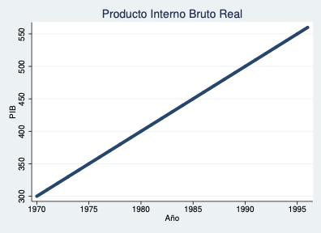

**Ejemplo — Crecimiento porcentual del PIB:**

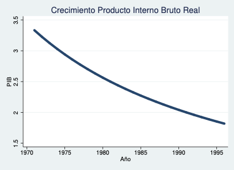

**Ejemplo — PIB (otra serie):**

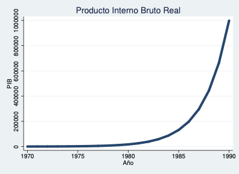

**Ejemplo — Crecimiento porcentual del PIB (otra serie):**

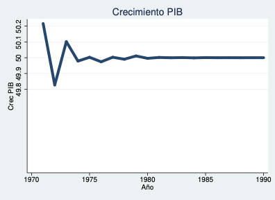

**PIB Real Colombia:**

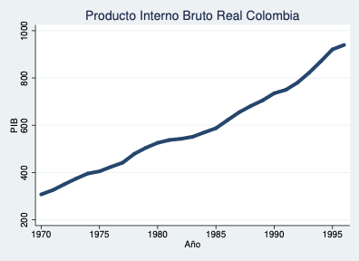

**Crecimiento del PIB Real Colombia:**

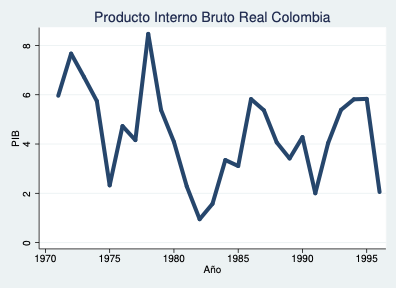

* * *

## Definiciones clave

**Tendencia:** describe el comportamiento de largo plazo de la serie — hacia dónde va $X_t$ cuando $t$ es grande.

**Media:** dice algo de la serie solo cuando la tendencia ha sido removida. La idea es trabajar con series de media cero, $X_t - \bar{X}$.

**Ciclo:** una serie sin tendencia puede mostrar ciclos. En economía, dada la naturaleza estocástica de las series, los ciclos nunca están demarcados claramente.

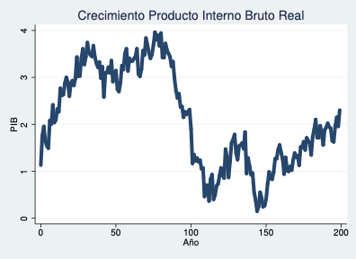

**Estacionalidad:** son ciclos cortos que se repiten dentro de un ciclo más largo (típicamente, dentro de un año).

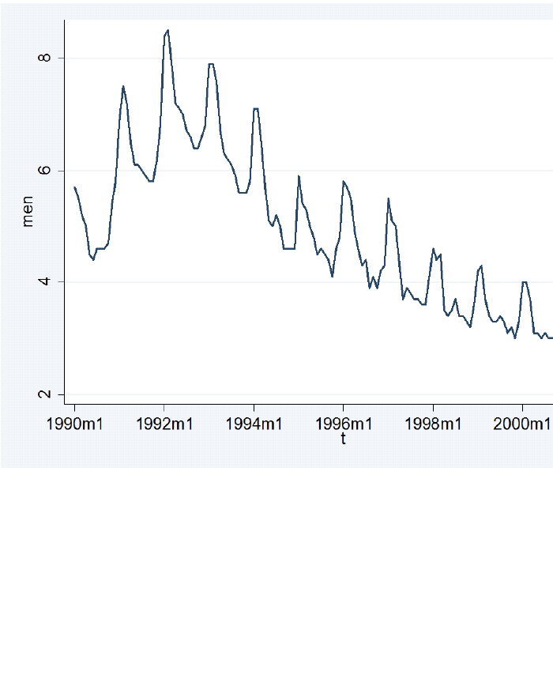

- **Determinística:** el patrón se repite igual cada año (Navidad siempre es en diciembre).
- **Estocástica:** el patrón se repite pero su intensidad varía año a año (el consumo como porcentaje del ingreso no es fijo).

**Ejemplos de series estacionales:** consumo de gasolina en vacaciones escolares, precios de tiquetes aéreos en temporada alta, consumo en noviembre–diciembre por compras navideñas.

* * *

## Predicción con tendencia y estacionalidad

Una serie con tendencia es fácil de predecir: está autocorrelacionada (alta inercia) y el dato en $t-1$ contiene información sobre el dato en $t$.

Una serie sin tendencia es más difícil: hay que verificar si existe un patrón entre observaciones cercanas. Si las observaciones pasadas no proveen información relevante, será imposible predecir usando el pasado — eso es **ruido**.

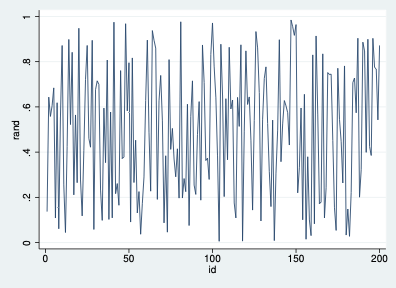

**Ejemplo ilustrativo.** Considere los siguientes datos trimestrales:

| Año | Trimestre | $Y_t$ |
|-----|-----------|-------|
| 2012 | I | 10.2 |
|  | II | 12.4 |
|  | III | 14.8 |
|  | IV | 15.0 |
| 2013 | I | 11.2 |
|  | II | 14.3 |
|  | III | 18.4 |
|  | IV | 18.0 |
| 2014 | I | ? |

**Paso 1 — Tendencia lineal.** Estimando $T_t = 0.944\,t + 10.039$, la proyección para 2014-I es:

$$\hat{T}_{2014\text{-I}} = 0.944 \cdot 9 + 10.039 = 18.54$$

**Paso 2 — Componente estacional aditivo.** Calcular el residuo $Y_t - T_t$ y promediar los residuos del trimestre I:

$$\frac{-0.783 + (-3.559)}{2} = -2.171$$

**Predicción aditiva:** $\hat{Y}_{2014\text{-I}} = 18.54 - 2.18 \approx 16.36$.

**Paso 3 — Componente estacional multiplicativo.** Calcular $Y_t / T_t$ y promediar los índices del trimestre I:

$$\frac{0.929 + 0.759}{2} = 0.8437$$

**Predicción multiplicativa:** $\hat{Y}_{2014\text{-I}} = 18.54 \cdot 0.8437 \approx 15.64$.

La elección entre aditivo y multiplicativo depende de si la amplitud estacional es constante (aditivo) o crece con el nivel de la serie (multiplicativo).

* * *

## Modelos con tendencia determinística

A partir de la gráfica se identifica la forma funcional de la tendencia:

- **Lineal:** $Y_t = \alpha_1 + \alpha_2 T + \varepsilon$
- **Exponencial:** $Y_t = \exp(\alpha_1 + \alpha_2 T + \varepsilon)$
- **Logarítmica:** $\ln Y_t = \ln \alpha_1 + \alpha_2 \ln T + \ln \varepsilon$
- **Cuadrática:** $Y_t = \alpha_1 + \alpha_2 T + \alpha_3 T^2 + \varepsilon$

Si la gráfica no permite decidir, hay que estimar todas las formas y comparar:

- Signos esperados de los coeficientes
- Significancia individual y global
- $R^2$ ajustado más cercano a 1
- Criterios de Akaike y Schwarz más pequeños

* * *

## Métodos de atenuación exponencial

Son técnicas **no paramétricas** que no requieren especificar una forma funcional. La información de $y_t$ se relaciona únicamente con su propio pasado, no con una tendencia explícita:

- Promedio móvil
- Suavizado exponencial
- Holt-Winters

* * *

## Modelos ARIMA y la metodología Box-Jenkins

Los modelos ARIMA permiten especificar y estimar pronósticos de corto plazo con muestras grandes. Incluyen, conjuntamente, los cuatro componentes de una serie de tiempo:

1. Tendencia
2. Ciclo
3. Estacionalidad
4. Componente irregular

Antes de avanzar, necesitamos formalizar cuatro conceptos.

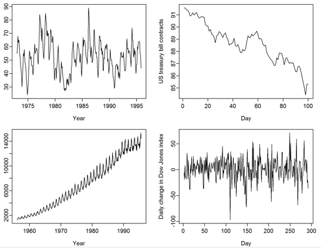

* * *

## Conceptos básicos

**Estocástico:** la naturaleza de la serie no es determinística — sus realizaciones son producto de un proceso aleatorio subyacente.

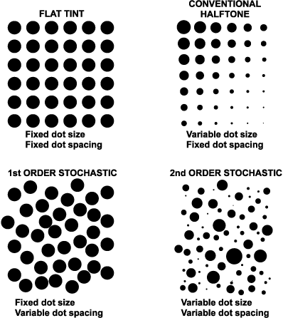


**Estacionario:** las características probabilísticas no varían con el tiempo. Distinguimos dos versiones:

- **Estacionariedad fuerte (o estricta) de orden $m$:** todos los momentos hasta orden $m$ son invariantes en el tiempo:

$$E(x_1^m, x_2^m, \ldots, x_n^m) = E(x_{1+\tau}^m, x_{2+\tau}^m, \ldots, x_{n+\tau}^m)$$

Equivalentemente, la función de distribución conjunta no depende de $t$:

$$F(x_1, x_2, \ldots, x_n) = F(x_{1+\tau}, x_{2+\tau}, \ldots, x_{n+\tau}) \quad \forall n, t$$

- **Estacionariedad débil ($m=2$):** solo se exige que los momentos hasta orden 2 sean finitos e independientes del tiempo:

  - Media constante: $E(x_t) = \mu$
  - Varianza constante: $Var(x_t) = \sigma^2$
  - Autocovarianza que depende solo del rezago: $Cov(x_t, x_{t-\tau}) = R(\tau)$

En la práctica, "estacionariedad" se refiere a la versión débil. Implica una serie aproximadamente plana, sin tendencia, sin estacionalidad, con varianza constante y autocorrelación que depende solo del rezago.

**Ergodicidad:** una serie es ergódica cuando la media y la varianza muestrales convergen a sus momentos poblacionales.

**Estacionalidad:** ciclos dentro del ciclo.

* * *

## ¿Por qué nos importa la estacionariedad?

Muchas técnicas de series de tiempo (incluida la metodología Box-Jenkins) asumen estacionariedad. Cuando la serie no es estacionaria:

- Los modelos tienen mal ajuste
- Se viola el supuesto de varianza constante del error
- Se viola el supuesto de no autocorrelación serial

Por eso, el primer paso de cualquier análisis es verificar estacionariedad y, si no se cumple, transformar la serie hasta lograrla.

* * *

## Ruido blanco

Un proceso $\varepsilon_t$ es **ruido blanco** si:

- Media nula: $E(\varepsilon_t) = 0$
- Varianza constante: $Var(\varepsilon_t) = \sigma^2$
- No autocorrelación: $Cov(\varepsilon_t, \varepsilon_{t-\tau}) = 0$ para todo $\tau \neq 0$

El ruido blanco es el bloque básico de toda la modelación ARMA: los residuos de un modelo bien especificado deben comportarse como ruido blanco.

* * *

## Métodos para detectar estacionariedad

1. Análisis gráfico
2. Durbin-Watson
3. Función de Autocorrelación Simple (ACF)
4. Función de Autocorrelación Parcial (PACF)
5. Análisis de raíz unitaria (Dickey-Fuller y Dickey-Fuller aumentada)

**Durbin-Watson:** regla práctica visual.

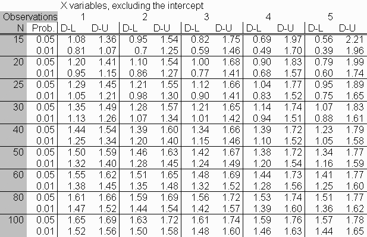

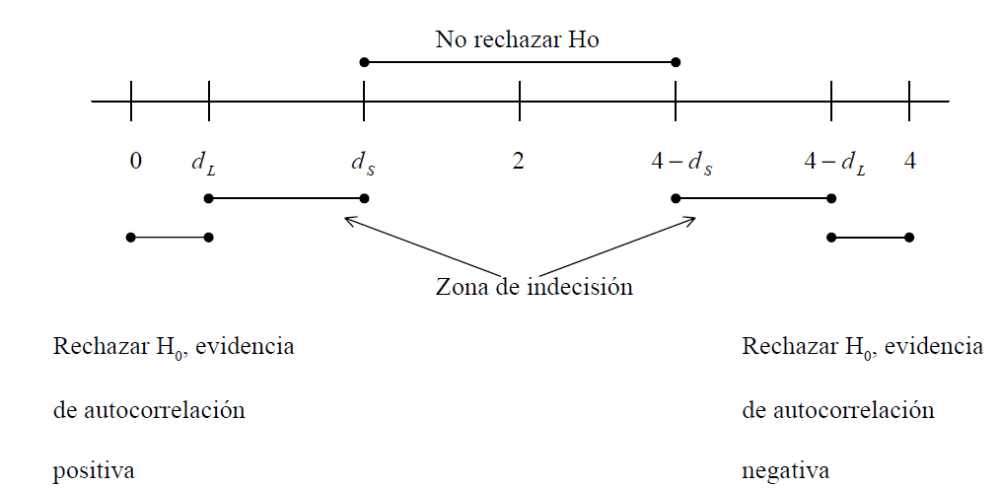

Es una prueba gráfica derivada de la función de autocorrelación simple (ACF), que a su vez depende de la función de autocovarianza.

* * *

## Función de autocovarianza y autocorrelación (ACF)

La **función de autocovarianza** mide la covarianza entre $x_t$ y su rezago $x_{t-\tau}$, como si fueran dos variables distintas:

$$R(\tau) = Cov(x_t, x_{t-\tau}) = E\left[(x_t - \mu)(x_{t-\tau} - \mu)\right]$$

Cuando $\tau = 0$, ambas series coinciden y $R(0) = Var(x_t)$.

La **función de autocorrelación (ACF)** normaliza la autocovarianza:

$$r(\tau) = \frac{R(\tau)}{R(0)}, \quad -1 < r(\tau) < 1, \quad r(\tau) \sim N(0, 1/n)$$

**Estimación muestral:**

$$\hat{R}(\tau) = \frac{1}{n}\sum_{t=1+|\tau|}^{n} (x_t - \bar{x})(x_{t-|\tau|} - \bar{x}), \quad \hat{r}(\tau) = \frac{\hat{R}(\tau)}{\hat{R}(0)}$$

**Lectura del correlograma:**

1. Solo se muestra el eje positivo de $\tau$.
2. Se omite el dato para $\tau = 0$ (siempre vale 1).
3. Se dibujan líneas punteadas a $\pm 2$ desviaciones estándar:

$$\hat{r}(\tau) - 1.96 \cdot \frac{1}{\sqrt{n}} \leq r(\tau) \leq \hat{r}(\tau) + 1.96 \cdot \frac{1}{\sqrt{n}}$$

Si la ACF cae rápidamente a cero, la serie es estacionaria. Si decae muy lentamente, hay tendencia o raíz unitaria.

```stata
* Correlograma en Stata
corrgram var, lags(#)
ac var, lags(#)
```

**Correlograma típico:**

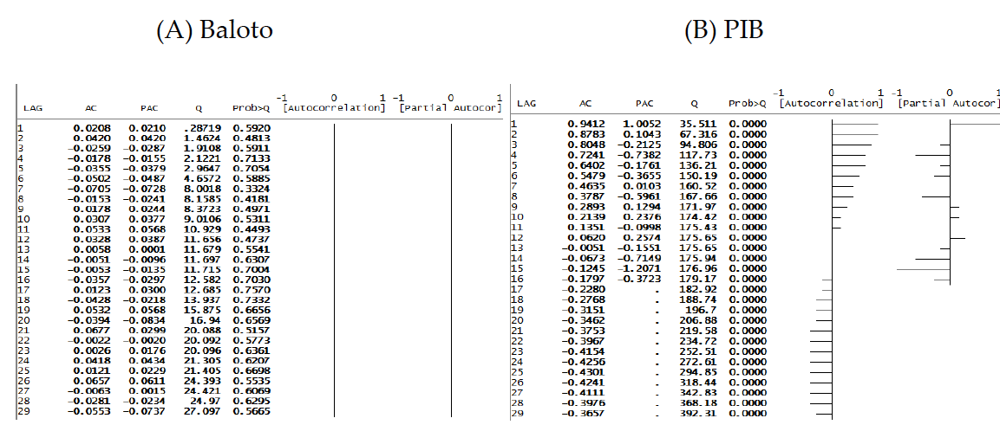

**Ejemplo — ACF del Baloto (ruido):**

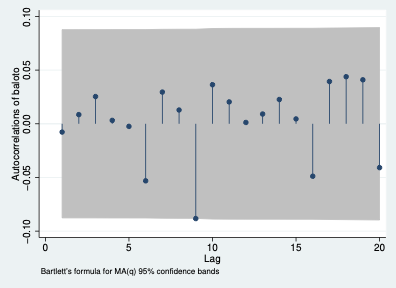

**Ejemplo — ACF del PIB (tendencia):**

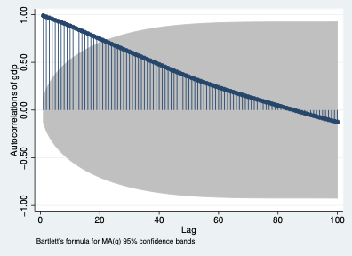

* * *

## Función de autocorrelación parcial (PACF)

La PACF calcula la correlación entre $x_t$ y $x_{t-\tau}$ **neta del efecto de los rezagos intermedios**:

- **ACF:** incluye, para el rezago $\tau$, tanto la correlación directa como la correlación implícita a través de los rezagos menores.
- **PACF:** mide solo la correlación estricta entre dos puntos separados por $\tau$ períodos.

La PACF se obtiene como el último coeficiente de la regresión:

$$x_t = c + \alpha_{\tau,1} x_{t-1} + \alpha_{\tau,2} x_{t-2} + \cdots + \alpha_{\tau,\tau} x_{t-\tau}$$

$$r_p(\tau) = \alpha_{\tau,\tau}$$

**PACF para el PIB:**

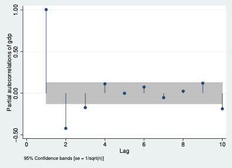

* * *

## Prueba Q de Box-Pierce

Para evaluar formalmente si la serie es ruido blanco, se prueba la significancia conjunta de las primeras $\tau$ autocorrelaciones:

$$H_0: r(1) = r(2) = \cdots = r(\tau) = 0 \quad \text{(la serie es ruido blanco)}$$

$$Q = n \sum_{t=1}^{\tau} \hat{r}(t)^2 \sim \chi^2(\tau)$$

Si $Q$ supera el valor crítico, se rechaza ruido blanco: la serie tiene estructura autocorrelacionada que vale la pena modelar.

**Limitaciones del análisis ACF/PACF:** es un diagnóstico **exploratorio**, no concluyente. Debe complementarse con un análisis formal de raíz unitaria.

* * *

## Caminatas aleatorias y procesos integrados

Una **caminata aleatoria** es un proceso donde la posición en $t$ depende solo de la posición en $t-1$ más un choque aleatorio:

$$x_t = x_{t-1} + \varepsilon_t, \quad \varepsilon_t \sim N(0, \sigma^2)$$

**Caminata aleatoria pura, sin intercepto:**

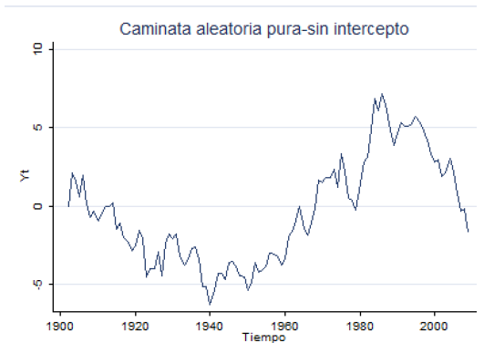

Iterando:

$$x_t = x_0 + \sum_{s=1}^{t} \varepsilon_s, \quad E(x_t) = x_0, \quad Var(x_t) = t \sigma^2$$

La varianza crece con $t$ → **no es estacionaria**.

**Variantes:**

- Con tendencia (deriva): $x_t = \alpha + x_{t-1} + \varepsilon_t$

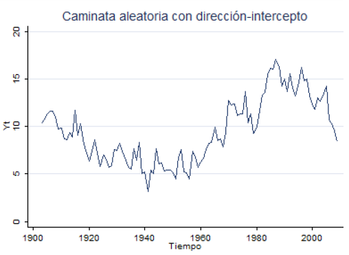
- Autoregresiva: $x_t = \rho x_{t-1} + \varepsilon_t$ con $-1 \leq \rho \leq 1$
- Con tendencia y autoregresiva: $x_t = \delta + \beta T_t + \rho x_{t-1} + \varepsilon_t$

**Proceso integrado de orden $d$, $I(d)$:** se refiere al número de veces que hay que diferenciar la serie para volverla estacionaria.

- $I(0)$: estacionaria en niveles
- $I(1)$: requiere una diferencia
- $I(2)$: requiere dos diferencias
- $I(d)$: requiere $d$ diferencias

* * *

## Prueba de raíz unitaria de Dickey-Fuller (DF)

Es la prueba formal y concluyente de estacionariedad. Se basa en las tres especificaciones de caminata aleatoria:

$$x_t = \rho x_{t-1} + \varepsilon_t$$
$$x_t = \alpha + \rho x_{t-1} + \varepsilon_t$$
$$x_t = \delta + \beta T_t + \rho x_{t-1} + \varepsilon_t$$

Restando $x_{t-1}$ a cada lado:

$$\Delta x_t = (\rho - 1) x_{t-1} + \varepsilon_t$$
$$\Delta x_t = \alpha + (\rho - 1) x_{t-1} + \varepsilon_t$$
$$\Delta x_t = \delta + \beta T_t + (\rho - 1) x_{t-1} + \varepsilon_t$$

**Hipótesis:**

- $H_0: \rho = 1$ — contiene raíz unitaria, es una caminata aleatoria, **NO** es estacionaria.
- $H_1: \rho \neq 1$ — **NO** contiene raíz unitaria, **NO** es caminata aleatoria, **ES** estacionaria.

**¡Atención!** El estadístico de contraste para $\rho = 1$ **no es la $t$ usual**. Dickey y Fuller (1979) y MacKinnon (1994) construyeron tablas especiales mediante simulaciones de Monte Carlo.

**Ejemplo en Stata — PIB de Estados Unidos:**

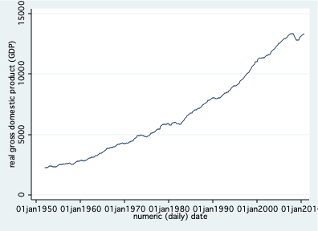

**ACF y PACF del PIB:**

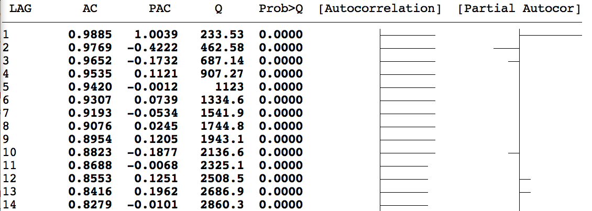

**Prueba de raíz unitaria (sin tendencia):**

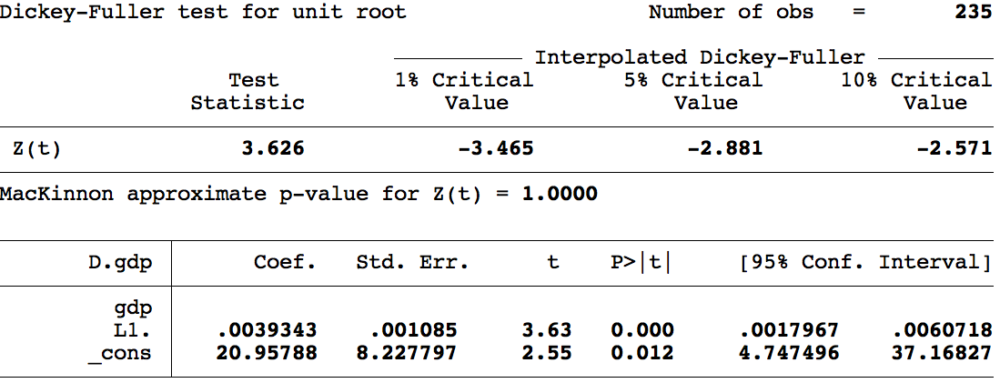

**Prueba de raíz unitaria (con tendencia):**

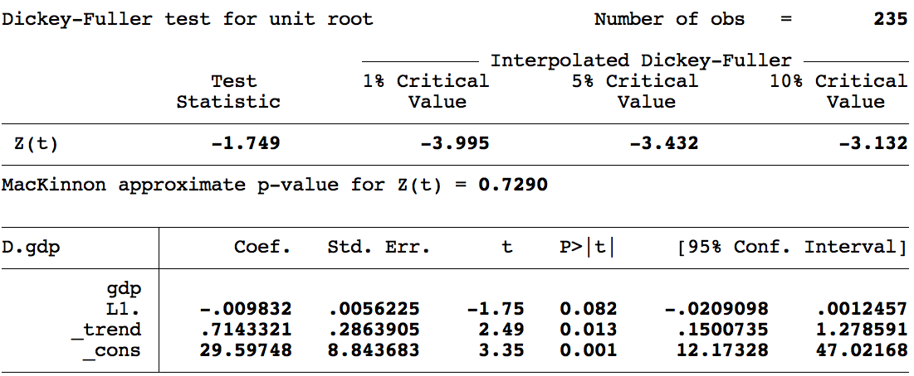

**Prueba de raíz unitaria con tendencia para $\ln$ PIB:**

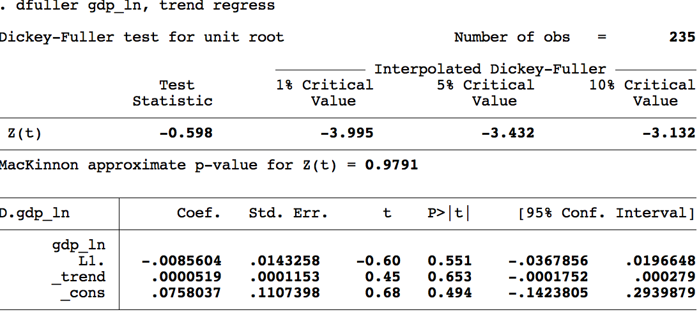

**Prueba de raíz unitaria con tendencia para $\Delta \ln$ PIB:**

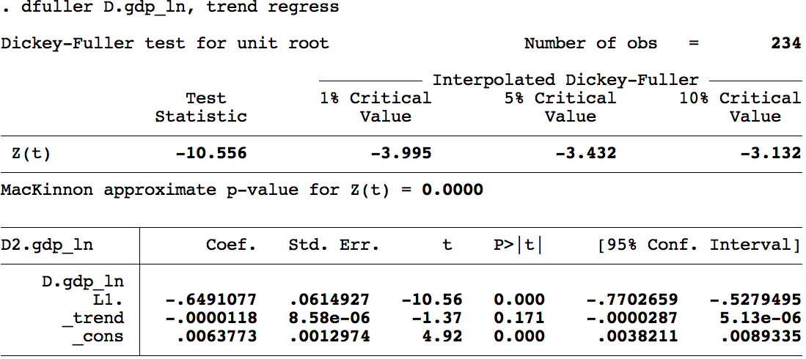

* * *

## Dickey-Fuller aumentada (ADF)

La DF original es válida solo si los errores no presentan autocorrelación serial — limitación severa. La versión **aumentada** corrige esto agregando rezagos de la diferencia:

$$\Delta x_t = (\rho - 1) x_{t-1} + \sum_{j=1}^{\tau} b_j \Delta x_{t-j} + \varepsilon_t$$

(con las tres variantes: pura, con intercepto, con intercepto y tendencia).

**Elección del número de rezagos $\tau$:**

- Criterio de Información de Akaike (AIC) o Schwarz (BIC)
- Prueba y error: incluir rezagos hasta eliminar la autocorrelación serial (Durbin-Watson)
- Usar **Dickey-Fuller GLS** (`dfgls` en Stata), que selecciona automáticamente el número óptimo de rezagos — suele ser la mejor opción

```stata
* Dickey-Fuller con intercepto
dfuller var

* Dickey-Fuller con intercepto y tendencia
dfuller var, trend

* Dickey-Fuller aumentada con k rezagos
dfuller var, lags(k) trend

* Dickey-Fuller GLS (selección automática de rezagos)
dfgls var
```

**Ejemplo en Stata — ADF aplicada al PIB:**

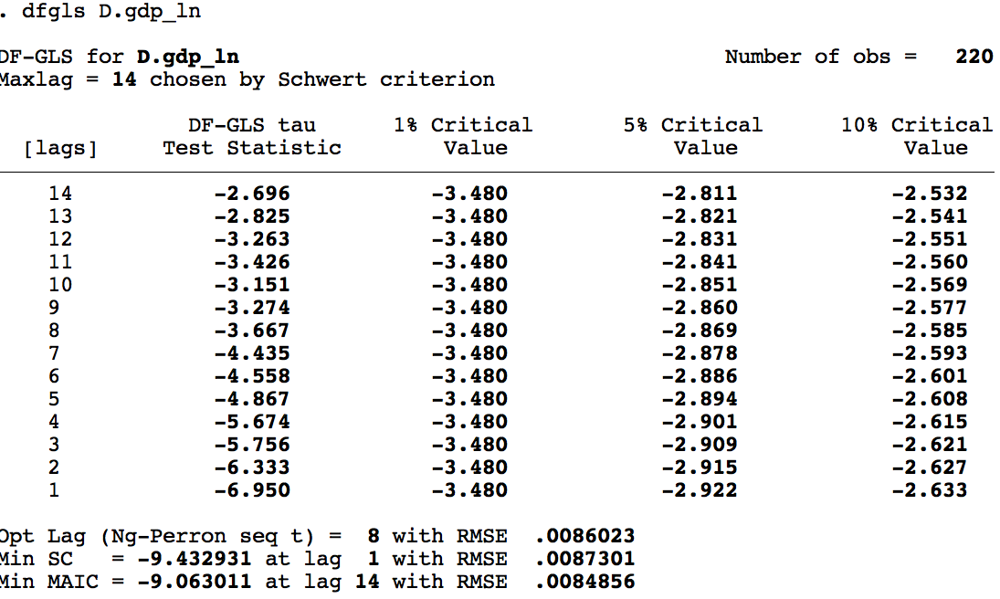

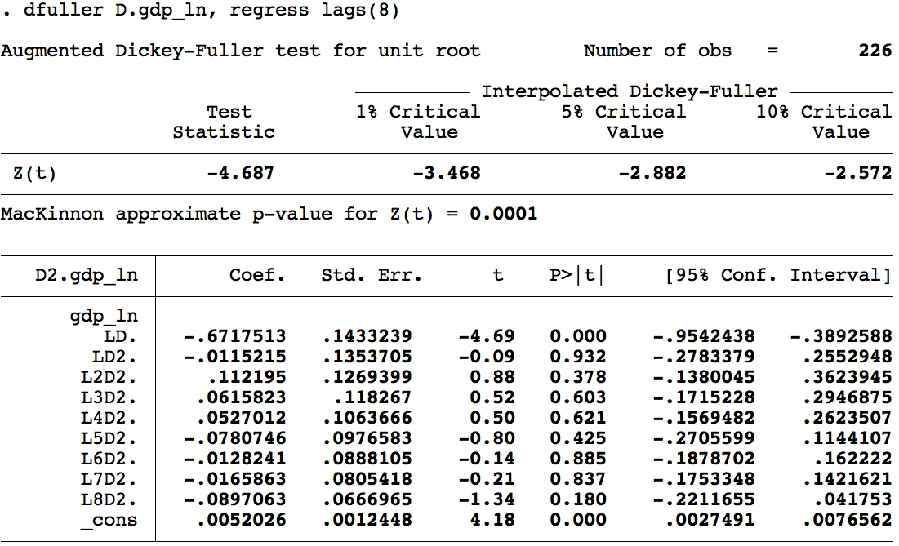

* * *

## Transformación de series no estacionarias

Cuando la serie no es estacionaria, hay tres estrategias:

1. **Diferencias:** $\Delta x_t = x_t - x_{t-1}$
2. **Diferencias de los logaritmos:** $\Delta \ln x_t$ (interpretación: tasa de crecimiento)
3. **Filtros de descomposición:** Hodrick-Prescott (HP), Holt-Winters (HW)

Tras transformar, se vuelve a aplicar la prueba ADF para verificar que la serie transformada sí es estacionaria.

* * *

## Modelos Autorregresivos y de Promedio Móvil

La idea central: el comportamiento pasado de la serie contiene información sobre su futuro y puede, en muchos casos, reemplazar la información de otras variables.

Estos modelos representan la variable en función de su propio pasado:

- Autorregresivos: $AR(p)$
- Promedio Móvil: $MA(q)$
- Mixtos: $ARMA(p, q)$

**Importante:** los modelos AR, MA y ARMA están **diseñados para procesos estocásticos estacionarios**.

* * *

## Modelo Autorregresivo $AR(p)$

$$x_t = c + \alpha_1 x_{t-1} + \alpha_2 x_{t-2} + \cdots + \alpha_p x_{t-p} + \varepsilon_t$$

donde $p$ es el rezago máximo y $\varepsilon_t$ es ruido blanco con media cero y varianza constante.

* * *

## Modelo de Promedio Móvil $MA(q)$

$$x_t = c + \beta_0 \varepsilon_t + \beta_1 \varepsilon_{t-1} + \beta_2 \varepsilon_{t-2} + \cdots + \beta_q \varepsilon_{t-q}$$

La serie se expresa como combinación lineal de choques de ruido blanco presentes y pasados.

* * *

## Teorema de descomposición de Wold

Todo proceso estocástico $x_t$ débilmente estacionario con media cero puede representarse como:

$$x_t = D_t + S_t$$

donde $D_t$ es la parte determinística y $S_t$ la parte estocástica:

$$S_t = \sum_{v=0}^{\infty} \beta_v \varepsilon_{t-v}$$

**Consecuencia:** cualquier proceso débilmente estacionario tiene una representación de Wold. Los modelos AR, MA y especialmente ARMA son aproximaciones finitas de esa representación.

* * *

## Modelo $ARMA(p, q)$

$$x_t = c + \alpha_1 x_{t-1} + \cdots + \alpha_p x_{t-p} + \varepsilon_t + \beta_1 \varepsilon_{t-1} + \cdots + \beta_q \varepsilon_{t-q}$$

Combina autorregresión (memoria larga vía $x_{t-j}$) con promedio móvil (memoria corta vía $\varepsilon_{t-j}$).

* * *

## Los cinco pasos de Box-Jenkins

1. **Identificación del modelo** (orden $p$ y $q$) a partir de ACF y PACF
2. **Estimación de parámetros**
3. **Validación del modelo** (residuos = ruido blanco)
4. **Pronóstico**
5. **Validación del pronóstico**

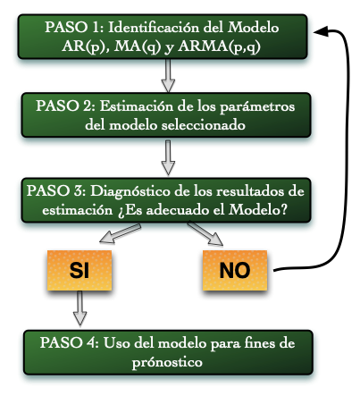

* * *

## Paso 1 — Identificación

Se usa la siguiente regla práctica con base en los correlogramas teóricos:

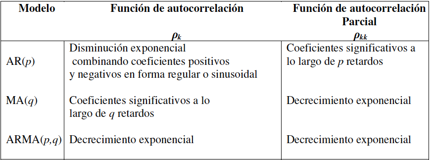

| Modelo | ACF | PACF |
|--------|-----|------|
| $AR(p)$ | Decae gradualmente | **Corte abrupto** después del rezago $p$ |
| $MA(q)$ | **Corte abrupto** después del rezago $q$ | Decae gradualmente |
| $ARMA(p, q)$ | Decae gradualmente | Decae gradualmente |

**Método alternativo — criterios de información.** Correr el modelo para distintas combinaciones de $p$ y $q$ y escoger la que minimice:

$$AIC = \ln\left(\frac{\hat{\varepsilon}'\hat{\varepsilon}}{n}\right) + \frac{2k}{n}$$

$$BIC = \ln\left(\frac{\hat{\varepsilon}'\hat{\varepsilon}}{n}\right) + \frac{k \cdot \ln(n)}{n}$$

donde $k$ es el número de parámetros y $n$ las observaciones utilizables. Se escoge el modelo con menor valor.

**Correlogramas teóricos — AR(1):**

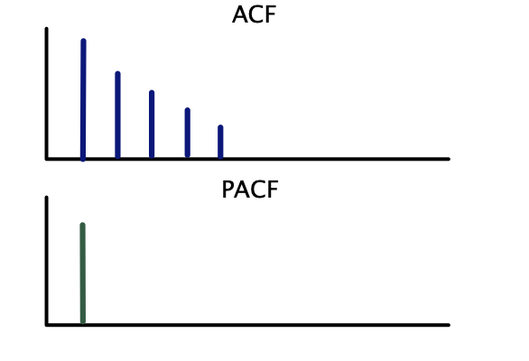

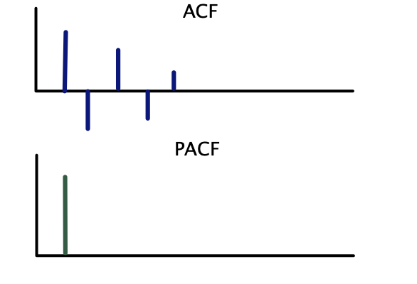

**Correlogramas teóricos — AR(2):**

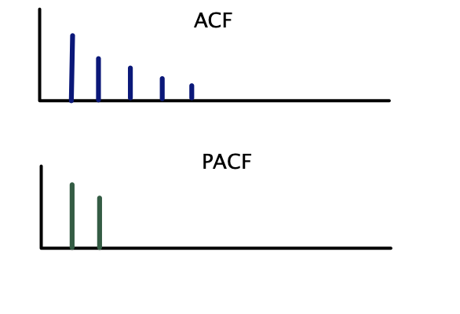

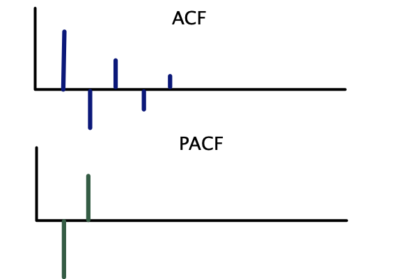

**Correlogramas teóricos — MA(1):**

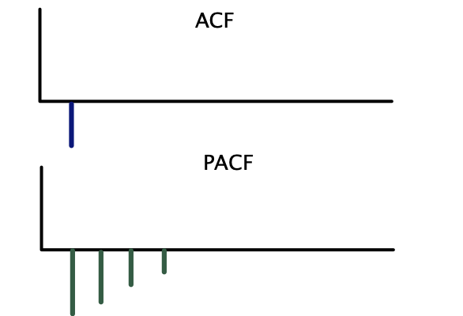

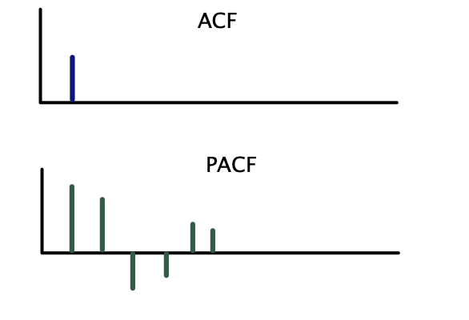

**Correlogramas teóricos — MA(2):**

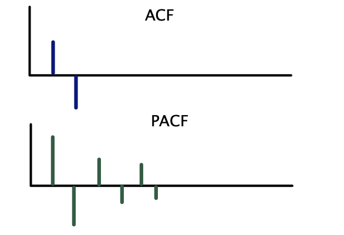

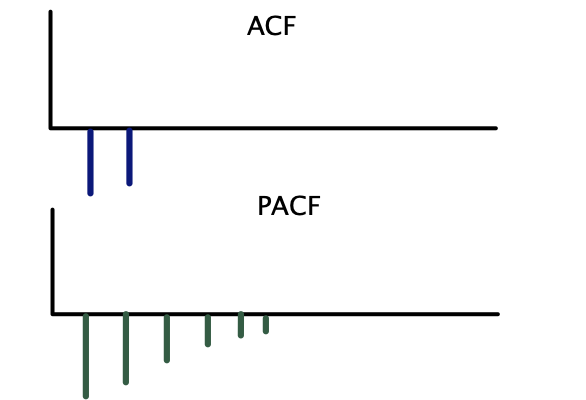

**Correlogramas teóricos — ARMA(1,1):**

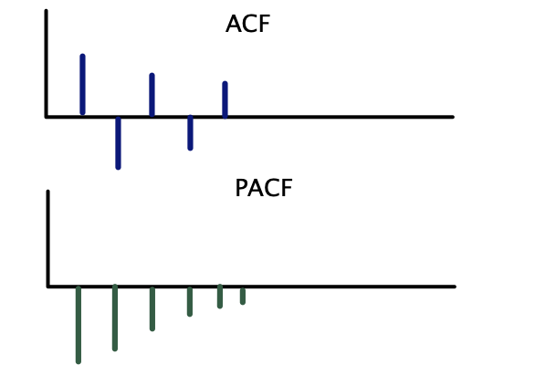

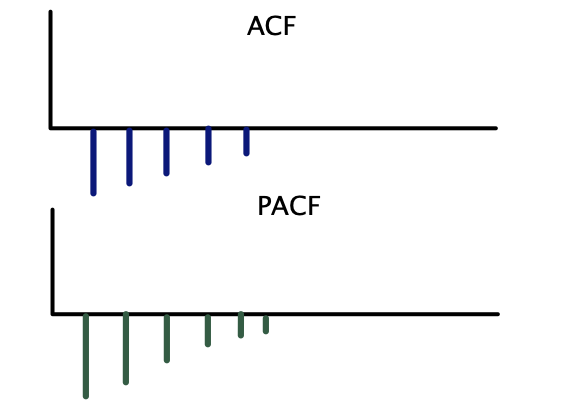

* * *

## Paso 2 — Estimación de parámetros

Existen tres métodos principales:

1. **Método de Momentos (Yule-Walker)** — solo para $AR(p)$, menos usado.
2. **Mínimos Cuadrados Ordinarios** — válido para AR y MA.
3. **Máxima Verosimilitud** — el más usado, especialmente para ARMA.

**Yule-Walker para $AR(p)$:** se estiman las autocovarianzas y se resuelven las $p$ ecuaciones simultáneas:

$$\hat{R}(\tau) + \hat{\alpha}_1 \hat{R}(\tau - 1) + \cdots + \hat{\alpha}_p \hat{R}(\tau - p) = 0, \quad \tau = 1, \ldots, p$$

**MCO para $AR(1)$:** minimizar $\sum (x_t - \alpha x_{t-1})^2$. En forma matricial:

$$\hat{\alpha} = (X'X)^{-1} X' x$$

**Máxima verosimilitud condicional:** asumiendo errores ruido blanco gaussianos,

$$f(\varepsilon_{p+1}, \ldots, \varepsilon_n) = \left(\frac{1}{2\pi\sigma_\varepsilon^2}\right)^{(n-p)/2} \exp\left(-\frac{1}{2\sigma_\varepsilon^2}\sum_{t=p+1}^{n} \varepsilon_t^2\right)$$

Se toman logaritmos y se maximiza la log-verosimilitud para hallar $\hat{\alpha}$.

* * *

## Paso 3 — Validación del modelo

Se analiza el correlograma de la ACF y la PACF **de los residuos** del modelo estimado.

**Diagnóstico esperado:** los coeficientes de autocorrelación de los residuos deben ser estadísticamente iguales a cero — es decir, los residuos deben comportarse como ruido blanco.

**¡Atención!** Si los residuos no son ruido blanco, hay que **volver al paso 1** y re-especificar el modelo.

* * *

## Paso 4 — Pronóstico

**$AR(1)$:**

$$x_t = c + \alpha_1 x_{t-1} + \varepsilon_t \quad \Rightarrow \quad \hat{x}_{t+1} = \hat{c} + \hat{\alpha}_1 x_t$$

**$MA(1)$:**

$$x_{t+1} = c + \varepsilon_{t+1} + \beta_1 \varepsilon_t \quad \Rightarrow \quad \hat{x}_{t+1} = \hat{c} + \hat{\beta}_1 \varepsilon_t$$

**$ARMA(p, q)$:**

$$\hat{x}_{t+1} = \hat{c} + \hat{\alpha}_1 x_t + \cdots + \hat{\alpha}_p x_{t+1-p} + \hat{\beta}_1 \varepsilon_t + \cdots + \hat{\beta}_q \varepsilon_{t+1-q}$$

* * *

## Paso 5 — Validación del pronóstico

- **Gráfica:** comparar la trayectoria temporal de valores observados y proyectados.
- **Intervalos de confianza:** una buena predicción produce intervalos de confianza estrechos. Si los intervalos crecen rápido con el horizonte, el modelo solo sirve para muy corto plazo.

* * *

## Ventajas y desventajas de los modelos ARMA

**Ventajas:**

- Excelente herramienta para pronóstico de corto plazo.
- Existen procedimientos formales (AIC, BIC, validación de residuos) para comparar modelos alternativos.

**Desventajas:**

- Requieren muestras grandes — se recomiendan al menos 30 observaciones (idealmente más).
- No tienen un mecanismo sencillo para incorporar nuevos datos: hay que reestimar.

```stata
* Identificación: ACF y PACF
ac y, lags(20)
pac y, lags(20)

* Estimar un ARMA(1,1)
arima y, arima(1,0,1)

* Estimar un ARIMA(1,1,1) sobre la serie en niveles
arima y, arima(1,1,1)

* Diagnóstico de residuos
predict r, residuals
corrgram r, lags(20)
wntestq r

* Pronóstico fuera de muestra
predict yhat, y dynamic(tq(2014q1))
```

**Ejemplo en Stata — estimación ARMA y pronóstico del PIB:**

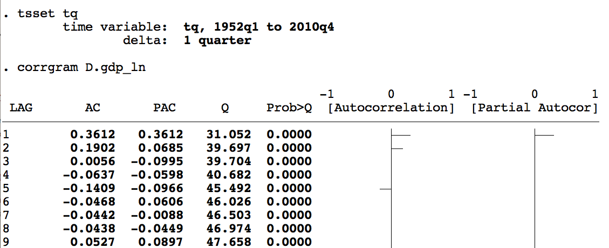

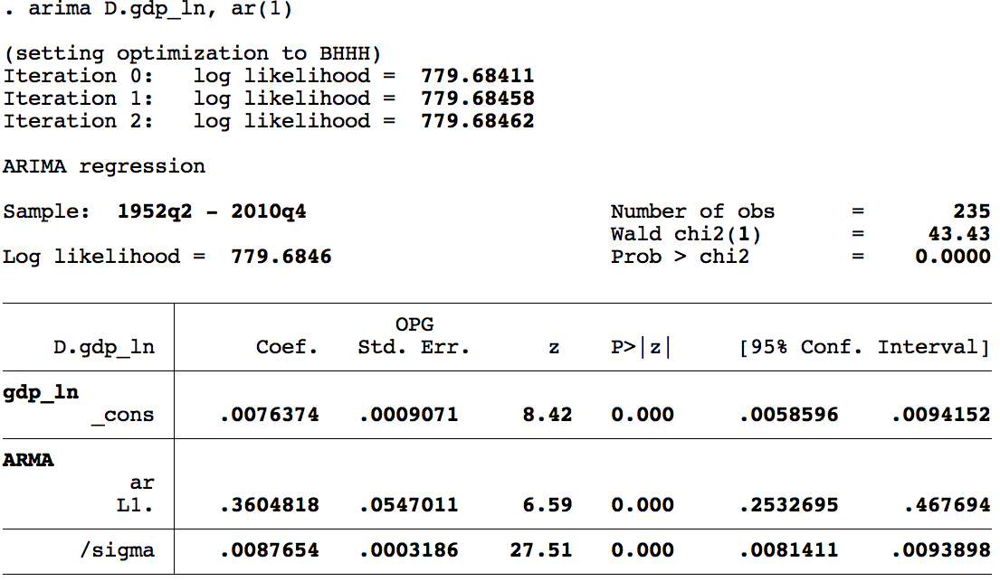

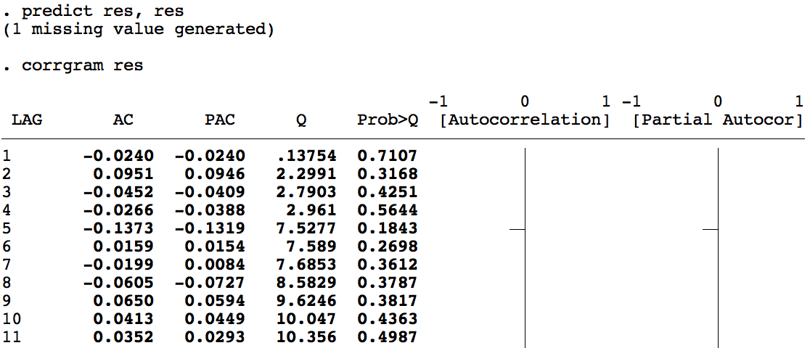

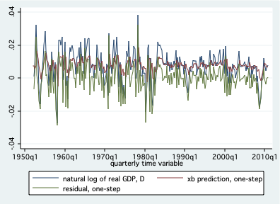

**Pronóstico:**

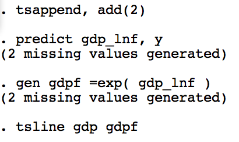

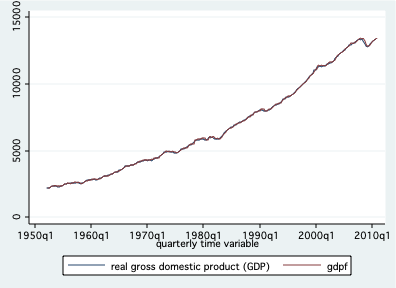

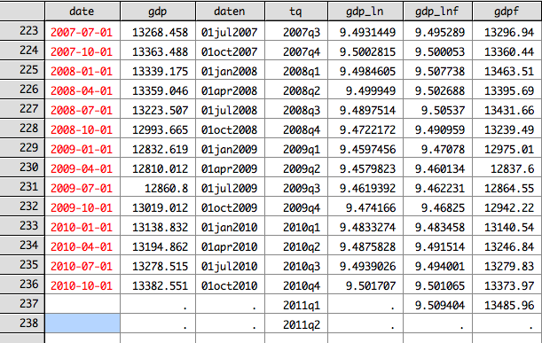

* * *

## Lecturas recomendadas

- **Enders (2014)** — *Applied Econometric Time Series*, 4ª ed. — referencia estándar para el curso, cubre ARMA, raíz unitaria y Box-Jenkins.
- **Hamilton (1994)** — *Time Series Analysis* — tratado de referencia avanzado.
- **Box, Jenkins & Reinsel (2008)** — *Time Series Analysis: Forecasting and Control* — la metodología original.
- **Dickey & Fuller (1979)** — "Distribution of the estimators for autoregressive time series with a unit root", *JASA*.


<!--chapter:end:14-SeriesTiempo.Rmd-->

# Modelos con variable dependiente binaria {#binaria}

En muchos problemas económicos la variable de interés no es continua sino binaria: el individuo habla inglés o no, está afiliado al sindicato o no, fue vacunado o no, sobrevivió al COVID o no. En estos casos $Y$ toma valor 1 si ocurre el evento y 0 en caso contrario, y la pregunta empírica natural es modelar la probabilidad de que ocurra el evento condicional a un vector de covariables $X$:

$$P(Y_i = 1 \mid X_i) = E(Y_i \mid X_i)$$

¿De dónde sale esta igualdad? Porque $Y_i$ es Bernoulli: $E(Y_i) = 1 \cdot p + 0 \cdot (1-p) = p$. La esperanza condicional **es** la probabilidad. Te lo advertí: la matemática no son números, son letras.

Tres modelos compiten para estimar esa probabilidad: el **Modelo Lineal de Probabilidad (MPL)**, el **Probit** y el **Logit**.

## La pregunta motivadora: quien habla ingles

Imaginemos datos ficticios donde $Y = 1$ si el individuo habla inglés y $X$ = ingreso de los padres. La variable explicada es binaria: solo toma los valores 0 y 1. Si graficamos los puntos contra el ingreso, vemos lo siguiente:

- En ingresos bajos, casi todos los puntos caen en $Y=0$.
- En ingresos altos, casi todos caen en $Y=1$.
- En ingresos medios, hay mezcla.

Dos modelos compiten por ajustar estos datos:

1. **Una recta** (MPL): $\widehat{P}(Y=1\mid X) = \widehat{\beta}_0 + \widehat{\beta}_1 X$.
2. **Una curva sigmoidal** (Logit o Probit): acotada en el intervalo de 0 a 1, con forma de S.

A primera vista la curva gana — parece ajustar mejor en los extremos. Pero como veremos, cuando la relación entre $X$ y $Y$ es difusa (situación común en ciencias sociales), la recta y la curva se parecen mucho en todo el rango, y la diferencia práctica entre los dos modelos se vuelve pequeña.

## El Modelo Lineal de Probabilidad (MPL)

El MPL aplica directamente MCO a una regresión donde la variable dependiente es binaria:

$$Y_i = \beta_0 + \beta_1 X_{1i} + \cdots + \beta_k X_{ki} + \varepsilon_i$$

Como $E(Y_i \mid X_i) = P(Y_i = 1 \mid X_i)$:

$$P(Y_i = 1 \mid X_i) = X_i\beta$$

**Interpretación directa de los coeficientes.** En el MPL cada $\beta_j$ es el efecto marginal sobre la probabilidad:

$$\frac{\Delta P(Y_i = 1 \mid X_i)}{\Delta X_{ji}} = \beta_j$$

Si $X_j$ aumenta en una unidad, la probabilidad de que $Y_i=1$ cambia en $\beta_j$. Multiplicando por 100 se expresa en puntos porcentuales.

**Problema 1: predicciones fuera del intervalo admisible.** El lado derecho $X_i\beta$ es lineal e ilimitado. Para valores extremos de $X$, el modelo predice probabilidades negativas o mayores que uno. ¡Horror! ¡Horror! ¡Policía! Una probabilidad debe estar contenida entre 0 y 1.

**Problema 2: heterocedasticidad por construcción.** Como $Y_i$ es Bernoulli con probabilidad $p_i = X_i\beta$:

$$Var(\varepsilon_i \mid X_i) = p_i(1-p_i) = (X_i\beta)(1 - X_i\beta)$$

La varianza del error depende de $X_i$ — el supuesto de homocedasticidad falla por construcción. Consecuencia: los errores estándar de MCO son inconsistentes. Solución obligatoria: errores estándar robustos.

**Problema 3: errores no normales.** $\varepsilon_i$ solo toma dos valores: $1 - X_i\beta$ cuando $Y_i=1$ y $-X_i\beta$ cuando $Y_i=0$. La distribución es discreta, no normal.

**Problema 4: efectos parciales constantes.** El MPL impone que llevar a alguien con probabilidad 0.05 a 0.15 es lo mismo que llevarlo de 0.50 a 0.60.

**Defensa del MPL — Angrist y Pischke.** A pesar de estos problemas, Angrist y Pischke defienden el MPL enfáticamente: poco para perder, mucho para ganar. En la práctica, cuando la relación entre $Y$ y $X$ es difusa, la recta rara vez se va del intervalo observado, y su pendiente se parece mucho a la de la curva logit/probit en casi todo el soporte. Además, el MPL se estima por MCO y hereda toda la tecnología disponible: variables instrumentales, paneles, efectos fijos, diferencias en diferencias.

## El enfoque de variable latente

Pensar en una variable latente $Y_i^*$ no observada:

$$Y_i^* = X_i\beta + u_i, \quad Y_i = 1 \text{ si } Y_i^* > 0, \quad Y_i = 0 \text{ si no.}$$

Entonces:

$$P(Y_i = 1 \mid X_i) = P(Y_i^* > 0 \mid X_i) = P(u_i > -X_i\beta \mid X_i)$$

Si la distribución de $u_i$ es simétrica:

$$P(Y_i = 1 \mid X_i) = G(X_i\beta)$$

donde $G(\cdot)$ es la CDF de $u_i$. La elección de $G$ define el modelo: Probit usa $\Phi$ (CDF normal); Logit usa $\Lambda(e) = \exp(e)/(1+\exp(e))$.

## El modelo Probit

En Probit suponemos $u_i \sim N(0,1)$:

$$g(X_i\beta) = \frac{1}{\sqrt{2\pi}}\exp\left(-\frac{1}{2}(X_i\beta)^2\right)$$

$$G(X_i\beta) = \Phi(X_i\beta) = \int_{-\infty}^{X_i\beta} \frac{1}{\sqrt{2\pi}} \exp\left(-\frac{1}{2}t^2\right) dt$$

## El modelo Logit

En Logit suponemos que $u_i$ sigue una distribución logística estándar:

$$g(X_i\beta) = \lambda(X_i\beta) = \frac{\exp(X_i\beta)}{(1+\exp(X_i\beta))^2}$$

$$G(X_i\beta) = \Lambda(X_i\beta) = \frac{\exp(X_i\beta)}{1+\exp(X_i\beta)}$$

**Interpretación por log-odds.** El Logit tiene una propiedad muy útil. Definamos los odds (razón de probabilidades):

$$\frac{P(Y_i=1\mid X_i)}{P(Y_i=0\mid X_i)} = \exp(X_i\beta)$$

Tomando logaritmos, el log-odds es lineal en $X_i\beta$. Un aumento de una unidad en $X_j$ multiplica los odds por $\exp(\beta_j)$ (el odds-ratio).

## Estimación por máxima verosimilitud

Para Probit y Logit no hay solución cerrada. Se estima por máxima verosimilitud. La log-verosimilitud:

$$\ln L(\beta) = \sum_{i=1}^n \left\{ Y_i \ln G(X_i\beta) + (1-Y_i)\ln[1-G(X_i\beta)] \right\}$$

Las condiciones de primer orden:

$$\sum_{i=1}^n \frac{Y_i - G(X_i\beta)}{G(X_i\beta)\,[1-G(X_i\beta)]} \, g(X_i\beta) \, X_{ji} = 0$$

Este sistema no tiene solución cerrada. Se resuelve numéricamente con Newton-Raphson. Bajo regularidad, $\hat{\beta}^{ML}$ es consistente, asintóticamente normal y eficiente.

## Efectos marginales

En Probit y Logit, $\beta_j$ no es el efecto marginal. Hay que aplicar la regla de la cadena.

**Caso 1: variable continua.** Sea $P(Y_i=1\mid X_i) = G(\beta_0 + \beta_1 X_{1i} + \beta_2 X_{2i})$. El efecto marginal de $X_1$:

$$\frac{\partial P(Y_i=1\mid X_i)}{\partial X_{1i}} = g(X_i\beta) \cdot \beta_1$$

Como $g(\cdot) > 0$ siempre, el efecto marginal tiene el mismo signo que $\beta_1$. El promedio en la muestra (APE) en Stata se obtiene con `margins, dydx(x1)`.

**Caso 2: variable binaria.** Para una variable binaria $X_1$, se calcula la diferencia:

$$\frac{\Delta P(Y_i=1\mid X_i)}{\Delta X_{1i}} = G(\beta_0 + \beta_1 + \beta_2 X_{2i}) - G(\beta_0 + \beta_2 X_{2i})$$

evaluada típicamente en $\bar{X}_2$.

## Ejemplo aplicado: mortalidad por COVID-19

Sea $Y = 1$ si el paciente murió de COVID-19. Las covariables:

- $X_1$ = Edad (continua), $\bar{X}_1 = 55$ años.
- $X_2$ = Vacuna (binaria), $\bar{X}_2 = 0.41$ (41% vacunados).

Estimaciones:

- Probit: $\hat{\beta}_0 = -3.80$, $\hat{\beta}_1 = 0.06$, $\hat{\beta}_2 = 2.00$.
- Logit: $\hat{\beta}_0 = -6.70$, $\hat{\beta}_1 = 0.11$, $\hat{\beta}_2 = 3.44$.

**Efecto marginal de la edad (continua) en Probit:**

$$X\hat{\beta} = -3.80 + 0.06 \cdot 55 + 2.00 \cdot 0.41 = 0.32$$

$$\phi(0.32) \approx 0.379 \quad\Rightarrow\quad \text{Efecto marginal} = 0.379 \cdot 0.06 \approx 0.023 \approx 2.3 \text{ pp por año}$$

**Efecto marginal de la edad en Logit:**

$$X\hat{\beta} = -6.70 + 0.11 \cdot 55 + 3.44 \cdot 0.41 = 0.76$$

$$\lambda(0.76) \approx 0.218 \quad\Rightarrow\quad \text{Efecto marginal} = 0.218 \cdot 0.11 \approx 0.024 \approx 2.4 \text{ pp por año}$$

Los dos modelos dan efectos marginales muy parecidos (2.3 pp vs 2.4 pp) aunque los $\hat{\beta}$ son distintos.

## Términos de interacción y cuadráticos

**Interacción $X_1 \times X_2$.** Si $P(Y=1\mid X) = G(\beta_0 + \beta_1 X_1 + \beta_2 X_2 + \beta_3 X_1 X_2)$, el efecto marginal cruzado no es simplemente $\beta_3$: depende del nivel de las otras variables y de la densidad $g(\cdot)$ evaluada en el punto correspondiente.

**Término cuadrático.** Si $P(Y=1\mid X) = G(\beta_0 + \beta_1 X_1 + \beta_2 X_1^2)$:

$$\frac{\partial P(Y=1\mid X)}{\partial X_1} = g(\beta_0 + \beta_1 X_1 + \beta_2 X_1^2)(\beta_1 + 2\beta_2 X_1)$$

## Comparación de los tres modelos

Las magnitudes de los coeficientes no son comparables. Como referencia aproximada:

$$\beta_{Logit} \approx 1.6 \cdot \beta_{Probit} \approx 4 \cdot \beta_{MPL}$$

Pero los efectos parciales promedio suelen ser muy similares. La elección entre Probit y Logit rara vez cambia las conclusiones; la diferencia importante es entre MPL y los modelos no lineales.

## Inferencia: prueba de razón de verosimilitudes (LR)

El estadístico:

$$LR = 2(\ln L_{ur} - \ln L_r) \sim \chi^2_q$$

donde $q$ es el número de restricciones bajo $H_0$.

**Ejemplo en Stata: `probit union south grade`.** Estimamos un Probit para afiliación sindical (`union = 1` si afiliado) en función de región sur y años de educación, $N = 26.200$.

Modelo no restringido: $\ln L_{ur} = -13580.409$, Pseudo $R^2 = 0.0205$, coeficientes south $= -0.383$ ($p<0.001$), grade $= 0.031$ ($p<0.001$).

Modelo restringido (sin `grade`): $\ln L_{r} = -13616.76$.

$$LR = 2(-13580.409 - (-13616.76)) = 2 \cdot 36.351 = 72.70$$

Bajo $H_0: \beta_{grade} = 0$, $LR \sim \chi^2_1$ — el valor crítico al 5% es 3.84, así que rechazamos con holgura. El `test grade` de Stata (test de Wald) da 72.46, casi idéntico al LR a mano: en muestras grandes los dos tests convergen.

## Bondad de ajuste

El $R^2$ tradicional no aplica en Probit y Logit. Las alternativas estándar:

**McFadden $R^2$ (Pseudo-$R^2$ de Stata):**

$$R^2_{McF} = 1 - \frac{\ln L_{ur}}{\ln L_{0}}$$

donde $\ln L_0$ es la log-verosimilitud del modelo solo con intercepto. En el ejemplo anterior, Stata reporta Pseudo $R^2 = 0.0205$ — el modelo explica apenas 2% de la verosimilitud frente al modelo nulo. Es bajo pero típico en datos micro.

**Tabla de clasificación.** Clasificamos $\hat{Y}_i = 1$ si $\hat{P}(Y_i=1) > 0.5$ y comparamos con el $Y_i$ observado. La tasa de error con modelo se compara con la regla ingenua (predecir todo según la moda) para obtener un $R^2$ predictivo. En Stata se obtiene con `estat classification`.

## Heterocedasticidad en modelos no lineales

En MCO, la heterocedasticidad afecta la eficiencia del estimador pero no el sesgo. En Probit y Logit la cosa es muy distinta: la heterocedasticidad cambia la forma funcional del modelo.

Considere el modelo de variable latente con error heterocedástico:

$$y_i^* = \psi_0 + \psi_1 x_{i1} + u_i, \quad u_i \sim N(0, x_{i1}^2)$$

Estandarizando $u_i = x_{i1} e_i$ con $e_i \sim N(0,1)$, después de algunos pasos:

$$P(y_i=1\mid x_{i1}) = \Phi\left(\psi_0 \frac{1}{x_{i1}} + \psi_1\right)$$

La forma funcional ha cambiado completamente. Si usted escribe $P(y_i=1\mid x_i) = \Phi(\psi_0 + \psi_1 x_{i1})$ ignorando la heterocedasticidad, estaría especificando mal el modelo. **Conclusión práctica:** en Probit y Logit, ignorar la heterocedasticidad no es solo un problema de errores estándar — produce estimadores inconsistentes. Si hay sospecha, hay que modelarla explícitamente con `hetprobit` en Stata.

## Implementación en Stata

```
* Cargar datos
use empleo.dta, clear

* MPL con errores robustos OBLIGATORIOS
reg trabaja edad educ hijos, robust

* Probit
probit trabaja edad educ hijos
margins, dydx(*)            // efectos marginales promedio (APE)
margins, dydx(*) atmeans    // efectos marginales en la media (PEA)
estat classification        // tabla de clasificacion

* Prueba LR
probit trabaja edad educ hijos
estimates store no_restringido
probit trabaja edad
estimates store restringido
lrtest no_restringido restringido

* Logit
logit trabaja edad educ hijos
margins, dydx(*)
logit trabaja edad educ hijos, or   // odds ratios

* Heteroskedasticity-Probit
hetprobit trabaja edad educ hijos, het(edad)
```

## Resumen de la clase

- El MPL es MCO sobre una $Y$ binaria. Simple e interpretable, pero predice fuera del rango admisible, genera heterocedasticidad por construcción e impone efectos parciales constantes. Use errores robustos siempre.
- Probit y Logit modelan $P(Y=1\mid X) = G(X\beta)$ con $G$ una CDF acotada. Probit usa $\Phi$; Logit usa $\Lambda$. Estimación por máxima verosimilitud, resuelta por Newton-Raphson.
- Los coeficientes $\beta_j$ no son los efectos marginales. Use `margins, dydx(*)`. El signo de $\beta_j$ sí corresponde al signo del efecto marginal.
- Para variables continuas, el efecto marginal es $g(X\beta)\cdot\beta_j$. Para binarias, es la diferencia entre $G(\cdot)$ con $X_j=1$ y con $X_j=0$.
- La prueba LR compara log-verosimilitudes: $LR = 2(\ln L_{ur} - \ln L_r) \sim \chi^2_q$.
- El pseudo-$R^2$ de McFadden reemplaza al $R^2$ tradicional.
- En Probit y Logit, la heterocedasticidad cambia la forma funcional del modelo y genera inconsistencia.
- Cuando la relación entre $Y$ y $X$ es difusa, MPL, Probit y Logit dan efectos marginales muy similares.

<!--chapter:end:15-VarDepBinaria.Rmd-->

# Parcial 1 · 2026-1 {#parcial-1-2026-1}

**Pontificia Universidad Javeriana · Departamento de Economía**
**Profesora:** Ana María Díaz · **Semestre:** 2026-1
**Puntaje máximo:** 5.0 pts + 0.2 bono

::: {.box-tarea}
**Cómo usar este capítulo**
Las preguntas están tal como aparecieron en el examen. Haz clic en **🔑 Ver solución** para revelar la respuesta y su explicación. Te recomendamos responder primero y consultar la solución después.
:::

<hr>

## Parte I: Selección Múltiple {#parte-i-seleccion-multiple}

**20 preguntas · 2 puntos en total**

La escala de calificación asigna 2.00 pts con 17 correctas, hasta 1.06 pts con 9 correctas; por debajo de 9, proporcional.

<hr>

**P1.** En el modelo $Y = X\beta + \varepsilon$, donde $X$ es de dimensión $n \times k$, el estimador de Mínimos Cuadrados Ordinarios (MCO) es:

(A) $\hat{\beta} = X'Y$  
(B) $\hat{\beta} = (X'X)\,X'Y$  
(C) $\hat{\beta} = (X'X)^{-1}X'Y$  
(D) $\hat{\beta} = (X'Y)^{-1}X'X$

<details><summary>🔑 Ver solución</summary><div class="sol-box">
**Respuesta: C.** Resultado directo de minimizar $\|Y-X\beta\|^2$: las condiciones de primer orden $X'(Y-X\hat{\beta})=0$ implican $\hat{\beta}=(X'X)^{-1}X'Y$.
</div></details>

<hr>

**P2.** En MCO con intercepto, ¿cuál de las siguientes propiedades de los residuos $\hat{u}$ se cumple *siempre*?

(A) $\hat{u}_i > 0$ para toda observación $i$  
(B) $X'\hat{u} = \mathbf{0}$  
(C) $\hat{u} = Y$ cuando $R^2 = 0$  
(D) Los residuos tienen varianza constante por construcción

<details><summary>🔑 Ver solución</summary><div class="sol-box">
**Respuesta: B.** Las condiciones de primer orden del MCO son exactamente $X'\hat{u}=0$: los residuos son ortogonales a cada columna de $X$. Con intercepto, esto implica además $\sum \hat{u}_i=0$.
</div></details>

<hr>

**P3.** La matriz de proyección $P = X(X'X)^{-1}X'$ satisface:

(A) $P$ es antisimétrica  
(B) $P^2 = I_n$  
(C) $\operatorname{tr}(P) = n$  
(D) $P^2 = P$ (es idempotente)

<details><summary>🔑 Ver solución</summary><div class="sol-box">
**Respuesta: D.** $P^2 = X(X'X)^{-1}\underbrace{X'X(X'X)^{-1}}_{I_k}X' = X(X'X)^{-1}X' = P$. También es simétrica ($P'=P$) y $\operatorname{tr}(P) = k$, no $n$.
</div></details>

<hr>

**P4.** $X$ es de dimensión $n \times 4$ (intercepto y 3 regresores). La traza de $P = X(X'X)^{-1}X'$ es:

(A) $n - 4$  
(B) $n$  
(C) $4$  
(D) $0$

<details><summary>🔑 Ver solución</summary><div class="sol-box">
**Respuesta: C.** $\operatorname{tr}(P) = \operatorname{tr}[(X'X)^{-1}X'X] = \operatorname{tr}(I_k) = k = 4$. Nota: $\operatorname{tr}(M) = n-4$.
</div></details>

<hr>

**P5.** Si $R^2 = 0.72$ en un modelo de regresión lineal, esto significa que:

(A) El 72% de las observaciones son correctamente predichas  
(B) Todos los coeficientes son estadísticamente significativos al 5%  
(C) El modelo explica el 72% de la variación total en $Y$  
(D) El error estándar de la regresión es $0.28$

<details><summary>🔑 Ver solución</summary><div class="sol-box">
**Respuesta: C.** $R^2 = 1 - \text{SRC}/\text{STC}$: fracción de la variación total de $Y$ explicada por el modelo. No mide predicciones correctas ni significancia estadística.
</div></details>

<hr>

**P6.** Si se incluye en el modelo una variable cuyo verdadero coeficiente es cero ($\beta_3 = 0$):

(A) Los estimadores de los demás coeficientes se sesgan  
(B) El $R^2$ disminuye necesariamente  
(C) Los estimadores dejan de ser consistentes  
(D) El MCO sigue siendo insesgado, pero la varianza de los estimadores puede aumentar

<details><summary>🔑 Ver solución</summary><div class="sol-box">
**Respuesta: D.** Incluir una variable irrelevante no introduce sesgo (S2 sigue válido) pero puede inflar la varianza de $\hat{\beta}$ si la variable está correlacionada con las demás regresoras. El $R^2$ nunca baja al agregar variables.
</div></details>

<hr>

**P7.** El Teorema de Frisch–Waugh–Lovell establece que $\hat{\beta}_1$ en el modelo $Y = X_1\beta_1 + X_2\beta_2 + \varepsilon$ es idéntico al obtenido al:

(A) Regresar $Y$ sobre $X_1$ solamente  
(B) Regresar $M_1 Y$ sobre $X_2$  
(C) Regresar $X_2$ sobre $X_1$ y luego $Y$ sobre los residuos  
(D) Regresar $M_2 Y$ sobre $M_2 X_1$ (donde $M_2 = I - P_2$, $P_2 = X_2(X_2'X_2)^{-1}X_2'$)

<details><summary>🔑 Ver solución</summary><div class="sol-box">
**Respuesta: D.** El FWL establece que $\hat{\beta}_1 = ((\tilde{X}_1)'\tilde{X}_1)^{-1}(\tilde{X}_1)'\tilde{Y}$ con $\tilde{X}_1 = M_2 X_1$ y $\tilde{Y} = M_2 Y$: se "limpia" el efecto de $X_2$ tanto en $Y$ como en $X_1$, y luego se regresa.
</div></details>

<hr>

**P8.** El Teorema de Gauss–Markov establece que, bajo los supuestos clásicos S1–S5, el estimador MCO es:

(A) El estimador con menor varianza entre *todos* los estimadores posibles  
(B) El estimador lineal insesgado con menor varianza (MELI / BLUE)  
(C) El estimador de máxima verosimilitud  
(D) El único estimador insesgado que existe

<details><summary>🔑 Ver solución</summary><div class="sol-box">
**Respuesta: B.** "Mejor Estimador Lineal Insesgado" (MELI) o BLUE. La restricción a la clase *lineal* e *insesgada* es esencial; fuera de ella puede haber estimadores con menor varianza (p.ej. estimadores sesgados como ridge).
</div></details>

<hr>

**P9.** En el modelo $Y_i = \beta_0 + \beta_1 D_i + \varepsilon_i$, donde $D_i = 1$ si el estudiante es mujer, se estima $\hat{\beta}_1 = 0.4$. La interpretación correcta es:

(A) El 40% de las mujeres obtienen mejor calificación  
(B) Las mujeres obtienen 40 veces más que los hombres  
(C) El modelo explica el 40% de la variación en $Y$  
(D) En promedio, las mujeres obtienen una calificación 0.4 puntos mayor que los hombres, manteniendo lo demás constante

<details><summary>🔑 Ver solución</summary><div class="sol-box">
**Respuesta: D.** Con una sola binaria, $\hat{\beta}_1 = \bar{Y}_{\text{mujer}} - \bar{Y}_{\text{hombre}}$. El coeficiente mide la diferencia de medias en unidades de $Y$.
</div></details>

<hr>

**P10.** Bajo los supuestos S1 (linealidad en parámetros) y S2 (exogeneidad estricta $E[\varepsilon\mid X]=0$), el estimador MCO:

(A) Es sesgado en muestras pequeñas  
(B) Es inconsistente  
(C) Es sesgado en muestras grandes  
(D) Es insesgado: $E[\hat{\beta}\mid X] = \beta$

<details><summary>🔑 Ver solución</summary><div class="sol-box">
**Respuesta: D.** $E[\hat{\beta}\mid X]=E[\beta+(X'X)^{-1}X'\varepsilon\mid X]=\beta+(X'X)^{-1}X'E[\varepsilon\mid X]=\beta$. El insesgamiento vale para cualquier $n$.
</div></details>

<hr>

**P11.** Bajo los supuestos clásicos (incluyendo S4: $\operatorname{Var}(\varepsilon\mid X) = \sigma^2 I_n$), la matriz de varianza-covarianza del estimador MCO es:

(A) $\sigma(X'X)$  
(B) $\sigma^2 X'X$  
(C) $\sigma^2(X'X)X$  
(D) $\sigma^2(X'X)^{-1}$

<details><summary>🔑 Ver solución</summary><div class="sol-box">
**Respuesta: D.** $\operatorname{Var}(\hat{\beta}\mid X) = (X'X)^{-1}X'\sigma^2 I X(X'X)^{-1} = \sigma^2(X'X)^{-1}$.
</div></details>

<hr>

**P12.** El modelo verdadero es $Y = \beta_0 + \beta_1 X_1 + \beta_2 X_2 + \varepsilon$, con $\beta_2 > 0$ y $\operatorname{Cov}(X_1, X_2) < 0$. Si se estima la regresión simple de $Y$ sobre $X_1$ (omitiendo $X_2$), el estimador MCO de $\beta_1$:

(A) Es insesgado  
(B) Está sesgado hacia arriba  
(C) Está sesgado hacia abajo  
(D) Es inconsistente solo en muestras pequeñas

<details><summary>🔑 Ver solución</summary><div class="sol-box">
**Respuesta: C.** Sesgo por variable omitida: $\tilde{\beta}_1 - \beta_1 = \beta_2 \cdot \operatorname{Cov}(X_1,X_2)/\operatorname{Var}(X_1)$. Como $\beta_2>0$ y $\operatorname{Cov}(X_1,X_2)<0$, el producto es negativo → subestima $\beta_1$.
</div></details>

<hr>

**P13.** Dado que $X'X = \begin{pmatrix} 4 & 0 \\ 0 & 9 \end{pmatrix}$ y $X'Y = \begin{pmatrix} 8 \\ 27 \end{pmatrix}$, el estimador MCO $\hat{\beta} = (\hat{\beta}_0,\,\hat{\beta}_1)'$ es:

(A) $(32,\;243)'$  
(B) $(0.5,\;0.33)'$  
(C) $(2,\;3)'$  
(D) $(4,\;9)'$

<details><summary>🔑 Ver solución</summary><div class="sol-box">
**Respuesta: C.** $(X'X)^{-1}=\operatorname{diag}(1/4,\,1/9)$, por lo que $\hat{\beta}_0=8/4=2$ y $\hat{\beta}_1=27/9=3$.
</div></details>

<hr>

**P14.** Un investigador crea dummies $D_1$, $D_2$, $D_3$ para tres categorías mutuamente excluyentes (bajo, medio, alto) y estima $Y = \beta_0 + \beta_1 D_1 + \beta_2 D_2 + \beta_3 D_3 + \varepsilon$. ¿Cuál es el problema?

(A) El $R^2$ siempre será igual a cero  
(B) Los coeficientes no son interpretables  
(C) El modelo es no lineal  
(D) Colinealidad perfecta: $D_1 + D_2 + D_3 = 1$ coincide con el intercepto, por lo que $X'X$ no es invertible

<details><summary>🔑 Ver solución</summary><div class="sol-box">
**Respuesta: D.** La columna de intercepto es combinación lineal perfecta de las tres dummies, por lo que $\operatorname{rank}(X)<k$ y $(X'X)^{-1}$ no existe. Solución: omitir una dummy (categoría de referencia).
</div></details>

<hr>

**P15.** Defina $M = I_n - P$, donde $P = X(X'X)^{-1}X'$. La transformación $MY$ produce:

(A) Los valores ajustados: $\hat{Y} = PY$  
(B) La media de $Y$  
(C) Los coeficientes estimados $\hat{\beta}$  
(D) Los residuos de la regresión: $\hat{u} = MY$

<details><summary>🔑 Ver solución</summary><div class="sol-box">
**Respuesta: D.** $\hat{u} = Y - \hat{Y} = Y - PY = (I-P)Y = MY$. $M$ proyecta $Y$ sobre el complemento ortogonal del espacio columna de $X$.
</div></details>

<hr>

**P16.** Si $\operatorname{Var}(\varepsilon_i\mid X) = \sigma_i^2$ (heterocedasticidad), el estimador MCO:

(A) Deja de ser insesgado  
(B) Deja de ser consistente  
(C) Sigue siendo insesgado, pero deja de ser MELI y los errores estándar habituales son incorrectos  
(D) No puede calcularse

<details><summary>🔑 Ver solución</summary><div class="sol-box">
**Respuesta: C.** El insesgamiento requiere solo S1–S2; la heterocedasticidad viola S4 pero no S2. $\hat{\beta}$ sigue siendo insesgado y consistente, pero $\operatorname{Var}(\hat{\beta}\mid X)\neq\sigma^2(X'X)^{-1}$: se necesitan errores HC (robustos).
</div></details>

<hr>

**P17.** En el modelo $\ln(Y_i) = \beta_0 + \beta_1\ln(X_i) + \varepsilon_i$, con $\hat{\beta}_1 = 0.4$. La interpretación correcta es:

(A) Un aumento de 1 unidad en $X$ aumenta $Y$ en $0.4$ unidades  
(B) Un aumento de 1 unidad en $X$ aumenta $Y$ en un 40%  
(C) Un aumento de 1% en $X$ aumenta $Y$ en $0.4$ unidades  
(D) Un aumento de 1% en $X$ está asociado con un aumento de $0.4\%$ en $Y$

<details><summary>🔑 Ver solución</summary><div class="sol-box">
**Respuesta: D.** Modelo log–log: $\hat{\beta}_1$ es la elasticidad de $Y$ respecto a $X$. $\partial\ln Y/\partial\ln X = \beta_1$ → "% cambio en $Y$ / % cambio en $X$ = $\beta_1$".
</div></details>

<hr>

**P18.** ¿Cuál de las siguientes afirmaciones sobre el $R^2$ ajustado ($\bar{R}^2$) es correcta?

(A) Siempre es mayor o igual que el $R^2$ ordinario  
(B) Nunca puede ser negativo  
(C) Aumenta automáticamente al añadir cualquier regresor al modelo  
(D) Puede disminuir al añadir un regresor si su contribución explicativa no compensa el grado de libertad perdido

<details><summary>🔑 Ver solución</summary><div class="sol-box">
**Respuesta: D.** $\bar{R}^2 = 1 - \frac{\text{SRC}/(n-k)}{\text{STC}/(n-1)}$. Al agregar un regresor irrelevante, SRC baja poco pero $n-k$ también baja, por lo que el cociente SRC/$(n-k)$ puede subir, reduciendo $\bar{R}^2$. Nota: $\bar{R}^2 \leq R^2$ siempre y puede ser negativo.
</div></details>

<hr>

**P19.** Cuando existe multicolinealidad *imperfecta* entre los regresores, el estimador MCO:

(A) Es sesgado e inconsistente  
(B) No puede calcularse porque $X'X$ es singular  
(C) Es sesgado pero consistente  
(D) Sigue siendo insesgado y consistente, pero la varianza de los estimadores aumenta y los errores estándar son imprecisos

<details><summary>🔑 Ver solución</summary><div class="sol-box">
**Respuesta: D.** La multicolinealidad *imperfecta* no viola el supuesto de rango completo (S3): $X'X$ sigue siendo invertible, así que MCO existe, es insesgado y consistente. El problema es práctico: la alta correlación infla $\operatorname{Var}(\hat{\beta})$ (VIF alto), produciendo intervalos amplios y estadísticos $t$ pequeños.
</div></details>

<hr>

**P20.** Si los errores $\varepsilon_i$ **no** son normales pero la muestra es grande ($n \to \infty$), las pruebas de hipótesis basadas en los estadísticos $t$ y $F$:

(A) Son completamente inválidas  
(B) Requieren conocer la distribución exacta de $\varepsilon$  
(C) Solo son válidas si los errores son simétricamente distribuidos  
(D) Son aproximadamente válidas gracias al Teorema Central del Límite

<details><summary>🔑 Ver solución</summary><div class="sol-box">
**Respuesta: D.** Por el TCL, $\sqrt{n}(\hat{\beta}-\beta)\xrightarrow{d}\mathcal{N}(0,\sigma^2 Q_{XX}^{-1})$ aunque los $\varepsilon_i$ no sean normales. Las pruebas $t$ y $F$ son *asintóticamente* válidas en muestra grande, aunque no exactamente en muestras pequeñas sin S6.
</div></details>

<hr>

## Parte II: Preguntas Abiertas

Responda la pregunta **obligatoria** y **una** de las dos opcionales.

<hr>

### Obligatoria — FWL con observación atípica (1.5 pts) {#obligatoria-fwl-con-observacion-atipica-15-pts}

Un investigador quiere estimar el efecto de las **horas de estudio semanales** ($X$) sobre la **nota del parcial** ($Y$) en un curso de economía. Dispone de datos de $n = 5$ estudiantes. La observación 5 corresponde a un estudiante que entró al curso tarde y se comporta como un caso atípico, por lo que se define la variable ficticia:

$$Z_i = \begin{cases} 1 & \text{si } i = 5 \\ 0 & \text{en otro caso} \end{cases}$$

| Obs. ($i$) | Horas ($X_i$) | Nota ($Y_i$) | Atípico ($Z_i$) |
|:----------:|:-------------:|:------------:|:---------------:|
| 1 | 2 | 2.0 | 0 |
| 2 | 4 | 3.0 | 0 |
| 3 | 6 | 4.0 | 0 |
| 4 | 8 | 5.0 | 0 |
| 5 | 1 | 4.8 | 1 |

**(1) — 0.25 pts.** Plantee el modelo de regresión múltiple $Y_i = \beta_0 + \beta_1 X_i + \beta_2 Z_i + u_i$. ¿Qué mide $\beta_1$ en este modelo? Argumente brevemente por qué incluir $Z$ es importante.

**(2) — 0.25 pts.** Suponga que se estima la regresión simple $Y_i = \alpha_0 + \alpha_1 X_i + v_i$ (sin controlar $Z$). ¿En qué dirección esperaría que el atípico sesgue $\hat{\alpha}_1$ respecto a $\hat{\beta}_1$? Justifique intuitivamente.

**(3) — 0.75 pts.** Aplique el Teorema de Frisch–Waugh–Lovell con $\mathbf{X}_2 = [\mathbf{1},\, Z]$. *Ayuda:* al regresar cualquier variable $v$ sobre $\mathbf{X}_2$, los valores ajustados son $\bar{v}_{1\text{–}4}$ para las obs. 1–4 y $v_5$ para la obs. 5.

- **(a)** Obtenga $\widetilde{X} = M_{\mathbf{X}_2} X$.
- **(b)** Obtenga $\widetilde{Y} = M_{\mathbf{X}_2} Y$.
- **(c)** Calcule $\hat{\beta}_1^{FWL} = \dfrac{\sum_i \widetilde{X}_i \widetilde{Y}_i}{\sum_i \widetilde{X}_i^2}$.

**(4) — 0.25 pts.** Muestre que $\hat{\beta}_1^{FWL}$ coincide con el estimador MCO de la regresión simple de $Y$ sobre $X$ usando *únicamente* las observaciones 1–4. Interprete el resultado.

<details><summary>🔑 Ver solución completa</summary><div class="sol-box">

**Solución (1) — Modelo e interpretación de $\beta_1$.**

$$Y_i = \beta_0 + \beta_1 X_i + \beta_2 Z_i + u_i, \qquad E[u_i\mid X_i, Z_i]=0.$$

$\beta_1$ mide el efecto de una hora adicional de estudio sobre la nota, **manteniendo constante** la pertenencia al grupo atípico. Incluir $Z$ es importante porque la observación 5 rompe el patrón lineal (nota alta con pocas horas); omitirla sesga $\hat{\alpha}_1$.

<hr>

**Solución (2) — Dirección del sesgo.**

La obs. 5 tiene $X_5=1$ (pocas horas) pero $Y_5=4.8$ (nota alta). Esto introduce una observación que tira la recta hacia la derecha y hacia abajo: el intercepto sube y la pendiente baja. Sin controlar $Z$, esperamos $\hat{\alpha}_1 < \hat{\beta}_1$: el atípico sesga $\hat{\alpha}_1$ **hacia abajo** (subestima el efecto de estudiar).

<hr>

**Solución (3) — FWL.**

*Resultado clave:* Los residuos de regresar $v$ sobre $\mathbf{X}_2$ son $v_i - \bar{v}_{1\text{–}4}$ para $i=1,\ldots,4$ y $0$ para $i=5$.

**(a)** $\bar{X}_{1\text{–}4} = (2+4+6+8)/4 = 5$

$$\widetilde{X} = M_{\mathbf{X}_2}X = (-3,\; -1,\; 1,\; 3,\; 0)'$$

**(b)** $\bar{Y}_{1\text{–}4} = (2+3+4+5)/4 = 3.5$

$$\widetilde{Y} = M_{\mathbf{X}_2}Y = (-1.5,\; -0.5,\; 0.5,\; 1.5,\; 0)'$$

**(c)**

$$\sum_{i=1}^{5}\widetilde{X}_i\widetilde{Y}_i = (-3)(-1.5)+(-1)(-0.5)+(1)(0.5)+(3)(1.5)+0 = 4.5+0.5+0.5+4.5 = 10$$

$$\sum_{i=1}^{5}\widetilde{X}_i^2 = 9+1+1+9+0 = 20$$

$$\hat{\beta}_1^{FWL} = \frac{10}{20} = \boxed{0.5}$$

<hr>

**Solución (4) — Equivalencia con la regresión en obs. 1–4.**

Usando solo obs. 1–4 ($\bar{X}=5$, $\bar{Y}=3.5$):

$$\hat{\beta}_1 = \frac{\sum_{i=1}^{4}(X_i-5)(Y_i-3.5)}{\sum_{i=1}^{4}(X_i-5)^2} = \frac{10}{20} = 0.5 \quad \checkmark \qquad \hat{\beta}_0 = 3.5 - 0.5\times 5 = 1.0$$

Ambos métodos dan exactamente $\hat{\beta}_1=0.5$. **Interpretación:** "Controlar por el atípico" equivale algebraicamente a estimar la regresión *solo con las observaciones normales*. $M_{\mathbf{X}_2}$ elimina la contribución de la observación 5 tanto de $X$ como de $Y$ antes de calcular la pendiente. Cada hora adicional de estudio aumenta la nota en $0.5$ puntos entre los estudiantes no atípicos.

</div></details>

<hr>

### Opcional 1 — Transformaciones y formas funcionales (1.5 pts)

Considere el modelo de regresión lineal simple $y_i = \beta_0 + \beta_1 x_i + \varepsilon_i$, donde $y$ es el ingreso mensual (miles de pesos) y $x$ son los años de educación formal.

**(1) — 0.4 pts. Transformación multiplicativa (notación matricial).**
Para $n = 3$ estudiantes, con $x_i$ centrado en la media muestral:

$$X = \begin{pmatrix} 1 & -1 \\ 1 & 0 \\ 1 & 1 \end{pmatrix}, \qquad Y = \begin{pmatrix} 1 \\ 3 \\ 5 \end{pmatrix}.$$

Un investigador reescala: $\tilde{x}_i = 2\,x_i$ (convierte años en semestres relativos a la media).

- **(a)** Escriba la matriz $\tilde{X}$ que resulta de reemplazar la columna de $x$ por $\tilde{x} = 2x$.
- **(b)** Calcule $\hat{\beta} = (X'X)^{-1}X'Y$. *(Ayuda: como $x$ está centrado, $X'X$ es diagonal.)*
- **(c)** Calcule $\hat{\beta}^{*} = (\tilde{X}'\tilde{X})^{-1}\tilde{X}'Y$ y verifique que $\hat{\beta}^{*}_1 = \hat{\beta}_1 / 2$.

**(2) — 0.4 pts. Formas funcionales.** Interprete $\beta_1$ usando $\hat{\beta}_1 = 0.08$ en cada caso:

- **(a)** Lineal–lineal: $y = \beta_0 + \beta_1 x + \varepsilon$
- **(b)** Log–lineal: $\ln(y) = \beta_0 + \beta_1 x + \varepsilon$
- **(c)** Log–log: $\ln(y) = \beta_0 + \beta_1 \ln(x) + \varepsilon$

**(3) — 0.4 pts. Estandarización.** Defina $\tilde{y}_i = (y_i - \bar{y})/s_y$ y $\tilde{x}_i = (x_i - \bar{x})/s_x$. Estime $\tilde{y} = \tilde{\beta}_0 + \tilde{\beta}_1 \tilde{x} + u$.

- **(a)** Demuestre que $\hat{\tilde{\beta}}_0 = 0$.
- **(b)** ¿Qué representa $\hat{\tilde{\beta}}_1$?

**(4) — 0.3 pts.** ¿Por qué el estadístico $t$ de $\hat{\beta}_1$ *no cambia* cuando se multiplica $x_i$ por una constante $c > 0$? Use la fórmula de la varianza del estimador para justificar.

<details><summary>🔑 Ver solución completa</summary><div class="sol-box">

**Solución (1) — Transformación multiplicativa ($c=2$).**

**(a)** Se multiplica la segunda columna de $X$ por $c=2$:

$$\tilde{X} = \begin{pmatrix} 1 & -2 \\ 1 & 0 \\ 1 & 2 \end{pmatrix}.$$

**(b)** Con datos originales ($x$ centrado → $X'X$ diagonal):

$$X'X = \begin{pmatrix}3 & 0 \\ 0 & 2\end{pmatrix}, \quad (X'X)^{-1} = \begin{pmatrix}1/3 & 0 \\ 0 & 1/2\end{pmatrix}, \quad X'Y = \begin{pmatrix}9 \\ 4\end{pmatrix}.$$

$$\hat{\beta} = (X'X)^{-1}X'Y = \begin{pmatrix}9/3 \\ 4/2\end{pmatrix} = \begin{pmatrix}3 \\ 2\end{pmatrix}.$$

**(c)** Con la variable reescalada:

$$\tilde{X}'\tilde{X} = \begin{pmatrix}3 & 0 \\ 0 & 8\end{pmatrix}, \quad (\tilde{X}'\tilde{X})^{-1} = \begin{pmatrix}1/3 & 0 \\ 0 & 1/8\end{pmatrix}, \quad \tilde{X}'Y = \begin{pmatrix}9 \\ 8\end{pmatrix}.$$

$$\hat{\beta}^* = \begin{pmatrix}9/3 \\ 8/8\end{pmatrix} = \begin{pmatrix}3 \\ 1\end{pmatrix}.$$

$\hat{\beta}^*_1 = 1 = 2/2 = \hat{\beta}_1/2$ ✓. El intercepto $\hat{\beta}_0 = 3$ no cambia.

<hr>

**Solución (2) — Formas funcionales con $\hat{\beta}_1 = 0.08$.**

**(a) Lineal–lineal:** Un año más de educación aumenta el ingreso en $0.08$ miles de pesos (= 80 pesos), *ceteris paribus*.

**(b) Log–lineal:** Un año más de educación está asociado con un aumento aproximado del $8\%$ en el ingreso. El retorno porcentual marginal a la educación es constante. *(Error frecuente: llamarlo elasticidad.)*

**(c) Log–log:** Un aumento del $1\%$ en los años de educación está asociado con un aumento del $0.08\%$ en el ingreso. $\hat{\beta}_1$ es la elasticidad del ingreso respecto a la educación.

<hr>

**Solución (3) — Estandarización.**

**(a)** El estimador del intercepto usa la condición de que la recta MCO pasa por $(\bar{\tilde{x}}, \bar{\tilde{y}})$:

$$\hat{\tilde{\beta}}_0 = \bar{\tilde{y}} - \hat{\tilde{\beta}}_1\bar{\tilde{x}} = 0 - \hat{\tilde{\beta}}_1 \cdot 0 = 0.$$

Por construcción, las variables estandarizadas tienen media cero.

**(b)**

$$\hat{\tilde{\beta}}_1 = \frac{\operatorname{Cov}(\tilde{x},\tilde{y})}{\operatorname{Var}(\tilde{x})} = \operatorname{Cov}\!\Bigl(\tfrac{x-\bar{x}}{s_x},\,\tfrac{y-\bar{y}}{s_y}\Bigr) = r_{xy}.$$

$\hat{\tilde{\beta}}_1$ es el **coeficiente de correlación** entre $x$ e $y$: un aumento de 1 desviación estándar en $x$ está asociado con un cambio de $r_{xy}$ desviaciones estándar en $y$.

<hr>

**Solución (4) — Invarianza del estadístico $t$.**

$$t^{\tilde{x}} = \frac{\hat{\beta}_1^{\tilde{x}}}{\operatorname{se}(\hat{\beta}_1^{\tilde{x}})} = \frac{\hat{\beta}_1/c}{\operatorname{se}(\hat{\beta}_1)/c} = \frac{\hat{\beta}_1}{\operatorname{se}(\hat{\beta}_1)} = t^{x}.$$

Multiplicar $x$ por $c$ escala el estimador en $1/c$ y su error estándar también en $1/c$, por lo que el cociente (y la inferencia) es idéntico.

</div></details>

<hr>

### Opcional 2 — Insesgamiento y Gauss–Markov (1.5 pts)

Considere el modelo de regresión lineal múltiple $Y = X\beta + \varepsilon$, con $X$ de dimensión $n \times k$ y rango completo. Asuma los supuestos clásicos S1–S5.

**(1) — 0.5 pts. Insesgamiento.**

- **(a)** A partir de $\hat{\beta} = (X'X)^{-1}X'Y$, sustituya $Y = X\beta + \varepsilon$ y demuestre que $\hat{\beta} = \beta + (X'X)^{-1}X'\varepsilon$.
- **(b)** Use $E[\varepsilon\mid X] = 0$ para demostrar que $E[\hat{\beta}\mid X] = \beta$.

**(2) — 0.5 pts. Varianza del estimador.**

- **(a)** Escriba la fórmula de $\operatorname{Var}(\hat{\beta}\mid X)$ bajo los supuestos clásicos. ¿Qué supuesto específico sobre $\varepsilon$ se requiere?
- **(b)** En la regresión simple $y_i = \beta_0 + \beta_1 x_i + \varepsilon_i$, con $\hat{\sigma}^2 = 9$ y $\sum_i (x_i - \bar{x})^2 = 100$, calcule $\widehat{\operatorname{Var}}(\hat{\beta}_1)$.

**(3) — 0.5 pts. Estimación de $\sigma^2$ y Gauss–Markov.**

- **(a)** ¿Por qué se divide por $(n-k)$ al estimar $\hat{\sigma}^2 = \hat{u}'\hat{u}/(n-k)$? ¿Qué pasaría si se dividiera por $n$?
- **(b)** ¿Qué supuesto adicional (S6) se necesita para que la distribución de $\hat{\beta}$ sea exactamente normal en muestras finitas?
- **(c)** Si S6 no se cumple pero $n$ es grande, ¿siguen siendo válidas las pruebas $t$ y $F$? ¿Por qué?

<details><summary>🔑 Ver solución completa</summary><div class="sol-box">

**Solución (1a) — Demostración.**

$$\hat{\beta} = (X'X)^{-1}X'Y = (X'X)^{-1}X'(X\beta + \varepsilon) = \underbrace{(X'X)^{-1}(X'X)}_{I_k}\beta + (X'X)^{-1}X'\varepsilon = \beta + (X'X)^{-1}X'\varepsilon. \quad \checkmark$$

**Solución (1b) — Insesgamiento.**

$$E[\hat{\beta}\mid X] = E\bigl[\beta + (X'X)^{-1}X'\varepsilon \mid X\bigr] = \beta + (X'X)^{-1}X'\underbrace{E[\varepsilon\mid X]}_{=\,0} = \beta. \quad \checkmark$$

Se requiere S2 ($E[\varepsilon\mid X]=0$), que implica exogeneidad estricta.

<hr>

**Solución (2a) — Varianza.**

$$\operatorname{Var}(\hat{\beta}\mid X) = \sigma^2(X'X)^{-1}.$$

Supuesto requerido: **S4** — $\operatorname{Var}(\varepsilon\mid X)=\sigma^2 I_n$ (homocedasticidad y no autocorrelación).

**Solución (2b) — Cálculo numérico.**

$$\widehat{\operatorname{Var}}(\hat{\beta}_1) = \frac{\hat{\sigma}^2}{\sum_i(x_i-\bar{x})^2} = \frac{9}{100} = 0.09.$$

Error estándar estimado: $\widehat{\operatorname{se}}(\hat{\beta}_1) = \sqrt{0.09} = 0.3$.

<hr>

**Solución (3a) — División por $n-k$.**

Estimar $\beta$ impone $k$ restricciones sobre los residuos ($X'\hat{u} = 0$), consumiendo $k$ grados de libertad. Dividir por $n-k$ produce un estimador *insesgado*: $E[\hat{\sigma}^2] = \sigma^2$. Si se divide por $n$, el estimador es sesgado hacia abajo: $E[\hat{\sigma}^2_n] = \frac{n-k}{n}\sigma^2 < \sigma^2$.

**Solución (3b) — Supuesto S6.**

$$\varepsilon\mid X \sim \mathcal{N}(0,\sigma^2 I_n).$$

Bajo S6, $\hat{\beta}\mid X\sim\mathcal{N}(\beta,\sigma^2(X'X)^{-1})$ exactamente, y los estadísticos $t$ y $F$ tienen distribuciones exactas $t_{n-k}$ y $F_{r,n-k}$ en muestras finitas.

**Solución (3c) — Sin S6 con $n$ grande.**

Por el Teorema Central del Límite, $\hat{\beta}$ es asintóticamente normal aunque $\varepsilon$ no lo sea. Las pruebas $t$ y $F$ son *asintóticamente válidas* (válidas en muestra grande), aunque no exactas en muestras pequeñas. En la práctica, con $n\geq 50$–$100$ la aproximación suele ser muy buena.

</div></details>

<hr>

### Bono (0.2 pts)

Describa brevemente (5–7 líneas) un video relacionado con econometría o economía empírica que le haya llamado la atención durante el curso. Indique: (i) cuál era la pregunta de investigación, (ii) cómo cree que el autor identificó el efecto causal, y (iii) qué aprendió de él.

<details><summary>🔑 Criterio de evaluación</summary><div class="sol-box">
**Respuesta libre.** Se otorga el bono si el estudiante: (i) identifica correctamente la pregunta de investigación del video; (ii) menciona algún elemento de identificación causal (experimento, DiD, VI, RD, etc.); y (iii) muestra reflexión genuina sobre qué aprendió. Se recomienda 0.1 pts por los puntos (i)–(ii) y 0.1 pts por (iii).
</div></details>

<!--chapter:end:P1-Parcial1_2026-1.Rmd-->

